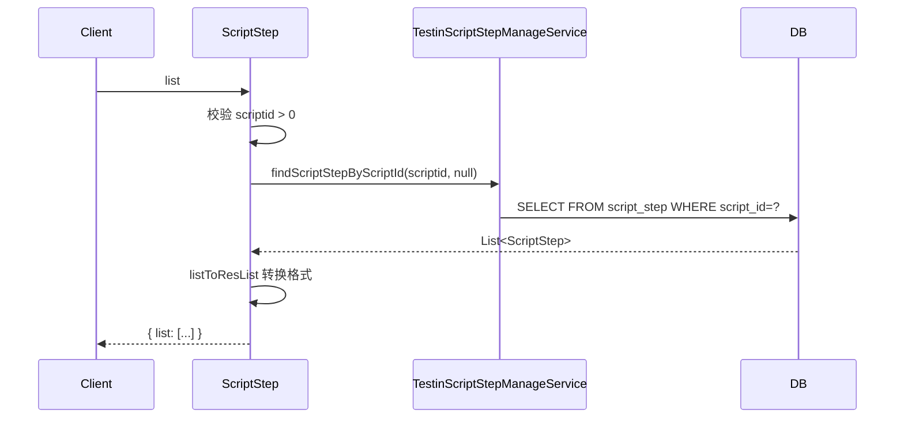
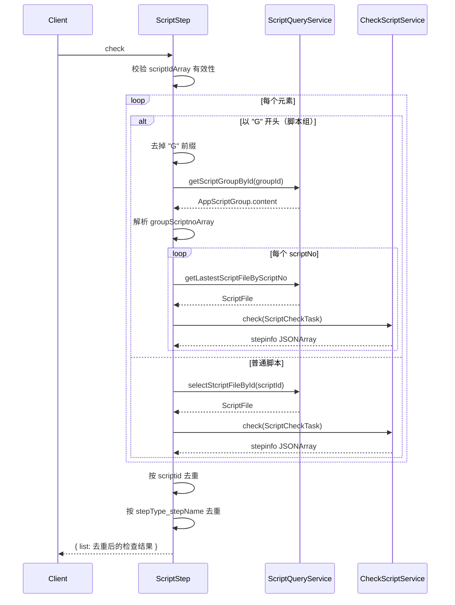

# ScriptStep (ApiServlet)

> 包路径：cn.testin.service.script.ScriptStep
> 调用方式：action=script op=ScriptStep.{method}

## 职责
脚本步骤 API，提供脚本步骤的查询和埋点/区域监控校验功能，用于提测前的步骤完整性检查。

---

## 方法列表

### list
查询指定脚本的步骤列表。

**请求参数（data字段）：**
| 参数 | 类型 | 必填 | 说明 |
|------|------|------|------|
| scriptid | Integer | 是 | 脚本ID |

**返回参数：**
| 字段 | 类型 | 说明 |
|------|------|------|
| code | Integer | 状态码，0=成功 |
| message | String | 提示信息 |
| data | Object | 返回数据 |
| data.list | JSONArray | 脚本步骤列表，元素为 ScriptStep（含 stepName/stepType/stepAction/stepParam 等字段） |

**实现意图：**
调用 TestinScriptStepManageService.findScriptStepByScriptId 查询 script_step 表。

**流程图：**

**涉及表：**
- [script_step](../../../数据库管理/db_file/script_step.md)

---

### check
检测脚本步骤中的埋点及区域监控步骤，用于提测使用。支持按 scriptId 或脚本组（groupId 以 "G" 前缀标识）批量检查。

**请求参数（data字段）：**
| 参数 | 类型 | 必填 | 说明 |
|------|------|------|------|
| scriptIdArray | JSONArray | 是 | 脚本ID列表；元素若以 "G" 开头表示脚本组ID |

**返回参数：**
| 字段 | 类型 | 说明 |
|------|------|------|
| code | Integer | 状态码，0=成功 |
| message | String | 提示信息 |
| data | Object | 返回数据 |
| data.list | JSONArray | 去重后的步骤检查结果列表，元素为埋点/区域监控步骤信息（含 scriptid、stepinfo） |

**实现意图：**
遍历 scriptIdArray，对普通脚本直接校验步骤，对脚本组（"G" 前缀）先解析组内 scriptNo 获取最新 ScriptFile 再校验。使用 CheckScriptService.check 执行埋点检查，最终对结果按 scriptid + stepType_stepName 去重。

**流程图：**

**涉及表：**
- [script_step](../../../数据库管理/db_file/script_step.md)
- [script_file](../../../数据库管理/db_file/script_file.md)
- [app_script_group](SQL/db_file/app_script_group.md)

**跨服务调用：**
- [CheckScriptService](../../../文件管理服务/00-首页.md)
