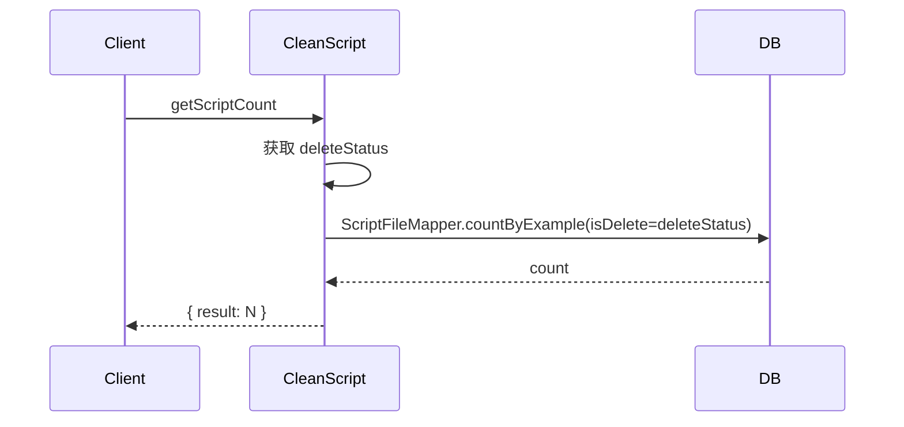
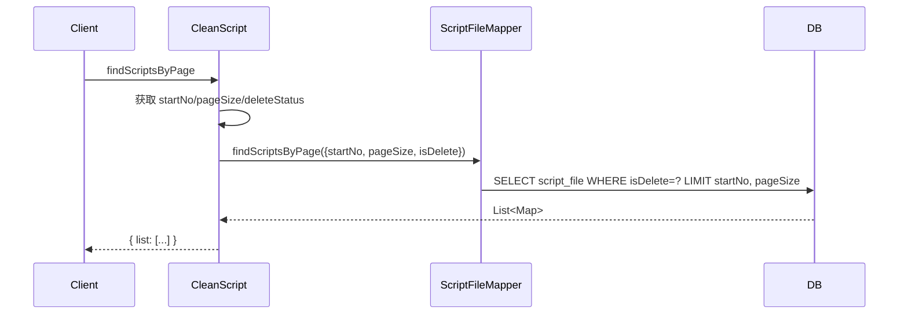
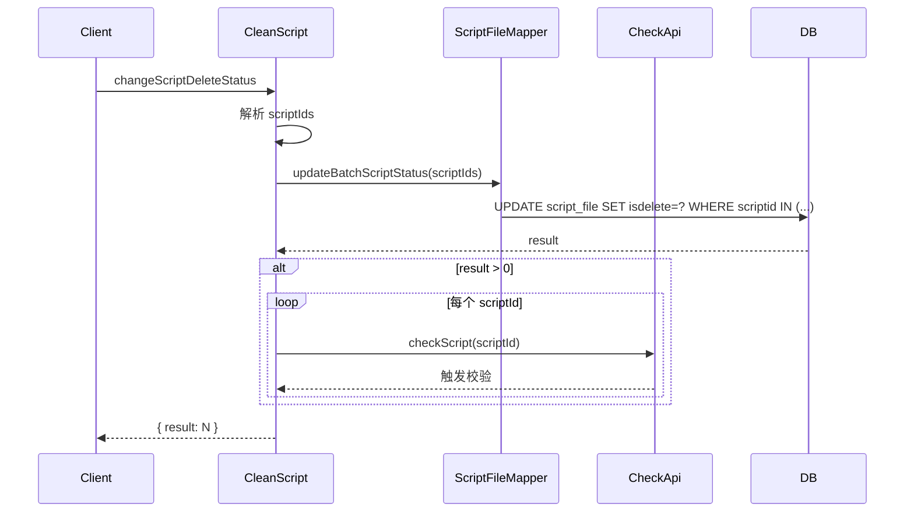
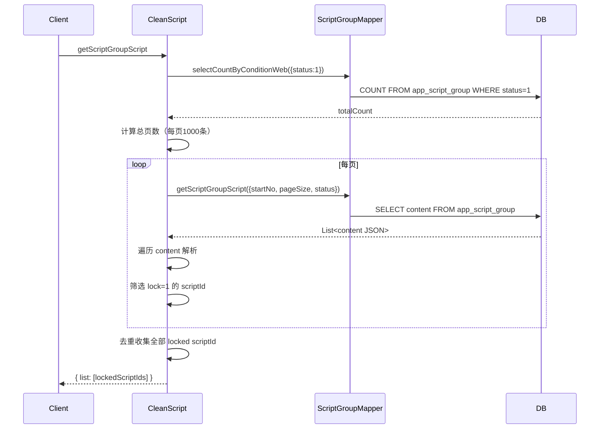

# CleanScript (ApiServlet)

> 包路径：cn.testin.service.script.CleanScript
> 调用方式：action=script op=CleanScript.{method}

## 职责
脚本清理工具 API，提供按删除状态统计脚本数量、分页查询脚本（用于批量清理）、修改脚本删除状态、获取脚本组中被锁定的脚本ID列表等功能。

---

## 方法列表

### getScriptCount
统计指定删除状态的脚本总数。

**请求参数（data字段）：**
| 参数 | 类型 | 必填 | 说明 |
|------|------|------|------|
| deleteStatus | Integer | 是 | 0=未删除, 1=逻辑删除, 2=物理删除 |

**返回参数：**
| 字段 | 类型 | 说明 |
|------|------|------|
| code | Integer | 状态码，0=成功 |
| message | String | 提示信息 |
| data | Object | 返回数据 |
| data.result | Integer | 脚本数量（异常时为 -1） |

**实现意图：**
通过 MyBatis Example Criteria 直接查询 script_file 表按 isDelete 计数。

**流程图：**

**涉及表：**
- [script_file](../../../数据库管理/db_file/script_file.md)

---

### findScriptsByPage
按删除状态分页查询脚本列表。

**请求参数（data字段）：**
| 参数 | 类型 | 必填 | 说明 |
|------|------|------|------|
| startNo | Integer | 是 | 起始行号 |
| pageSize | Integer | 是 | 每页条数 |
| deleteStatus | Integer | 是 | 0=未删除, 1=逻辑删除, 2=物理删除 |

**返回参数：**
| 字段 | 类型 | 说明 |
|------|------|------|
| code | Integer | 状态码，0=成功 |
| message | String | 提示信息 |
| data | Object | 返回数据 |
| data.list | JSONArray | 脚本列表，元素为 Map（script_file 字段） |

**实现意图：**
通过自定义 Mapper SQL（findScriptsByPage）查询指定状态的分页脚本数据。

**流程图：**

**涉及表：**
- [script_file](../../../数据库管理/db_file/script_file.md)

---

### changeScriptDeleteStatus
批量修改脚本删除状态（并触发重新校验）。

**请求参数（data字段）：**
| 参数 | 类型 | 必填 | 说明 |
|------|------|------|------|
| scriptIds | JSONArray | 是 | 脚本ID列表 |

**返回参数：**
| 字段 | 类型 | 说明 |
|------|------|------|
| code | Integer | 状态码，0=成功 |
| message | String | 提示信息 |
| data | Object | 返回数据 |
| data.result | Integer | 更新条数（异常时为 -1） |

**实现意图：**
批量更新脚本删除状态后，对每个 scriptId 调用 CheckApi.checkScript 触发重新校验。

**流程图：**

**涉及表：**
- [script_file](../../../数据库管理/db_file/script_file.md)

**跨服务调用：**
- [CheckApi](../../../文件管理服务/00-首页.md)

---

### getScriptGroupScript
获取所有脚本组中被锁定的脚本ID列表。

**请求参数（data字段）：** 无

**返回参数：**
| 字段 | 类型 | 说明 |
|------|------|------|
| code | Integer | 状态码，0=成功 |
| message | String | 提示信息 |
| data | Object | 返回数据 |
| data.list | JSONArray | 被锁定的脚本ID列表，元素为 String scriptId |

**实现意图：**
遍历所有状态=1的脚本组（每页1000条），解析每个组的 content JSON，筛选出 lock=1 的脚本项，收集其 scriptId 去重后返回。

**流程图：**

**涉及表：**
- [app_script_group](SQL/db_file/app_script_group.md)
