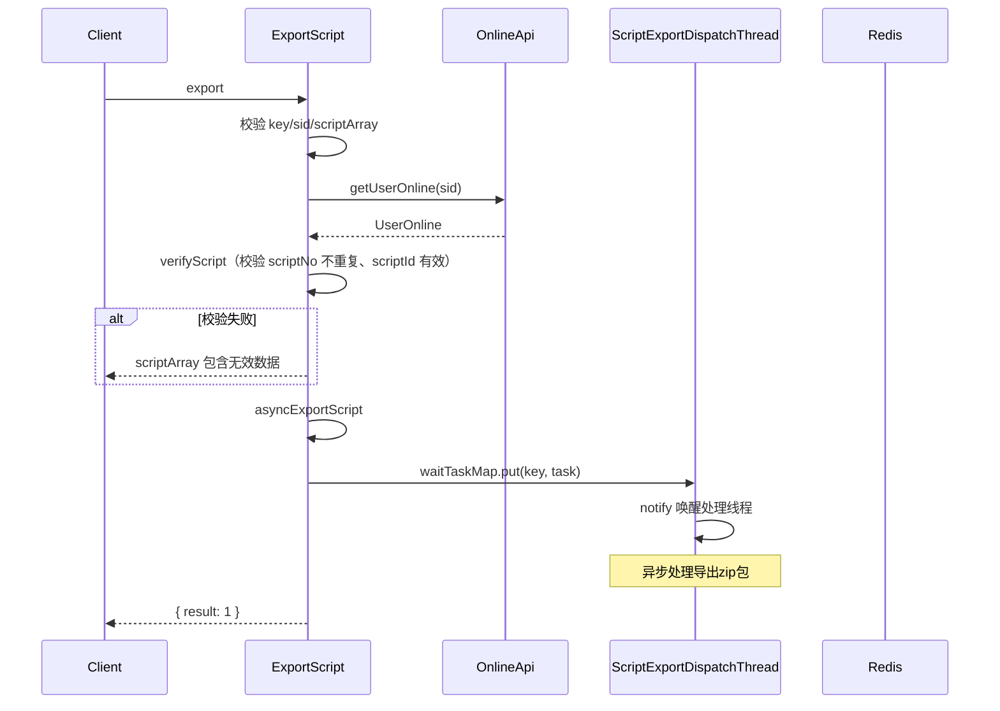
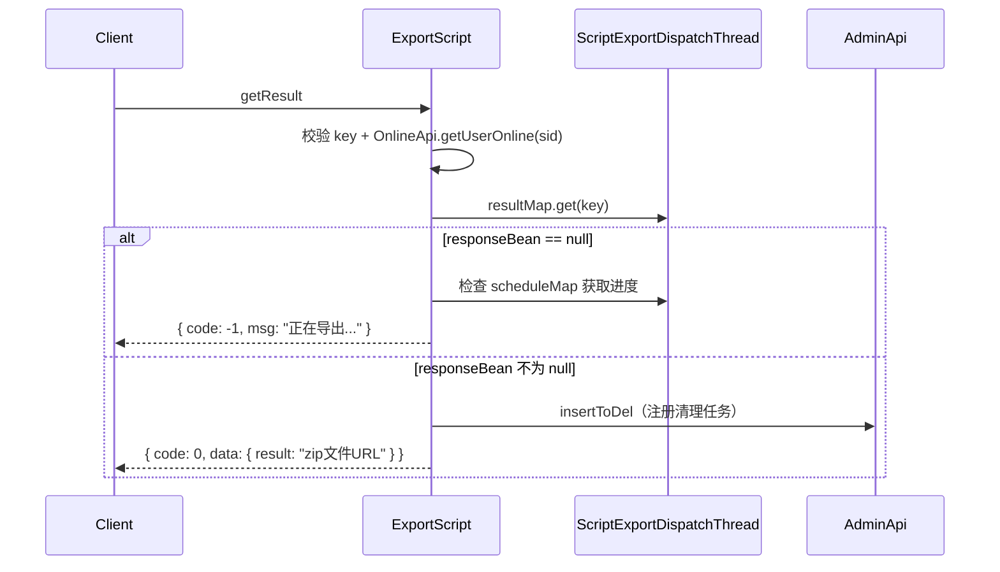
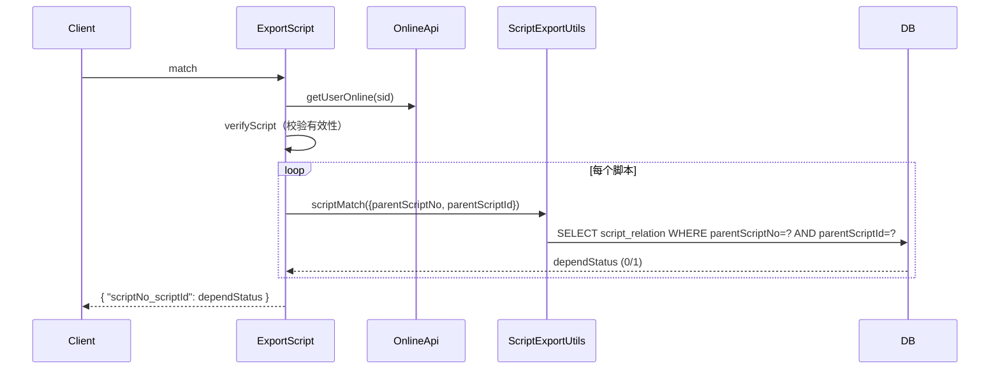
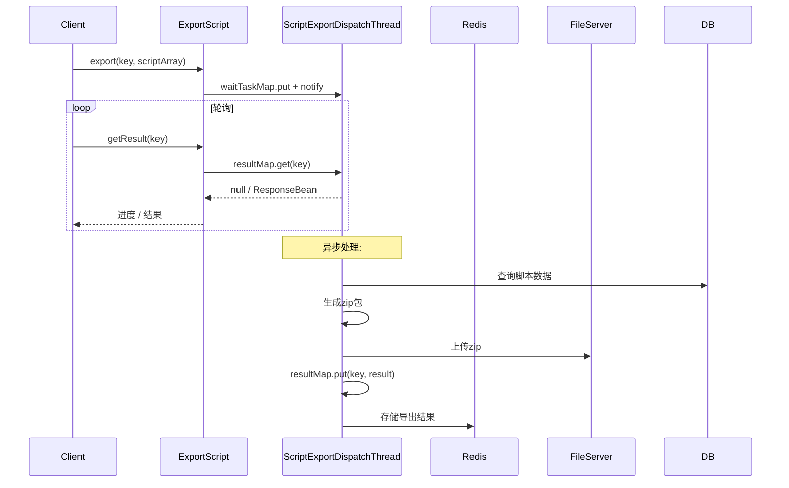

# ExportScript (ApiServlet)

> 包路径：cn.testin.service.script.ExportScript
> 调用方式：action=script op=ExportScript.{method}

## 职责
脚本异步导出 API，支持提交导出任务、轮询导出结果、匹配脚本依赖关系。导出流程通过 ScriptExportDispatchThread 异步队列 + Redis 实现。

---

## 方法列表

### export
提交脚本导出任务到异步队列。z7.6.1.1 版本后前端界面不再使用此方法批量导出。

**请求参数（data字段）：**
| 参数 | 类型 | 必填 | 说明 |
|------|------|------|------|
| key | String | 是 | 导出任务唯一标识 |
| scriptArray | JSONArray | 是 | 要导出的脚本列表，每项含 { scriptNo, scriptId, exportDepend } |
| sid | String | 是 | 通过 apiRequest.getSid() 获取 |

**返回参数：**
| 字段 | 类型 | 说明 |
|------|------|------|
| code | Integer | 状态码，0=成功 |
| message | String | 提示信息 |
| data | Object | 返回数据 |
| data.result | Integer | 固定为 1，表示任务已提交 |

**实现意图：**
校验 key/sid/scriptArray 有效性，通过 OnlineApi 获取用户在线信息进行脚本归属校验（verifyScript：scriptNo 不能重复，scriptId 必须有效且属于当前项目组），然后将任务放入 ScriptExportDispatchThread.waitTaskMap 队列异步执行。

**流程图：**

**涉及表：**
- [script_file](../../../数据库管理/db_file/script_file.md)

**跨服务调用：**
- [OnlineApi](../../../平台基础功能服务/00-首页.md)

---

### getResult
轮询获取导出结果。

**请求参数（data字段）：**
| 参数 | 类型 | 必填 | 说明 |
|------|------|------|------|
| key | String | 是 | 导出任务唯一标识 |
| sid | String | 是 | 会话标识 |

**返回参数：**
| 字段 | 类型 | 说明 |
|------|------|------|
| code | Integer | 状态码，0=成功 |
| message | String | 提示信息 |
| data | Object | 返回数据（ResponseBean 序列化） |
| data.code | Integer | 导出结果码，0=成功，-1=处理中/请求不存在 |
| data.msg | String | 结果提示信息 |
| data.data.result | String | 导出 zip 文件 URL（成功时）/ 导出进度（处理中） |

**实现意图：**
从 ScriptExportDispatchThread.resultMap 获取结果。若为 null 表示还在处理中（返回进度或 "导出请求不存在"）。导出成功后将结果加入 AdminApi 清理任务。

**流程图：**

**涉及表：** 无（基于 Redis + 内存 Map）

**跨服务调用：**
- [OnlineApi](../../../平台基础功能服务/00-首页.md)
- [AdminApi](../../../外部服务/Admin.md)

---

### match
匹配脚本依赖关系（检测每个脚本是否有子脚本依赖）。

**请求参数（data字段）：**
| 参数 | 类型 | 必填 | 说明 |
|------|------|------|------|
| scriptArray | JSONArray | 是 | 脚本列表，每项含 { scriptNo, scriptId } |
| sid | String | 是 | 会话标识 |

**返回参数：**
| 字段 | 类型 | 说明 |
|------|------|------|
| code | Integer | 状态码，0=成功 |
| message | String | 提示信息 |
| data | Object | 返回数据（Map），键为 `{scriptNo}_{scriptId}` |
| data.{scriptNo}_{scriptId} | Integer | 依赖状态，1=有依赖，0=无依赖 |

**实现意图：**
对每个脚本调用 ScriptExportUtils.scriptMatch 查询是否有依赖（scriptNo + scriptId 组合查询 script_relation 表）。

**流程图：**

**涉及表：**
- [script_relation](../../../数据库管理/db_file/script_relation.md)

**跨服务调用：**
- [OnlineApi](../../../平台基础功能服务/00-首页.md)

---

## 异步导出流程总览

