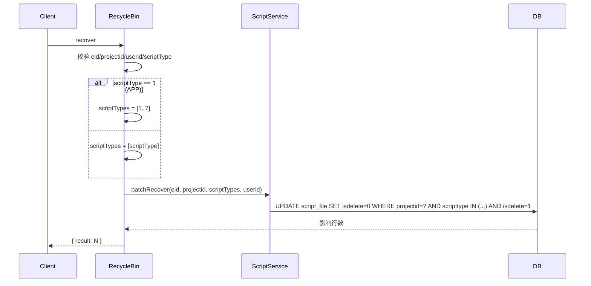
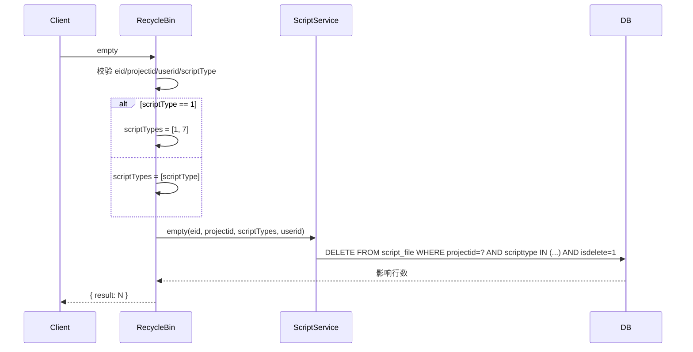

# RecycleBin (ApiServlet)

> 包路径：cn.testin.service.script.RecycleBin
> 调用方式：action=script op=RecycleBin.{method}

## 职责
回收站批量操作 API，提供当前项目组下所有回收站脚本的一键恢复和一键清空功能。

---

## 方法列表

### recover
批量恢复回收站中的所有脚本。

**请求参数（data字段）：**
| 参数 | 类型 | 必填 | 说明 |
|------|------|------|------|
| eid | Integer | 是 | 企业ID |
| projectid | Integer | 是 | 项目组ID |
| userid | Integer | 是 | 用户ID |
| scriptType | Integer | 是 | 脚本类型：1=APP（自动扩展为 [1,7]）, 2=Web, 3=PC |

**返回参数：**
| 字段 | 类型 | 说明 |
|------|------|------|
| code | Integer | 状态码，0=成功 |
| message | String | 提示信息 |
| data | Object | 返回数据 |
| data.result | Integer | 恢复条数 |

**实现意图：**
根据 scriptType 确定需要恢复的脚本类型列表（scriptType=1 时扩展为 [1,7]），调用 scriptService.batchRecover 批量恢复当前项目下所有被逻辑删除的脚本。

**流程图：**

**涉及表：**
- [script_file](../../../数据库管理/db_file/script_file.md)

---

### empty
批量清空回收站（永久删除所有已逻辑删除的脚本）。

**请求参数（data字段）：**
| 参数 | 类型 | 必填 | 说明 |
|------|------|------|------|
| eid | Integer | 是 | 企业ID |
| projectid | Integer | 是 | 项目组ID |
| userid | Integer | 是 | 用户ID |
| scriptType | Integer | 是 | 脚本类型：1=APP（自动扩展为 [1,7]）, 2=Web, 3=PC |

**返回参数：**
| 字段 | 类型 | 说明 |
|------|------|------|
| code | Integer | 状态码，0=成功 |
| message | String | 提示信息 |
| data | Object | 返回数据 |
| data.result | Integer | 永久删除条数 |

**实现意图：**
与 recover 逻辑对称，调用 scriptService.empty 进行批量物理删除。

**流程图：**

**涉及表：**
- [script_file](../../../数据库管理/db_file/script_file.md)
