# Script (ApiServlet)

> 包路径：cn.testin.service.script.Script
> 调用方式：action=script op=Script.{method}

## 职责
脚本 CRUD 综合 API，提供脚本的创建、查询、更新、删除、导入/导出、复制、校验、标签管理、父子关系查询等全生命周期操作。

---

## 方法列表

### listScriptFile
分页查询脚本列表（主要查询接口），支持多维度组合筛选。

**请求参数（data字段）：**
| 参数 | 类型 | 必填 | 说明 |
|------|------|------|------|
| projectId | Integer | 是 | 项目组ID |
| startPageNo | Integer | 否 | 起始页，默认1 |
| pageSize | Integer | 否 | 每页条数，默认15 |
| scriptType | Integer | 否 | 脚本类型，默认1（APP） |
| appId | Integer | 否 | 应用ID |
| appVersion | String | 否 | 应用版本 |
| scriptDesc | String | 否 | 脚本描述 |
| channelId | String | 否 | 渠道ID |
| scriptTag | String | 否 | 脚本标签 |
| osType | Integer | 否 | 操作系统类型 |
| eid | Integer | 否 | 企业ID |
| userIds | String | 否 | 更新人ID（逗号分隔） |
| designUserIds | String | 否 | 设计人ID（逗号分隔） |
| recordType | Integer | 否 | 录制类型 |
| scriptNo | Integer | 否 | 脚本编号 |
| scriptNos | JSONArray | 否 | 脚本编号列表 |
| appName | String | 否 | 应用名称 |
| suiteId | Integer | 否 | 套件ID |
| keyword | String | 否 | 关键字搜索 |
| checkStatus | Integer | 否 | 校验状态 |
| deleteStatus | Integer | 否 | 删除状态 |
| fuzzyQuery | String | 否 | 模糊查询 |
| build | Integer | 否 | 构建号 |
| startTime/endTime | Long | 否 | 时间范围（更新时间） |
| sortByDesc | String | 否 | 排序字段 |
| orderByCol/orderByType | String | 否 | 排序列/排序方式 |
| scriptTypes | JSONArray | 否 | 脚本类型列表 |
| scriptTags | JSONArray | 否 | 标签列表 |
| relationScriptNo | Integer | 否 | 关联脚本编号（第三方绑定） |
| thirdPartyUserName | String | 否 | 第三方更新人 |
| updateUser | String | 否 | 更新人（模糊匹配） |
| needSignfileinfo | Integer | 否 | 是否需要签名信息 |
| notdeviceGroupSign | Integer | 否 | 非设备组签名 |

**响应：** 分页脚本列表，含 scriptNo, scriptId, scriptDesc, scriptType, appId, osType, checkStatus 等字段，自动填充设计人名称。

**返回参数：**
| 字段 | 类型 | 说明 |
|------|------|------|
| code | Integer | 状态码，0=成功 |
| message | String | 提示信息 |
| data | Object | 返回数据 |
| data.list | JSONArray | 脚本列表（scriptNo、scriptId、scriptDesc、scriptType、appId、osType、checkStatus 等） |
| data.page / pageSize | Integer | 当前页 / 每页条数 |
| data.totalRow / totalPage | Integer | 总行数 / 总页数 |

**实现意图：**
核心查询入口，构建 ScriptFileDTO 条件对象，调用 scriptService.listScriptFile 进行数据库分页查询。结果额外附加脚本创建时间和设计人中文名。

**流程图：**
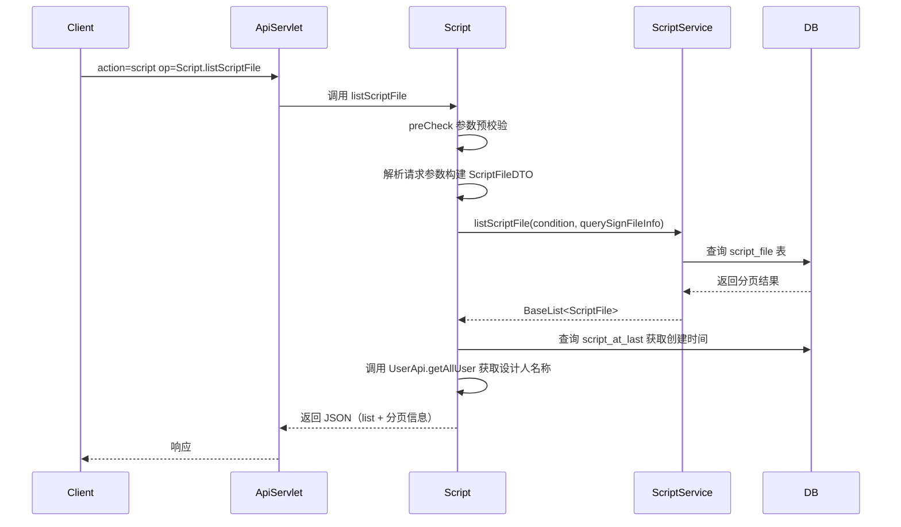

**涉及表：**
- [script_file](../../../数据库管理/db_file/script_file.md)
- [script_at_last](../../../数据库管理/db_file/script_at_last.md)

**跨服务调用：**
- [UserApi](../../../平台基础功能服务/00-首页.md)

---

### newListScriptFile
新版分页查询，在 listScriptFile 基础上增加了目录维度筛选（scriptDirId/deep/unassigned）。

**请求参数（data字段）：**
| 参数 | 类型 | 必填 | 说明 |
|------|------|------|------|
| projectId | Integer | 是 | 项目组ID |
| eid | Integer | 否 | 企业ID |
| scriptDirId | Integer | 否 | 脚本目录ID |
| deep | Integer | 否 | 是否深层查询子目录，默认0 |
| unassigned | Integer | 否 | 是否未分配目录，默认0 |

（其余参数同 listScriptFile）

**响应：** 与 listScriptFile 相同结构的分页脚本列表。

**返回参数：**
| 字段 | 类型 | 说明 |
|------|------|------|
| code | Integer | 状态码，0=成功 |
| message | String | 提示信息 |
| data | Object | 返回数据 |
| data.list | JSONArray | 脚本列表 |
| data.page / pageSize | Integer | 当前页 / 每页条数 |
| data.totalRow / totalPage | Integer | 总行数 / 总页数 |

**实现意图：**
先通过 scriptDirService 获取指定目录下的脚本编号列表（scriptNos），再将其作为查询条件传入 ScriptService。回收站场景（deleteStatus=1）直接返回空列表。未分配目录场景（unassigned=1）调用 unstorage 获取未归属脚本。

**流程图：**
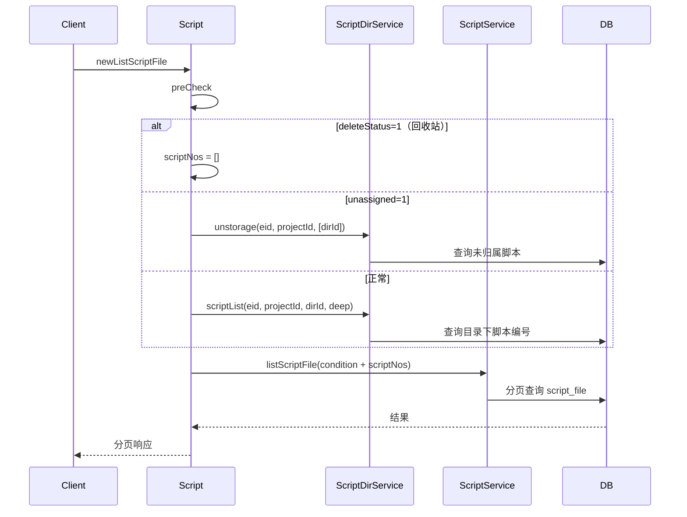

**涉及表：**
- [script_file](../../../数据库管理/db_file/script_file.md)
- [script_dir_child](../../../数据库管理/db_file/script_dir_child.md)

---

### getScriptStepByScriptNo
获取指定脚本的步骤信息。

**请求参数（data字段）：**
| 参数 | 类型 | 必填 | 说明 |
|------|------|------|------|
| scriptId | Integer | 是 | 脚本ID |
| scriptNo | Integer | 是 | 脚本编号 |

**响应：** 脚本步骤列表（NewScriptStep 对象数组）。

**返回参数：**
| 字段 | 类型 | 说明 |
|------|------|------|
| code | Integer | 状态码，0=成功 |
| message | String | 提示信息 |
| data | Object | 返回数据 |
| data.list | JSONArray | 步骤列表（NewScriptStep 对象数组） |

**流程图：**
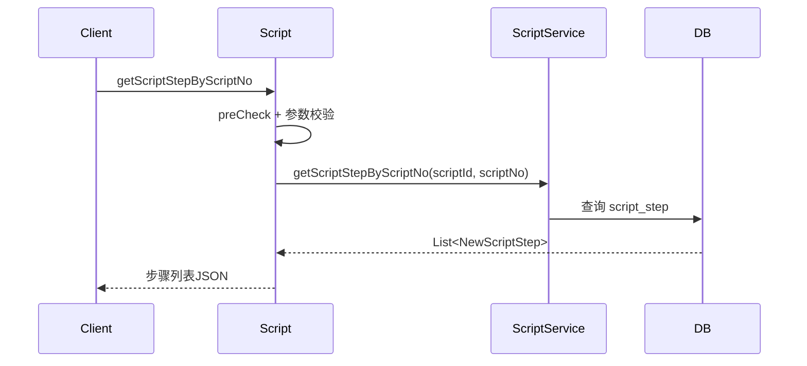

**涉及表：**
- [script_step](../../../数据库管理/db_file/script_step.md)

---

### listHistoryScriptByScriptNo
根据 scriptNo 查询脚本的历史版本列表。

**请求参数（data字段）：**
| 参数 | 类型 | 必填 | 说明 |
|------|------|------|------|
| scriptNo | Integer | 是 | 脚本编号 |
| scriptId | Integer | 是 | 当前脚本ID |
| projectId | Integer | 是 | 项目组ID |
| scriptType | Integer | 否 | 脚本类型 |

**响应：** 该脚本所有历史版本的列表（按版本倒序）。

**返回参数：**
| 字段 | 类型 | 说明 |
|------|------|------|
| code | Integer | 状态码，0=成功 |
| message | String | 提示信息 |
| data | Object | 返回数据 |
| data.list | JSONArray | 历史版本列表（按版本倒序） |

**实现意图：**
通过 scriptNo 查询 script_file 表中 history=1 的所有版本记录。

**涉及表：**
- [script_file](../../../数据库管理/db_file/script_file.md)

---

### listScriptDetailByScriptNo
根据 scriptNo 查询脚本详情（含当前版本和历史版本的详细信息）。

**请求参数（data字段）：**
| 参数 | 类型 | 必填 | 说明 |
|------|------|------|------|
| scriptNo | Integer | 是 | 脚本编号 |
| scriptId | Integer | 是 | 脚本ID |
| projectId | Integer | 是 | 项目组ID |

**响应：** 脚本详情列表，包含 scriptNo, scriptDesc, scriptType, appInfo, fileInfo 等完整信息。

**返回参数：**
| 字段 | 类型 | 说明 |
|------|------|------|
| code | Integer | 状态码，0=成功 |
| message | String | 提示信息 |
| data | Object | 返回数据 |
| data.list | JSONArray | 脚本详情列表（scriptNo、scriptDesc、scriptType、appInfo、fileInfo 等） |

**涉及表：**
- [script_file](../../../数据库管理/db_file/script_file.md)
- [script_at_last](../../../数据库管理/db_file/script_at_last.md)

---

### updateScript
更新脚本信息（触发应用关联刷新）。

**请求参数（data字段）：**
| 参数 | 类型 | 必填 | 说明 |
|------|------|------|------|
| scriptId | Integer | 是 | 脚本ID |
| projectId | Integer | 是 | 项目组ID |
| appId | Integer | 是 | 应用ID |

**响应：** `{ "result": 1 }` 表示更新成功。

**返回参数：**
| 字段 | 类型 | 说明 |
|------|------|------|
| code | Integer | 状态码，0=成功 |
| message | String | 提示信息 |
| data | Object | 返回数据 |
| data.result | Integer | 受影响行数 / 结果值 |

**涉及表：**
- [script_file](../../../数据库管理/db_file/script_file.md)

---

### generateScript
创建新脚本（生成 scriptNo、建立目录关联、套件关联）。

**请求参数（data字段）：**
| 参数 | 类型 | 必填 | 说明 |
|------|------|------|------|
| eid | Integer | 是 | 企业ID |
| projectid | Integer | 是 | 项目组ID |
| userid/username | Integer/String | 是 | 用户ID 或用户名（二选一） |
| scriptName | String | 是 | 脚本名称 |
| scriptType | Integer | 是 | 脚本类型（1=APP, 2=Web, 3=PC） |
| scriptDirId | Integer | 否 | 目录ID，默认0 |
| suiteId | Integer | 否 | 套件/应用ID |
| scriptTags | JSONArray | 否 | 标签列表 |

**响应：** `{ "scriptId": xxx, "scriptNo": xxx }`

**返回参数：**
| 字段 | 类型 | 说明 |
|------|------|------|
| code | Integer | 状态码，0=成功 |
| message | String | 提示信息 |
| data | Object | 返回数据 |
| data.scriptId | Integer | 新脚本ID |
| data.scriptNo | Integer | 新脚本编号 |

**流程图：**
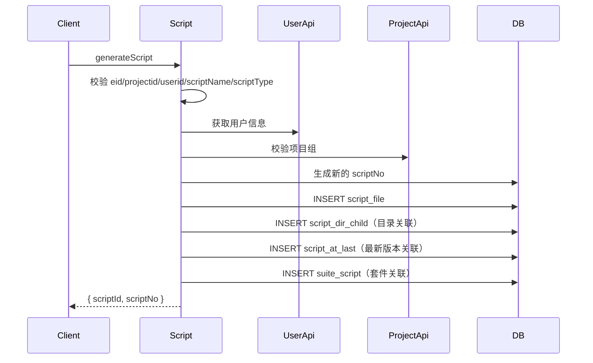

**涉及表：**
- [script_file](../../../数据库管理/db_file/script_file.md)
- [script_dir_child](../../../数据库管理/db_file/script_dir_child.md)
- [script_at_last](../../../数据库管理/db_file/script_at_last.md)
- [suite_script](../../../数据库管理/db_file/suite_script.md)

**跨服务调用：**
- [UserApi](../../../平台基础功能服务/00-首页.md)
- [ProjectApi](../../../平台基础功能服务/00-首页.md)

---

### generateEmptyScript
创建空脚本（恒生专用，无应用概念，默认使用项目组应用）。

**请求参数（data字段）：**
| 参数 | 类型 | 必填 | 说明 |
|------|------|------|------|
| projectid | Integer | 是 | 项目组ID |
| scriptName | String | 是 | 脚本名称 |
| scriptType | Integer | 是 | 脚本类型 |
| scriptDirId | Integer | 否 | 目录ID，默认0 |
| userid/username | Integer/String | 是 | 用户ID 或用户名 |

**响应：** `{ "scriptId": xxx, "scriptNo": xxx }`

**返回参数：**
| 字段 | 类型 | 说明 |
|------|------|------|
| code | Integer | 状态码，0=成功 |
| message | String | 提示信息 |
| data | Object | 返回数据 |
| data.scriptId | Integer | 新脚本ID |
| data.scriptNo | Integer | 新脚本编号 |

**涉及表：**
- [script_file](../../../数据库管理/db_file/script_file.md)
- [script_dir_child](../../../数据库管理/db_file/script_dir_child.md)
- [script_at_last](../../../数据库管理/db_file/script_at_last.md)
- [suite_script](../../../数据库管理/db_file/suite_script.md)

---

### removeScript
逻辑删除脚本（按 scriptId，支持逗号分隔批量）。

**请求参数（data字段）：**
| 参数 | 类型 | 必填 | 说明 |
|------|------|------|------|
| scriptId | String | 是 | 脚本ID，支持逗号分隔 |
| uid | Integer | 是 | 操作用户ID |

**响应：** `{ "result": N }` 删除条数。

**返回参数：**
| 字段 | 类型 | 说明 |
|------|------|------|
| code | Integer | 状态码，0=成功 |
| message | String | 提示信息 |
| data | Object | 返回数据 |
| data.result | Integer | 删除条数 |

**流程图：**
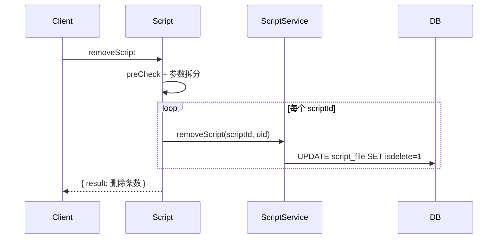

**涉及表：**
- [script_file](../../../数据库管理/db_file/script_file.md)

---

### removeScriptByScriptNo
按 scriptNo 逻辑删除（删除包括历史版本）。

**请求参数（data字段）：**
| 参数 | 类型 | 必填 | 说明 |
|------|------|------|------|
| scriptNo | Integer | 是 | 脚本编号 |
| uid | Integer | 是 | 操作用户ID |
| projectid | Integer | 是 | 项目组ID |

**返回参数：**
| 字段 | 类型 | 说明 |
|------|------|------|
| code | Integer | 状态码，0=成功 |
| message | String | 提示信息 |
| data | Object | 返回数据 |
| data.result | Integer | 删除条数 |

**涉及表：**
- [script_file](../../../数据库管理/db_file/script_file.md)

---

### recoverScriptByScriptNo
从回收站恢复脚本。

**请求参数（data字段）：**
| 参数 | 类型 | 必填 | 说明 |
|------|------|------|------|
| scriptNo | Integer | 是 | 脚本编号 |
| uid | Integer | 是 | 操作用户ID |
| projectid | Integer | 是 | 项目组ID |

**返回参数：**
| 字段 | 类型 | 说明 |
|------|------|------|
| code | Integer | 状态码，0=成功 |
| message | String | 提示信息 |
| data | Object | 返回数据 |
| data.result | Integer | 恢复条数 |

**涉及表：**
- [script_file](../../../数据库管理/db_file/script_file.md)

---

### sweepScriptByScriptNo
永久删除脚本（物理删除）。

**请求参数（data字段）：**
| 参数 | 类型 | 必填 | 说明 |
|------|------|------|------|
| scriptNo | Integer | 是 | 脚本编号 |
| uid | Integer | 是 | 操作用户ID |
| projectid | Integer | 是 | 项目组ID |

**返回参数：**
| 字段 | 类型 | 说明 |
|------|------|------|
| code | Integer | 状态码，0=成功 |
| message | String | 提示信息 |
| data | Object | 返回数据 |
| data.result | Integer | 删除条数 |

**涉及表：**
- [script_file](../../../数据库管理/db_file/script_file.md)

---

### batchRf
批量移入回收站。

**请求参数（data字段）：**
| 参数 | 类型 | 必填 | 说明 |
|------|------|------|------|
| projectId/projectid | Integer | 是 | 项目组ID |
| scriptNos | List<Integer> | 是 | 脚本编号列表 |

**返回参数：**
| 字段 | 类型 | 说明 |
|------|------|------|
| code | Integer | 状态码，0=成功 |
| message | String | 提示信息 |
| data | Object | 返回数据 |
| data.result | Integer | 受影响行数 |

**涉及表：**
- [script_file](../../../数据库管理/db_file/script_file.md)

---

### batchRecover
批量从回收站恢复。

**请求参数（data字段）：**
| 参数 | 类型 | 必填 | 说明 |
|------|------|------|------|
| projectId/projectid | Integer | 是 | 项目组ID |
| scriptNos | List<Integer> | 是 | 脚本编号列表 |

**返回参数：**
| 字段 | 类型 | 说明 |
|------|------|------|
| code | Integer | 状态码，0=成功 |
| message | String | 提示信息 |
| data | Object | 返回数据 |
| data.result | Integer | 恢复条数 |

**涉及表：**
- [script_file](../../../数据库管理/db_file/script_file.md)

---

### batchSweep
批量永久删除。

**请求参数（data字段）：**
| 参数 | 类型 | 必填 | 说明 |
|------|------|------|------|
| projectId/projectid | Integer | 是 | 项目组ID |
| scriptNos | List<Integer> | 是 | 脚本编号列表 |

**返回参数：**
| 字段 | 类型 | 说明 |
|------|------|------|
| code | Integer | 状态码，0=成功 |
| message | String | 提示信息 |
| data | Object | 返回数据 |
| data.result | Integer | 删除条数 |

**涉及表：**
- [script_file](../../../数据库管理/db_file/script_file.md)

---

### parse
解析上传的脚本文件（zip/json），提取主脚本和依赖脚本的结构信息。

**请求参数（data字段）：**
| 参数 | 类型 | 必填 | 说明 |
|------|------|------|------|
| url | String | 是 | 脚本文件远程URL |
| again | Integer | 否 | 是否重新解析，默认0 |

**响应：** `{ "result": [...], "depends": [...] }` 解析结果。

**返回参数：**
| 字段 | 类型 | 说明 |
|------|------|------|
| code | Integer | 状态码，0=成功 |
| message | String | 提示信息 |
| data | Object | 返回数据 |
| data.result | JSONArray | 解析后的主脚本结构信息 |
| data.depends | JSONArray | 依赖脚本列表 |

**流程图：**
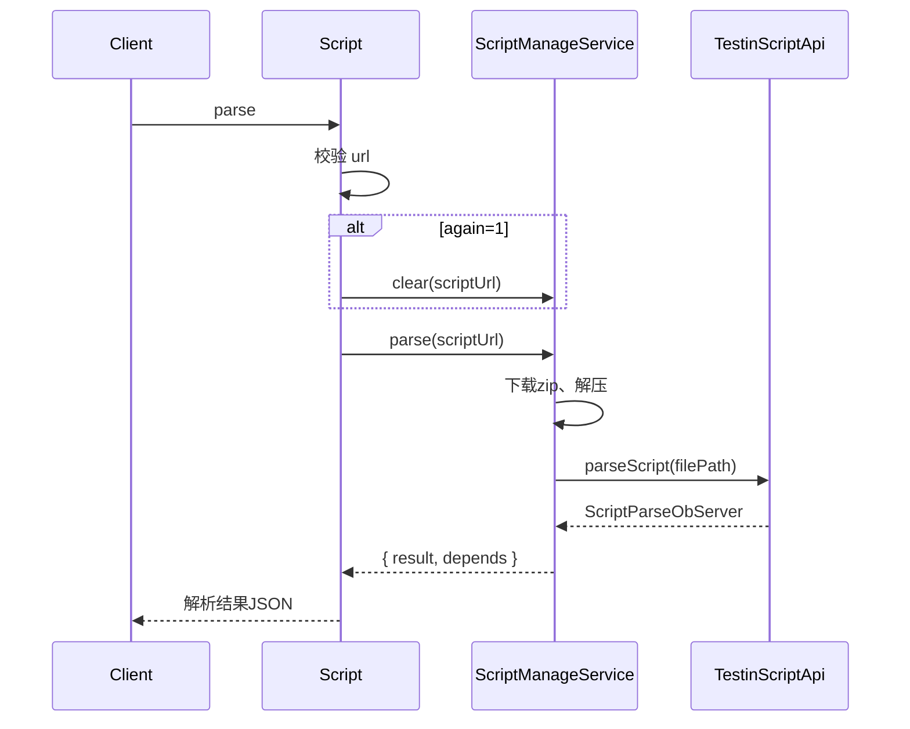

**涉及表：** 无（纯解析，不落库）

---

### importScript
导入脚本（需先调用 parse 解析）。

**请求参数（data字段）：**
| 参数 | 类型 | 必填 | 说明 |
|------|------|------|------|
| eid | Integer | 是 | 企业ID |
| userid | Integer | 是 | 用户ID |
| projectid | Integer | 是 | 项目组ID |
| url | String | 是 | 脚本zip文件URL |
| suiteId | Integer | 是（APP脚本） | 套件/应用ID |
| details | JSONArray | 否 | 导入详情（含 scriptNo, operate, filePath 等） |
| dirs | JSONArray | 否 | 目录信息 |
| dirId | Integer | 否 | 目标目录ID |
| scriptType | Integer | 否 | 脚本类型 |

**响应：** `{ "state": ..., "result": ... }` 导入状态和结果。

**返回参数：**
| 字段 | 类型 | 说明 |
|------|------|------|
| code | Integer | 状态码，0=成功 |
| message | String | 提示信息 |
| data | Object | 返回数据 |
| data.state | String | 导入状态 |
| data.result | String/Object | 导入结果 |

**流程图：**
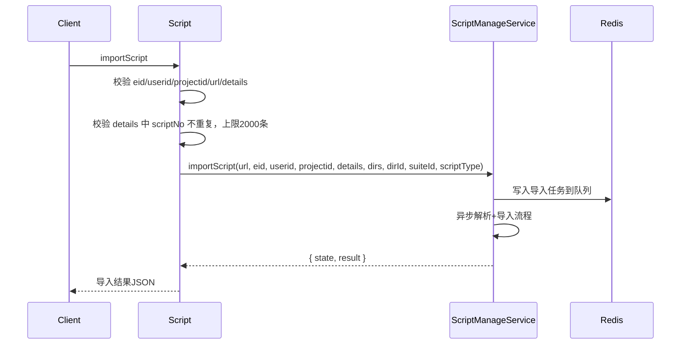

**涉及表：**
- [script_file](../../../数据库管理/db_file/script_file.md)
- [script_at_last](../../../数据库管理/db_file/script_at_last.md)
- [script_dir_child](../../../数据库管理/db_file/script_dir_child.md)

---

### importScriptUrl
新版导入接口（简化参数，异步处理）。

**请求参数（data字段）：**
| 参数 | 类型 | 必填 | 说明 |
|------|------|------|------|
| eid | Integer | 是 | 企业ID |
| userId | Integer | 是 | 用户ID |
| projectId | Integer | 是 | 项目组ID |
| url | String | 是 | 脚本zip文件URL |
| suiteId | Integer | 是（APP脚本） | 套件ID |
| dirId | Integer | 否 | 目录ID |
| scriptType | Integer | 否 | 脚本类型，默认1 |
| scriptImportFlag | Integer | 否 | 导入标志 |

**响应：** `{ "result": "requestId" }` 异步任务标识。

**返回参数：**
| 字段 | 类型 | 说明 |
|------|------|------|
| code | Integer | 状态码，0=成功 |
| message | String | 提示信息 |
| data | Object | 返回数据 |
| data.result | String | 异步导入任务 requestId |

**流程图：**
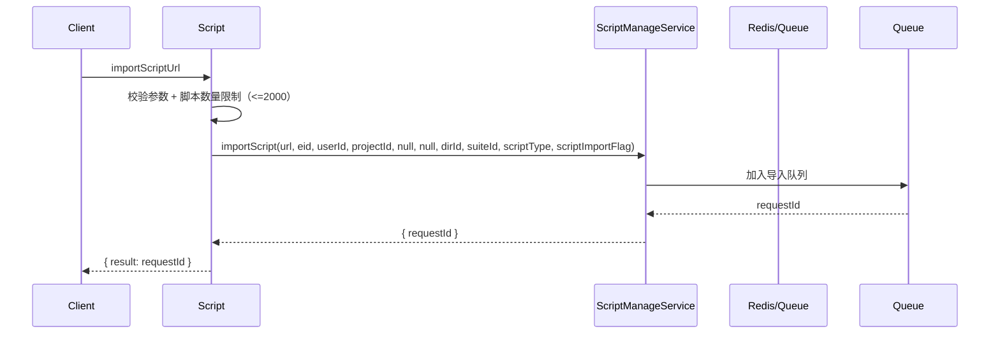

**涉及表：**
- [script_file](../../../数据库管理/db_file/script_file.md)
- [script_at_last](../../../数据库管理/db_file/script_at_last.md)

---

### batchCopyScript
批量复制脚本（支持跨项目组复制及依赖复制）。

**请求参数（data字段）：**
| 参数 | 类型 | 必填 | 说明 |
|------|------|------|------|
| projectid | Integer | 是 | 源项目组ID |
| userid | Integer | 是 | 操作用户ID |
| scriptNos | JSONArray | 是 | 要复制的脚本编号列表 |
| newHundsunProjectId | String | 否 | 目标第三方项目ID |
| newVId | String | 否 | 目标第三方企业ID |

**响应：** `{ scriptNoMap: { oldNo: newNo } }` 新旧脚本编号映射。

**返回参数：**
| 字段 | 类型 | 说明 |
|------|------|------|
| code | Integer | 状态码，0=成功 |
| message | String | 提示信息 |
| data | Object | 返回数据 |
| data.scriptNoMap | Object | 新旧脚本编号映射（oldNo → newNo） |

**流程图：**
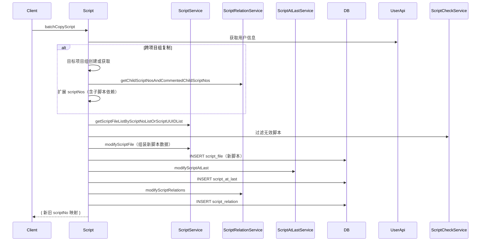

**涉及表：**
- [script_file](../../../数据库管理/db_file/script_file.md)
- [script_at_last](../../../数据库管理/db_file/script_at_last.md)
- [script_relation](../../../数据库管理/db_file/script_relation.md)
- [script_check](../../../数据库管理/db_file/script_check.md)
- [script_recover_info](../../../数据库管理/db_file/script_recover_info.md)

**跨服务调用：**
- [UserApi](../../../平台基础功能服务/00-首页.md)

---

### dirCopy
目录复制脚本（异步任务，通过 md5 去重防重复提交）。

**请求参数（data字段）：**
| 参数 | 类型 | 必填 | 说明 |
|------|------|------|------|
| eid | Integer | 是 | 企业ID |
| pid | Integer | 是 | 项目组ID |
| uid | Integer | 是 | 用户ID |
| selectDirId | Integer | 是 | 源目录ID |
| targetDirId | Integer | 是 | 目标目录ID |
| sourceType | Integer | 否 | 脚本类型 |

**响应：** `{ "result": 0 }` 状态码（0=进行中，-1=失败, 5=完成）。

**返回参数：**
| 字段 | 类型 | 说明 |
|------|------|------|
| code | Integer | 状态码，0=成功 |
| message | String | 提示信息 |
| data | Object | 返回数据 |
| data.result | Integer | 复制状态码（0=进行中，-1=失败，5=完成） |

**流程图：**
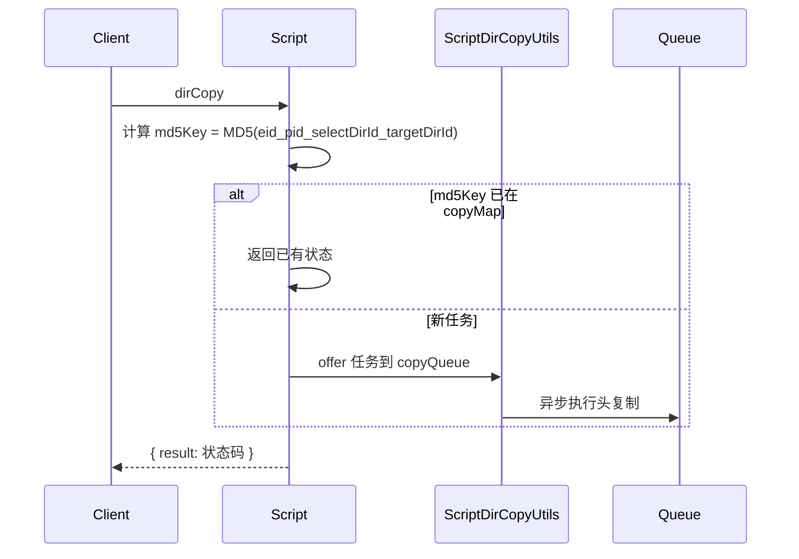

**涉及表：**
- [script_file](../../../数据库管理/db_file/script_file.md)
- [script_dir](../../../数据库管理/db_file/script_dir.md)
- [script_dir_child](../../../数据库管理/db_file/script_dir_child.md)

---

### scriptUpdate
更新脚本元数据（恒生专用，根据 scriptNo 更新描述等信息）。

**请求参数（data字段）：**
| 参数 | 类型 | 必填 | 说明 |
|------|------|------|------|
| eid | Integer | 是 | 企业ID |
| projectid | Integer | 是 | 项目组ID |
| userid | Integer | 是 | 用户ID |
| scriptNo | Integer | 是 | 脚本编号 |
| scriptDesc | String | 否 | 脚本描述 |

**返回参数：**
| 字段 | 类型 | 说明 |
|------|------|------|
| code | Integer | 状态码，0=成功 |
| message | String | 提示信息 |
| data | Object | 返回数据 |
| data.result | Integer | 受影响行数 |

**涉及表：**
- [script_file](../../../数据库管理/db_file/script_file.md)

---

### maintain
维护脚本属性（脚本描述、设计人、标签）。

**请求参数（data字段）：**
| 参数 | 类型 | 必填 | 说明 |
|------|------|------|------|
| scriptId | Integer | 是 | 脚本ID |
| scriptDesc | String | 否 | 脚本描述 |
| designUserid | Integer | 否 | 设计人ID |
| scriptTags | String | 否 | 标签 |

**返回参数：**
| 字段 | 类型 | 说明 |
|------|------|------|
| code | Integer | 状态码，0=成功 |
| message | String | 提示信息 |
| data | Object | 返回数据 |
| data.result | Integer | 受影响行数 |

**涉及表：**
- [script_file](../../../数据库管理/db_file/script_file.md)

---

### getScriptWithVars
获取脚本及其变量信息（全局变量和局部变量）。

**请求参数（data字段）：**
| 参数 | 类型 | 必填 | 说明 |
|------|------|------|------|
| scriptNo | Integer | 是 | 脚本编号 |
| projectId | Integer | 是 | 项目组ID |

**响应：** 脚本详情 + 全局/局部变量（去除内部变量）。

**返回参数：**
| 字段 | 类型 | 说明 |
|------|------|------|
| code | Integer | 状态码，0=成功 |
| message | String | 提示信息 |
| data | Object | 返回数据（脚本详情直接平铺在 data 下） |
| data.scriptNo | Integer | 脚本编号 |
| data.scriptDesc | String | 脚本描述 |
| data.scriptTags | JSONArray | 脚本标签列表 |
| data.scriptCreateTime / scriptUpdateTime | Long | 创建/更新时间 |
| data.scriptCreateUser / scriptUpdateUser | String | 创建人/更新人邮箱 |
| data.type | Integer | 系统类型（osType） |
| data.globaltVars | Object | 全局变量 Map（代码字段名为 globaltVars） |
| data.localVars | Object | 局部变量 Map |
| data.scriptDirNode | Object | 脚本所在目录层级节点 |

**涉及表：**
- [script_file](../../../数据库管理/db_file/script_file.md)
- [script_at_last](../../../数据库管理/db_file/script_at_last.md)

---

### existForScriptNo
批量检查 scriptNo 在当前项目/应用下是否存在。

**请求参数（data字段）：**
| 参数 | 类型 | 必填 | 说明 |
|------|------|------|------|
| projectId | Integer | 是 | 项目组ID |
| appId | Integer | 是 | 应用ID |
| scriptNoArray | JSONArray | 是 | 脚本编号列表 |

**响应：** 存在的最新脚本记录列表（LastUpdateScriptFileRecordDTO）。

**返回参数：**
| 字段 | 类型 | 说明 |
|------|------|------|
| code | Integer | 状态码，0=成功 |
| message | String | 提示信息 |
| data | Object | 返回数据 |
| data.list | JSONArray | 存在的最新脚本记录列表（LastUpdateScriptFileRecordDTO） |

**涉及表：**
- [script_file](../../../数据库管理/db_file/script_file.md)

---

### listScriptControl
列出脚本关联的控件信息。

**请求参数（data字段）：**
| 参数 | 类型 | 必填 | 说明 |
|------|------|------|------|
| scriptId | Integer | 是 | 脚本ID |

**返回参数：**
| 字段 | 类型 | 说明 |
|------|------|------|
| code | Integer | 状态码，0=成功 |
| message | String | 提示信息 |
| data | Object | 返回数据 |
| data.list | JSONArray | 脚本关联控件列表 |

**涉及表：**
- [script_control](../../../数据库管理/db_file/script_control.md)

---

### listScriptParam
列出脚本关联的参数信息。

**请求参数（data字段）：**
| 参数 | 类型 | 必填 | 说明 |
|------|------|------|------|
| scriptId | Integer | 是 | 脚本ID |

**返回参数：**
| 字段 | 类型 | 说明 |
|------|------|------|
| code | Integer | 状态码，0=成功 |
| message | String | 提示信息 |
| data | Object | 返回数据 |
| data.list | JSONArray | 脚本关联参数列表 |

**涉及表：**
- [script_param](../../../数据库管理/db_file/script_param.md)

---

### listAppInScripts
列出项目下脚本中引用的所有App（用于脚本列表的App下拉筛选）。

**请求参数（data字段）：**
| 参数 | 类型 | 必填 | 说明 |
|------|------|------|------|
| projectid | Integer | 是 | 项目组ID |

**返回参数：**
| 字段 | 类型 | 说明 |
|------|------|------|
| code | Integer | 状态码，0=成功 |
| message | String | 提示信息 |
| data | Object | 返回数据 |
| data.list | JSONArray | 脚本中引用的 App 列表 |

**涉及表：**
- [script_file](../../../数据库管理/db_file/script_file.md)

---

### getLastestScriptByScriptNo
获取脚本最新版本（含校验检查）。

**请求参数（data字段）：**
| 参数 | 类型 | 必填 | 说明 |
|------|------|------|------|
| projectId | Integer | 是 | 项目组ID |
| scriptNo | Integer | 是 | 脚本编号 |
| ignoreCheck | Integer | 否 | 是否跳过校验检查 |

**响应：** 最新的 ScriptFile 对象（含 app 信息）。

**返回参数：**
| 字段 | 类型 | 说明 |
|------|------|------|
| code | Integer | 状态码，0=成功 |
| message | String | 提示信息 |
| data | Object | 返回数据 |
| data.object | Object | 最新 ScriptFile 对象（含 app 信息） |

**流程图：**
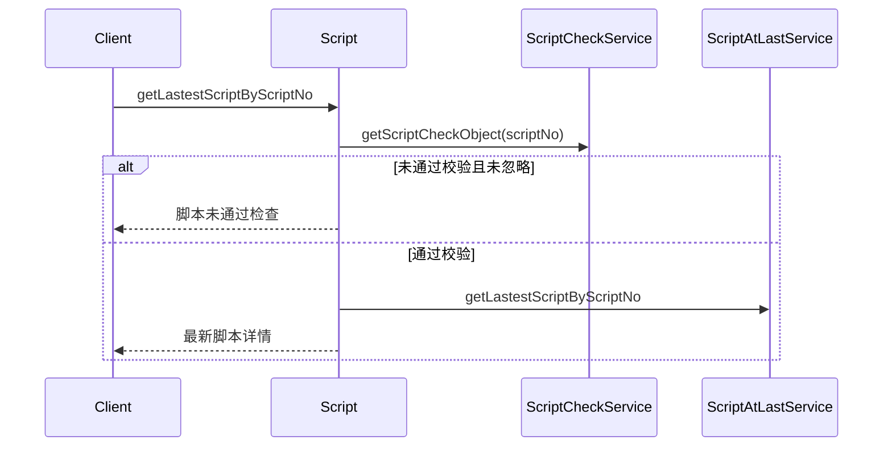

**涉及表：**
- [script_check](../../../数据库管理/db_file/script_check.md)
- [script_at_last](../../../数据库管理/db_file/script_at_last.md)
- [script_file](../../../数据库管理/db_file/script_file.md)

---

### getParentScripts
获取脚本的最新版本父脚本依赖（仅一层）。

**请求参数（data字段）：**
| 参数 | 类型 | 必填 | 说明 |
|------|------|------|------|
| scriptNo | Integer | 是 | 脚本编号 |
| projectId | Integer | 是 | 项目组ID |

**返回参数：**
| 字段 | 类型 | 说明 |
|------|------|------|
| code | Integer | 状态码，0=成功 |
| message | String | 提示信息 |
| data | Object | 返回数据 |
| data.list | JSONArray | 父脚本依赖列表（一层） |

**涉及表：**
- [script_relation](../../../数据库管理/db_file/script_relation.md)
- [script_file](../../../数据库管理/db_file/script_file.md)

---

### getChildScriptNos
根据脚本编号列表查询所有子脚本编号。

**请求参数（data字段）：**
| 参数 | 类型 | 必填 | 说明 |
|------|------|------|------|
| scriptNos | JSONArray | 是 | 脚本编号列表 |

**响应：** 所有子脚本编号列表。

**返回参数：**
| 字段 | 类型 | 说明 |
|------|------|------|
| code | Integer | 状态码，0=成功 |
| message | String | 提示信息 |
| data | Object | 返回数据 |
| data.list | JSONArray | 所有子脚本编号列表 |

**涉及表：**
- [script_relation](../../../数据库管理/db_file/script_relation.md)

---

### getScriptAndSubScript
获取指定脚本及其所有子脚本的完整信息。

**请求参数（data字段）：**
| 参数 | 类型 | 必填 | 说明 |
|------|------|------|------|
| scriptNos | JSONArray | 是 | 脚本编号列表 |

**响应：** `{ scriptNo: [ScriptFile, ...] }` 每个父脚本对应其自身及子脚本列表。

**返回参数：**
| 字段 | 类型 | 说明 |
|------|------|------|
| code | Integer | 状态码，0=成功 |
| message | String | 提示信息 |
| data | Object | 返回数据（Map<scriptNo, List<ScriptFile>>） |
| data.{scriptNo} | JSONArray | 对应脚本及其子脚本列表 |

**涉及表：**
- [script_relation](../../../数据库管理/db_file/script_relation.md)
- [script_file](../../../数据库管理/db_file/script_file.md)

---

### getParentOrChildScriptsByScriptNo
分页查询脚本的父脚本或子脚本。

**请求参数（data字段）：**
| 参数 | 类型 | 必填 | 说明 |
|------|------|------|------|
| scriptNo | Integer | 是 | 脚本编号 |
| scriptId | Integer | 否（查父脚本时需推算） | 脚本ID |
| parentScriptOrChildScript | Integer | 是 | 0=查父脚本, 1=查子脚本 |
| startPage | Integer | 是 | 起始页 |
| pageSize | Integer | 是 | 每页条数 |

**响应：** 分页的 ScriptFileSimpleDTO 列表。

**返回参数：**
| 字段 | 类型 | 说明 |
|------|------|------|
| code | Integer | 状态码，0=成功 |
| message | String | 提示信息 |
| data | Object | 返回数据 |
| data.list | JSONArray | ScriptFileSimpleDTO 列表 |
| data.page / pageSize | Integer | 当前页 / 每页条数 |
| data.totalRow / totalPage | Integer | 总行数 / 总页数 |

**涉及表：**
- [script_relation](../../../数据库管理/db_file/script_relation.md)
- [script_file](../../../数据库管理/db_file/script_file.md)
- [script_at_last](../../../数据库管理/db_file/script_at_last.md)

---

### updateScriptTagsBatch
批量更新脚本标签。

**请求参数（data字段）：**
| 参数 | 类型 | 必填 | 说明 |
|------|------|------|------|
| scriptNos | List<Integer> | 是 | 脚本编号列表 |
| scriptTag | String | 否 | 标签（逗号分隔） |
| flag | Integer | 是 | 操作类型：1=追加, 2=覆盖, 3=清空 |
| userId | Integer | 否 | 操作用户ID |

**响应：** `{ "result": 1 }`

**返回参数：**
| 字段 | 类型 | 说明 |
|------|------|------|
| code | Integer | 状态码，0=成功 |
| message | String | 提示信息 |
| data | Object | 返回数据 |
| data.result | Integer | 受影响行数 |

**流程图：**
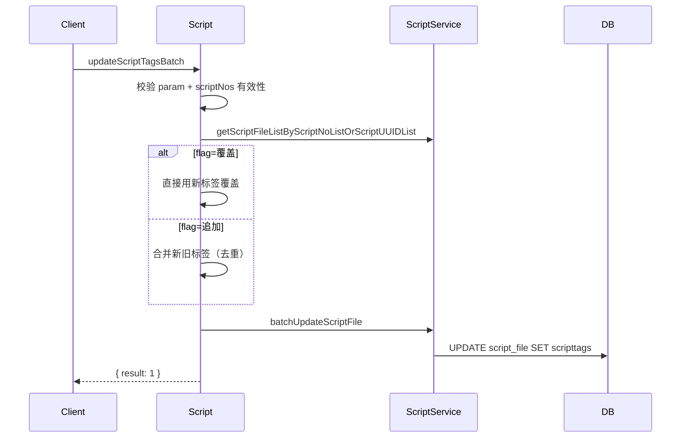

**涉及表：**
- [script_file](../../../数据库管理/db_file/script_file.md)

---

### scriptNum
获取指定目录及其子目录下脚本数量统计。

**请求参数（data字段）：**
| 参数 | 类型 | 必填 | 说明 |
|------|------|------|------|
| eid | Integer | 是 | 企业ID |
| projectId | Integer | 是 | 项目组ID |
| unStorage | Integer | 否 | 是否统计未分配目录数 |
| recycleBin | Integer | 否 | 是否统计回收站数 |
| dirIds | JSONArray | 否 | 指定目录ID列表 |

**响应：** `{ dirIdWithCount: {...}, unStorageCount: N, deletedScriptCount: N }`

**返回参数：**
| 字段 | 类型 | 说明 |
|------|------|------|
| code | Integer | 状态码，0=成功 |
| message | String | 提示信息 |
| data | Object | 返回数据 |
| data.dirIdWithCount | Object | 目录ID → 脚本数量映射 |
| data.unStorageCount | Integer | 未分配目录脚本数 |
| data.deletedScriptCount | Integer | 回收站脚本数 |

**涉及表：**
- [script_dir](../../../数据库管理/db_file/script_dir.md)
- [script_dir_child](../../../数据库管理/db_file/script_dir_child.md)
- [script_file](../../../数据库管理/db_file/script_file.md)

---

### findScriptByCondition
条件查询脚本（老接口，兼容同步）。

**请求参数（data字段）：**
| 参数 | 类型 | 必填 | 说明 |
|------|------|------|------|
| page | Integer | 是 | 页码 |
| pageSize | Integer | 是 | 页大小 |
| projectid | Integer | 否 | 项目组ID |
| appid | Integer | 否 | 应用ID |
| ... | ... | 否 | 其他动态筛选条件（除 page/pageSize 外全部透传为查询条件） |

**返回参数：**
| 字段 | 类型 | 说明 |
|------|------|------|
| code | Integer | 状态码，0=成功 |
| message | String | 提示信息 |
| data | Object | 返回数据 |
| data.list | JSONArray | 脚本列表（ScriptFile） |
| data.page / pageSize | Integer | 当前页 / 每页条数 |
| data.totalRow / totalPage | Integer | 总行数 / 总页数 |

**涉及表：**
- [script_file](../../../数据库管理/db_file/script_file.md)

---

### listScriptBasicInfoByCondition
脚本基础信息分页查询。

**请求参数（data字段）：**
| 参数 | 类型 | 必填 | 说明 |
|------|------|------|------|
| projectid | Integer | 是 | 项目组ID |
| page | Integer | 是 | 页码 |
| pageSize | Integer | 是 | 页大小 |
| scriptdesc | String | 否 | 脚本描述（模糊） |
| scriptNos | JSONArray | 否 | 脚本编号列表 |
| exclusionScriptNos | JSONArray | 否 | 分页不需要展示的 scriptNo 列表 |

**返回参数：**
| 字段 | 类型 | 说明 |
|------|------|------|
| code | Integer | 状态码，0=成功 |
| message | String | 提示信息 |
| data | Object | 返回数据 |
| data.list | JSONArray | 脚本基础信息列表（ScriptFileBasicInfo） |
| data.page / pageSize | Integer | 当前页 / 每页条数 |
| data.totalRow / totalPage | Integer | 总行数 / 总页数 |

**涉及表：**
- [script_file](../../../数据库管理/db_file/script_file.md)

---

### selectProjectScriptChannels
查询项目下脚本的渠道列表。

**请求参数（data字段）：**
| 参数 | 类型 | 必填 | 说明 |
|------|------|------|------|
| projectId / projectid | Integer | 是 | 项目组ID |

**返回参数：**
| 字段 | 类型 | 说明 |
|------|------|------|
| code | Integer | 状态码，0=成功 |
| message | String | 提示信息 |
| data | Object | 返回数据 |
| data.list | JSONArray | 渠道名称列表（String） |

**涉及表：**
- [script_file](../../../数据库管理/db_file/script_file.md)

---

### selectAllScriptsByCondition
全量条件查询脚本（不分页，用于脚本组等组件数据源）。

**请求参数（data字段）：**
| 参数 | 类型 | 必填 | 说明 |
|------|------|------|------|
| projectId | Integer | 是 | 项目组ID |
| scriptNos | JSONArray | 是 | 脚本编号列表 |
| userIds | String | 否 | 更新人ID（逗号分隔） |
| userLike | String | 否 | 用户名模糊匹配 |
| eid | Integer | 否 | 企业ID |
| scriptType | Integer | 否 | 脚本类型，默认1 |
| checkStatus | Integer | 否 | 校验状态，默认1 |
| scriptDesc | String | 否 | 脚本描述 |
| scriptNo | String | 否 | 脚本编号（模糊） |
| channelId | String | 否 | 渠道ID |
| scriptTags | JSONArray | 否 | 标签列表 |
| appId | Integer | 否 | 应用ID |
| suiteId | Integer | 否 | 套件/应用ID |
| osType | Integer | 否 | 系统类型 |

**返回参数：**
| 字段 | 类型 | 说明 |
|------|------|------|
| code | Integer | 状态码，0=成功 |
| message | String | 提示信息 |
| data | Object | 返回数据 |
| data.list | JSONArray | 脚本列表（ScriptFile，最多1000条） |

**涉及表：**
- [script_file](../../../数据库管理/db_file/script_file.md)

**跨服务调用：**
- [UserApi](../../../平台基础功能服务/00-首页.md)

---

### checkScriptByScriptid
校验单个脚本（查询 ScriptCheck）。

**请求参数（data字段）：**
| 参数 | 类型 | 必填 | 说明 |
|------|------|------|------|
| scriptid | Integer | 是 | 脚本ID |

**返回参数：**
| 字段 | 类型 | 说明 |
|------|------|------|
| code | Integer | 状态码，0=成功 |
| message | String | 提示信息 |
| data | Object | 返回数据 |
| data.object | Object | 脚本校验对象（ScriptCheck） |

**涉及表：**
- [script_check](../../../数据库管理/db_file/script_check.md)

---

### listScriptCheckByScriptIds
批量查询脚本校验对象。

**请求参数（data字段）：**
| 参数 | 类型 | 必填 | 说明 |
|------|------|------|------|
| scriptIds | JSONArray | 是 | 脚本ID列表 |

**返回参数：**
| 字段 | 类型 | 说明 |
|------|------|------|
| code | Integer | 状态码，0=成功 |
| message | String | 提示信息 |
| data | Object | 返回数据 |
| data.list | JSONArray | 脚本校验对象列表（ScriptCheck） |

**涉及表：**
- [script_check](../../../数据库管理/db_file/script_check.md)

---

### checkInfos
批量查询校验信息（根据 scriptIds 列表）。

**请求参数（data字段）：**
| 参数 | 类型 | 必填 | 说明 |
|------|------|------|------|
| scriptIds | JSONArray | 是 | 脚本ID列表 |

**返回参数：**
| 字段 | 类型 | 说明 |
|------|------|------|
| code | Integer | 状态码，0=成功 |
| message | String | 提示信息 |
| data | Object | 返回数据 |
| data.list | JSONArray | 脚本校验信息列表（ScriptCheck） |

**涉及表：**
- [script_check](../../../数据库管理/db_file/script_check.md)

---

### suiteList
查询脚本关联的套件（Suite）列表。

**请求参数（data字段）：**
| 参数 | 类型 | 必填 | 说明 |
|------|------|------|------|
| projectId | Integer | 是 | 项目组ID |
| scriptIds | List<Integer> | 是 | 脚本ID列表 |

**返回参数：**
| 字段 | 类型 | 说明 |
|------|------|------|
| code | Integer | 状态码，0=成功 |
| message | String | 提示信息 |
| data | Object | 返回数据 |
| data.list | JSONArray | 套件列表（SuiteInfo） |

**涉及表：**
- [suite_script](../../../数据库管理/db_file/suite_script.md)
- [suite_info](../../../数据库管理/db_file/suite_info.md)

---

### getScriptByScriptid
按 scriptId 查询脚本信息。

**请求参数（data字段）：**
| 参数 | 类型 | 必填 | 说明 |
|------|------|------|------|
| scriptid | Integer | 是 | 脚本ID |

**返回参数：**
| 字段 | 类型 | 说明 |
|------|------|------|
| code | Integer | 状态码，0=成功 |
| message | String | 提示信息 |
| data | Object | 返回数据 |
| data.object | Object | 脚本对象（ScriptFile） |

**涉及表：**
- [script_file](../../../数据库管理/db_file/script_file.md)

---

### getLastScriptIdsByNos
根据脚本编号列表获取最新的 scriptId 列表。

**请求参数（data字段）：**
| 参数 | 类型 | 必填 | 说明 |
|------|------|------|------|
| scriptNos | JSONArray | 是 | 脚本编号列表 |
| projectId | Integer | 否 | 项目组ID |

**返回参数：**
| 字段 | 类型 | 说明 |
|------|------|------|
| code | Integer | 状态码，0=成功 |
| message | String | 提示信息 |
| data | Object | 返回数据 |
| data.list | JSONArray | 最新 scriptId 列表（Integer） |

**涉及表：**
- [script_at_last](../../../数据库管理/db_file/script_at_last.md)

---

### suppImportScriptList
补充导入脚本列表处理（检查是否已存在、状态、排序）。

**请求参数（data字段）：**
| 参数 | 类型 | 必填 | 说明 |
|------|------|------|------|
| projectid | Integer | 是 | 项目组ID |
| scriptFiles | JSONArray | 是 | 待导入脚本文件列表（ScriptTempFile） |
| scriptNos | JSONArray | 是 | 脚本编号列表 |
| scriptDirId | Integer | 是 | 目标目录ID（须>=0） |
| scriptType | Integer | 否 | 脚本类型 |

**返回参数：**
| 字段 | 类型 | 说明 |
|------|------|------|
| code | Integer | 状态码，0=成功 |
| message | String | 提示信息 |
| data | Object | 返回数据 |
| data.result | JSONArray | 补充处理后的脚本列表（ScriptTempFile，含 state/flag/index/dirPath） |

**涉及表：**
- [script_file](../../../数据库管理/db_file/script_file.md)

---

### getScriptsByCondition
通过套件ID和脚本类型获取脚本列表。

**请求参数（data字段）：**
| 参数 | 类型 | 必填 | 说明 |
|------|------|------|------|
| suiteId | Integer | 是 | 套件ID |
| scriptType | Integer | 否 | 脚本类型 |

**返回参数：**
| 字段 | 类型 | 说明 |
|------|------|------|
| code | Integer | 状态码，0=成功 |
| message | String | 提示信息 |
| data | Object | 返回数据 |
| data.list | JSONArray | 脚本列表（ScriptFile） |

**涉及表：**
- [suite_script](../../../数据库管理/db_file/suite_script.md)
- [script_file](../../../数据库管理/db_file/script_file.md)

---

### listScriptByAppIdAndVersion
根据 appId 和 appVersion 查询脚本（供数据源管理使用）。

**请求参数（data字段）：**
| 参数 | 类型 | 必填 | 说明 |
|------|------|------|------|
| projectId | Integer | 是 | 项目组ID |
| appId | Integer | 否 | 应用ID |
| appVersion | String | 否 | 应用版本 |
| sourceId | Integer | 否 | 数据源ID（过滤数据源下已用脚本） |

**返回参数：**
| 字段 | 类型 | 说明 |
|------|------|------|
| code | Integer | 状态码，0=成功 |
| message | String | 提示信息 |
| data | Object | 返回数据 |
| data.list | JSONArray | 脚本摘要列表（ScriptSummaryDTO） |

**涉及表：**
- [script_file](../../../数据库管理/db_file/script_file.md)

---

### listLastestScriptByScriptNo
批量查询最新脚本信息（含校验状态过滤）。

**请求参数（data字段）：**
| 参数 | 类型 | 必填 | 说明 |
|------|------|------|------|
| projectId | Integer | 是 | 项目组ID |
| scriptNoArray | JSONArray | 是 | 脚本编号列表 |
| scriptCheck | Integer | 否 | 是否校验，默认1 |

**返回参数：**
| 字段 | 类型 | 说明 |
|------|------|------|
| code | Integer | 状态码，0=成功 |
| message | String | 提示信息 |
| data | Object | 返回数据 |
| data.list | JSONArray | 最新脚本列表（ScriptFile） |

**涉及表：**
- [script_check](../../../数据库管理/db_file/script_check.md)
- [script_at_last](../../../数据库管理/db_file/script_at_last.md)

---

### listByScriptids
根据 scriptId 集合获取脚本详情列表。

**请求参数（data字段）：**
| 参数 | 类型 | 必填 | 说明 |
|------|------|------|------|
| projectid | Integer | 是 | 项目组ID |
| scriptIdArray | JSONArray | 是 | 脚本ID列表 |
| needAppInfo | Integer | 否 | 是否需要App信息（默认需要） |
| needFileInfo | Integer | 否 | 是否需要文件信息（默认需要） |

**返回参数：**
| 字段 | 类型 | 说明 |
|------|------|------|
| code | Integer | 状态码，0=成功 |
| message | String | 提示信息 |
| data | Object | 返回数据 |
| data.list | JSONArray | 脚本详情列表（ScriptInfo） |

**涉及表：**
- [script_file](../../../数据库管理/db_file/script_file.md)

---

### listScriptByScriptProperty
根据脚本属性（projectId + appId + appVersion）查询脚本。

**请求参数（data字段）：**
| 参数 | 类型 | 必填 | 说明 |
|------|------|------|------|
| projectId | Integer | 是 | 项目组ID |
| appId | Integer | 是 | 应用ID |
| appVersion | String | 是 | 应用版本 |
| channel | String | 否 | 渠道 |

**返回参数：**
| 字段 | 类型 | 说明 |
|------|------|------|
| code | Integer | 状态码，0=成功 |
| message | String | 提示信息 |
| data | Object | 返回数据 |
| data.list | JSONArray | 脚本列表（ScriptFile） |

**涉及表：**
- [script_file](../../../数据库管理/db_file/script_file.md)

---

### findScriptByScriptIdList
根据 scriptId 列表查询脚本。

**请求参数（data字段）：**
| 参数 | 类型 | 必填 | 说明 |
|------|------|------|------|
| scriptids | JSONArray | 是 | 脚本ID列表 |
| projectid | Integer | 否 | 项目组ID |

**返回参数：**
| 字段 | 类型 | 说明 |
|------|------|------|
| code | Integer | 状态码，0=成功 |
| message | String | 提示信息 |
| data | Object | 返回数据 |
| data.list | JSONArray | 脚本列表（ScriptFile） |

**涉及表：**
- [script_file](../../../数据库管理/db_file/script_file.md)

---

### getLastestScriptWithNoApp
获取最新脚本（不填充 App 信息，轻量查询）。

**请求参数（data字段）：**
| 参数 | 类型 | 必填 | 说明 |
|------|------|------|------|
| scriptNo | Integer | 是 | 脚本编号 |

**返回参数：**
| 字段 | 类型 | 说明 |
|------|------|------|
| code | Integer | 状态码，0=成功 |
| message | String | 提示信息 |
| data | Object | 返回数据 |
| data.object | Object | 最新脚本对象（ScriptFile，不含 App 信息） |

**涉及表：**
- [script_file](../../../数据库管理/db_file/script_file.md)
- [script_at_last](../../../数据库管理/db_file/script_at_last.md)

---

### findScriptByScriptIdList2
根据 scriptId 列表查询脚本（版本2，含已删除）。

**请求参数（data字段）：**
| 参数 | 类型 | 必填 | 说明 |
|------|------|------|------|
| scriptids | JSONArray | 是 | 脚本ID列表 |
| projectid | Integer | 否 | 项目组ID |

**返回参数：**
| 字段 | 类型 | 说明 |
|------|------|------|
| code | Integer | 状态码，0=成功 |
| message | String | 提示信息 |
| data | Object | 返回数据 |
| data.list | JSONArray | 脚本列表（ScriptFile，含已删除） |

**涉及表：**
- [script_file](../../../数据库管理/db_file/script_file.md)

---

### findFinalScriptByScriptNoList
根据 scriptNo 列表查询最终版脚本。

**请求参数（data字段）：**
| 参数 | 类型 | 必填 | 说明 |
|------|------|------|------|
| scriptnos | JSONArray | 是 | 脚本编号列表 |
| projectid | Integer | 否 | 项目组ID |

**返回参数：**
| 字段 | 类型 | 说明 |
|------|------|------|
| code | Integer | 状态码，0=成功 |
| message | String | 提示信息 |
| data | Object | 返回数据 |
| data.list | JSONArray | 最终版脚本列表（ScriptFile） |

**涉及表：**
- [script_file](../../../数据库管理/db_file/script_file.md)
- [script_at_last](../../../数据库管理/db_file/script_at_last.md)

---

### generateScriptNo
生成一个新的脚本编号。

**返回参数：**
| 字段 | 类型 | 说明 |
|------|------|------|
| code | Integer | 状态码，0=成功 |
| message | String | 提示信息 |
| data | Object | 返回数据 |
| data.object | Object | 生成结果对象 |
| data.object.result | Integer | 新生成的脚本编号 |

**涉及表：**
- [script_file](../../../数据库管理/db_file/script_file.md)

---

## 关键流程总览

### 脚本生命周期流程
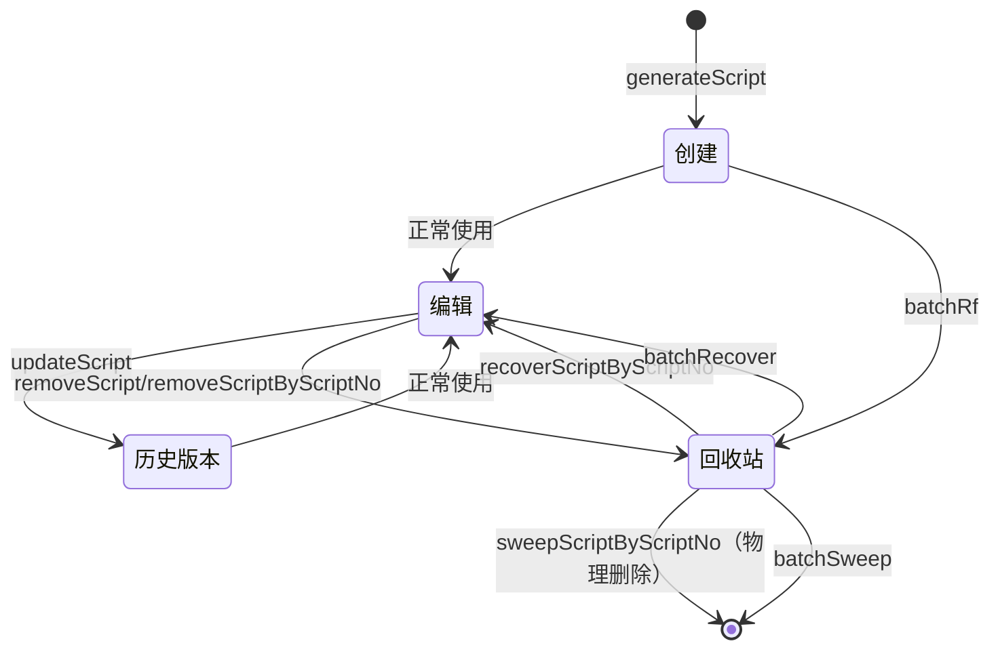

### 导入导出流程
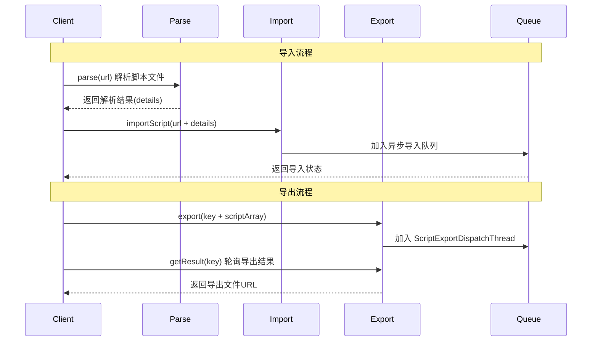
