# ScriptController

> 包路径：cn.testin.mvc.controller.ScriptController
> 基础路径：/v3/script

## 接口列表

### POST /v3/script/scripts
分页查询脚本列表。支持按目录、标签、状态、用户名等多条件组合查询，返回分页列表。

**请求参数：**
| 参数 | 类型 | 必填 | 说明 |
|------|------|------|------|
| projectId | Integer | 是 | 项目ID |
| scriptType | Integer | 是 | 脚本类型(APP/WEB/PC) |
| page | Integer | 否 | 页码，默认1 |
| pageSize | Integer | 否 | 每页大小，默认20，最大200 |
| dirId | Integer | 否 | 目录ID |
| dirIds | List<Integer> | 否 | 多目录ID列表 |
| deep | Integer | 否 | 是否包含子目录，1为包含 |
| unassigned | Integer | 否 | 是否未分配目录 |
| isDelete | Integer | 否 | 删除状态过滤 |
| scriptTags | List<String> | 否 | 标签列表过滤 |
| designUserName | String | 否 | 设计人用户名过滤 |
| updateUserName | String | 否 | 更新人用户名过滤 |
| checkStatus | Integer | 否 | 检查状态过滤 |
| orderByCol | String | 否 | 排序字段 |
| orderByType | String | 否 | 排序方向(ASC/DESC) |
| noCheck | Integer | 否 | 是否跳过参数校验 |

**响应结构：**
```json
{
  "code": 200,
  "data": {
    "page": 1,
    "pageSize": 20,
    "totalRow": 100,
    "totalPage": 5,
    "list": [
      {
        "scriptNo": 1001,
        "scriptId": 5001,
        "scriptName": "登录测试",
        "scriptType": 1,
        "scriptTags": ["冒烟测试", "登录"],
        "checkStatus": 1,
        "dirId": 10,
        "suiteId": 100,
        "updateTime": 1690800000000,
        "scriptRecoverInfoVo": null
      }
    ]
  }
}
```

**实现意图：**
该接口是脚本管理的核心查询入口。先解析请求参数，将userName转换为userIds，解析目录关系（包含子目录/未分配目录），最后通过ScriptFileMapper分页查询数据库。查询结果会额外填充tag标签信息（从script_tag表）和自愈脚本信息（从script_recover_info表）。对于APP类型脚本，额外JOIN suite表获取应用名称。

**流程图：**
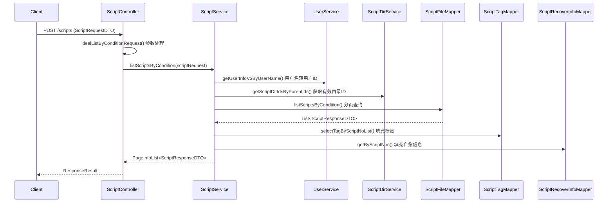

**涉及表：**
- script_file
- script_tag
- script_recover_info
- script_dir
- script_dir_child
- suite_info (APP类型)

**跨服务调用：**
- UserApi (用户名转用户ID)

**关键代码：**
```java
PageHelper.startPage(scriptRequest.getPage(), scriptRequest.getPageSize());
List<ScriptResponseDTO> list = getScriptResponseList(condition);
PageInfo<ScriptResponseDTO> page = new PageInfo<>(list);
return PageUtil.dealPage(page);
```

---

### POST /v3/script/scripts/relation_status
查询脚本关联关系状态。用于判断脚本是否存在子脚本或注释调用关系。

**请求参数：**
| 参数 | 类型 | 必填 | 说明 |
|------|------|------|------|
| scriptNos | List<Integer> | 是 | 脚本编号列表 |

**响应结构：**
```json
{
  "code": 200,
  "data": {
    "1001": 1,
    "1002": 0
  }
}
```

**实现意图：**
校验所有scriptNos有效性后，遍历每个脚本查询script_file表中的关联关系。返回值1表示有关联，0表示无关联。

**流程图：**
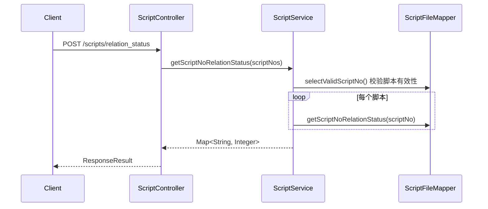

**涉及表：**
- script_file
- script_relation

---

### POST /v3/script/scripts/datasources/export
导出脚本（新版）。通过ScriptExportService异步执行导出任务，生成ZIP包（含脚本XML/JSON、图片、数据源Excel等），上传后通过活动日志返回下载URL。

**请求参数：**
| 参数 | 类型 | 必填 | 说明 |
|------|------|------|------|
| scriptNos | List<Integer> | 否 | 指定脚本编号列表 |
| condition | ScriptConditionRequestDTO | 否 | 全选查询条件 |
| scriptType | Integer | 是 | 脚本类型 |
| projectId | Integer | 是 | 项目ID |
| userId | Integer | 是 | 操作用户ID |
| exportDepend | Integer | 否 | 是否导出依赖(子脚本) |
| exportDataSourceType | Integer | 否 | 数据源导出类型 |
| sourceIdList | List<Integer> | 否 | 指定数据源ID |
| exportImages | Integer | 否 | 是否导出图片 |

**响应结构：**
```json
{
  "code": 200,
  "data": {
    "result": "abc123def456"
  }
}
```

**实现意图：**
先通过scriptExport()校验参数（脚本有效性、导出条件），生成唯一requestId（key），注入exportRequestDTO。然后通过线程池异步调用exportScript()执行实际导出：下载XML/JSON/图片 → 导出关联关系 → 导出目录结构 → 导出标签 → 调用DataSourceApi导出数据源 → 压缩为ZIP → 上传文件 → 通过Redis写入活动日志。Controller同步返回requestId供前端轮询。

**流程图：**
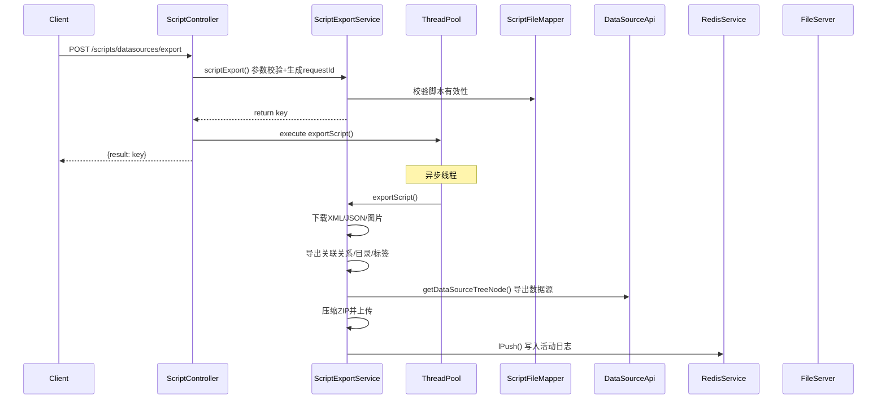

**涉及表：**
- script_file
- script_relation
- script_recover_info
- script_dir
- script_dir_child
- script_tag
- common_file
- action_log (Redis)

**跨服务调用：**
- DataSourceApi (getDataSourceBaseInfoList / getDataSourceTreeNode)
- FileServer (文件上传)
- RedisService (活动日志队列)

---

### POST /v3/script/scripts/datasources/export/old
导出脚本（旧版）。使用旧版的异步导出逻辑，通过ScriptExportDispatchThread任务调度器执行。

**请求参数：**
同 POST /v3/script/scripts/datasources/export

**响应结构：**
```json
{
  "code": 200,
  "data": {
    "result": "uuid-key-string"
  }
}
```

**实现意图：**
调用ScriptService.scriptExport()（@Deprecated方法）。先构建目录树和dirId-名称映射 → 查询脚本列表 → 调用DataSourceApi获取数据源 → 将任务放入ScriptExportDispatchThread.waitTaskMap通知调度线程处理 → 记录活动日志到Redis。同步返回key。

**流程图：**
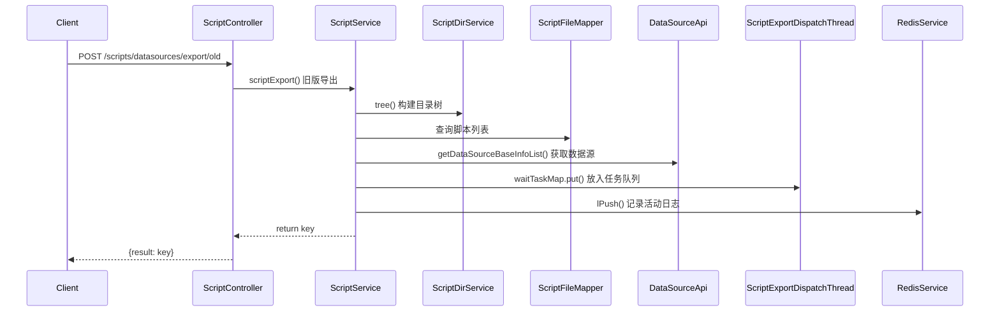

**涉及表：**
- script_file
- script_dir
- script_dir_child
- action_log (Redis)

**跨服务调用：**
- DataSourceApi
- ScriptExportDispatchThread
- RedisService

---

### PUT /v3/script/scripts/{scriptNo}
更新脚本信息。支持修改名称、标签、设计人。可选同步更新数据源名称。

**请求参数：**
| 参数 | 类型 | 必填 | 说明 |
|------|------|------|------|
| scriptNo | Integer(路径) | 是 | 脚本编号 |
| scriptId | Integer | 否 | 脚本ID |
| scriptName | String | 是 | 脚本名称 |
| scriptTags | List<String> | 否 | 标签列表 |
| scriptDesignUserId | Integer | 否 | 设计人用户ID |
| userId | Integer | 是 | 更新用户ID |
| syncSourceName | Integer | 否 | 是否同步数据源名称 |

**响应结构：**
```json
{
  "code": 200,
  "data": {
    "result": 1
  }
}
```

**实现意图：**
在@Transactional中执行：校验脚本是否存在 → 更新script_file表的名称、标签、更新人 → 调用tagService更新script_tag表 → 如syncSourceName=1则调用DataSourceApi.syncSourceName()同步数据源名称。使用@OperateLog记录操作日志。

**流程图：**
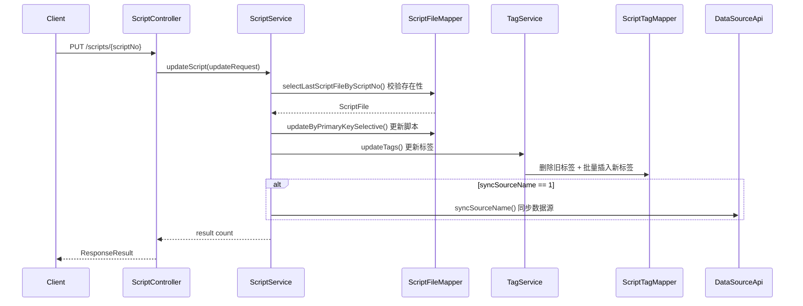

**涉及表：**
- script_file
- script_tag

**跨服务调用：**
- DataSourceApi (syncSourceName)

---

### POST /v3/script/scripts/hard_delete
硬删除脚本。将回收站中的脚本标记为硬删除状态（isDelete=2），同时删除关联的接口自动化用例。

**请求参数：**
| 参数 | 类型 | 必填 | 说明 |
|------|------|------|------|
| projectId | Integer | 是 | 项目ID |
| scriptNos | List<Integer> | 否 | 脚本编号列表（与scriptType二选一至少一个非空） |
| scriptType | Integer | 否 | 脚本类型（全选删除） |

**响应结构：**
```json
{
  "code": 200,
  "data": {
    "result": 5
  }
}
```

**实现意图：**
查询isDelete=1的脚本列表 → 更新isDelete为2（硬删除） → 调用scriptCaseRelationMapper.removeBatchScriptCaseRelation()删除关联用例。

**流程图：**
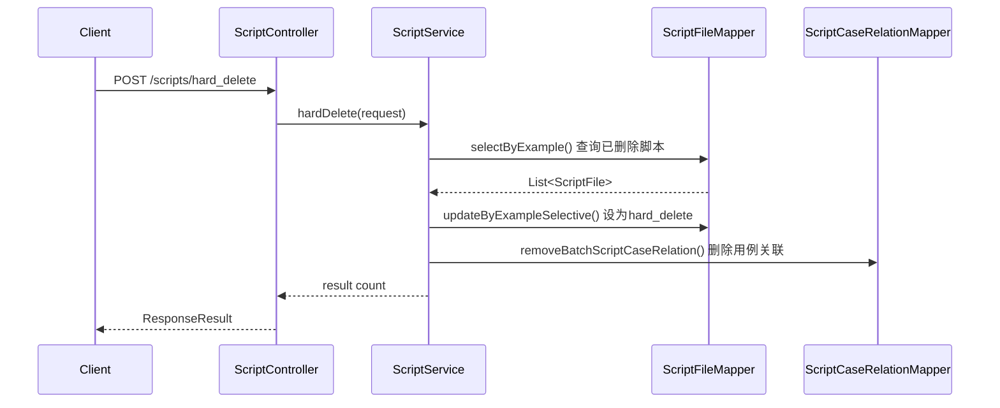

**涉及表：**
- script_file
- script_case_relation

---

### POST /v3/script/scripts/batch_recover
批量恢复脚本。从回收站恢复脚本到正常状态，并重新检查脚本有效性。

**请求参数：**
| 参数 | 类型 | 必填 | 说明 |
|------|------|------|------|
| projectId | Integer | 是 | 项目ID |
| scriptNos | List<Integer> | 否 | 脚本编号列表 |
| scriptType | Integer | 否 | 脚本类型（全选恢复） |
| userId | Integer | 是 | 操作用户ID |
| onDuplicateAction | Integer | 否 | 重复处理策略（REPLACE/KEEP） |

**响应结构：**
```json
{
  "code": 200,
  "data": {
    "result": 3
  }
}
```

**实现意图：**
先调用refreshUUUIdForRepeatScripts()处理重复脚本（覆盖模式：替换脚本内容+重建调用关系；保留两者：刷新新的UUID） → 更新isDelete为0 → 将无目录脚本放入根目录 → 调用CheckApi.checkScript()检查脚本服务可用性 → 逐个调用invalidScriptRecheck()重新检查 → 放入Redis批量恢复队列。

**流程图：**
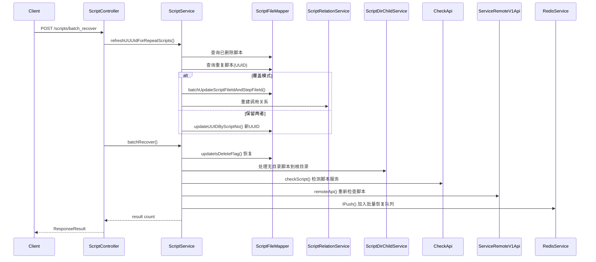

**涉及表：**
- script_file
- script_relation
- script_dir_child
- script_check

**跨服务调用：**
- CheckApi (checkScript)
- ServiceRemoteV1Api (脚本重检)
- RedisService

---

### POST /v3/script/scripts/create_empty
创建空脚本。生成新的scriptNo，在script_file中创建基础记录，同时建立目录关联和应用关联。

**请求参数：**
| 参数 | 类型 | 必填 | 说明 |
|------|------|------|------|
| scriptName | String | 是 | 脚本名称 |
| scriptType | Integer | 是 | 脚本类型 |
| projectId | Integer | 是 | 项目ID |
| userId | Integer | 是 | 创建用户ID |
| dirId | Integer | 否 | 所属目录ID |
| suiteId | Integer | 否 | 关联应用ID（APP类型必填） |
| scriptDesignUserId | Integer | 否 | 设计人ID |
| scriptTag | String | 否 | 标签字符串 |

**响应结构：**
```json
{
  "code": 200,
  "data": {
    "result": 1001
  }
}
```

**实现意图：**
APP类型校验suiteId → 生成scriptNo → 创建ScriptFile记录（默认值：history=1, recordType=1, ostype=0, build=1）→ 创建script_dir_child关系 → 创建script_at_last关系 → 保存suite_script关联（APP类型）。返回新生成的scriptNo。

**流程图：**
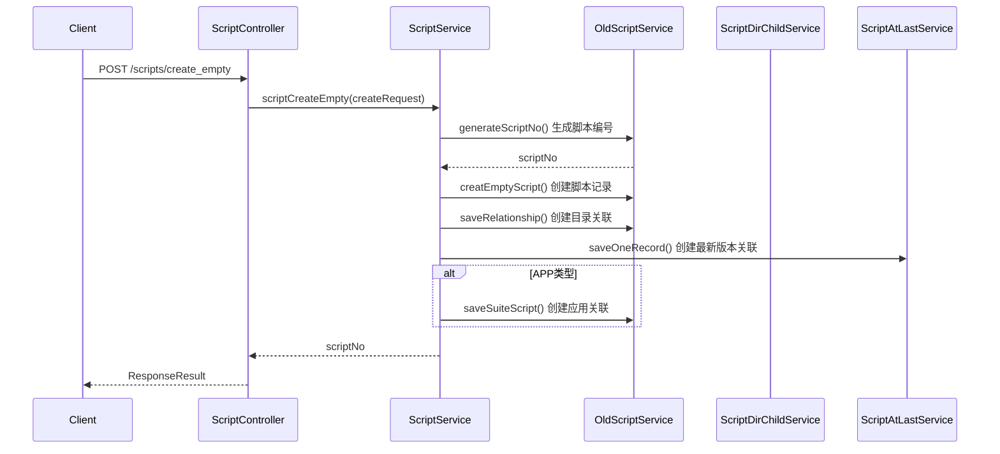

**涉及表：**
- script_file
- script_dir_child
- script_at_last
- suite_script

---

### POST /v3/script/scripts/recheck
无效脚本重新检查。通过远程API服务触发脚本重新检查流程。

**请求参数：**
| 参数 | 类型 | 必填 | 说明 |
|------|------|------|------|
| scriptNo | Integer | 是 | 脚本编号 |

**响应结构：**
```json
{
  "code": 200,
  "data": {
    "result": 1
  }
}
```

**实现意图：**
根据scriptNo查询最新有效的scriptId → 构建ScriptRecheckDTO → 调用ServiceRemoteV1Api.remoteApi()发送远程检查请求（ACTION: FILEUPLOAD_ACTION, OP: SCRIPT_CHECK_SCRIPT_OP）。

**流程图：**
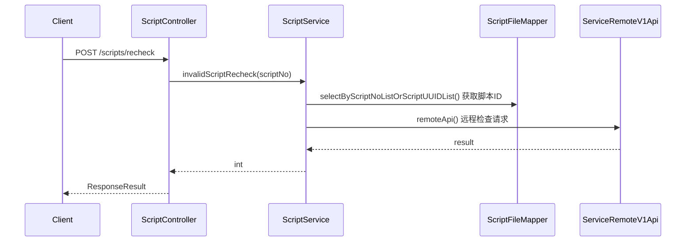

**涉及表：**
- script_file

**跨服务调用：**
- ServiceRemoteV1Api (FILEUPLOAD_ACTION)

---

### POST /v3/script/scripts/batch_copy
批量复制脚本（异步）。根据查询条件找到需要复制的脚本，在线程池中异步执行复制逻辑。

**请求参数：**
| 参数 | 类型 | 必填 | 说明 |
|------|------|------|------|
| scriptNos | List<Integer> | 否 | 脚本编号列表 |
| targetDirId | Integer | 是 | 目标目录ID |
| targetProjectId | Integer | 是 | 目标项目ID |
| targetSuiteId | Integer | 否 | 目标应用ID |
| copyType | Integer | 是 | 复制类型（1-仅脚本/2-含实例数据/3-含数据源） |
| copyWithDependencies | Integer | 是 | 是否复制子脚本依赖 |
| condition | ScriptConditionRequestDTO | 否 | 全选查询条件 |
| newScriptName | String | 否 | 单个脚本复制时的自定义新名称 |
| userId | Integer | 是 | 操作用户ID |
| userName | String | 是 | 操作用户名 |

**响应结构：**
```json
{
  "code": 200,
  "data": {
    "result": "uuid-request-id"
  }
}
```

**实现意图：**
参数校验（目标目录、目标项目、复制类型、依赖选项）→ 调用ProjectApi获取目标项目名称 → 查询目标目录信息 → 通过条件查询需要复制的脚本列表 → 生成requestId → 线程池异步执行oldScriptService.copyScripts()进行实际复制。同步返回requestId。

**流程图：**
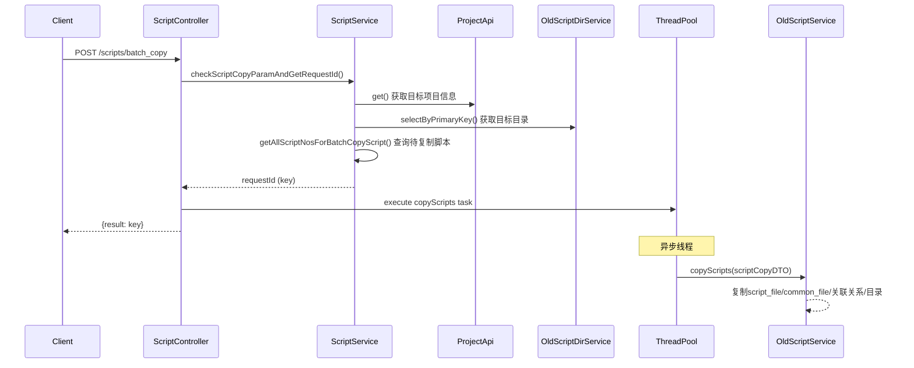

**涉及表：**
- script_file
- common_file
- script_relation
- script_dir_child
- script_at_last
- script_tag

**跨服务调用：**
- ProjectApi (get)
- OldScriptService (file.service.ScriptService)

---

### POST /v3/script/scripts/move/dir
批量移动脚本目录。将指定脚本移动到目标目录下。

**请求参数：**
| 参数 | 类型 | 必填 | 说明 |
|------|------|------|------|
| scriptNos | List<Integer> | 否 | 脚本编号列表 |
| targetDirId | Integer | 是 | 目标目录ID |
| projectId | Integer | 是 | 项目ID |
| eid | Integer | 否 | 企业ID |
| userId | Integer | 是 | 操作用户ID |
| condition | ScriptConditionRequestDTO | 否 | 全选查询条件 |

**响应结构：**
```json
{
  "code": 200,
  "data": {
    "result": 10
  }
}
```

**实现意图：**
如未传scriptNos则通过condition全选查询出所有scriptNos → 调用oldScriptDirService.relationship()移动脚本目录关系。

**流程图：**
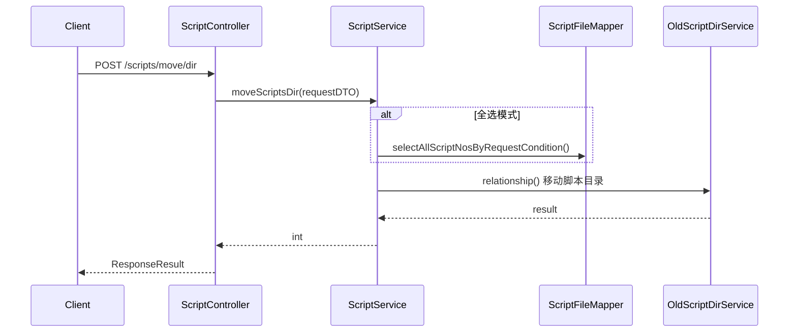

**涉及表：**
- script_dir_child

---

### POST /v3/script/scripts/remove
批量删除脚本。将脚本标记为删除状态（isDelete=1），移入回收站。

**请求参数：**
| 参数 | 类型 | 必填 | 说明 |
|------|------|------|------|
| scriptNos | List<Integer> | 否 | 脚本编号列表 |
| projectId | Integer | 是 | 项目ID |
| condition | ScriptConditionRequestDTO | 否 | 全选查询条件 |

**响应结构：**
```json
{
  "code": 200,
  "data": {
    "result": 5
  }
}
```

**实现意图：**
全选模式通过condition查询所有scriptNos → 调用oldScriptService.batchDeleteScript()执行删除。@OperateLog记录SCRIPT_DELETE操作日志。

**流程图：**
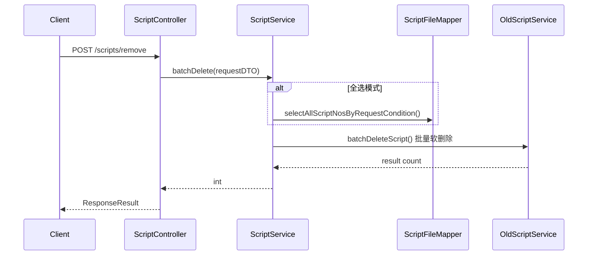

**涉及表：**
- script_file

---

### PUT /v3/script/scripts/tags
批量更新标签。支持全选条件下批量覆盖或追加标签。

**请求参数：**
| 参数 | 类型 | 必填 | 说明 |
|------|------|------|------|
| scriptNos | List<Integer> | 否 | 脚本编号列表 |
| userId | Integer | 是 | 操作用户ID |
| scriptTags | List<String> | 是 | 标签列表 |
| flag | Integer | 是 | 操作类型（1-覆盖/2-追加） |
| condition | ScriptConditionRequestDTO | 否 | 全选查询条件 |

**响应结构：**
```json
{
  "code": 200,
  "data": {
    "result": 10
  }
}
```

**实现意图：**
根据条件或scriptNos查询所有目标脚本 → 根据flag判断是覆盖还是追加标签 → 遍历脚本调用scriptFileMapper.updateScriptFile()更新script_file表中的scripttags字段 → 同步更新script_tag表。

**流程图：**
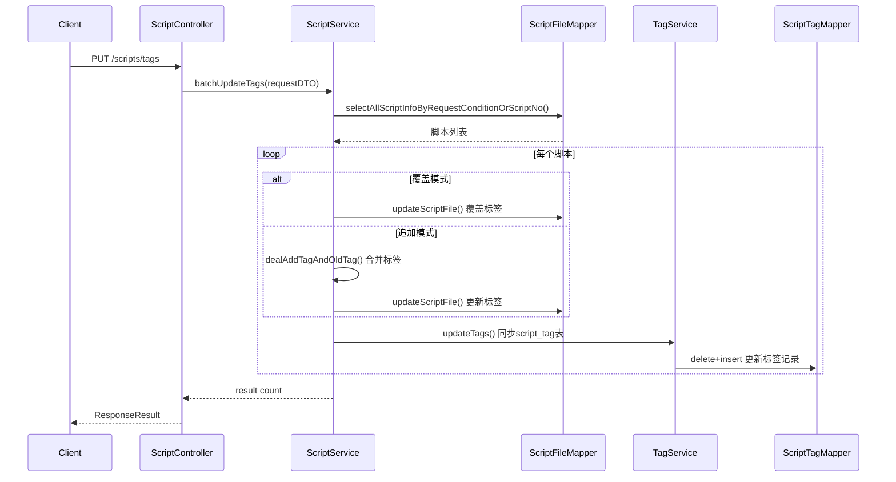

**涉及表：**
- script_file
- script_tag

---

### POST /v3/script/scripts/script_nos
根据条件获取脚本号列表。内部接口，供数据源等模块使用。

**请求参数：**
| 参数 | 类型 | 必填 | 说明 |
|------|------|------|------|
| projectId | Integer | 是 | 项目ID |
| scriptType | Integer | 是 | 脚本类型 |
| (其他ScriptConditionRequestDTO字段) | - | 否 | 全选筛选条件 |

**响应结构：**
```json
{
  "code": 200,
  "data": {
    "scriptNos": [1001, 1002, 1003]
  }
}
```

**实现意图：**
校验projectId和scriptType → 调用selectAllScriptNosByRequestCondition()返回所有符合条件的scriptNo列表。

**流程图：**
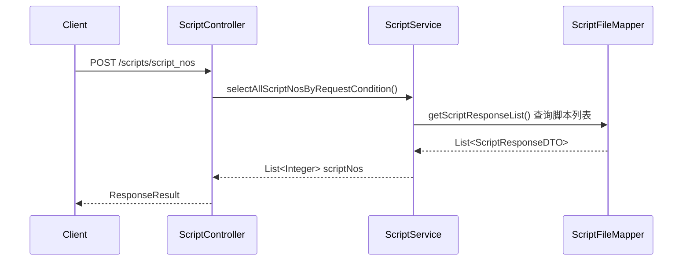

**涉及表：**
- script_file
- script_dir_child

---

### PUT /v3/script/scripts/assoc_case_num
更新脚本关联用例数量。

**请求参数：**
| 参数 | 类型 | 必填 | 说明 |
|------|------|------|------|
| scriptNo | Integer | 是 | 脚本编号 |
| assocCaseNum | Integer | 是 | 关联用例数量 |

**响应结构：**
```json
{
  "code": 200,
  "data": {
    "result": 1
  }
}
```

**实现意图：**
直接调用scriptFileMapper.updateScriptAssocCaseNum()更新关联用例计数。

**流程图：**
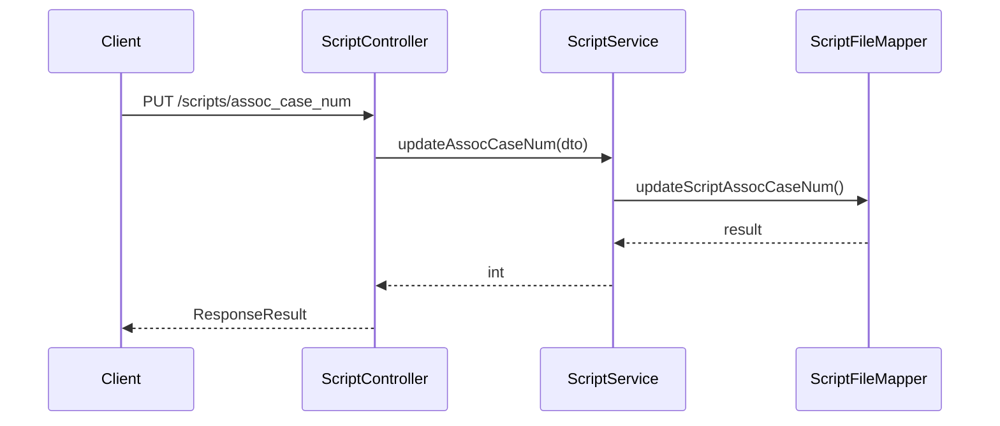

**涉及表：**
- script_file

---

### POST /v3/script/scripts/case_num
根据脚本编号列表获取用例数总和。

**请求参数：**
| 参数 | 类型 | 必填 | 说明 |
|------|------|------|------|
| scriptNos | List<Integer> | 是 | 脚本编号列表 |
| scriptType | Integer | 否 | 脚本类型（APP走suite关联查询） |

**响应结构：**
```json
{
  "code": 200,
  "data": {
    "result": 15
  }
}
```

**实现意图：**
通过ScriptNumConditionDTO构建查询条件 → APP类型走getScriptCountAndCaseCountWithSuite → 其他类型走getScriptCountAndCaseCount → 返回用例数总和。

**流程图：**
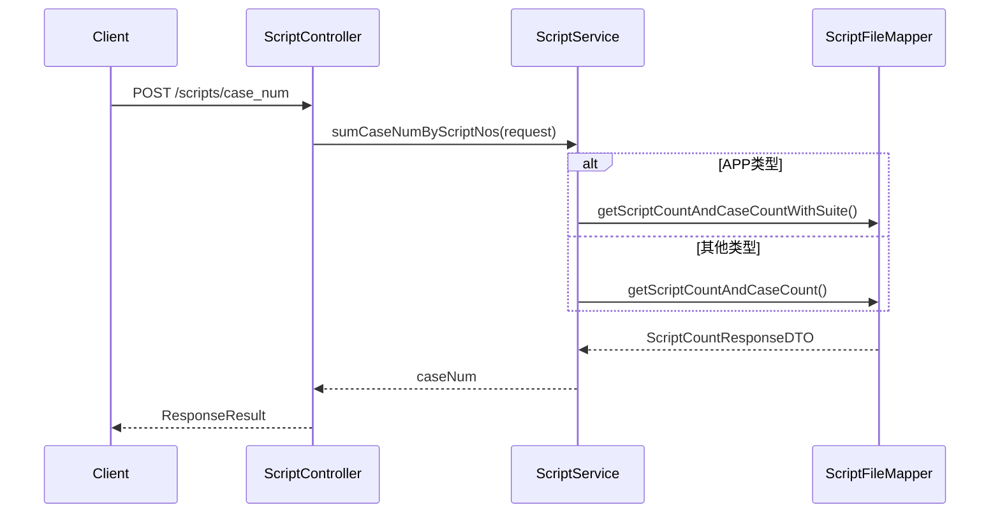

**涉及表：**
- script_file
- suite_script (APP类型)

---

### GET /v3/script/scripts/count
获取脚本数和用例数统计。按项目、脚本类型、时间范围统计新增/更新脚本数和用例数。

**请求参数：**
| 参数 | 类型 | 必填 | 说明 |
|------|------|------|------|
| projectId | Integer | 是 | 项目ID |
| scriptType | Integer | 是 | 脚本类型 |
| startTime | Long | 否 | 统计起始时间戳 |
| endTime | Long | 否 | 统计截止时间戳 |

**响应结构：**
```json
{
  "code": 200,
  "data": {
    "scriptCount": 100,
    "caseCount": 50,
    "addScriptCount": 20,
    "updateScriptCount": 80
  }
}
```

**实现意图：**
通过ScriptNumConditionDTO批量查询脚本总数和用例总数 → 单独查询新增数量和更新数量 → 返回统计结果。

**流程图：**
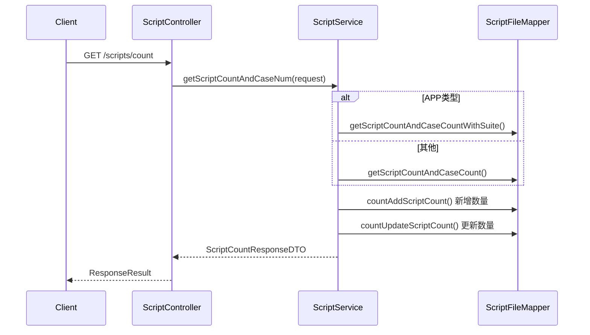

**涉及表：**
- script_file
- suite_script (APP)

---

### GET /v3/script/scripts/tag_count
查询tag关联数量。按项目、类型、时间统计每个标签的使用次数。

**请求参数：**
| 参数 | 类型 | 必填 | 说明 |
|------|------|------|------|
| projectId | Integer | 是 | 项目ID |
| scriptType | Integer | 是 | 脚本类型 |
| startTime | Long | 否 | 统计起始时间 |
| endTime | Long | 否 | 统计截止时间 |

**响应结构：**
```json
{
  "code": 200,
  "data": {
    "title": "脚本标签统计",
    "list": [
      {"key": "冒烟测试", "value": 25},
      {"key": "回归测试", "value": 18}
    ],
    "total": {"key": "合计", "value": 43}
  }
}
```

**实现意图：**
分页（每页1000条）遍历所有脚本 → 解析每个脚本的scripttags字段 → 按tag累积计数 → 构建ScriptChartDTO返回。有startTime/endTime时按更新时间排序，否则按创建时间排序。

**流程图：**
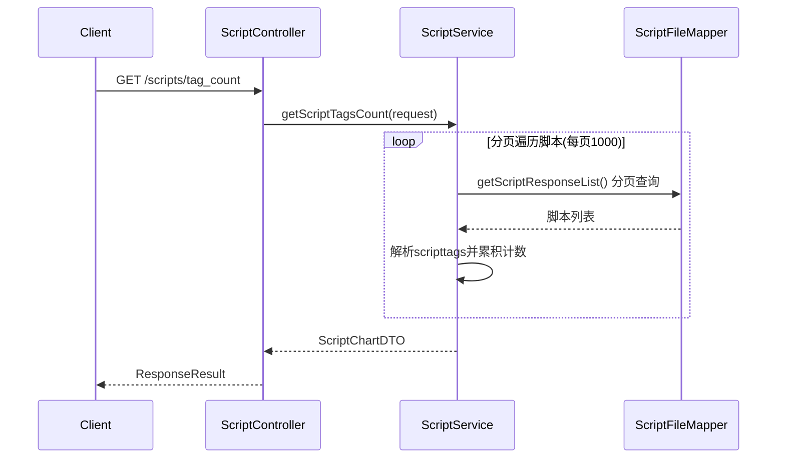

**涉及表：**
- script_file

---

### GET /v3/script/scripts/tag_count/download
下载tag统计CSV文件。返回UTF-8 BOM编码的CSV附件。

**请求参数：**
同 GET /v3/script/scripts/tag_count

**实现意图：**
调用getScriptTagsCount()获取统计数据 → 调用ProjectApi获取项目名 → 构建文件名（项目名_类型_标签统计_时间.csv） → 设置响应头Content-Disposition → 写入CSV内容（UTF-8 BOM + 表头 + 数据行）。

**流程图：**
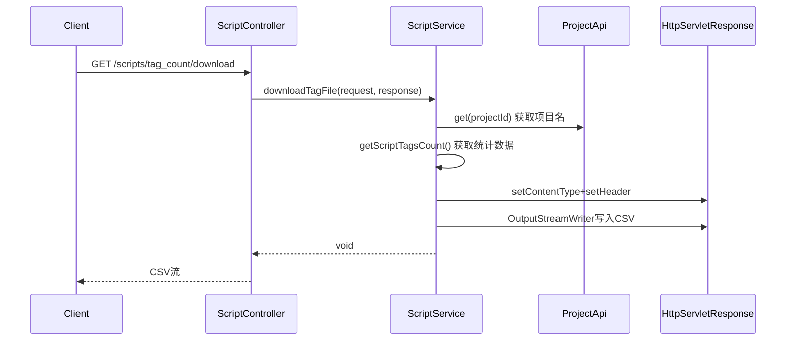

**涉及表：**
- script_file

**跨服务调用：**
- ProjectApi

---

### POST /v3/script/scripts/sync_tags
脚本标签同步。将script_file表中的scripttags字段同步到script_tag表中。

**请求参数：**
无

**响应结构：**
```json
{
  "code": 200,
  "data": {
    "result": 500
  }
}
```

**实现意图：**
分页（每页2000条）查询所有脚本 → 解析每个脚本的scripttags字段（逗号分隔） → 构建ScriptTag对象列表 → 每500条批量INSERT IGNORE到script_tag表。

**流程图：**
```mermaid
sequenceDiagram
    participant Client
    participant ScriptController
    participant ScriptService
    participant ScriptFileMapper
    participant ScriptTagMapper

    Client->>ScriptController: POST /scripts/sync_tags
    ScriptController->>ScriptService: syncTags()
    loop 分页遍历(每页2000)
        ScriptService->>ScriptFileMapper: selectAllScriptTag() 查询所有脚本标签
        ScriptFileMapper-->>ScriptService: List<ScriptFile>
        ScriptService->>ScriptService: 解析scripttags字段
        each 每500条
            ScriptService->>ScriptTagMapper: batchInsertIgnoreScriptTag()
        end
    end
    ScriptService-->>ScriptController: total inserted
    ScriptController-->>Client: ResponseResult
```

**涉及表：**
- script_file
- script_tag

---

### POST /v3/script/scripts/import_script
脚本导入（异步）。下载上传的ZIP包，解压后在线程池中异步执行导入逻辑。

**请求参数：**
| 参数 | 类型 | 必填 | 说明 |
|------|------|------|------|
| url | String | 是 | 脚本ZIP包下载地址 |
| requestId | String | 是 | 导入请求ID |
| projectId | Integer | 是 | 目标项目ID |
| scriptType | Integer | 是 | 脚本类型 |
| scriptImportFlag | Integer | 是 | 重复处理策略(1-跳过/2-覆盖/3-新建) |
| dirId | Integer | 否 | 目标目录ID |
| suiteId | Integer | 否 | 关联应用ID |
| eid | Integer | 是 | 企业ID |
| userId | Integer | 是 | 操作用户ID |
| userName | String | 是 | 操作用户名 |

**响应结构：**
```json
{
  "code": 200,
  "data": {
    "result": "request-id-string"
  }
}
```

**实现意图：**
线程池异步执行scriptImportService.importScript()：下载ZIP → 解压 → 读取脚本文件 → 按导入策略处理重复（跳过/覆盖/新建） → 复制common_file → 导入关联关系 → 导入目录结构 → 导入数据源（调用DataSourceApi） → 生成脚本步骤搜索数据 → 记录活动日志到Redis → 完成时清理临时文件。

**流程图：**
```mermaid
sequenceDiagram
    participant Client
    participant ScriptController
    participant ThreadPool
    participant ScriptImportService
    participant ScriptFileMapper
    participant DataSourceApi
    participant RedisService

    Client->>ScriptController: POST /scripts/import_script
    ScriptController->>ThreadPool: execute import task
    ScriptController-->>Client: {row: requestId}

    Note over ThreadPool: 异步导入
    ThreadPool->>ScriptImportService: importScript()
    ScriptImportService->>ScriptImportService: 下载ZIP并解压
    ScriptImportService->>ScriptImportService: 读取script_file.json
    alt 跳过模式
        ScriptImportService->>ScriptImportService: 过滤已存在的UUID脚本
    else 覆盖模式
        ScriptImportService->>ScriptImportService: 替换已存在的脚本
    else 新建模式
        ScriptImportService->>ScriptImportService: 全部新建+新UUID
    end
    ScriptImportService->>ScriptFileMapper: batchInsert() 插入脚本
    ScriptImportService->>ScriptImportService: 导入script_relation/script_dir_child
    ScriptImportService->>DataSourceApi: importDataSourceInfo() 导入数据源
    ScriptImportService->>ScriptImportService: saveScriptStepSearchRelation() 搜索表
    ScriptImportService->>RedisService: lPush() 更新活动日志
    ScriptImportService->>ScriptImportService: deleteImportTempFile() 清理文件
```

**涉及表：**
- script_file
- common_file
- script_relation
- script_recover_info
- script_dir
- script_dir_child
- script_at_last
- script_check
- script_tag
- script_step_search
- suite_script (APP)

**跨服务调用：**
- DataSourceApi (importDataSourceInfo)
- UserApi (获取用户信息)
- TestinScriptApi (上传脚本文件)
- RedisService

---

### POST /v3/script/scripts/pre_import_script
脚本预导入。解析ZIP包内容，返回脚本列表、目录结构和数据源名称供用户预览确认。

**请求参数：**
| 参数 | 类型 | 必填 | 说明 |
|------|------|------|------|
| url | String | 是 | 脚本ZIP包下载地址 |
| projectId | Integer | 是 | 目标项目ID |

**响应结构：**
```json
{
  "code": 200,
  "data": {
    "requestId": "uuid-key",
    "scriptFileList": [
      {
        "scriptNo": 1001,
        "scriptName": "登录测试",
        "scriptType": 1,
        "existUUID": 1,
        "scriptTags": ["tag1"]
      }
    ],
    "rootDir": { "name": "根目录", ... },
    "dirMap": {},
    "dataSourceName": ["数据源1", "数据源2"]
  }
}
```

**实现意图：**
下载ZIP → 解压 → 校验文件完整性（script_file.json/script_dir.json/script_dir_child.json/各脚本xml和json文件） → 校验版本兼容性 → 查询已存在的UUID列表 → 解析标签 → 构建脚本预览列表（标记existUUID） → 解析目录树结构 → 解析数据源名称 → 返回预览结果。

**流程图：**
```mermaid
sequenceDiagram
    participant Client
    participant ScriptController
    participant ScriptImportService
    participant OldScriptService
    participant ScriptFileMapper

    Client->>ScriptController: POST /scripts/pre_import_script
    ScriptController->>ScriptImportService: preImportScript()
    ScriptImportService->>ScriptImportService: 下载ZIP并解压
    ScriptImportService->>ScriptImportService: checkImportFile() 检查文件完整性
    ScriptImportService->>ScriptImportService: checkScriptSystemMsg() 版本检查
    ScriptImportService->>OldScriptService: getScriptFileListByScriptNoListOrScriptUUIDList() 查询已存在UUID
    ScriptImportService->>ScriptImportService: 读取script_tag.json标签
    ScriptImportService->>ScriptImportService: perImportDataSource() 解析数据源名称
    ScriptImportService->>ScriptImportService: 构建目录树+脚本映射
    ScriptImportService-->>ScriptController: ScriptPreImportResponseDTO
    ScriptController-->>Client: ResponseResult
```

**涉及表：**
- script_file (查询已有UUID)

---

### POST /v3/script/scripts/list_simple
获取用例步骤的脚本简要信息。根据脚本编号列表返回简化的脚本信息。

**请求参数：**
Request Body: List<Integer> scriptNos

**响应结构：**
```json
{
  "code": 200,
  "data": [
    {
      "scriptNo": 1001,
      "scriptName": "登录测试",
      "scriptType": 1
    }
  ]
}
```

**实现意图：**
直接调用scriptFileMapper.selectScriptSimpleList()查询脚本简要信息。

**流程图：**
```mermaid
sequenceDiagram
    participant Client
    participant ScriptController
    participant ScriptService
    participant ScriptFileMapper

    Client->>ScriptController: POST /scripts/list_simple (List<Integer>)
    ScriptController->>ScriptService: getScriptSimpleList(scriptNos)
    ScriptService->>ScriptFileMapper: selectScriptSimpleList()
    ScriptFileMapper-->>ScriptService: List<SimpleScriptInfo>
    ScriptService-->>ScriptController: result
    ScriptController-->>Client: ResponseResult
```

**涉及表：**
- script_file

---

### POST /v3/script/scripts/check_script_repeat
检查脚本重复。从回收站恢复前检查是否存在UUID冲突的脚本。

**请求参数：**
| 参数 | 类型 | 必填 | 说明 |
|------|------|------|------|
| projectId | Integer | 是 | 项目ID |
| scriptNos | List<Integer> | 否 | 脚本编号列表 |
| scriptType | Integer | 否 | 脚本类型 |

**响应结构：**
```json
{
  "code": 200,
  "data": {
    "result": [...]
  }
}
```

**实现意图：**
查询待恢复脚本列表 → 提取UUID（去掉DEL_前缀） → 查询同项目下是否有相同UUID的有效脚本 → 返回重复脚本列表。

**流程图：**
```mermaid
sequenceDiagram
    participant Client
    participant ScriptController
    participant ScriptService
    participant ScriptFileMapper

    Client->>ScriptController: POST /scripts/check_script_repeat
    ScriptController->>ScriptService: getScriptRepeat(request)
    ScriptService->>ScriptFileMapper: selectDeleteScriptList() 查询待恢复脚本
    ScriptFileMapper-->>ScriptService: 待恢复脚本列表
    ScriptService->>ScriptService: 提取UUID(去DEL_前缀)
    ScriptService->>ScriptFileMapper: selectByScriptNoListOrScriptUUIDList() 查询重复
    ScriptFileMapper-->>ScriptService: 重复脚本列表
    ScriptService-->>ScriptController: List<ScriptFile>
    ScriptController-->>Client: ResponseResult
```

**涉及表：**
- script_file
