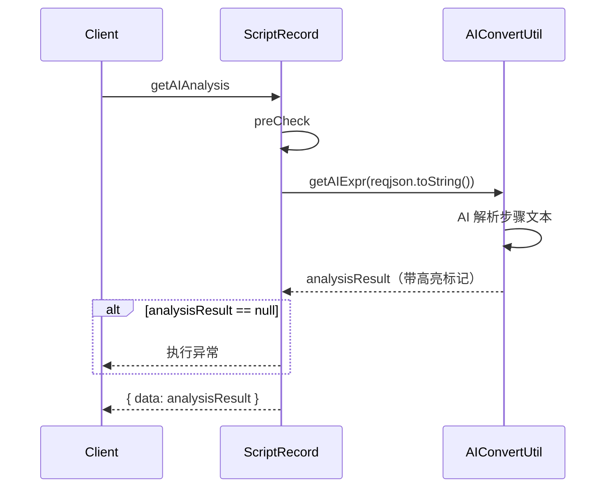
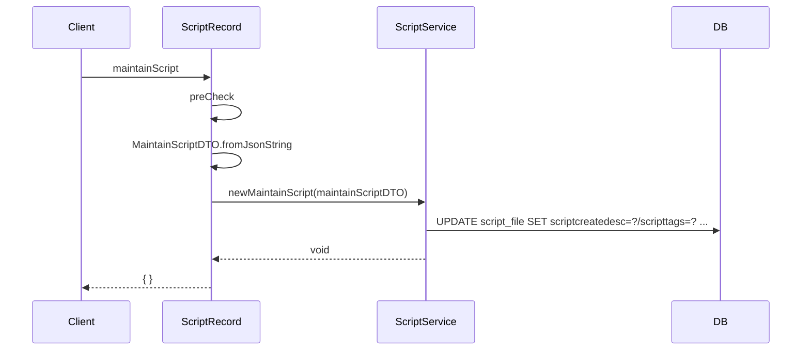
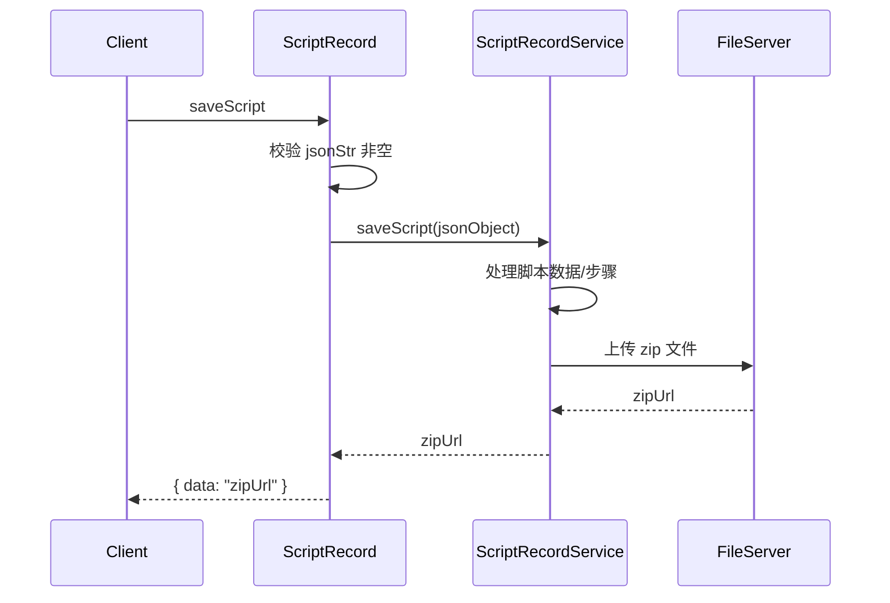
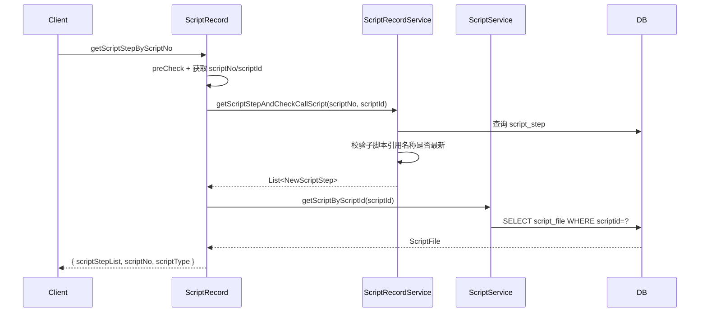

# ScriptRecord (ApiServlet)

> 包路径：cn.testin.service.script.ScriptRecord
> 调用方式：action=script op=ScriptRecord.{method}

## 职责
脚本记录（AI分析+保存）API，提供 AI 步骤解析高亮、按 scriptNo 维护脚本信息、保存脚本、获取脚本步骤（含子脚本名称校验）等功能。

---

## 方法列表

### getAIAnalysis
AI 步骤分析和高亮显示。将脚本步骤文本通过 AI 解析为带颜色标记的结构化表达式。

**请求参数（data字段）：**
| 参数 | 类型 | 必填 | 说明 |
|------|------|------|------|
| ... | ... | 是 | AI分析所需的脚本步骤数据（透传 reqjson） |

**返回参数：**
| 字段 | 类型 | 说明 |
|------|------|------|
| code | Integer | 状态码，0=成功 |
| message | String | 提示信息 |
| data | String | AI 解析后的结构化表达式字符串 |

**实现意图：**
将完整的 req JSON 传入 AIConvertUtil.getAIExpr 进行解析处理，返回带 AI 高亮标记的表达式。

**流程图：**

**涉及表：** 无（纯 AI 文本处理）

**跨服务调用：**
- AIConvertUtil

---

### maintainScript
根据脚本编号维护脚本信息（设计人、描述、标签等）。

**请求参数（data字段）：** MaintainScriptDTO 对象字段
| 参数 | 类型 | 必填 | 说明 |
|------|------|------|------|
| scriptNo | Integer | 是 | 脚本编号 |
| scriptDesc | String | 否 | 脚本描述 |
| designUserid | Integer | 否 | 设计人ID |
| scriptTags | String | 否 | 标签 |

**返回参数：**
| 字段 | 类型 | 说明 |
|------|------|------|
| code | Integer | 状态码，0=成功 |
| message | String | 提示信息 |
| data | Object | 返回数据（空对象表示成功） |

**实现意图：**
调用 scriptService.newMaintainScript 更新脚本元数据，不需要 scriptId 仅靠 scriptNo 定位。

**流程图：**

**涉及表：**
- [script_file](../../../数据库管理/db_file/script_file.md)

---

### saveScript
保存脚本内容（主要是文件上传/存储）。

**请求参数（data字段）：**
| 参数 | 类型 | 必填 | 说明 |
|------|------|------|------|
| ... | JSON | 是 | 脚本保存所需的完整数据（透传 reqjson） |

**返回参数：**
| 字段 | 类型 | 说明 |
|------|------|------|
| code | Integer | 状态码，0=成功 |
| message | String | 提示信息 |
| data | String | 保存后的脚本 zip 文件 URL |

**实现意图：**
将整个请求 JSON 传递给 scriptRecordService.saveScript 处理，返回存储后的脚本 zip 文件 URL。

**流程图：**

**涉及表：**
- [script_file](../../../数据库管理/db_file/script_file.md)
- [script_step](../../../数据库管理/db_file/script_step.md)

---

### getScriptStepByScriptNo
获取脚本步骤并校验调用子脚本的名称是否为最新（供 Online 界面使用）。

**请求参数（data字段）：**
| 参数 | 类型 | 必填 | 说明 |
|------|------|------|------|
| scriptNo | Integer | 是 | 脚本编号 |
| scriptId | Integer | 是 | 脚本ID |

**返回参数：**
| 字段 | 类型 | 说明 |
|------|------|------|
| code | Integer | 状态码，0=成功 |
| message | String | 提示信息 |
| data | Object | 返回数据 |
| data.scriptStepList | JSONArray | 脚本步骤列表（NewScriptStep） |
| data.scriptNo | Integer | 脚本编号 |
| data.scriptType | Integer | 脚本类型 |

**实现意图：**
调用 scriptRecordService.getScriptStepAndCheckCallScript 获取步骤列表，同时校验子脚本引用名称。返回步骤列表 + 脚本编号 + 脚本类型。

**流程图：**

**涉及表：**
- [script_step](../../../数据库管理/db_file/script_step.md)
- [script_file](../../../数据库管理/db_file/script_file.md)
