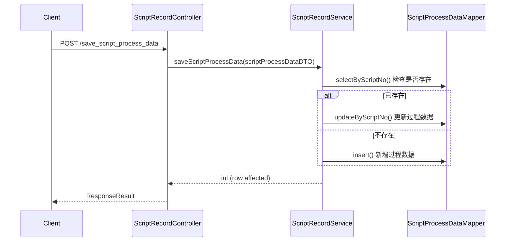
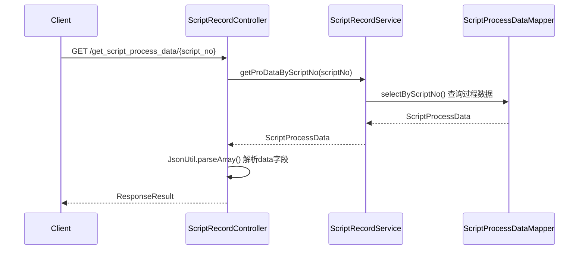

# ScriptRecordController

> 包路径：cn.testin.mvc.controller.ScriptRecordController
> 基础路径：/v3/script/script_record

## 接口列表

### POST /v3/script/script_record/save_script_process_data
保存脚本过程数据。存储脚本执行过程中的中间数据，如参数、运行状态等。

**请求参数：** ScriptProcessDataDTO 实体字段
| 参数 | 类型 | 必填 | 说明 |
|------|------|------|------|
| scriptNo | Integer | 是 | 脚本编号（@NotNull） |
| projectId | Integer | 是 | 项目ID（@NotNull） |
| scriptType | Integer | 是 | 脚本类型 1：app 3：web 5：pc（@NotNull） |
| data | List\<Object\> | 是 | 过程数据（@NotNull，JSON 数组） |
| userId | Integer | 是 | 操作用户ID（@NotNull） |

**响应结构：** data 为 BaseResponseDTO（result 为受影响行数）
```json
{
  "code": 200,
  "data": {
    "result": 1
  }
}
```

**实现意图：**
接收ScriptProcessDataDTO → 调用ScriptRecordService.saveScriptProcessData() → 将过程数据写入script_process_data表。如果该scriptNo已有记录则更新，否则新增。

**流程图：**


**涉及表：**
- script_process_data

---

### GET /v3/script/script_record/get_script_process_data/{script_no}
获取脚本过程数据。根据脚本编号查询保存的过程数据。

**请求参数：**
| 参数 | 类型 | 必填 | 说明 |
|------|------|------|------|
| script_no | Integer(路径) | 是 | 脚本编号 |

**响应结构：**
```json
{
  "code": 200,
  "data": {
    "scriptNo": 1001,
    "projectId": 100,
    "scriptType": 1,
    "userId": 1001,
    "data": [
      {"key": "value"}
    ]
  }
}
```

**实现意图：**
通过scriptNo查询script_process_data表 → 获取ScriptProcessData实体 → 将data字段（JSON字符串）使用JsonUtil.parseArray()解析为对象列表 → 组装ScriptProcessDataDTO返回。

**流程图：**


**涉及表：**
- script_process_data
