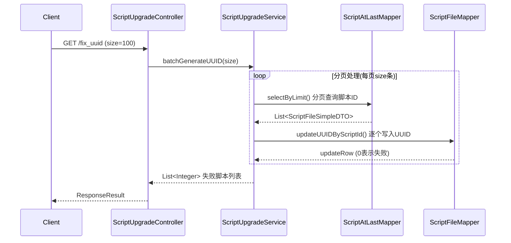
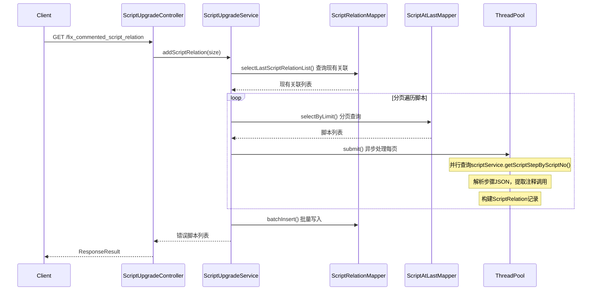
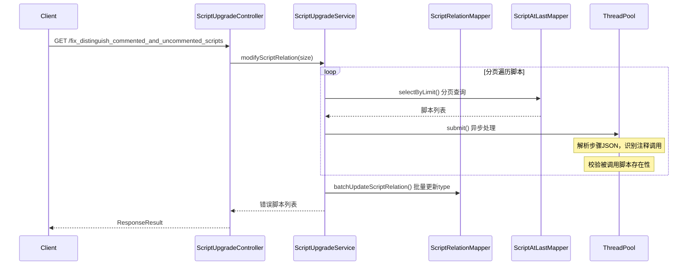
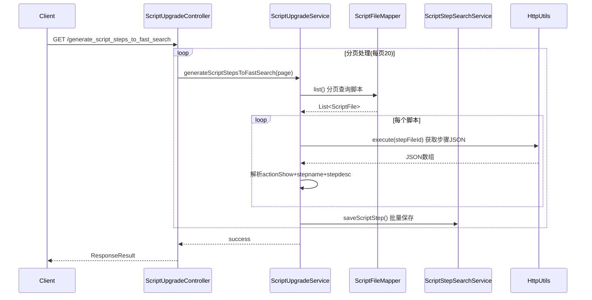

# ScriptUpgradeController

> 包路径：cn.testin.mvc.controller.ScriptUpgradeController
> 基础路径：/v3/scripts/version_upgrade

注意：本Controller所有接口均为版本升级专用，在系统正常运行时不应被调用。仅在新版本首次部署时由运维或管理员触发。

## 接口列表

### GET /v3/scripts/version_upgrade/fix_uuid
为脚本批量添加UUID字段。遍历所有历史脚本记录，为缺失UUID的脚本生成并写入UUID。

**请求参数：**
| 参数 | 类型 | 必填 | 说明 |
|------|------|------|------|
| size | Integer | 否 | 每批次处理数量，默认100 |

**响应结构：**
```json
{
  "code": 200,
  "data": [1001, 1005]
}
```
返回值中为更新失败需要手动处理的scriptNo列表。

**实现意图：**
分页查询script_at_last表中的所有脚本ID → 逐个调用scriptFileMapper.updateUUIDByScriptId()写入UUID → 记录更新失败的scriptNo返回。用于Z7760版本升级。

**流程图：**


**涉及表：**
- script_at_last
- script_file

---

### GET /v3/scripts/version_upgrade/fix_commented_script_relation
修复被注释掉调用脚本的关联关系。扫描所有脚本步骤中已注释的调用动作，创建对应的script_relation记录（type=COMMENTED）。

**请求参数：**
| 参数 | 类型 | 必填 | 说明 |
|------|------|------|------|
| size | Integer | 否 | 每批次处理数量，默认100 |

**响应结构：**
```json
{
  "code": 200,
  "data": [1001, 1005]
}
```
返回迁移过程中出错的scriptNo列表。

**实现意图：**
先查询现有的script_relation列表构建去重Map → 分页遍历所有脚本 → 解析每个脚本的步骤JSON（通过HttpUtils获取stepFileId内容） → 检查步骤类型是否为调用类型且expr中包含[disable/true]（被注释） → 从ext中提取callScriptName → 校验被调用脚本在项目中是否存在 → 构建ScriptRelation(type=COMMENTED) → 异步线程池并行处理 → 批量插入script_relation表。用于Z7760版本升级。

**流程图：**


**涉及表：**
- script_at_last
- script_file
- script_relation

**跨服务调用：**
- HttpUtils (获取步骤JSON数据)
- ThreadPoolUtils (异步并行处理)

---

### GET /v3/scripts/version_upgrade/fix_distinguish_commented_and_uncommented_scripts
区分注释/未注释脚本的调用关系类型。将识别出的注释调用关系的type正确标记为COMMENTED值。

**请求参数：**
| 参数 | 类型 | 必填 | 说明 |
|------|------|------|------|
| size | Integer | 否 | 每批次处理数量，默认100 |

**响应结构：**
```json
{
  "code": 200,
  "data": [1001, 1005]
}
```

**实现意图：**
逻辑与fix_commented_script_relation类似 → 识别所有被注释的调用 → 构建ScriptRelation(type=COMMENTED) → 最后通过batchUpdateScriptRelation批量更新relation表，将已识别的注释关系type字段修正。

**流程图：**


**涉及表：**
- script_at_last
- script_file
- script_relation

---

### GET /v3/scripts/version_upgrade/generate_script_steps_to_fast_search
生成步骤快速搜索数据。将脚本的步骤JSON解析后写入script_step_search表，用于支持步骤名称的快速检索。

**请求参数：**
| 参数 | 类型 | 必填 | 说明 |
|------|------|------|------|
| page | Integer | 否 | 起始页码，默认0 |

**响应结构：**
```json
{
  "code": 200,
  "data": 1
}
```

**实现意图：**
分页查询script_file表（每页20条） → 通过stepFileId获取步骤JSON数据（HttpUtils.execute） → 解析每个步骤的ext.actionShow、stepname、stepdesc → 拼接为搜索字符串列表 → 构建ScriptStepSearch实体 → 调用ScriptStepSearchService.saveScriptStep()保存到script_step_search表 → 循环直到所有脚本处理完毕。

**流程图：**


**涉及表：**
- script_file
- script_step_search

**跨服务调用：**
- HttpUtils (获取步骤JSON文件内容)
- ScriptStepSearchService (批量保存搜索数据)
