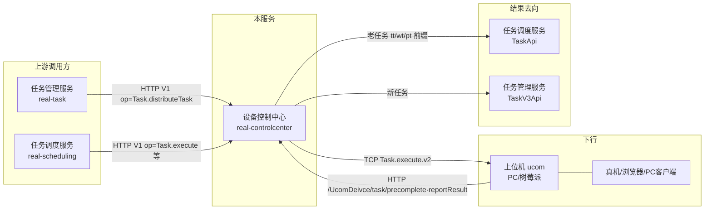

# 产品概述

> **Git 仓库**：`git@git.testin.cn:stock/backend/real.git`（子模块 `real-controlcenter/`）　**分支**：`syy.release.z7.8.1.0`

## 这是什么

设备控制中心（real-controlcenter）是 Testin 云真机平台的**设备/上位机连接中枢**。真机并不直接连平台，而是插在一台台**上位机**（ucom：托管机房里的 PC / 树莓派）上；上位机通过 MINA TCP 长连接（默认 8000 端口，`real-controlcenter/src/main/java/cn/testin/util/Config.java`）接入本服务，由本服务统一管理设备台账、在线状态、任务下发与结果回传。

它解决四类问题：

1. **长连接中枢**：上位机接入后完成认证 → 心跳保活 → 指令下发 → 响应回收 → 断连清理的全生命周期管理（协议细节见 [核心链路-上位机长连接](../04-复杂功能细节/核心链路-上位机长连接.md)）。
2. **设备台账与状态**：App 真机、Web 浏览器（PC 上位机）、PC 客户端（含鸿蒙 PC）三类资源的登记、心跳刷新、状态维护与离线检测（DEVICE_TIMEOUT=120s）。
3. **任务下发与结果闭环**：接收任务管理服务/任务调度服务的下发请求（`Task.distributeTask`），经长连接把 `Task.execute.v2` 指令送到上位机；上位机执行完再通过 `precomplete` / `reportResult` 回报，本服务转发给任务侧服务并清理设备占用标记。
4. **资源互斥**：通过设备锁（`device_lock_pool` 表）保证一台设备同一时刻只被一个任务使用。

## 上下游关系

| 方向 | 服务/端 | 交互 |
|---|---|---|
| 上游 | 任务管理服务 | `DeviceServiceApi.pushTaskDataToDevice` 发 `op=Task.distributeTask, action=control`（real-task 仓 `src/main/java/cn/testin/api/device/DeviceServiceApi.java`） |
| 上游 | 任务调度服务 | `api/controlcenter/control/TaskApi` 发 `Task.execute` / `Task.stop` 等（real-scheduling 仓 `src/main/java/cn/testin/api/controlcenter/control/TaskApi.java`） |
| 下游 | 上位机 | TCP 长连接，认证/心跳/指令/响应，见 [核心链路-上位机长连接](../04-复杂功能细节/核心链路-上位机长连接.md) |
| 结果 | 任务调度服务 | 老任务（taskid 以 tt/wt/pt 开头）的 precomplete/reportResult 经 `TaskApi` 回传 |
| 结果 | 任务管理服务 | 新任务经 `TaskV3Api` 回传（REST v3 remotePost，`realTaskPrefixName="RealTask"`，分叉在 `TaskInfoServiceImpl.precomplete/reportResult`） |
| 依赖 | 平台基础功能服务 | UserApi / UserV3Api / ProjectApi（用户与项目信息） |
| 依赖 | 平台配置 | DeviceSourceApi / ProjectGroupApi / DeviceCfgApi / DbRsaApi |
| 依赖 | 脚本服务 | AppPackageApi（App 包信息） |

## 核心概念

| 概念 | 一句话说明 | 深入阅读 |
|---|---|---|
| **上位机（ucom）** | 托管机房里的宿主机器（PC/树莓派），真机通过 USB/网络挂在它下面；以 `ucomid` 标识，是长连接的连接主体 | [术语表](术语表.md#U) |
| **真机/设备（device）** | 被测终端：App 手机（`deviceid`）、Web 浏览器（按 ucomid 标识的 PC）、PC 客户端（`pcId`）三类资源（`resourceType = app/web/pc`） | [功能总览](功能总览.md) |
| **设备锁（device_lock_pool）** | db_device 中的锁表：任务执行前先按 `taskId + deviceId/ucomId` 插锁行，下发时校验锁归属，防止一台设备被两个任务抢 | [设备锁与心跳实现](../03-实现逻辑/设备锁与心跳实现.md) |
| **心跳（keepalive）** | 上位机周期上报 `HeartBeat.keepalive`，刷新设备状态并顺带领取匹配到的任务；120s 不上报即判离线（`Config.DEVICE_TIMEOUT=120000`，`real-controlcenter/src/main/java/cn/testin/util/Config.java`） | [设备锁与心跳实现](../03-实现逻辑/设备锁与心跳实现.md) |
| **占用（DeviceProcess）** | 设备被"云真机调试/任务"占用的过程记录（device_process / browser_process / client_process），异常时由 `releaseByAbnormal` 回收 | [核心链路-设备异常恢复](../04-复杂功能细节/核心链路-设备异常恢复.md) |
| **协议（PccProtocol）** | 本服务内部"请求-响应"异步化载体：下发指令先落协议表，分发线程送上长连接，响应回来后再回填 | [核心链路-上位机长连接](../04-复杂功能细节/核心链路-上位机长连接.md) |

## 三种资源形态

读代码前必须先建立这个认知——本服务的"设备"不是单一模型（见 `Task.distributeTask` 的三个分支）：

| resourceType | 资源 | 主键 | 内存池 | 主库 |
|---|---|---|---|---|
| `app` | 真机（手机/平板） | deviceid | DevicePoolUtil | db_device.device_info |
| `web` | PC 上位机上的浏览器 | ucomid | PcInfoPoolUtil | db_pc.pc_info |
| `pc` | PC/鸿蒙客户端 | pcId（sessionKey 可能改写为来源上位机） | ClientInfoPoolUtil | db_client.client_info |

## 延伸阅读

- [功能总览](功能总览.md) — 功能清单与数据模型要点
- [任务下发与结果回传实现](../03-实现逻辑/任务下发与结果回传实现.md) — 代码级链路
- [存储总览](../02-技术架构/00-存储总览.md) — 四个库的表索引
- [开放接口模块索引](../07-开放接口文档/00-模块索引.md) — 72 个入口全清单
