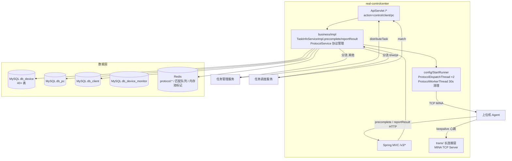

# 总体架构

## 平台定位

设备控制中心（real-controlcenter）是 Testin 平台的**设备与上位机管理中枢**，负责：与上位机维持 TCP 长连接（MINA 框架）、设备心跳与状态管理、任务下发（主动 + 心跳捎带两种模式）、结果回传分流。它是云真机架构中最底层的服务——所有测试最终都要经过它才能到达真机。

与上位机的通信协议是自研的二进制协议，长连接管理（认证/编解码/会话管理/断连恢复）细节见 [核心链路-上位机长连接](../04-复杂功能细节/核心链路-上位机长连接.md)。

## 系统上下文

## 核心架构决策

### 1. 双模下发：主动下发 + 心跳捎带

- **主动下发**：任务管理服务调 `Task.distributeTask` → 指定 ucomid/deviceid 点对点推送 `Task.execute.v2` → 同步等待上位机响应（`sysnProtocolPro` 无超时轮询）
- **心跳捎带**：上位机 `HeartBeat.keepalive` → 空闲设备进 match 队列 → 向任务调度服务 `Task.match` → 任务随心跳响应的 `tasks` 字段带回

两种模式共用同上位机执行与回报通道。

### 2. TCP 长连接 + 协议表轮询

下发指令经 `PccProtocol` 表落库（type=activity），`ProtocolDispatchThread` 按 sessionKey 找到 TCP 会话写出报文。下发方 `sysnProtocolPro` 每秒轮询协议表直到上位机回填 `resContent`——**无超时上限**，是全链路最薄弱点。兜底：`ProtocolWorkerThread` 每 30s 清理过期协议。

### 3. taskid 前缀分流结果回传

上位机 HTTP 回报 `precomplete` / `reportResult` 时，按 taskid 前缀决定流向：
- `tt/wt/pt` 开头 → 任务调度服务（老任务）
- 其他 → 任务管理服务（新任务，V3 接口）

### 4. 内存池管理设备任务标记

`DeviceTaskInfo`（taskid/subtaskid/pendingSstaskMap）写入对应内存池（DevicePoolUtil / PcInfoPoolUtil / ClientInfoPoolUtil），全程在 `DeviceReport` 分布式锁内。服务重启后池内标记全丢，靠 DB 侧（`device_process`、`device_lock_pool`）与心跳重建。

## 代码工程一览

| 工程 | 技术栈 | 产物 | 说明 |
|---|---|---|---|
| `real`（大仓） | Java 1.8 / Spring Boot 2.x / MINA / MyBatis / Redis | jar（按模块分目录） | real-common 共享，4 个子模块之一 |

## 延伸阅读

- [存储总览](00-存储总览.md) — db_device 等 4 库 + Redis 协议缓存
- [任务下发与结果回传实现](../03-实现逻辑/任务下发与结果回传实现.md)
- [核心链路-上位机长连接](../04-复杂功能细节/核心链路-上位机长连接.md) / [核心链路-设备匹配与下发](../04-复杂功能细节/核心链路-设备匹配与下发.md) / [核心链路-设备异常恢复](../04-复杂功能细节/核心链路-设备异常恢复.md)
- [跨模块：超时与异常点分析](../../跨模块链路/横切-超时与异常点分析.md)
