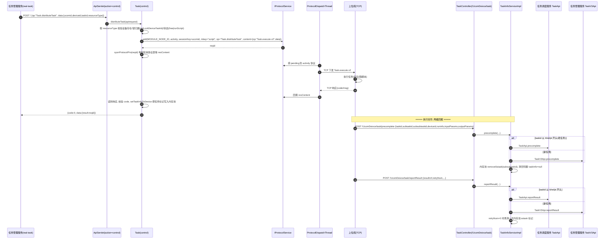

# 任务下发与结果回传实现

## 概述

本文描述设备控制中心最核心的一条代码级链路：**任务下发 → 上位机执行 → 结果回传**。

整条链路可以概括为 6 步：

1. 任务管理服务调 `op=Task.distributeTask, action=control`（ApiServlet V1 协议，HTTP POST `/`）；
2. `Task.distributeTask` 校验设备锁归属与设备在线状态，组装 `Task.execute.v2` 报文落协议表（PccProtocol，type=activity）；
3. `ProtocolDispatchThread(activity)` 把协议经 TCP 长连接发给对应上位机（sessionKey=ucomid），同时下发线程 `sysnProtocolPro` **无超时轮询**等响应；
4. 上位机收到指令执行任务（装包、跑脚本）；
5. 执行完调 HTTP `/UcomDeivce/task/precomplete`（预完成）与 `/reportResult`（结果回报）；
6. 本服务按 taskid 前缀分流到任务调度服务（老任务）或任务管理服务（新任务），并清理内存池中的任务标记。

长连接本身的认证/编解码/会话管理细节见 [核心链路-上位机长连接](../04-复杂功能细节/核心链路-上位机长连接.md)，匹配模式（心跳顺带领任务）见 [核心链路-设备匹配与下发](../04-复杂功能细节/核心链路-设备匹配与下发.md)，断连恢复见 [核心链路-设备异常恢复](../04-复杂功能细节/核心链路-设备异常恢复.md)。

## 两种下发模式

| 模式 | 触发 | 说明 |
|---|---|---|
| **主动下发（本文主线）** | 任务侧服务调 `Task.distributeTask` | 指定 ucomid/deviceid，点对点推送 `Task.execute.v2`，同步等响应 |
| **心跳捎带** | 上位机 `HeartBeat.keepalive` | 空闲设备进 match 队列 → DeviceDispatchThread 向任务调度服务 `Task.match` → 任务随心跳响应 `tasks` 字段带回（`real-controlcenter/src/main/java/cn/testin/trans/controller/req/script/HeartBeat.java`） |

两种模式共用同一个上位机执行与回报通道，区别只在"任务如何到达上位机"。

## 全链路时序图

## 逻辑详解

### 1. 下发入口与校验

`Task.distributeTask`（`real-controlcenter/src/main/java/cn/testin/service/control/Task.java`）做四道闸：

1. **参数校验**：ucomid / resourceType 必填；
2. **按资源类型查设备**：app 查 `IDeviceInfoDAO`、web 查 `IPcInfoDAO`、pc 查 `IClientInfoDAO`；
3. **锁归属校验**：`DeviceService.getLockDeviceTaskId(deviceid/ucomid, 类型)` 返回的 taskId 必须等于本次 taskid，否则报"this device is locking by task!"——**锁先于下发存在**，加锁动作由任务管理服务在下发前调 `/ControlCenter/device/lock_device_by_taskid` 完成（见 [设备锁与心跳实现](设备锁与心跳实现.md)）；
4. **状态校验**：设备必须是 `free` 或 `runScript`。

pc 类型还有两道额外检查：`currentTimeSlotValidForDevice` 校验该客户端当前时段可用；sessionKey 优先取 `fromUcomDevice`（鸿蒙 PC 挂在别的上位机下时，指令要发给来源上位机）。

### 2. 协议落库与同步等待

校验过后，distributeTask 把任务原报文包一层 `{"op":"Task.execute.v2","data":reqjson}`，调 `iprotocolservice.add(...)` 写入协议表：

- `type = activity`（本服务主动发起）、`mkey = "script"`、`sessionKey = ucomid`（决定发给哪台上位机）；
- 返回的 `reqid` 是后续响应对位的唯一锚点；
- 随后 `sysnProtocolPro(result, content)`进入 `GenericBaseService` 的 `while(true)` 轮询：每秒查一次协议表，直到 `resContent` 非空（`real-controlcenter/src/main/java/cn/testin/service/GenericBaseService.java`）。

> **注意：`sysnProtocolPro` / `sysnProtocol`（`GenericBaseService.sysnProtocolPro`）没有任何超时退出条件**——只要上位机一直不响应且协议行不被清理，HTTP 调用方线程会被无限占住。这是全链路最薄弱点，跨模块分析见 [横切-超时与异常点分析](../../跨模块链路/横切-超时与异常点分析.md)。兜底是 `ProtocolWorkerThread` 每 30s 清理过期协议，清理后轮询因 `protocol == null` 抛 GeneralException 退出。

### 3. 协议分发到上位机

`ProtocolDispatchThread`（activity/passivity 两个实例，`real-controlcenter/src/main/java/cn/testin/config/StartRunner.java`）长驻捞取 pending 协议，按 sessionKey 找到 `AbstractSession` 中的 TCP 会话写出报文；上位机响应回来后由会话 handler 回填 `resContent`（详见 [核心链路-上位机长连接](../04-复杂功能细节/核心链路-上位机长连接.md)）。

### 4. 下发成功的善后

上位机返回 code=0 后：

- `setTaskInfoToDevice`把任务信息组装成 `DeviceTaskInfo`（taskid/subtaskid/pendingSstaskMap，状态 STATUS_ON）写入对应内存池（DevicePoolUtil / PcInfoPoolUtil / ClientInfoPoolUtil），全程在 `LockUtil.getLock(DeviceLockKeys.DeviceReport, deviceid)` 的 synchronized 块内；
- 调用方拿到 `{result: reqid}` 作为受理凭证。

### 5. 结果回传（precomplete / reportResult）

上位机执行完走 **HTTP WebMvc**（不是长连接）回报：

| 端点 | 作用 | 入口 |
|---|---|---|
| `POST /UcomDeivce/task/precomplete` | 脚本执行完的即时回报（runinfo/errorCode/输入输出参数） | `TaskController.precomplete`（`real-controlcenter/src/main/java/cn/testin/mvc/controller/UcomDevice/TaskController.java`） |
| `POST /UcomDeivce/task/reportResult` | 结果产物（resultUrl）就绪后的最终回报 | 同 Controller（reportResult 方法） |

两端的业务实现都在 `TaskInfoServiceImpl`：

- **precomplete**（`real-controlcenter/src/main/java/cn/testin/business/impl/TaskInfoServiceImpl.java`）：
  - **分流**：taskid 以 `tt/wt/pt` 开头 → `TaskApi.precomplete` 发任务调度服务；否则组 `TaskPreCompleteRequestDTO` → `TaskV3Api.precomplete` 发任务管理服务；
  - **清理池标记**：在 `DeviceReport` 锁内对 Pc/Device/Client 三个池逐个 `removeSstask(subsubtaskid)`；sstask 清空则 `taskInfo=null`；App 设备顺带累加 Redis 中 `scriptFinish` 计数，全部清完时 `delTaskInfoByDeviceId`；
  - subtaskid 对不上（设备已被别的子任务占用）直接整体清空 taskInfo。
- **reportResult**：
  - 同样的 tt/wt/pt 分流，新任务发 `TaskResultReportRequestDTO`（taskId/subTaskId/subSubTaskId/resultUrl/retryNum）；
  - 仅当 `retryNum == 0` 才清 Device 池的 sstask 标记——重试中的回报不动占用标记。

## 关键代码位置表

| 环节 | 类 / 方法 | 位置（相对 real 仓根） |
|---|---|---|
| 调用方（任务管理服务） | DeviceServiceApi.pushTaskDataToDevice | real-task/src/main/java/cn/testin/api/device/DeviceServiceApi.java |
| 下发入口 | Task.distributeTask | real-controlcenter/src/main/java/cn/testin/service/control/Task.java |
| 锁归属校验 | DeviceService.getLockDeviceTaskId | real-controlcenter/src/main/java/cn/testin/mvc/service/DeviceService.java |
| 报文组装 Task.execute.v2 | Task.distributeTask | real-controlcenter/src/main/java/cn/testin/service/control/Task.java |
| 协议落库 | IProtocolService.add | real-controlcenter/src/main/java/cn/testin/service/control/Task.java |
| 同步等待（无超时） | GenericBaseService.sysnProtocolPro / sysnProtocol | real-controlcenter/src/main/java/cn/testin/service/GenericBaseService.java |
| 协议分发线程 | ProtocolDispatchThread ×2 启动点 | real-controlcenter/src/main/java/cn/testin/config/StartRunner.java |
| 过期协议清理 | ProtocolWorkerThread 启动点 | real-controlcenter/src/main/java/cn/testin/config/StartRunner.java |
| 池内任务标记写入 | Task.setTaskInfoToDevice | real-controlcenter/src/main/java/cn/testin/service/control/Task.java |
| 心跳领任务 | HeartBeat.keepalive（pushqueue match + receive） | real-controlcenter/src/main/java/cn/testin/trans/controller/req/script/HeartBeat.java |
| 回报入口 | TaskController.precomplete | real-controlcenter/src/main/java/cn/testin/mvc/controller/UcomDevice/TaskController.java |
| 预完成实现 | TaskInfoServiceImpl.precomplete | real-controlcenter/src/main/java/cn/testin/business/impl/TaskInfoServiceImpl.java |
| 结果回报实现 | TaskInfoServiceImpl.reportResult | real-controlcenter/src/main/java/cn/testin/business/impl/TaskInfoServiceImpl.java |
| 老任务回报出口 | TaskApi.precomplete / reportResult | real-controlcenter/src/main/java/cn/testin/api/real/scheduling/TaskApi.java |
| 新任务回报出口 | TaskV3Api.precomplete / reportResult | real-controlcenter/src/main/java/cn/testin/api/realtask/TaskV3Api.java |

## 注意事项与坑

1. **下发是"同步等响应"的**：`sysnProtocolPro` 每秒轮询协议表直到有 `resContent`，无超时上限（GenericBaseService.java）。任务管理服务侧的 HTTP 调用会一直挂到上位机响应或协议被 ProtocolWorkerThread 清掉，调用方的超时/线程池配置必须考虑这一点。
2. **taskid 前缀决定结果流向**：`tt/wt/pt` → 任务调度服务（TaskApi，doPress RealScheduling），其他 → 任务管理服务（TaskV3Api，REST v3 remotePost）。改 taskid 生成规则时必须同步评估这两个分叉。
3. **precomplete 成功才清池**：任务侧返回 false 时直接 return，内存池 sstask 标记残留——设备会一直显示"有任务在跑"，只能靠后续心跳/异常恢复链路兜底。
4. **reportResult 重试不清标记**：`retryNum != 0` 的回报不碰池标记，避免重试期间误释放设备。
5. **锁是下发的先决条件而非结果**：distributeTask 只**校验**锁（taskid 必须等于锁里的 taskId），不负责加锁解锁；加解锁由任务管理服务经 v3 接口完成，顺序错了会被  拦下。
6. **setTaskInfoToDevice 只更新内存池**：设备当前任务标记（DeviceTaskInfo）在 CachePool 里，服务重启后池内标记全丢，靠 DB 侧（device_process、device_lock_pool）与心跳重建。

## 延伸阅读

- [设备锁与心跳实现](设备锁与心跳实现.md)
- [核心链路-设备匹配与下发](../04-复杂功能细节/核心链路-设备匹配与下发.md) / [核心链路-上位机长连接](../04-复杂功能细节/核心链路-上位机长连接.md) / [核心链路-设备异常恢复](../04-复杂功能细节/核心链路-设备异常恢复.md)
- [端到端-测试计划执行](../../跨模块链路/端到端-测试计划执行.md)
