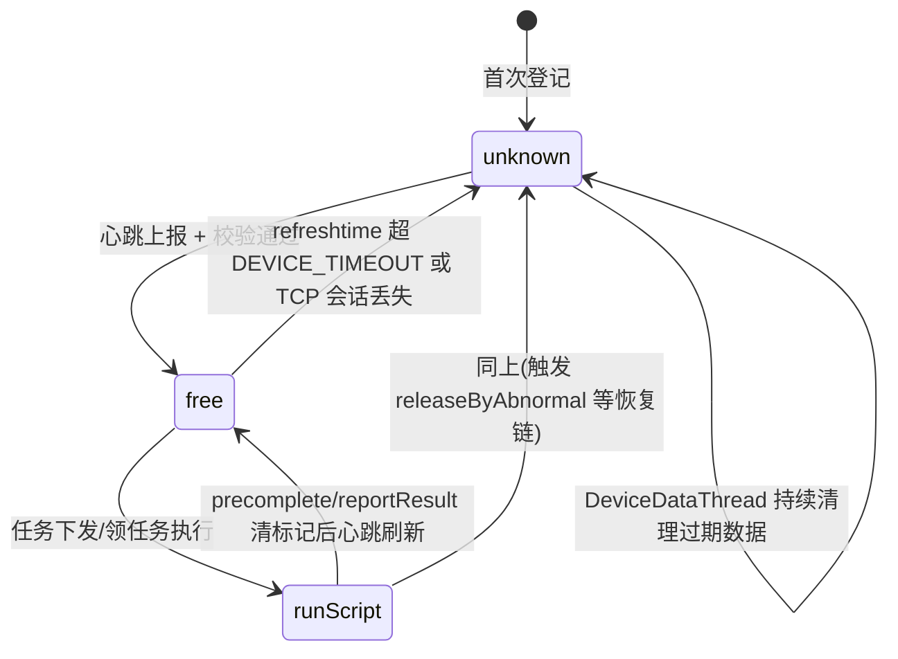

# 设备锁与心跳实现

## 概述

本文讲设备控制中心两个互相关联的底层机制：

- **设备锁（device_lock_pool）**：任务级互斥原语。任务执行前先往 db_device.device_lock_pool 插锁行（taskId + deviceId/ucomId），下发时校验锁归属；任务结束删锁行。**锁行残留是运维高危点**——残留后该设备对所有后续任务报"已被锁定/locking by task"。
- **心跳（keepalive）**：上位机的存在性证明与状态同步通道。每次心跳刷新设备 `refreshtime` 并把空闲设备推进任务匹配队列；120 秒（DEVICE_TIMEOUT）无心跳或 TCP 会话消失即判离线，触发状态置 unknown、占用回收等异常恢复动作。

## 一、设备锁实现

### 加锁：lockDevice

入口：`POST /ControlCenter/device/lock_device_by_taskid`（`real-controlcenter/src/main/java/cn/testin/mvc/controller/DeviceController.java`），由任务管理服务在下发任务前调用（real-task 仓 `src/main/java/cn/testin/api/device/DeviceServiceApi.java` `lockTaskExecuteRecordDevice`）。

实现 `DeviceService.lockDevice`（`real-controlcenter/src/main/java/cn/testin/mvc/service/DeviceService.java`），`@Transactional`，对请求里的每台设备：

1. **前置校验**：设备必须存在且状态为 `free` 或 `runScript`；
2. **查重**：`selectCount` 查 device_lock_pool 中该设备（App 按 deviceId+ucomId；Web/Pc 按 ucomId + deviceType in (3,5)）是否已有锁行，有则抛"已被锁定"；
3. **插锁行**：写入 taskType/taskId/taskDescr/deviceId/ucomId/deviceType/createTime；
4. **部分失败策略**：`lockAllDevice == 0` 时单台失败只记日志继续，否则整批回滚。

### 解锁：unlockDevice

入口：`POST /ControlCenter/device/unlock_device_by_taskid`（`DeviceController.java`）。实现 `DeviceService.unlockDevice`（`DeviceService.java`）：**按 taskId 删锁行**，可选按 deviceIds 收敛范围。没有按设备单独解锁的语义，也没有过期时间字段——**锁的生命周期完全依赖任务侧在任务结束（成功/失败/取消/超时）时调解锁接口**。

### 锁查询：getLockDeviceTaskId

`DeviceService.getLockDeviceTaskId`（`DeviceService.java`）：按 deviceId/ucomId/类型查锁行返回 taskId。消费方：

- `Task.distributeTask` 下发前校验锁归属（`Task.distributeTask`）；
- `HeartBeat.keepalive` 中 web/pc 资源判断"未被锁定"才推进匹配队列（`HeartBeat.keepalive`）；
- `/ControlCenter/device/get_lock_device_taskid` 查询接口（`DeviceController.java`）。

### 锁与设备类型的匹配规则

`getLockDeviceTaskId` 里有个容易踩的细节：App 类型按单值精确匹配 deviceType，**Web/Pc 按 `deviceType in (Pc, Web)` 合并匹配**——即 Web 锁和 Pc 锁在同一台 ucomid 下互斥，对应"web 任务和 pc 任务不能同时在同一台上位机上跑"的约束（HeartBeat.java 的注释）。

### 锁泄漏场景

| 场景 | 后果 | 处置 |
|---|---|---|
| 任务管理服务异常退出，未调 unlock | 锁行残留，设备永久不可下发 | 手工按 taskId/deviceId 删 device_lock_pool 行 |
| unlock 时 deviceIds 传错 | 部分锁行残留 | 同上 |
| 加锁成功但 distributeTask 校验失败/下发失败 | 任务侧若不做补偿解锁，同样残留 | 依赖任务侧的失败补偿链路 |

跨服务的排查与修复脚本见 [横切-服务异常影响与数据修复](../../跨模块链路/横切-服务异常影响与数据修复.md)。

> 代码事实：`lockDevice` 里的互斥是 `synchronized (DEVICE_ID_LOCAL + deviceId)` / `synchronized (UNCOM_ID_DEVICE_LOCAL + ucomId)`——拼接出的新 String 每轮都是不同对象，**这个 synchronized 实际上不提供跨线程互斥**，真正的防重靠 DB 层的 selectCount + insert 与 `@Transactional`。多实例部署下也仅依赖数据库。

## 二、心跳实现

### 心跳处理：HeartBeat.keepalive

长连接命令字 `HeartBeat.keepalive`（`real-controlcenter/src/main/java/cn/testin/trans/controller/req/script/HeartBeat.java`），一次心跳做四件事：

1. **刷新状态**：按报文中的 devices / pc / client / deviceGroup / harmonyPcs 五类节点分别 `refresh`，更新 `refreshtime` 与状态字段；
2. **资源闸门**：心跳先过 APP/WEB/PC_RESOURCE 三个全局资源开关，过期或超配额直接清空对应节点；
3. **空闲资源进匹配队列**：通过 `checkByExecTask`（空闲+已授权+已匹配+未锁定）的资源 push 到 `TaskConfig.QueueType.match`，随后 `itaskinfoservice.receive(...)` 把匹配到的任务装进响应报文 `tasks` 字段带回——**心跳同时是任务领取通道**，见 [核心链路-设备匹配与下发](../04-复杂功能细节/核心链路-设备匹配与下发.md)；
4. **副作用处理**：ROM 升级状态回写 device_upgrade_log、设备温度推监控队列、响应里附带 oemConfig 与设备分组清单。

另有 `refreshStatus`：上位机领任务后上报占用状态，重建 DeviceProcess/BrowserProcess/ClientProcess 占用记录；发现"占用中的进程不是测试任务"时直接 `releaseByAbnormal` 回收。

### 超时检测：DEVICE_TIMEOUT = 120s

判定常量：`Config.DEVICE_TIMEOUT = 120000`（`real-controlcenter/src/main/java/cn/testin/util/Config.java`，可由 `device.timeout` 配置覆盖）。

三层检测网：

| 层 | 位置 | 机制 |
|---|---|---|
| TCP 会话层 | `TCPEndpoint.start`（`real-controlcenter/src/main/java/cn/testin/trans/server/TCPEndpoint.java`） | MINA `setIdleTime(BOTH_IDLE, 60)`：60s 双向往无读写触发 idle 事件；`DisconnectAppThread` 每 5s 跑断连清理（`real-controlcenter/src/main/java/cn/testin/config/StartRunner.java`） |
| 内存池层 | `DeviceWorkerThread`（`real-controlcenter/src/main/java/cn/testin/schedule/device/DeviceWorkerThread.java`） | `refreshtime < now - DEVICE_TIMEOUT` **或** `AbstractSession.getSession(ucomid) == null`（上位机会话没了）→ `cleanPoolDevice` 清池 + 状态置 unknown；PC/客户端侧同构逻辑在 PcWorkerThread.java、ClientWorkerThread.java |
| DB 层 | `DeviceDataThread`（`real-controlcenter/src/main/java/cn/testin/schedule/device/DeviceDataThread.java`） | `listByExpired(DEVICE_TIMEOUT)` 捞出 DB 中过期数据交给 WorkerThread 逐个处理；PcDataThread.java、ClientDataThread.java 同构 |

注意 DeviceWorkerThread 的超时判定是**二选一**：refreshtime 过期或会话丢失任一成立即判离线——上位机进程假死（会话还在但不发心跳）和进程被杀（会话断开）都能兜住。

### 占用与锁的过期回收

WorkerThread 每轮还做两件回收（DeviceWorkerThread.java）：

- **占用回收**：设备有 pending 的 DeviceProcess 但状态不是 runScript，且占用已超 20s → `releaseByAbnormal` 异常释放；
- **内存锁过期**：设备池内 `DeviceLockInfo.expiretime` 过期 → `ideviceservice.unlock`——注意这是**内存态的调试锁**（云真机调试占用），与 DB 的 device_lock_pool 是两套机制，后者没有自动过期。

断连后任务侧的连锁反应（取消任务、释放账号、标记异常）见 [核心链路-设备异常恢复](../04-复杂功能细节/核心链路-设备异常恢复.md)。

## 状态流转小结

## 关键代码位置表

| 环节 | 类 / 方法 | 位置（相对 real 仓根） |
|---|---|---|
| 加锁接口 | DeviceController.lockDevice | real-controlcenter/src/main/java/cn/testin/mvc/controller/DeviceController.java |
| 加锁实现 | DeviceService.lockDevice | real-controlcenter/src/main/java/cn/testin/mvc/service/DeviceService.java |
| 解锁实现 | DeviceService.unlockDevice | real-controlcenter/src/main/java/cn/testin/mvc/service/DeviceService.java |
| 锁查询 | DeviceService.getLockDeviceTaskId | real-controlcenter/src/main/java/cn/testin/mvc/service/DeviceService.java |
| 下发前锁校验 | Task.distributeTask | real-controlcenter/src/main/java/cn/testin/service/control/Task.java |
| 心跳处理 | HeartBeat.keepalive | real-controlcenter/src/main/java/cn/testin/trans/controller/req/script/HeartBeat.java |
| 占用重建/异常回收 | HeartBeat.refreshStatus | real-controlcenter/src/main/java/cn/testin/trans/controller/req/script/HeartBeat.java |
| 超时常量 | Config.DEVICE_TIMEOUT | real-controlcenter/src/main/java/cn/testin/util/Config.java |
| MINA idle 检测 | TCPEndpoint.start | real-controlcenter/src/main/java/cn/testin/trans/server/TCPEndpoint.java |
| 断连清理线程 | DisconnectAppThread 启动点 | real-controlcenter/src/main/java/cn/testin/config/StartRunner.java |
| 池内超时判定 | DeviceWorkerThread | real-controlcenter/src/main/java/cn/testin/schedule/device/DeviceWorkerThread.java |
| DB 过期数据捞取 | DeviceDataThread | real-controlcenter/src/main/java/cn/testin/schedule/device/DeviceDataThread.java |

## 注意事项与坑

1. **device_lock_pool 没有超时与自动清理**：解锁全靠任务侧主动调 `unlock_device_by_taskid`；任何一条漏调的路径都会造成设备"假占用"。排障第一步永远是 `select * from device_lock_pool where device_id=? / ucom_id=?`。
2. **锁表 DO 是 TaskDeviceLockPoolDO**：MyBatis-Plus LambdaQueryWrapper 操作（`ITaskDeviceLockPoolDAO`），锁表在 db_device 库，建表/字段见 [device_lock_pool 表文档](../../数据库管理/db_device/device_lock_pool.md)。
3. **心跳是下发通道也是状态通道**：改 keepalive 报文结构（devices/pc/client/deviceGroup/harmonyPcs 五节点）时，上位机端与本服务必须同版发布。
4. **离线判定有两条路径**（refreshtime 过期 / session 丢失），排查"设备显示离线但心跳还在发"时优先看 `AbstractSession.getSession`——通常是会话被旧连接踢掉或 MINA idle 关闭。
5. **内存调试锁（DeviceLockInfo）与 DB 任务锁（device_lock_pool）是两套**：前者有 expiretime 自动过期（DeviceWorkerThread.java），后者没有。改"锁"相关需求时先确认改的是哪一套。

## 延伸阅读

- [任务下发与结果回传实现](任务下发与结果回传实现.md)
- [核心链路-设备异常恢复](../04-复杂功能细节/核心链路-设备异常恢复.md) / [核心链路-上位机长连接](../04-复杂功能细节/核心链路-上位机长连接.md)
- [横切-超时与异常点分析](../../跨模块链路/横切-超时与异常点分析.md)
