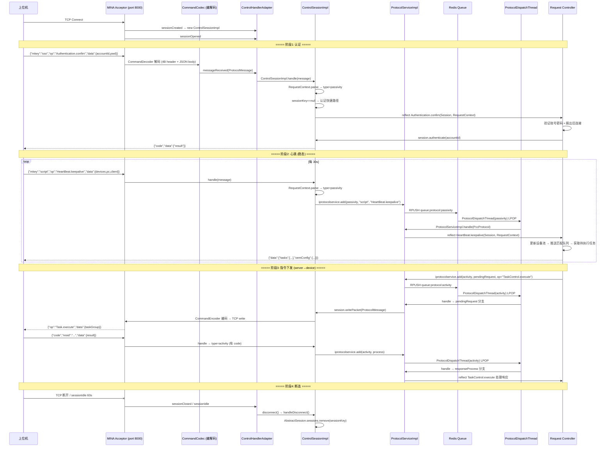

# 核心链路-上位机长连接

> 上位机（ucom/raspberry-pi/PC客户端）通过 TCP 长连接与 设备控制中心 保持通信。基于 Apache MINA NioSocketAcceptor，自定义 4 字节头+JSON 体的二进制协议，覆盖认证→心跳→指令下发→响应→断连的完整生命周期。

## 完整流程图



## 阶段拆解

### 阶段1: TCP 连接建立

```
StartRunner.run()
  → new TCPEndpoint(port=Config.DEVICECENTER_PORT, handler=ControlHandlerAdapter)
  → TCPEndpoint.start()
    → new NioSocketAcceptor()
    → session config: ReadBufferSize=2048, TcpNoDelay=true, IdleTime=60s(BOTH_IDLE)
    → filter chain: ProtocolCodecFilter(CommandCodecFactory) → ExecutorFilter(CachedThreadPool)
    → acceptor.setHandler(controlHandlerAdapter)
    → acceptor.bind(InetSocketAddress(port))
```

| 配置项 | 值 | 说明 |
|--------|-----|------|
| 端口 | 8000 (Config.DEVICECENTER_PORT) | 可配置覆盖 |
| 读缓冲 | 2048 bytes | 单次读取大小 |
| TCP NoDelay | true | 禁用 Nagle 算法，降低延迟 |
| IdleTime | 60s BOTH_IDLE | 60 秒无读写触发 sessionIdle |
| 最大包体 | 15 MB (PROTOCOL_MAX_SIZE) | 超限断开连接 |

### 阶段2: 认证 (Authentication.confim)

```
ControlSessionImpl.handle(ProtocolMessage):
  → RequestContext.parse → 检查 mkey + op
  → 若 sessionKey==null && mkey=="sso" && op=="Authentication.confim":
      → 认证快捷路径 (不经过 Redis 队列)
      → reflect cn.testin.trans.controller.req.sso.Authentication.confim()
        → 读取 data.accountId / data.accountPwd
        → ipcaccountservice.get(accountId) 查账号
        → 验证密码 vs pcAccount.getUcomidPwd()
        → 检查 IPcConfigService 配置
        → 若已有同账号 session:
            → kickoff → poolSession.disconnect() 踢旧连接
            → 新连接返回 "logining" 错误 (账号仍处登录中, 需稍后重试, 非立即接管)
        → ipcaccountservice.signReport() 签到上报
        → session.authenticate(accountId):
            → AbstractSession.sessions.put(accountId, this)
            → sessionKey = accountId, authed = true
      → 返回 {"code","data":{"result"}}
  → 若非认证请求且未认证:
      → iprotocolservice.add(passivity, ...) 走队列
```

### 阶段3: 心跳与任务交付 (HeartBeat.keepalive)

```
非认证请求 → ControlSessionImpl.handle()
  → RequestContext.parse: code==null → type=passivity
  → iprotocolservice.add(vhost, passivity, sessionKey, reqid, mkey, op, content)

ProtocolDispatchThread(passivity) → LPOP Redis queue
  → ProtocolServiceImpl.handle(PccProtocol) → requestProcess 分支:
    → reflect cn.testin.trans.controller.req.script.HeartBeat.keepalive()
      → 解析 data.devices / data.pc / data.client / data.deviceGroup / data.harmonyPcs
      → 资源过期检查 (app.resource / web.resource / pc.resource 超时计时器)
      → 每个设备: 更新 DevicePoolUtil 内存池 + DB device_info
      → 若设备空闲+已授权: pushQueue(match, device) 触发任务匹配
      → receive(device) 获取已匹配待领取的任务
      → 组装响应: data.tasks = [taskJson, ...] + oemConfig
    → 响应写入 ProtocolMessage → session.writePacket → TCP 发送

refreshStatus (设备确认领取任务后):
  → 创建 DeviceProcess / BrowserProcess / ClientProcess 记录
  → 从待领取任务表移除
```

**心跳响应即任务下发通道**：上位机每次心跳，服务器在响应中附带 `data.tasks` 数组，包含已匹配的任务详情（taskId + scriptList + deviceId）。这避免了服务器主动推送的复杂性。

### 阶段4: 指令下发 (server → device)

```
主动指令 (occupy/release/reboot/screencap/execute/stop...):
  → service.control.Device / Task / Pc 等类
    → iprotocolservice.add(vhost, activity, sessionKey,
        reqid, "script", "DeviceControl.occupy",
        content, pendingRequest=true)
  → 写入 Redis queue:protocol:activity

ProtocolDispatchThread(activity) → LPOP
  → ProtocolServiceImpl.handle → pendingRequest 分支:
    → AbstractSession.getSession(sessionKey) 查找连接
    → 若离线 → 返回 ucomOffline + 标记 finish
    → 若在线 → 封装 ProtocolMessage → session.writePacket()
      → synchronized(ioSession) → CommandEncoder → TCP write
    → 更新状态为 pendingResponse (等待设备回复)
```

### 阶段5: 设备响应 (device → server)

```
设备执行完指令 → TCP 回复 {"code","resid":"...","mkey":"script","op":"...","data":{...}}

ControlSessionImpl.handle:
  → RequestContext.parse: code 存在 → type=activity
  → iprotocolservice.add(activity, process, ...) 更新协议记录

ProtocolDispatchThread(activity) → ProtocolServiceImpl.handle → responseProcess 分支:
  → reflect cn.testin.trans.controller.res.script.<Mkey>.<Op>
    e.g. TaskControl.stop, DeviceControl.occupy, DeviceControl.release
  → 标记 PccProtocol.finish
  → 发布异步通知 NoticeUtil.sendNotice(mkey, op, reqid)
```

### 阶段6: 断连

```
触发方式:
  1. MINA sessionIdle (60s BOTH_IDLE) → sessionIdle() → disconnect()
  2. exceptionCaught → disconnect()
  3. 设备主动断开 → sessionClosed()
  4. 服务端踢出 (duplicate login) → Authentication.kickoff → disconnect()

handleDisconnect():
  → 仅当 session.id == AbstractSession.sessions[sessionKey].id 时移除
    (防止踢掉已被新连接替换的旧 session)
  → sessions.remove(sessionKey)
  → authed = false, sessionKey = null

后续影响:
  → 该 ucom 的待下发指令 → ProtocolServiceImpl.handle 检测离线 → ucomOffline
  → DisconnectAppThread 5s 扫描 → push revokeTask 通知
  → AbnormalDeviceWorkerThread 30s 扫描 → 清理设备池
```

## 协议格式

| 字段 | 大小 | 说明 |
|------|------|------|
| header | 4 bytes | Big-endian int，body 的字节长度 |
| body | header 指定 | UTF-8 JSON 字符串，最大 15MB |

### 请求 JSON 结构

```json
{
    "mkey": "script",
    "op": "HeartBeat.keepalive",
    "reqid": "uuid",
    "timestamp": 1234567890,
    "sid": "session_id",
    "data": {
        "devices": [{"deviceid": "xxx", "status": "idle", ...}],
        "pc": [...],
        "client": [...]
    }
}
```

| 字段 | 说明 |
|------|------|
| mkey | 模块标识 (script/sso/device/pc/client) |
| op | 操作 (ClassName.methodName 或 HeartBeat.keepalive) |
| reqid | 请求唯一 ID，用于请求-响应匹配 |
| data | 业务载荷 JSON |

## 关键代码路径

| 步骤 | 文件 | 方法 |
|------|------|------|
| TCP 启动 | `real-controlcenter/.../config/StartRunner.java` | `run()` |
| Acceptor 配置 | `real-controlcenter/.../trans/server/TCPEndpoint.java` | `start()` |
| 编解码器 | `real-controlcenter/.../trans/codec/CommandDecoder.java` / `CommandEncoder.java` | `doDecode()` / `encode()` |
| 消息帧 | `real-controlcenter/.../trans/bean/ProtocolMessage.java` | header(4B int) + body(JSON) |
| IoHandler | `real-controlcenter/.../trans/adapter/ControlHandlerAdapter.java` | `messageReceived()` |
| Session 管理 | `real-controlcenter/.../trans/session/AbstractSession.java` | `authenticate()` / `handleDisconnect()` |
| 消息分发 | `real-controlcenter/.../trans/session/ControlSessionImpl.java` | `handle()` |
| 认证处理 | `real-controlcenter/.../trans/controller/req/sso/Authentication.java` | `confim()` |
| 心跳处理 | `real-controlcenter/.../trans/controller/req/script/HeartBeat.java` | `keepalive()` / `refreshStatus()` |
| 协议队列 | `real-controlcenter/.../schedule/protocol/ProtocolDispatchThread.java` | `run()` |
| 协议处理 | `real-controlcenter/.../business/impl/ProtocolServiceImpl.java` | `add()` / `handle()` |
| 指令下发 | `real-controlcenter/.../service/control/Task.java` / `Device.java` | `execute()` / `occupy()` / `release()` |
| 指令响应 | `real-controlcenter/.../trans/controller/res/script/TaskControl.java` / `DeviceControl.java` | `stop()` / `occupy()` |
| 断连检测 | `real-controlcenter/.../schedule/app/DisconnectAppThread.java` | `run()` |

## 核心发现

- **双队列设计**：ProtocolDispatchThread 分 `activity`(主动指令+响应) 和 `passivity`(设备请求) 两个队列，分离关注点
- **认证快捷路径**：auth 请求不走 Redis 队列，直接在 ControlSessionImpl.handle 中反射调用，减少延迟
- **心跳即下发**：不使用服务端主动推送，上位机心跳时顺便拉取已匹配任务，降低服务端复杂度
- **请求-响应匹配**：`pendingRequest` → `pendingResponse` → `finish` 状态机追踪每条指令的生命周期
- **同步写入**：`session.writePacket()` 使用 `synchronized(ioSession)` 保证单连接串行写入
- **15MB 包体限制**：超限直接断开连接，防止内存溢出
- **反射路由**：请求和响应处理都通过 `cn.testin.trans.controller.req/res.<mkey>.<ClassName>.<method>` 反射调用，与 HTTP ApiServlet 同模式

## 相关文档

- [核心链路-设备匹配与下发](核心链路-设备匹配与下发.md) — 心跳触发的任务匹配流程
- [核心链路-设备异常恢复](核心链路-设备异常恢复.md) — 断连后的异常处理
- [基础设施-双入口路由](../../app处理服务（real-test）/04-复杂功能细节/基础设施-双入口路由.md) — HTTP 双入口与 TCP 入口并存
- [基础设施-后台线程全景](../../app处理服务（real-test）/04-复杂功能细节/基础设施-后台线程全景.md) — ProtocolDispatchThread, DisconnectAppThread
- [基础设施-模块间通信](../../app处理服务（real-test）/04-复杂功能细节/基础设施-模块间通信.md) — TCP MINA 长连接通信方式
