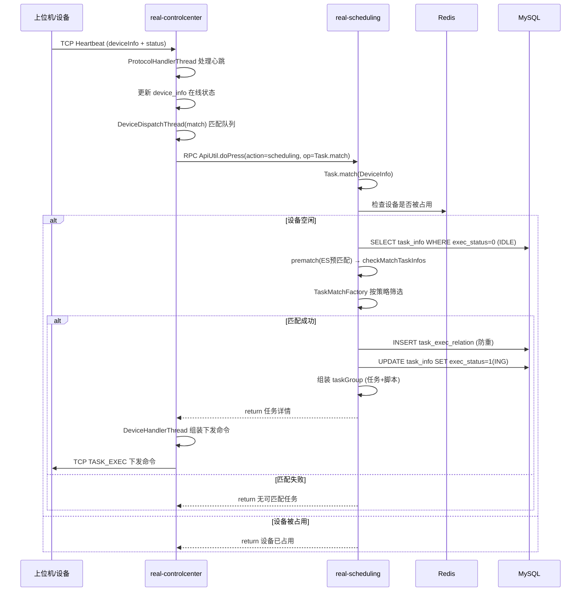

# 核心链路-设备匹配与下发

> 上位机通过 TCP 长连接发送心跳 → 设备控制中心 触发匹配请求 → 任务调度服务 根据设备信息匹配待执行任务 → 匹配成功下发任务命令 → 上位机开始执行脚本。

## 完整流程图



## 匹配策略

源码：`real-scheduling/.../business/util/TaskMatchFactory.java`

| 策略 | 匹配规则 | 适用类型 |
|------|----------|----------|
| 按设备匹配 | task_info.allow_deviceids 包含该 deviceId | APP |
| 按型号匹配 | task_info 中的手机型号要求（model_name） | APP |
| 按 OS 匹配 | task_info 中的 Android/iOS 版本要求 | APP |
| 全匹配 | 综合品牌+型号+OS+分辨率 所有条件 | APP |
| WEB 匹配 | 浏览器类型+版本 匹配 | WEB |
| Client 匹配 | PC 客户端类型 匹配 | PC |

## 阶段拆解

### 阶段1: 心跳触发 (设备控制中心)

```
TCP Heartbeat → ControlHandlerAdapter
  → ProtocolDispatchThread(activity)
    → ProtocolHandlerThread 处理
      → DevicePoolUtil 更新设备池
      → DeviceDispatchThread(match队列) 触发匹配
```

| 数据 | 来源 | 说明 |
|------|------|------|
| deviceInfo | TCP JSON | 设备序列号、型号、OS、状态 |
| heartbeat 间隔 | 配置 | 默认 30s |

### 阶段2: 任务匹配 (任务调度服务)

```
ApiServlet: Task.match(ApiRequest)
  → ITaskService.receive(DeviceInfo)   // APP设备
  → ITaskService.match(DeviceInfo)     // 匹配入口
    → prematch(ES预匹配)               // Elasticsearch 快速筛选候选
    → checkMatchTaskInfos()            // 加锁 + 防重检查
    → TaskMatchFactory.match()         // 策略匹配
    → INSERT task_exec_relation        // 执行关系记录
    → UPDATE task_info SET exec_status=1, deviceid=xxx
    → callCreate()                     // 梆梆加固回调（如有）
```

### 阶段3: 任务下发 (设备控制中心)

```
匹配成功返回 taskGroup
  → DeviceDispatchThread(extract队列)
    → DeviceHandlerThread
      → 组装 TCP 下发命令 (TASK_EXEC)
        → ControlHandlerAdapter 发送
          → 上位机接收并执行
```

| 命令字 | 方向 | 内容 |
|--------|------|------|
| TASK_EXEC | CC → 上位机 | taskGroup（taskId + scriptList + deviceId） |

## 关键代码路径

| 步骤 | 文件 | 方法 |
|------|------|------|
| 心跳处理 | `real-controlcenter/.../schedule/protocol/ProtocolHandlerThread.java` | handler |
| 匹配入口 | `real-scheduling/.../service/scheduling/Task.java` | `match(ApiRequest)` |
| 匹配逻辑 | `real-scheduling/.../business/impl/TaskServiceImpl.java` | `matchDevice()` / `receive()` |
| 策略工厂 | `real-scheduling/.../business/util/TaskMatchFactory.java` | `match()` |
| 任务下发 | `real-controlcenter/.../schedule/task/DeviceHandlerThread.java` | exec task |

## 核心发现

- **双队列设计**：match 队列（设备心跳触发匹配）和 extract 队列（匹配成功后提取任务），分离关注点
- **ES 预匹配**：先用 ES 快速筛选候选任务（按 model/os/status），减少 MySQL 全表扫描
- **分布式锁**：`LOCK.lock(KEY.lock("taskMatch"))` 防止同一任务被多设备同时匹配
- **执行关系防重**：task_exec_relation 表确保 device+task 唯一配对
- **WEB/PC 独立匹配**：`BrowserDispatchThread` 和 `ClientDispatchThread` 分别处理 WEB 和 PC 设备的匹配
- **梆梆回调**：匹配成功后如有加固需求，调用 `callCreate()` 向梆梆服务注册

## 相关文档

- [核心链路-任务初始化](../../app处理服务（real-test）/04-复杂功能细节/核心链路-任务初始化.md) — 上游：任务创建
- [核心链路-结果回收与报告](../../app处理服务（real-test）/04-复杂功能细节/核心链路-结果回收与报告.md) — 下游：执行完成后结果上报
- [核心链路-设备异常恢复](核心链路-设备异常恢复.md) — 异常场景
- [核心链路-任务状态机](../../app处理服务（real-test）/04-复杂功能细节/核心链路-任务状态机.md) — exec_status: IDLE(0) → ING(1)
- [基础设施-后台线程全景](../../app处理服务（real-test）/04-复杂功能细节/基础设施-后台线程全景.md) — DeviceDispatchThread, ProtocolHandlerThread
- [基础设施-模块间通信](../../app处理服务（real-test）/04-复杂功能细节/基础设施-模块间通信.md) — TCP 长连接 + REST RPC
