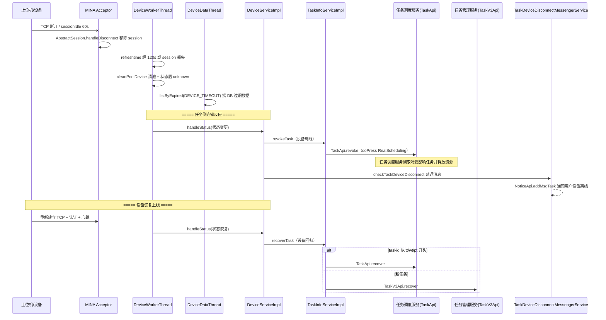

# 核心链路-设备异常恢复

> 设备控制中心 检测到设备离线（MINA 会话断开 / 心跳超时 / 上位机会话丢失）→ 内存池与 DB 双向清理设备状态 → 由 `DeviceServiceImpl.handleStatus` 触发受影响任务的撤销（revoke）/ 设备回归后的恢复（recover）→ 经 TaskApi / TaskV3Api 通知任务侧服务 → 同时向上报用户发送设备离线通知。

## 完整流程图



## 阶段拆解

### 阶段1: 离线检测 (设备控制中心)

三层检测网，全部在 real-controlcenter 内部：

```
1. TCP 会话层: MINA setIdleTime(BOTH_IDLE, 60)
   → 60s 双向无读写触发 sessionIdle
   → AbstractSession.handleDisconnect()
     → 仅当 session.id 与 sessions[sessionKey].id 一致才移除
       (防止误删已被新连接替换的旧 session)

2. 内存池层: DeviceWorkerThread (CachePool worker)
   → refreshtime < now - DEVICE_TIMEOUT(120s) 或
     AbstractSession.getSession(ucomid) == null (会话没了)
   → cleanPoolDevice 清池 + 状态置 unknown
   → 同构: PcWorkerThread / ClientWorkerThread

3. DB 层: DeviceDataThread
   → listByExpired(DEVICE_TIMEOUT) 捞 DB 中过期数据
   → cleanDbDevice 持久化离线
   → 同构: PcDataThread / ClientDataThread
```

| 层 | 类 / 方法 | 机制 |
|----|-----------|------|
| TCP 会话 | `TCPEndpoint.start` + `AbstractSession.handleDisconnect` | 60s BOTH_IDLE 触发 sessionIdle → 移除会话 |
| 内存池 | `DeviceWorkerThread` | refreshtime 超 120s 或 session 丢失 → cleanPoolDevice + unknown |
| DB | `DeviceDataThread` | listByExpired(120s) → cleanDbDevice |

> 注意区分：`DisconnectAppThread`（每 5s）调 `DeviceBound.checkHeartbeat` 检测的是**远程真机调试 App（adb 远程访问）**的心跳（Redis 记录 ip:port → lastHeartbeatTime，超 35s 断开 adb），不是上位机 ucom 的 TCP 会话心跳。上位机断连检测由上面三层网负责。

> `AbnormalDeviceWorkerThread` 是 `AbnormalDevicePoolUtil` 缓存池的过期清理 worker，只遍历 cache/expiryCache 删除过期条目，**不做** DB 扫描、也不标记设备 OFFLINE。

### 阶段2: 任务撤销与用户通知

```
设备被判定离线后，连锁反应的入口是 DeviceServiceImpl.handleStatus
  (DeviceWorkerThread.process 调用; 心跳 refresh 置 handleStatusFlag 触发)

handleStatus 内含两条分支:
  1. revokeTask (设备离线)
     → TaskInfoServiceImpl.revoke
       → TaskApi.revoke (doPress RealScheduling)
       → 任务调度服务侧取消受影响任务 + 释放设备锁/账号占用
  2. recoverTask (设备回归, 见阶段3)

设备离线通知用户 (独立通道):
  TaskDeviceDisconnectMessengerService.checkTaskDeviceDisconnect()
    → TaskDeviceDisconnectMessengerThread (延迟消息调度器)
      → NoticeApi.addMsgTask 向用户发设备离线通知
```

> `TaskDeviceDisconnectMessengerThread` 是延迟消息调度单例（`add(element, timeout, unit, expireCallback)`），用于"设备掉线延迟通知用户"，**不是**往 Redis MQ push revokeTask 的线程。

### 阶段3: 设备恢复 (recoverTask)

```
设备重新上线:
  → TCP 重连 + Authentication.confim 认证 + HeartBeat.keepalive 心跳
  → DeviceServiceImpl.handleStatus 检测状态恢复
    → recoverTask
      → taskid 以 tt/wt/pt 开头 → TaskInfoServiceImpl.recover
          → TaskApi.recover (doPress RealScheduling)
      → 否则 → TaskInfoServiceImpl.realTaskRecover
          → TaskV3Api.recover (REST v3 remotePost → 任务管理服务)
```

## 关键代码路径

| 步骤 | 类 / 方法 |
|------|-----------|
| MINA 断连回调 | `AbstractSession.handleDisconnect` |
| 池内超时判定 | `DeviceWorkerThread`（refreshtime 超时或 session 丢失 → cleanPoolDevice） |
| DB 过期清理 | `DeviceDataThread`（listByExpired → cleanDbDevice） |
| 状态变更入口 | `DeviceServiceImpl.handleStatus` / `refresh` |
| 任务撤销 | `TaskInfoServiceImpl.revoke` → `TaskApi.revoke` |
| 任务恢复 | `TaskInfoServiceImpl.recover` / `realTaskRecover` → `TaskApi.recover` / `TaskV3Api.recover` |
| 设备离线通知 | `TaskDeviceDisconnectMessengerService.checkTaskDeviceDisconnect` + `TaskDeviceDisconnectMessengerThread` |
| 远程调试心跳 | `DeviceBound.checkHeartbeat`（adb 远程访问 35s，非 ucom 会话） |
| 缓存池过期清理 | `AbnormalDeviceWorkerThread`（仅清 cache/expiryCache） |

## 核心发现

- **三层离线检测**：TCP 会话层（MINA 60s idle）→ 内存池层（DeviceWorkerThread 120s）→ DB 层（DeviceDataThread），层层兜底
- **二选一离线判定**：DeviceWorkerThread 的 `refreshtime 过期` 或 `session 丢失` 任一成立即判离线，进程假死与进程被杀都能兜住
- **恢复/撤销入口是 handleStatus**：设备离线→revokeTask、设备回归→recoverTask，均由 `DeviceServiceImpl.handleStatus` 驱动，而非独立扫描线程
- **容易混淆的三个类**：
  - `DisconnectAppThread` / `DeviceBound.checkHeartbeat` = 远程真机调试 adb 心跳（35s），非 ucom 会话
  - `AbnormalDeviceWorkerThread` = 缓存池过期清理，非 DB 扫描
  - `TaskDeviceDisconnectMessengerThread` = 延迟用户通知，非 revokeTask 的 MQ 推送
- **跨服务边界**：task_info 的实际取消/恢复落库在任务调度服务（TaskApi，doPress RealScheduling）与任务管理服务（TaskV3Api，REST v3 remotePost）完成，本服务只负责状态感知与发起调用

## 相关文档

- [核心链路-设备匹配与下发](核心链路-设备匹配与下发.md) — 正常匹配流程的异常分支
- [核心链路-上位机长连接](核心链路-上位机长连接.md) — TCP 连接生命周期
- [核心链路-结果回收与报告](../../app处理服务（real-test）/04-复杂功能细节/核心链路-结果回收与报告.md) — 异常导致结果丢失的处理
- [核心链路-任务状态机](../../app处理服务（real-test）/04-复杂功能细节/核心链路-任务状态机.md) — CANCEL 状态 + resultCode 枚举
- [设备锁与心跳实现](../03-实现逻辑/设备锁与心跳实现.md) — 三层离线检测与 DEVICE_TIMEOUT 常量
- [基础设施-后台线程全景](../../app处理服务（real-test）/04-复杂功能细节/基础设施-后台线程全景.md) — DeviceWorkerThread / DeviceDataThread / AbnormalDeviceWorkerThread
- [基础设施-模块间通信](../../app处理服务（real-test）/04-复杂功能细节/基础设施-模块间通信.md) — TaskApi(doPress) / TaskV3Api(remotePost) 跨服务调用
