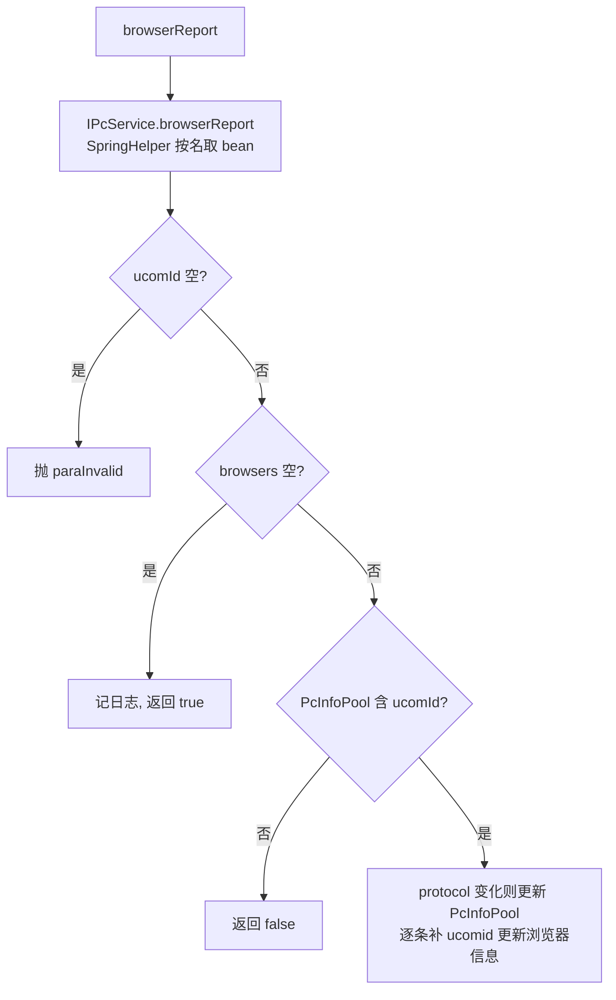

# BrowserController（UcomDevice-浏览器上报）

- 源码：`real-controlcenter/src/main/java/cn/testin/mvc/controller/UcomDevice/BrowserController.java`
- 职责：接收上位机上报的浏览器列表信息（Web 自动化环境）。
- 基础路径 `/v3/UcomDeivce/browser`（注意路径中 Deivce 为历史拼写）

## 接口一览

| # | 方法 | 路径 | 说明 |
|---|------|------|------|
| 1 | POST | /v3/UcomDeivce/browser/report | 浏览器信息上报 |

---

### 浏览器信息上报 (`POST /v3/UcomDeivce/browser/report`)

- **实现意图**：上位机周期性上报本机可用浏览器（类型/版本/协议），刷新 PcInfo 池中的 protocol 并更新浏览器清单。
- **请求参数**（`BrowserReportRequestDTO extends BaseRequestDTO`）：

| 参数名 | 类型 | 必填 | 说明 |
|--------|------|------|------|
| ucomId | String | 是 | 上位机账号 @NotNull |
| devices | List<PcBrowserInfo> | 否 | 浏览器列表（空列表视为成功） |

- **返回参数**

| 字段 | 类型 | 说明 |
| --- | --- | --- |
| code | int | 状态码，0 成功 |
| msg | String | 提示信息 |
| data | Object | 返回数据对象 |
| data.result | Integer | 1 成功 / 0 失败 |
- **处理流程**：



- **调用链**：无外部服务（本模块缓存池 + DB）。
- **涉及表与 SQL**：PcInfoPool（内存缓存池）；浏览器信息落库见 `browser_info` 相关 DAO（IPcService 内部）。
- **异常与校验**：ucomId 空抛 `paraInvalid`。
- **关键代码摘录**：

```java
// mvc/controller/UcomDevice/BrowserController.java
@PostMapping("/report")
public ResponseResult<Map<String, Object>> browserReport(@RequestBody BrowserReportRequestDTO request) throws GeneralException {
    boolean result = this.ipcservice.browserReport(request.getUcomId(), request.getDevices(), null);
    ...
    datamap.put(ApiResponse.RES_RESULT, result ? 1 : 0);
}
```
