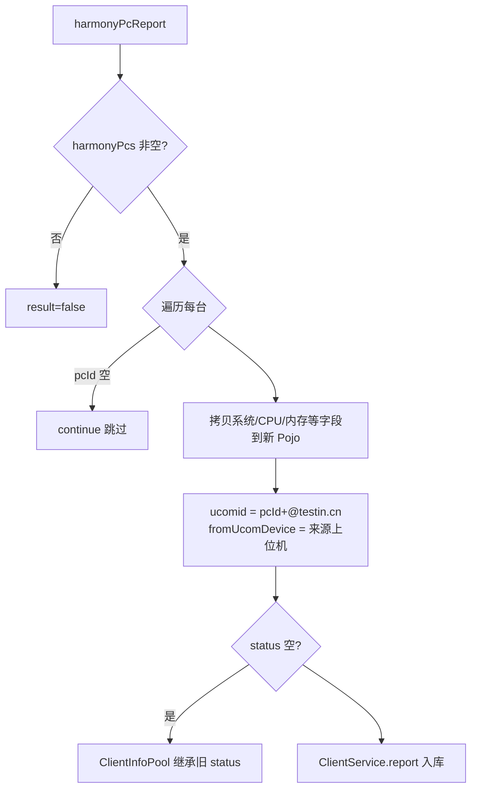

# HarmonyPcController（UcomDevice-鸿蒙 PC 上报）

- 源码：`real-controlcenter/src/main/java/cn/testin/mvc/controller/UcomDevice/HarmonyPcController.java`
- 职责：接收上位机上报的鸿蒙 PC（HarmonyOS 桌面）设备信息。
- 基础路径 `/v3/UcomDeivce/harmonyPc`

## 接口一览

| # | 方法 | 路径 | 说明 |
|---|------|------|------|
| 1 | POST | /v3/UcomDeivce/harmonyPc/report | 鸿蒙 PC 信息上报 |

---

### 鸿蒙 PC 信息上报 (`POST /v3/UcomDeivce/harmonyPc/report`)

- **实现意图**：把鸿蒙 PC 当作"虚拟上位机"登记：ucomid 伪造成 `pcId@testin.cn`，记录来源上位机 fromUcomDevice，走 ClientService.report 统一入库。
- **请求参数**（`HarmonyPcRequestDTO extends BaseRequestDTO`）：

| 参数名 | 类型 | 必填 | 说明 |
|--------|------|------|------|
| ucomId | String | 是 | 来源上位机账号 |
| harmonyPcs | List<ClientInfoPojo> | 是 | 鸿蒙 PC 列表（pcId 必填，否则跳过） |

- **返回参数**

| 字段 | 类型 | 说明 |
| --- | --- | --- |
| code | int | 状态码，0 成功 |
| msg | String | 提示信息 |
| data | Object | 返回数据对象 |
| data.result | Integer | 1 成功 / 0 失败（最后一台上报结果覆盖整体结果） |
- **处理流程**：



- **调用链**：无外部服务。
- **涉及表与 SQL**：`client_info`（INSERT/UPDATE；IClientService.report）、ClientInfoPool（内存池）。
- **异常与校验**：不显式抛异常；pcId 空跳过。
- **关键代码摘录**：

```java
// mvc/controller/UcomDevice/HarmonyPcController.java
clientInfoPojo.setUcomid(harmonyPc.getPcId() + "@testin.cn");
clientInfoPojo.setFromUcomDevice(request.getUcomId());
if (clientInfoPojo.getStatus() == null) {
    ClientInfoPojo poolClientInfoPojo = ClientInfoPoolUtil.getClientPool().get(clientInfoPojo.getUcomid());
    if (poolClientInfoPojo != null) { clientInfoPojo.setStatus(poolClientInfoPojo.getStatus()); }
}
result = clientService.report(clientInfoPojo);
```
