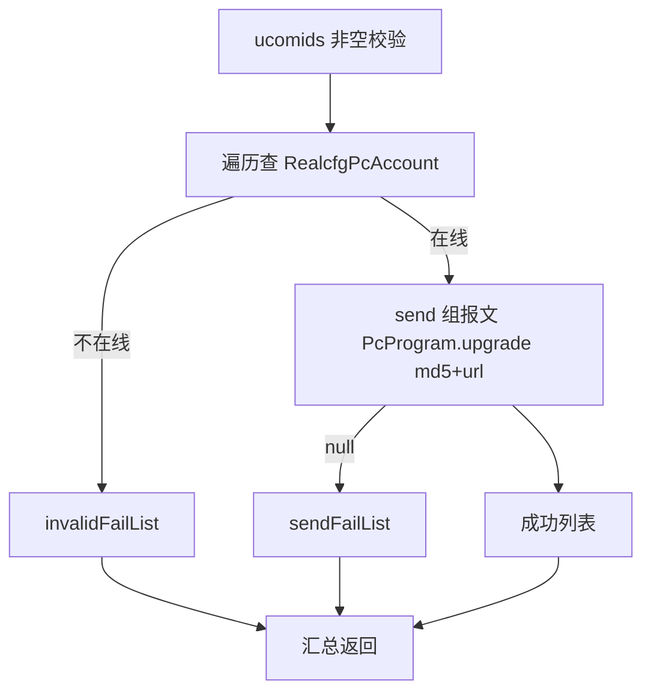

# Pc-control

- **类全名**：`cn.testin.service.control.Pc`
- **源码路径**：`real-controlcenter/src/main/java/cn/testin/service/control/Pc.java`
- **同名说明**：与 `cn.testin.service.pc.Pc` 区分，本文档为 control 包（上位机控制）。
- **职责**：上位机（ucom，PC 宿主）运维控制：配置重载、服务程序升级、服务重启、整机上位机重启。均通过 `IProtocolService.add` 异步下发到上位机在线节点（signvhost）。

## op 一览表

| op | 方法 | 职责 |
| --- | --- | --- |
| reloadCfg | `Pc.reloadCfg` | 通知上位机重新加载配置 |
| upgrade | `Pc.upgrade` | 批量通知上位机服务程序升级 |
| restart | `Pc.restart` | 重启上位机服务程序 |
| reboot | `Pc.reboot` | 重启上位机整机 |

---

### reloadCfg (`Pc.reloadCfg`)

- **入口**：ApiServlet，action=control，op=Pc.reloadCfg
- **实现意图**：通知指定上位机重新加载配置（封装在 `IPcConfigService.reloadCfg` 内组报文下发）。

**请求参数**

| 参数 | 类型 | 必填 | 说明 |
| --- | --- | --- | --- |
| ucomid | String | 是 | 上位机账号 |

**返回参数**

| 字段 | 类型 | 说明 |
| --- | --- | --- |
| code | Integer | 状态码，0 成功 |
| msg | String | 提示信息 |
| data | Object | 返回数据对象 |
| data.result | String | 协议 reqid |
**处理流程**：ucomid 校验 → `ipcconfigservice.reloadCfg(ucomid)` → 返回 reqid。
**调用链**：`IPcConfigService.reloadCfg`（内部组报文 + IProtocolService.add）。
**涉及表与 SQL**：上位机账号表 pc_account（select，校验在线）。
**异常与校验**：ucomid 空 → paraInvalid；下发失败 → execFailed。

---

### upgrade (`Pc.upgrade`)

- **入口**：ApiServlet，action=control，op=Pc.upgrade
- **实现意图**：批量向多台上位机下发服务程序升级指令（op=PcProgram.upgrade，携带升级包 md5/url）。不在线的上位机记入 invalidFailList，下发失败的记入 sendFailList。

**请求参数**

| 参数 | 类型 | 必填 | 说明 |
| --- | --- | --- | --- |
| ucomids | JSONArray | 是 | 上位机账号数组 |
| fileMd5 | String | 否 | 升级包 MD5 |
| fileUrl | String | 否 | 升级包下载地址 |

**返回参数**

| 字段 | 类型 | 说明 |
| --- | --- | --- |
| code | Integer | 状态码，0 成功 |
| msg | String | 提示信息 |
| data | Object | 返回数据对象 |
| data.result | String | 下发成功的 reqid 列表（JSONArray.toString） |
| data.invalidFailList | JSONArray&lt;String&gt; | 上位机不存在/不在线的 ucomid 列表（仅非空时返回） |
| data.sendFailList | JSONArray&lt;String&gt; | 协议下发失败的 ucomid 列表（仅非空时返回） |

**处理流程**



**调用链**：`IPcAccountService.get`（逐个）→ `IProtocolService.add`；升级包经 [file-service](../../../文件管理服务/00-首页.md) 分发。
**涉及表与 SQL**：pc_account（select）。
**异常与校验**：ucomids 空 → paraInvalid；单台失败不中断。

**关键代码摘录**

```java
// real-controlcenter/.../service/control/Pc.java
RealcfgPcAccount pcAccount = ipcaccountservice.get(ucomids.getString(i));
if (pcAccount == null || pcAccount.getSignvhost() == null) { failList.add(ucomids.getString(i)); continue; }
String result = send(realcfgPcAccount.getUcomid(), fileMd5, fileUrl, realcfgPcAccount);
```

---

### restart (`Pc.restart`)

- **入口**：ApiServlet，action=control，op=Pc.restart
- **实现意图**：向指定上位机下发 `PcProgram.restart`，重启上位机服务程序。

**请求参数**

| 参数 | 类型 | 必填 | 说明 |
| --- | --- | --- | --- |
| ucomid | String | 是 | 上位机账号 |

**返回参数**

| 字段 | 类型 | 说明 |
| --- | --- | --- |
| code | Integer | 状态码，0 成功 |
| msg | String | 提示信息 |
| data | Object | 返回数据对象 |
| data.result | String | 协议 reqid |
**处理流程**：ucomid 校验 → `IPcAccountService.get` 校验在线 → 组报文 add → 返回 reqid。
**调用链**：`IPcAccountService.get` → `IProtocolService.add`。
**涉及表与 SQL**：pc_account（select）。
**异常与校验**：ucomid 空/上位机不在线 → paraInvalid；add 失败 → execFailed。

---

### reboot (`Pc.reboot`)

- **入口**：ApiServlet，action=control，op=Pc.reboot
- **实现意图**：向指定上位机下发 `Pc.reboot`，重启上位机整机操作系统。

**请求参数/响应/流程/调用链/异常**：与 restart 完全一致，仅报文 op 为 `Pc.reboot`。
