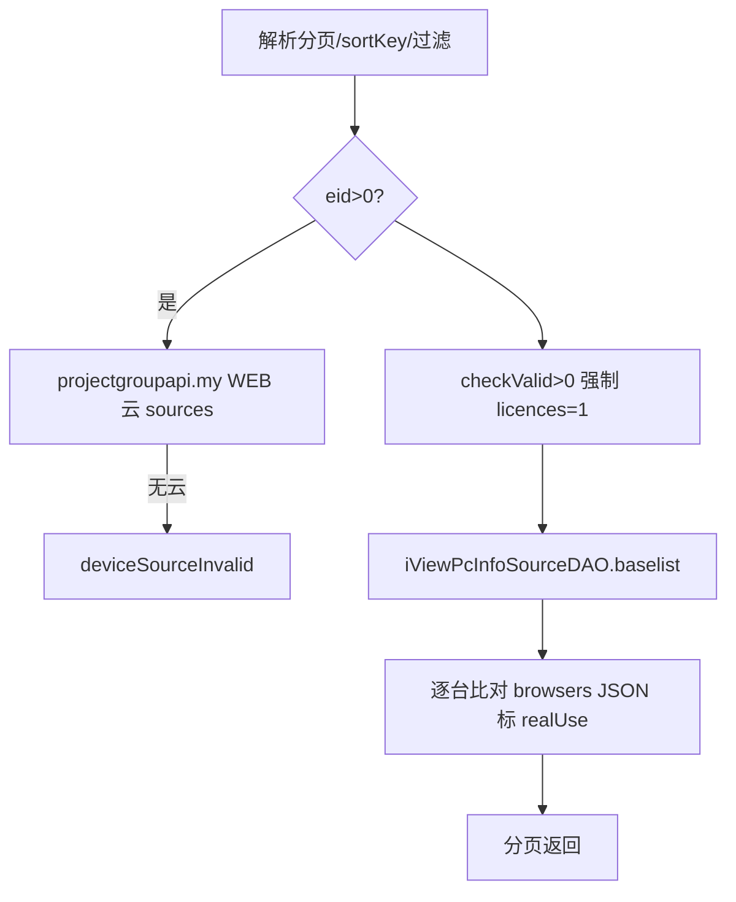
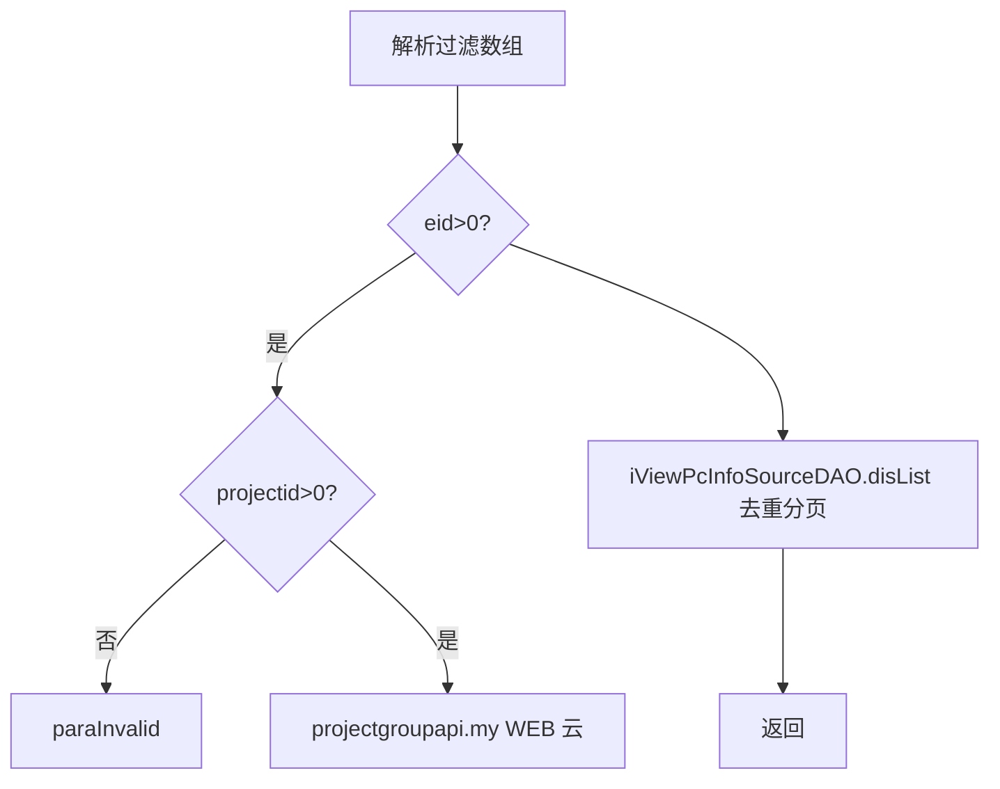
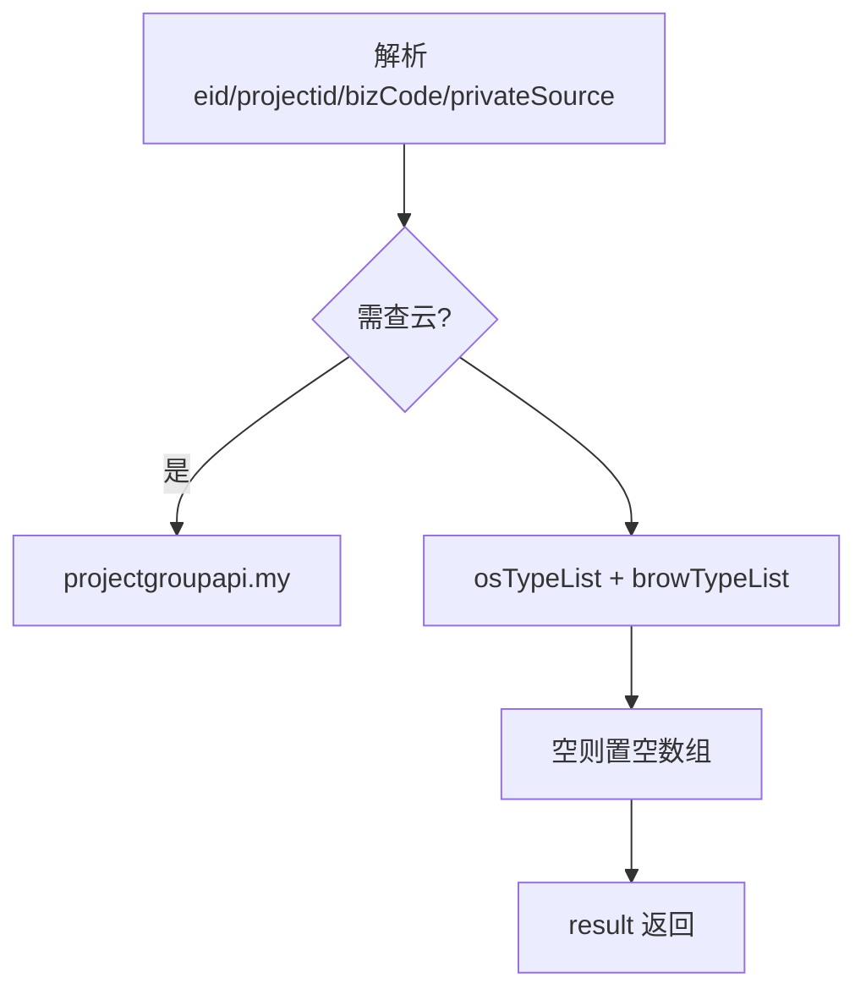
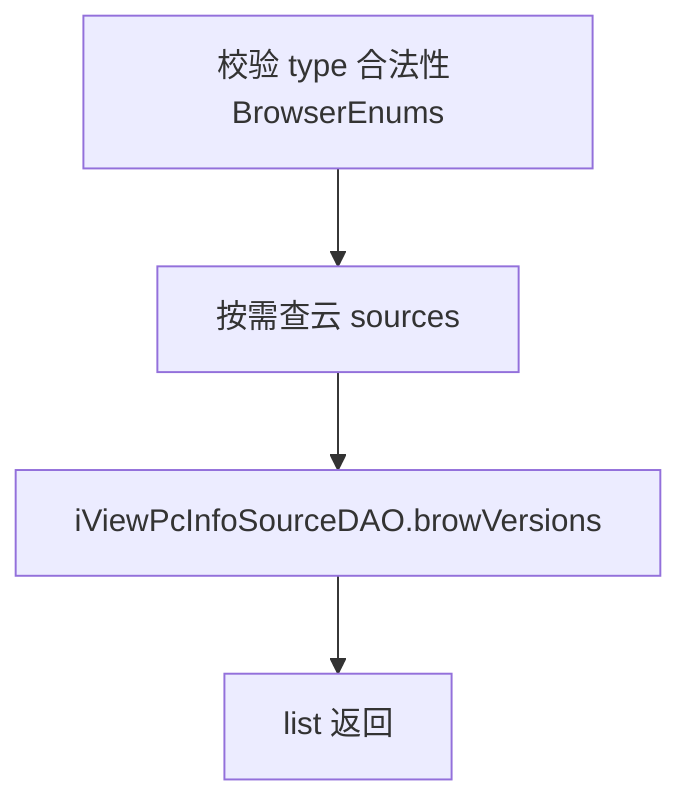
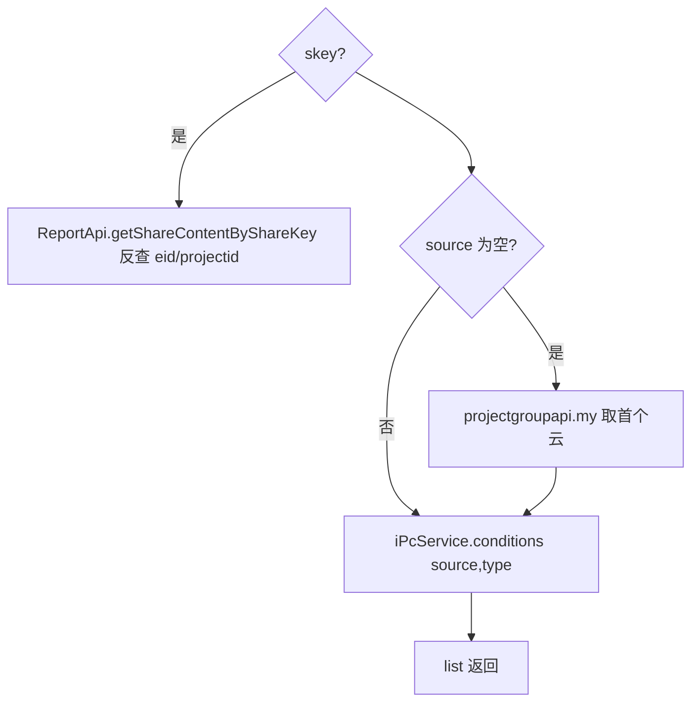

# Pc-pc（pc 包）

## 职责
Web 自动化测试 PC 资源（浏览器执行机）接口：PC 云设备列表、去重机型列表、系统/浏览器种类、浏览器版本、无云列表、查询条件。数据来自 view_pc_info_source / view_pc_info / view_pc_condition 视图。

- 源码：`real-controlcenter/src/main/java/cn/testin/service/pc/Pc.java`
- 基类：`GenericBaseService`（注入 iViewPcInfoSourceDAO、iViewPcInfoDAO、iPcService、projectgroupapi）

## op 一览表

| op | 说明 |
|---|---|
| list | PC 云设备分页列表（含浏览器占用判定） |
| disList | 去重列表（系统类型/浏览器版本/浏览器类型） |
| types | 系统种类及浏览器种类 |
| browserVersion | 指定浏览器的版本列表 |
| noSourceList | 无设备云 PC 分页列表 |
| infolist | 同 noSourceList（别名入口） |
| conditions | PC 浏览器查询条件 |

---

### list (`Pc.list`)
- **入口**：ApiServlet，action/op（action=pc，op=Pc.list）
- **实现意图**：查询 PC 云（WEB 类型）设备分页列表；逐台比对设备 browsers JSON 与当前浏览器进程，标注 realUse（浏览器是否实际占用）。
- **请求参数**：page、pageSize（必填校验）；eid、projectid（可选，查云）、checkValid（默认 1，>0 时强制 licences=1）；sortKey=[{key,sortType}]；其余 PcConditionKeyword 键作过滤（数组值=多值 IN）。
- **返回参数**

| 字段 | 类型 | 说明 |
| --- | --- | --- |
| code | Integer | 状态码，0 成功 |
| msg | String | 提示信息 |
| data | Object | 返回数据对象 |
| data.page | Integer | 当前页 |
| data.pageSize | Integer | 每页条数 |
| data.totalRow | Integer | 总记录数 |
| data.totalPage | Integer | 总页数 |
| data.list | JSONArray&lt;ViewPcInfoSource&gt; | PC 云设备列表（含 realUse 标记） |
- **处理流程**：

- **调用链**：[平台配置](../../../平台配置（real-cfg）/07-开放接口文档/00-模块索引.md)（ProjectGroupApi.my）。
- **涉及表与 SQL**：`view_pc_info_source`（视图分页）。
- **异常与校验**：分页非法 → paraInvalid；无可用云 → deviceSourceInvalid；查询 null → unknown。
- **关键代码摘录**：
```java
// real-controlcenter/src/main/java/cn/testin/service/pc/Pc.java
for (ViewPcInfoSource viewPcInfoSource : list) {
    viewPcInfoSource.setRealUse(ViewPcInfoSource.STATUS_OFF);
    JSONArray array = new JSONArray(viewPcInfoSource.getBrowsers());
    for (int i = 0; i < array.length(); i++) {
        JSONObject object = array.getJSONObject(i);
        if (viewPcInfoSource.getType().equals(object.optString("type"))
                && viewPcInfoSource.getVersion().equals(object.optString("version"))) {
            viewPcInfoSource.setRealUse(ViewPcInfoSource.STATUS_ON);
        }
    }
}
```

### disList (`Pc.disList`)
- **入口**：ApiServlet，action/op（action=pc，op=Pc.disList）
- **实现意图**：PC 设备去重分页列表（按 系统类型|浏览器版本|浏览器类型 维度去重），供机型选择场景。
- **请求参数**：page、pageSize（必填）；eid、projectid（eid>0 时 projectid 必填>0）；osNames/types/versions/ips（JSONArray 可选过滤）；sortKey。
- **返回参数**

| 字段 | 类型 | 说明 |
| --- | --- | --- |
| code | Integer | 状态码，0 成功 |
| msg | String | 提示信息 |
| data | Object | 返回数据对象 |
| data.page | Integer | 当前页 |
| data.pageSize | Integer | 每页条数 |
| data.totalRow | Integer | 总记录数 |
| data.totalPage | Integer | 总页数 |
| data.list | JSONArray&lt;ViewPcInfoSource&gt; | 去重后的 PC 设备列表 |

- **处理流程**：

- **调用链**：[平台配置](../../../平台配置（real-cfg）/07-开放接口文档/00-模块索引.md)。
- **涉及表与 SQL**：`view_pc_info_source`（DISTINCT/GROUP 去重）。

### types (`Pc.types`)
- **入口**：ApiServlet，action/op（action=pc，op=Pc.types）
- **实现意图**：返回可用云内的操作系统种类与浏览器种类，供筛选下拉。
- **请求参数**：eid、projectid（>0 时查云）、bizCode、privateSource（可选）。
- **返回参数**

| 字段 | 类型 | 说明 |
| --- | --- | --- |
| code | Integer | 状态码，0 成功 |
| msg | String | 提示信息 |
| data | Object | 返回数据对象 |
| data.result | Object | 种类结果对象 |
| data.result.osTypes | JSONArray&lt;String&gt; | 操作系统种类数组 |
| data.result.types | JSONArray&lt;String&gt; | 浏览器种类数组 |
- **处理流程**：

- **涉及表与 SQL**：`view_pc_info_source`（DISTINCT 系统/浏览器类型）。
- **异常与校验**：无可用云 → deviceSourceInvalid。

### browserVersion (`Pc.browserVersion`)
- **入口**：ApiServlet，action/op（action=pc，op=Pc.browserVersion）
- **实现意图**：查询指定浏览器种类在可用云内的版本列表。
- **请求参数**：type（String，必填，须为 BrowserEnums 支持的浏览器）；eid、projectid、bizCode、privateSource（可选）。
- **返回参数**

| 字段 | 类型 | 说明 |
| --- | --- | --- |
| code | Integer | 状态码，0 成功 |
| msg | String | 提示信息 |
| data | Object | 返回数据对象 |
| data.list | JSONArray&lt;String&gt; | 浏览器版本号数组 |
- **处理流程**：

- **涉及表与 SQL**：`view_pc_info_source`（DISTINCT 版本）。
- **异常与校验**：type 空或不支持 → paraInvalid；无可用云 → deviceSourceInvalid。

### noSourceList (`Pc.noSourceList`)
- **入口**：ApiServlet，action/op（action=pc，op=Pc.noSourceList）
- **实现意图**：无设备云维度的 PC 信息分页列表（运维管理视角）。
- **请求参数**：page、pageSize（必填）；其余 PcConditionKeyword 键作过滤（数组值=多值 IN）。
- **返回参数**

| 字段 | 类型 | 说明 |
| --- | --- | --- |
| code | Integer | 状态码，0 成功 |
| msg | String | 提示信息 |
| data | Object | 返回数据对象 |
| data.page | Integer | 当前页 |
| data.pageSize | Integer | 每页条数 |
| data.totalRow | Integer | 总记录数 |
| data.totalPage | Integer | 总页数 |
| data.list | JSONArray&lt;ViewPcInfo&gt; | 无设备云 PC 信息列表 |
- **涉及表与 SQL**：`view_pc_info`（视图分页）。
- **异常与校验**：分页非法 → paraInvalid；结果 null → unknown。

### infolist (`Pc.infolist`)
- **入口**：ApiServlet，action/op（action=pc，op=Pc.infolist）
- **实现意图**：noSourceList 的别名入口，逻辑完全一致（直接委托调用）。
- **请求参数/响应结构**：同 noSourceList。
- **关键代码摘录**：
```java
// Pc.java
public String infolist(ApiRequest apirequest) throws Exception {
    return noSourceList(apirequest);
}
```

### conditions (`Pc.conditions`)
- **入口**：ApiServlet，action/op（action=pc，op=Pc.conditions）
- **实现意图**：查询某 PC 云下的浏览器筛选条件集合；支持通过分享 key（skey）反查企业/项目组。
- **请求参数**：

| 参数 | 类型 | 必填 | 说明 |
|---|---|---|---|
| source | String | 否 | 云 ID；缺省时需 eid+projectid 或 skey |
| type | String | 否 | 条件分类 |
| skey | String | 否 | 报告分享 key（反查 eid/projectid） |
| eid / projectid | int | source 缺省时必填 | 企业/项目组 |

- **返回参数**

| 字段 | 类型 | 说明 |
| --- | --- | --- |
| code | Integer | 状态码，0 成功 |
| msg | String | 提示信息 |
| data | Object | 返回数据对象 |
| data.list | JSONArray&lt;ViewPcCondition&gt; | PC 浏览器查询条件列表 |
- **处理流程**：

- **调用链**：[app处理服务](../../../app处理服务（real-test）/07-开放接口文档/00-模块索引.md)（ReportApi.getShareContentByShareKey）、[平台配置](../../../平台配置（real-cfg）/07-开放接口文档/00-模块索引.md)（ProjectGroupApi.my）。
- **涉及表与 SQL**：`view_pc_condition`（视图）。
- **异常与校验**：eid/projectid 非法 → paraInvalid；查询 null → unknown。

---

## 依赖汇总
- 外部服务：[平台配置](../../../平台配置（real-cfg）/07-开放接口文档/00-模块索引.md)（设备云）、[app处理服务](../../../app处理服务（real-test）/07-开放接口文档/00-模块索引.md)（分享内容反查）
- 主要表/视图：view_pc_info_source、view_pc_info、view_pc_condition
