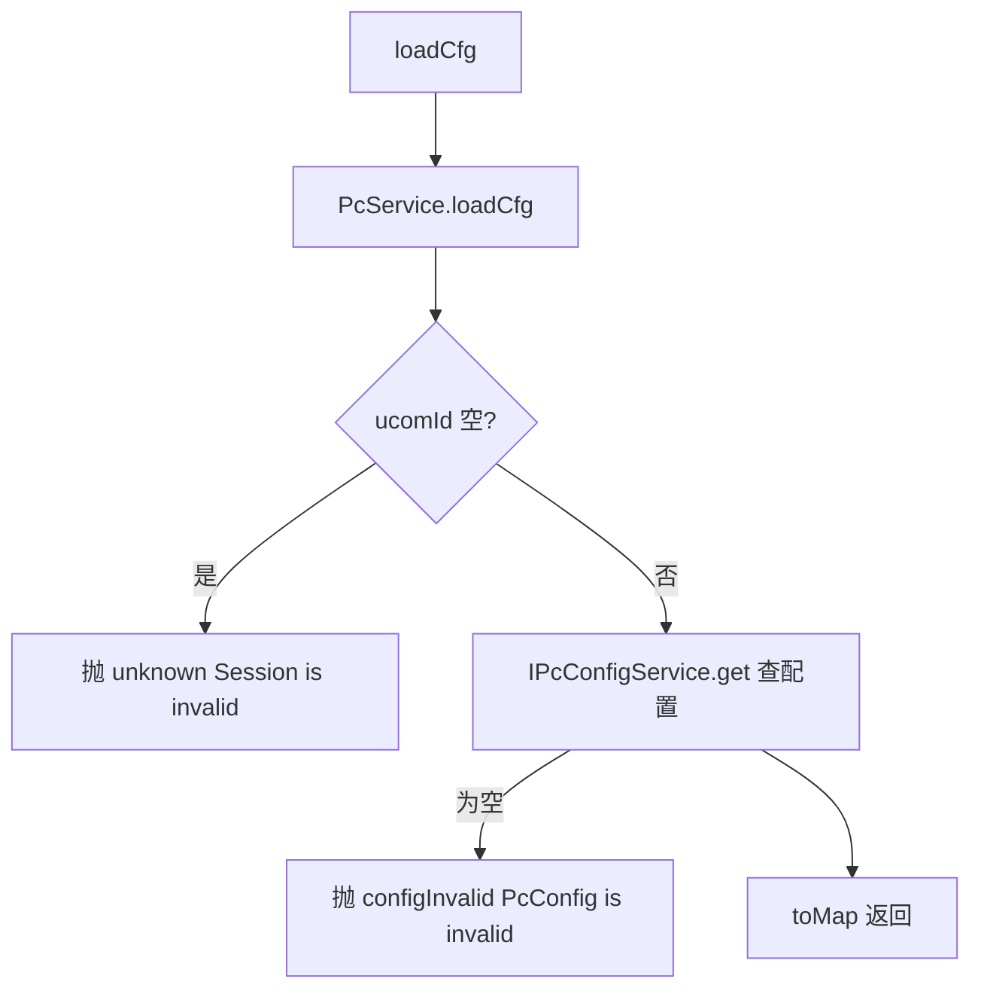

# PcController（UcomDevice-上位机 Web 节点配置）

- 源码：`real-controlcenter/src/main/java/cn/testin/mvc/controller/UcomDevice/PcController.java`
- 职责：上位机 Web（浏览器自动化）节点的配置加载与远程地址上报。
- 基础路径 `/v3/UcomDeivce/pc`

## 接口一览

| # | 方法 | 路径 | 说明 |
|---|------|------|------|
| 1 | GET | /v3/UcomDeivce/pc/loadCfg | 加载上位机 Pc 配置 |
| 2 | POST | /v3/UcomDeivce/pc/report | 上报远程访问地址 |

---

### 加载上位机 Pc 配置 (`GET /v3/UcomDeivce/pc/loadCfg`)

- **实现意图**：上位机启动时拉取自己的 Pc 配置（浏览器/分辨率等 realcfg 配置）。
- **请求参数**：

| 参数名 | 类型 | 必填 | 说明 |
|--------|------|------|------|
| ucomId | String | 否 | 上位机账号（service 内空值抛错） |

- **返回参数**

| 字段 | 类型 | 说明 |
| --- | --- | --- |
| code | int | 状态码，0 成功 |
| msg | String | 提示信息 |
| data | Object | RealcfgPcCfg.toMap() 配置对象 |
| data.config | Object | 优先级配置（pcConfig 解析出的 JSON 对象） |
| data.rasPiList | JSONArray | 树莓派列表（RealcfgRaspiCfg.toMap） |
| data.extDeviceList | JSONArray | 扩展设备列表（DeviceInfoExtend.toMap） |
| data.pcIp | String | 上位机 ip（非空时返回） |
| data.netManage | Integer | 网络管理 0=自动 / 1=手动 |
| data.location | String | 机房信息（非空时返回） |
| data.caseNum | String | 机柜信息（非空时返回） |
| data.descr | String | 描述（非空时返回） |
| data.remoteUrl | String | 真机远程地址（非空时返回） |
| data.status | Integer | 状态（非空时返回） |
| data.createtime | Long | 创建时间（非空时返回） |
| data.updatetime | Long | 更新时间（非空时返回） |

- **处理流程**：



- **调用链**：[平台配置](../../../平台配置（real-cfg）/07-开放接口文档/00-模块索引.md)（IPcConfigService 配置数据源自 realcfg 体系）。
- **涉及表与 SQL**：Pc 配置表（IPcConfigService.get）。
- **异常与校验**：ucomId 空抛 `unknown`；配置不存在抛 `configInvalid`。
- **关键代码摘录**：

```java
// mvc/service/PcService.java
RealcfgPcCfg pccfg = this.ipcconfigservice.get(ucomid);
if (pccfg == null) {
    throw new GeneralException(CommonCode.configInvalid.getValue(), "...(PcConfig is invalid!)");
}
```

---

### 上报远程访问地址 (`POST /v3/UcomDeivce/pc/report`)

- **实现意图**：上位机上报自己的远程访问 URL 与 IP（供 Web 远程调试入口跳转）。
- **请求参数**（`PcReportRequestDTO extends BaseRequestDTO`）：

| 参数名 | 类型 | 必填 | 说明 |
|--------|------|------|------|
| ucomId | String | 是 | 上位机账号 |
| remoteUrl | String | 是 | 远程访问地址 |
| ip | String | 否 | 上位机 ip |

- **返回参数**

| 字段 | 类型 | 说明 |
| --- | --- | --- |
| code | int | 状态码，0 成功 |
| msg | String | 提示信息 |
| data | Object | 返回数据对象 |
| data.result | Integer | 1 成功 / 0 失败 |

- **处理流程**：校验 ucomId/remoteUrl → `IPcConfigService.report(ucomid, ip, remoteUrl)` → result 1/0。
- **调用链**：无。
- **涉及表与 SQL**：Pc 配置表（UPDATE remoteUrl/ip；IPcConfigService.report）。
- **异常与校验**：ucomId 空抛 `unknown`；remoteUrl 空抛 `paraInvalid`。
- **关键代码摘录**：

```java
// mvc/service/PcService.java
boolean result = ipcconfigservice.report(ucomid, ip, remoteUrl);
datamap.put("result", result ? 1 : 0);
```
