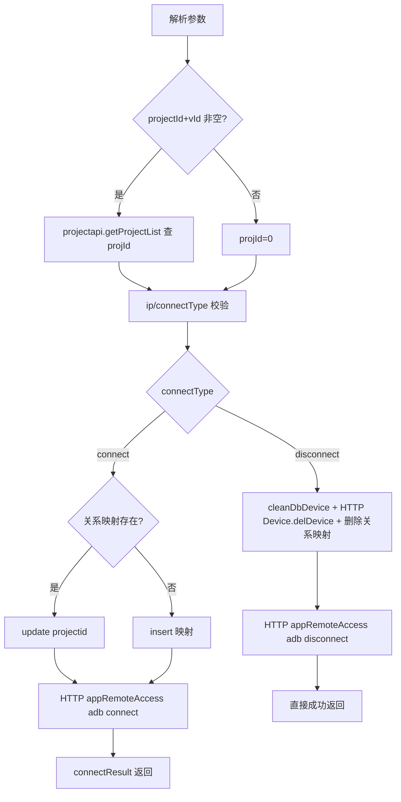

# RemoteAccess

- **类全名**：`cn.testin.service.app.RemoteAccess`
- **源码路径**：`real-controlcenter/src/main/java/cn/testin/service/app/RemoteAccess.java`
- **职责**：安卓终端远程接入：App 请求将设备通过 ADB（ip:5555）连接/断开上位机，并维护设备-项目关系映射（device_project_relation）。

## op 一览表

| op | 方法 | 职责 |
| --- | --- | --- |
| connectDevice | `RemoteAccess.connectDevice` | 连接/断开上位机（ADB 远程接入） |

---

### connectDevice (`RemoteAccess.connectDevice`)

- **入口**：ApiServlet，action=app，op=RemoteAccess.connectDevice
- **实现意图**：App 端发起设备远程接入。projectId+vId 非空时按 productNo 查项目得到 projId（否则 projId=0 共享）；connectType=connect 时新增/更新设备-项目关系映射，connectType=disconnect 时清理数据库设备、调用设备管理服务删除设备、删除关系映射；最后通过外部 HTTP 服务执行 adb connect/disconnect。

**请求参数**

| 参数 | 类型 | 必填 | 说明 |
| --- | --- | --- | --- |
| ip | String | 是 | 设备 IP（拼  为 serialNumber） |
| connectType | String | 是 | connect / disconnect |
| brandName | String | 否 | 品牌名 |
| name | String | 否 | 机型名（组装 RealcfgAppModel） |
| projectId | String | 否 | 恒生项目 ID |
| vId | String | 否 | 版本 ID |

**返回参数**

| 字段 | 类型 | 说明 |
| --- | --- | --- |
| code | Integer | 状态码，0 成功 |
| msg | String | 提示信息 |
| data | Object | 返回数据对象（disconnect 时无 data 节点） |
| data.connectResult | Object | adb 连接服务返回结果 Map&lt;String,String&gt;（connect 时返回） |

**处理流程**



**调用链**：
- `ProjectApi.getProjectList`（[user-manager](../../../平台基础功能服务/00-首页.md)，eid=1 按 productNo 查项目）
- `IDeviceService.getBySerialNumber/cleanDbDevice`、`IDeviceProjectRelationDAO.list/insert/update/delete`
- HTTP `Config.DEVICE_DEL_DEVICE_URL/device.action`（op=Device.delDevice，[设备控制中心](../00-模块索引.md) 设备管理服务）
- HTTP `Config.DEVICE_CONNECT_URL/method/appRemoteAccess`（ADB 连接服务，外部 HTTP，代码不在本仓库）
- disconnect 成功后 `IDeviceBoundService.delStatusByDeviceId`（清 Redis 心跳）

**涉及表与 SQL**：`device_project_relation`（select by serial_number / insert / update / delete）；视图 `view_device_info`（select by serial_number）；`device_info`（cleanDbDevice 清理）。
**异常与校验**：ip/connectType 空 → paraInvalid；项目不存在 → execFailed；deviceConnectUrl 未配置 → paraInvalid；adb 连接失败或返回 code=500 → execFailed（提示检查网络与 adb tcpip 5555）。

**关键代码摘录**

```java
// real-controlcenter/.../service/app/RemoteAccess.java
serialNumber = ip + ":" + port;
...
String connectResult = HttpPostRequestUtil.request(deviceConnectUrl + "/method/appRemoteAccess", data);
convert = convert(connectResult);
if (convert == null || connectResult.isEmpty() || Objects.equals(convert.get("code"), "500")) {
    throw new GeneralException(CommonCode.execFailed.getValue(),
        "adb连接失败，请做如下操作\n1. 请检查网络是否正常\n2. 连接上PC, 执行adb tcpip 5555开启无线调试;");
}
```
