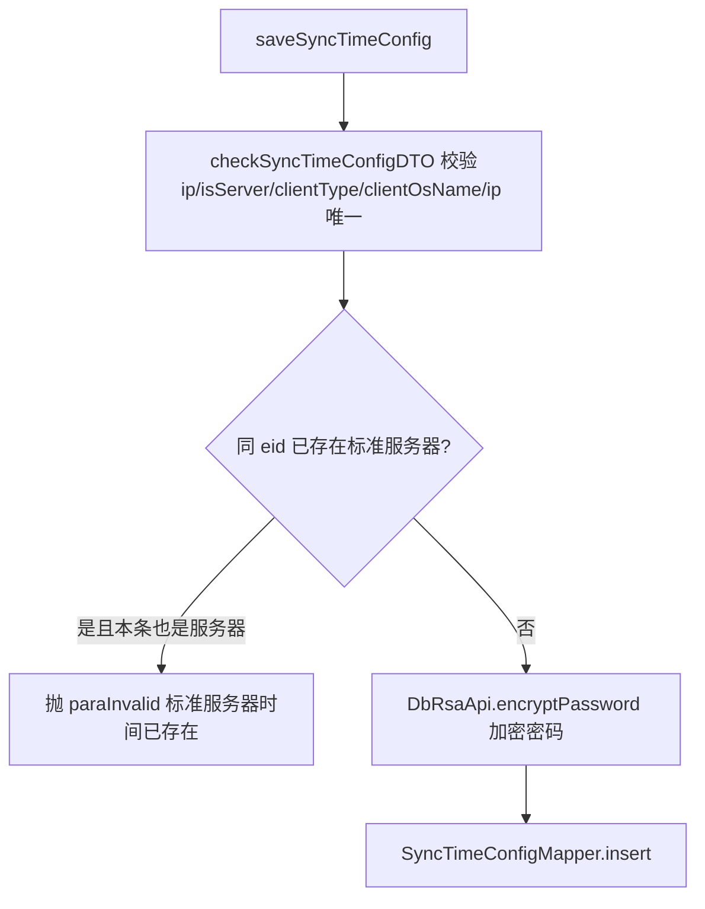
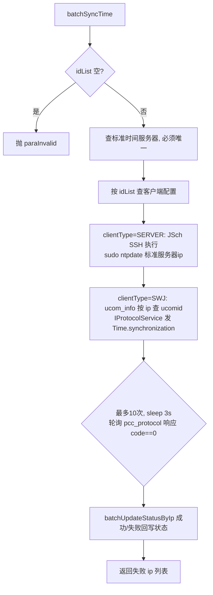

# SyncTimeConfigController（时间同步配置）

- 源码：`real-controlcenter/src/main/java/cn/testin/mvc/controller/SyncTimeConfigController.java`
- 职责：管理标准时间服务器与待校准设备（服务器/上位机）的时间同步配置，并支持批量触发时间同步。
- 基础路径 `/v3/ControlCenter/sync_time`

## 接口一览

| # | 方法 | 路径 | 说明 |
|---|------|------|------|
| 1 | POST | /v3/ControlCenter/sync_time | 新增配置 |
| 2 | PUT | /v3/ControlCenter/sync_time | 修改配置 |
| 3 | GET | /v3/ControlCenter/sync_time | 配置列表 |
| 4 | DELETE | /v3/ControlCenter/sync_time/{id} | 逻辑删除 |
| 5 | PUT | /v3/ControlCenter/sync_time/batch_sync | 批量同步时间 |

---

### 新增时间同步配置 (`POST /v3/ControlCenter/sync_time`)

- **实现意图**：新增一条时间同步配置（标准时间服务器或待校准客户端），客户端密码经 RSA 加密落库。
- **请求参数**（`SyncTimeConfigDTO extends BaseRequestDTO`）：

| 参数名 | 类型 | 必填 | 说明 |
|--------|------|------|------|
| ip | String | 是 | 设备 ip（同 eid 下唯一） |
| isServer | Integer | 是 | 1=标准时间服务器，0=客户端 |
| clientType | Integer | 条件 | isServer=0 时必填：SERVER=服务器 / SWJ=上位机 |
| clientOsName | Integer | 条件 | isServer=0 时必填：Windows/Mac/Linux |
| clientUser / clientPassword | String | 否 | SSH 账号/密码（服务器校准用） |
| eid / projectId / userId | Integer | 是 | BaseRequestDTO |

- **返回参数**

| 字段 | 类型 | 说明 |
| --- | --- | --- |
| code | int | 状态码，0 成功 |
| msg | String | 提示信息 |
| data | Object | 返回数据对象 |
| data.result | Integer | 插入行数 |
- **处理流程**：



- **调用链**：[平台配置](../../../平台配置（real-cfg）/07-开放接口文档/00-模块索引.md)（DbRsaApi.encryptPassword）。
- **涉及表与 SQL**：`sync_time_config`（SELECT COUNT / INSERT；SyncTimeConfigMapper）。
- **异常与校验**：ip 空、isServer/clientType/clientOsName 非法、ip 重复均抛 `paraInvalid`。
- **关键代码摘录**：

```java
// mvc/service/SyncTimeConfigService.java
.clientPassword(encryptPassword(syncTimeConfigDTO.getClientPassword()))
.isDelete(SyncTimeConfig.IS_DELETE_NOT_DELETED)
return syncTimeConfigMapper.insert(syncTimeConfig);
```

---

### 修改时间同步配置 (`PUT /v3/ControlCenter/sync_time`)

- **实现意图**：按 id 修改配置；新密码（clientNewPassword）加密后覆盖。
- **请求参数**：`SyncTimeConfigDTO`，id 必填（>0），其余同上；clientNewPassword 为修改后的新密码。
- **返回参数**

| 字段 | 类型 | 说明 |
| --- | --- | --- |
| code | int | 状态码，0 成功 |
| msg | String | 提示信息 |
| data | Object | 返回数据对象 |
| data.result | Integer | 影响行数 |
- **处理流程**：Controller 校验 id → `checkSyncTimeConfigDTO`（排除自身 id 的 ip 唯一校验）→ `SyncTimeConfigMapper.update`。
- **调用链**：[平台配置](../../../平台配置（real-cfg）/07-开放接口文档/00-模块索引.md)（DbRsaApi.encryptPassword）。
- **涉及表与 SQL**：`sync_time_config`（UPDATE）。
- **异常与校验**：id 空或非正抛 `paraInvalid("无效的id")`。
- **关键代码摘录**：

```java
// mvc/controller/SyncTimeConfigController.java
if (syncTimeConfigDTO.getId() == null || syncTimeConfigDTO.getId() <= 0) {
    throw new GeneralException(CommonCode.paraInvalid.getValue(), "无效的id");
}
```

---

### 时间同步配置列表 (`GET /v3/ControlCenter/sync_time`)

- **实现意图**：按企业 + 是否标准服务器查询未删除的配置列表。
- **请求参数**：

| 参数名 | 类型 | 必填 | 说明 |
|--------|------|------|------|
| eid | Integer | 是 | 企业 id |
| is_server | Integer | 是 | 1=标准服务器 0=客户端 |

- **返回参数**

| 字段 | 类型 | 说明 |
| --- | --- | --- |
| code | int | 状态码，0 成功 |
| msg | String | 提示信息 |
| data | JSONArray&lt;SyncTimeConfig&gt; | 未删除的时间同步配置列表 |
- **处理流程**：Controller → `SyncTimeConfigService.getSyncTimeConfigList` → `SyncTimeConfigMapper.selectList(eid, isServer, 未删除)`。
- **调用链**：无。
- **涉及表与 SQL**：`sync_time_config`（SELECT）。
- **异常与校验**：无显式校验。
- **关键代码摘录**：

```java
// mvc/service/SyncTimeConfigService.java
return syncTimeConfigMapper.selectList(eid, isServer, SyncTimeConfig.IS_DELETE_NOT_DELETED);
```

---

### 删除时间同步配置 (`DELETE /v3/ControlCenter/sync_time/{id}`)

- **实现意图**：逻辑删除（is_delete 置位）一条配置。
- **请求参数**：路径变量 id（Integer，必填，>0）。
- **返回参数**

| 字段 | 类型 | 说明 |
| --- | --- | --- |
| code | int | 状态码，0 成功 |
| msg | String | 提示信息 |
| data | Object | 返回数据对象 |
| data.result | Integer | 影响行数 |
- **处理流程**：Controller 校验 id → `SyncTimeConfigService.deleteSyncTimeConfig` → UPDATE is_delete=已删除。
- **调用链**：无。
- **涉及表与 SQL**：`sync_time_config`（UPDATE 逻辑删除）。
- **异常与校验**：id 空或非正抛 `paraInvalid`。
- **关键代码摘录**：

```java
// mvc/service/SyncTimeConfigService.java
SyncTimeConfig syncTimeConfig = SyncTimeConfig.builder().updateTime(System.currentTimeMillis())
        .isDelete(SyncTimeConfig.IS_DELETE_DELETED).build();
return syncTimeConfigMapper.update(syncTimeConfig, queryWrapper);
```

---

### 批量同步时间 (`PUT /v3/ControlCenter/sync_time/batch_sync`)

- **实现意图**：以唯一的标准时间服务器为基准，批量校准选中设备：服务器类设备走 SSH `ntpdate`；上位机走长连接协议 `Time.synchronization`，轮询等待响应（最长约 30 秒）；最后按成功/失败回写状态。
- **请求参数**（`SyncTimeConfigDTO`）：

| 参数名 | 类型 | 必填 | 说明 |
|--------|------|------|------|
| idList | List<Integer> | 是 | 待同步配置 id 列表 |
| eid | Integer | 是 | 企业 id |

- **返回参数**

| 字段 | 类型 | 说明 |
| --- | --- | --- |
| code | int | 状态码，0 成功 |
| msg | String | 提示信息 |
| data | JSONArray&lt;String&gt; | 同步失败的 ip 列表 |
- **处理流程**：



- **调用链**：[平台配置](../../../平台配置（real-cfg）/07-开放接口文档/00-模块索引.md)（DbRsaApi.decryptPassword）；上位机 ucom（长连接 `Time.synchronization`）；SSH（JSch，外部基础设施）。
- **涉及表与 SQL**：`sync_time_config`（SELECT / 批量 UPDATE 状态）、`ucom_info`（selectUcomListByIp）、`pcc_protocol`（INSERT/SELECT）。
- **异常与校验**：idList 空、标准服务器不是恰好一条、idList 查不到配置均抛 `paraInvalid`；SSH 失败仅记日志并计入失败。
- **关键代码摘录**：

```java
// mvc/service/SyncTimeConfigService.java
String command = "echo " + password + " | sudo -S ntpdate " + targetIp;
...
jsonContent.put("op", "Time.synchronization");
data.put("targetAddress", targetAddress);
return iprotocolservice.add(Config.MODULE_NODE_ID, type, ucomId, null, mkey, op, content, status, null, null);
```
