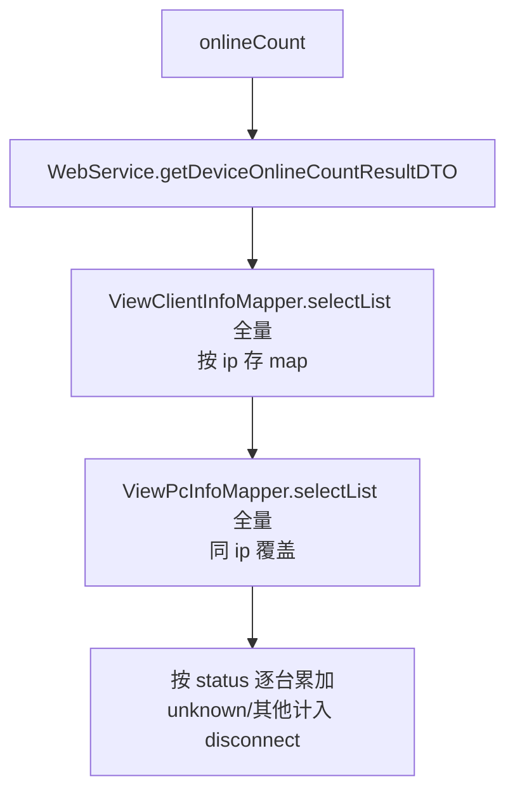
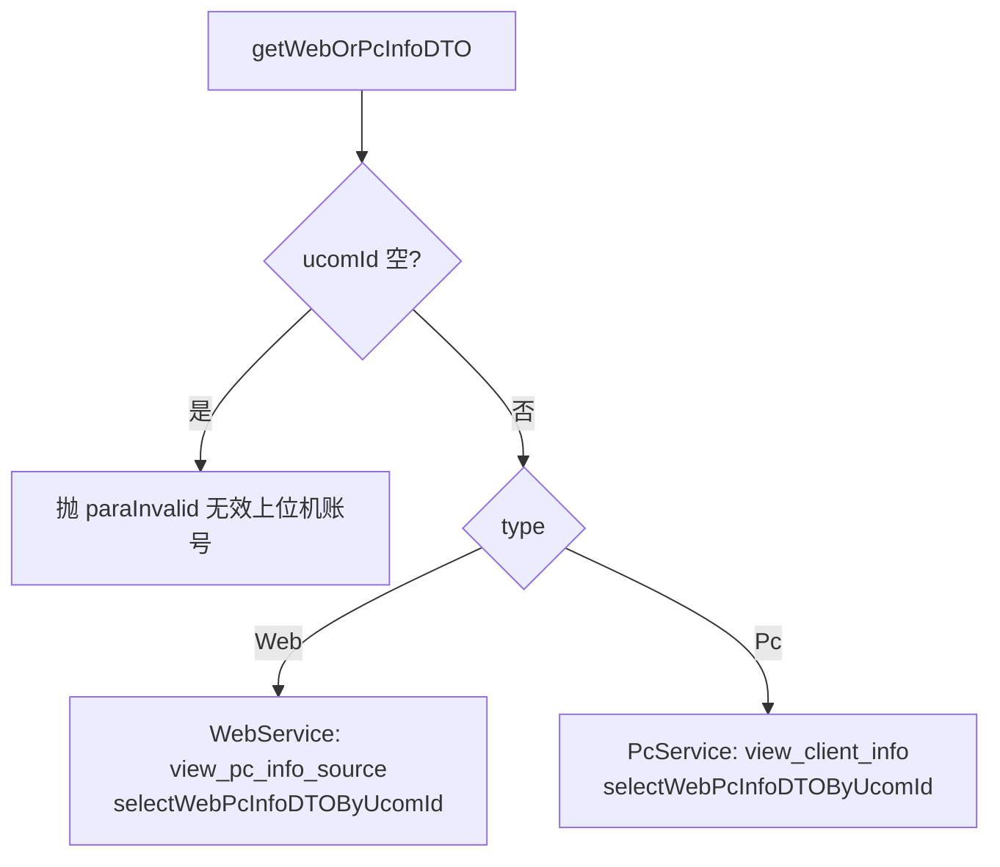

# WebController（Web/Pc 设备视图）

- 源码：`real-controlcenter/src/main/java/cn/testin/mvc/controller/WebController.java`
- 职责：Web 浏览器/Pc 桌面设备的在线统计、历史天统计、单台信息查询与 CSV 导出。
- 基础路径 `/v3/ControlCenter`

## 接口一览

| # | 方法 | 路径 | 说明 |
|---|------|------|------|
| 1 | GET | /v3/ControlCenter/web/online_count | Web/Pc 设备在线统计 |
| 2 | GET | /v3/ControlCenter/web/history_count | Web/Pc 天统计分页 |
| 3 | GET | /v3/ControlCenter/web/getWebPcInfo | 单台 Web/Pc 信息 |
| 4 | GET | /v3/ControlCenter/web/export | Web/Pc 天统计导出 |

---

### Web/Pc 设备在线统计 (`GET /v3/ControlCenter/web/online_count`)

- **实现意图**：按 ip 汇总 Web（view_pc_info）与 Pc（view_client_info）设备状态，统计 free/runScript/disconnect 数量（同 ip 后者覆盖前者）。
- **请求参数**：无。
- **返回参数**

| 字段 | 类型 | 说明 |
| --- | --- | --- |
| code | int | 状态码，0 成功 |
| msg | String | 提示信息 |
| data | Object | DeviceOnlineCountResultDTO 返回数据对象 |
| data.android | Object | Android 设备计数 DeviceOnlineCountDTO{free, runScript, disconnect} |
| data.ios | Object | iOS 设备计数（同上结构） |
| data.harmonyOS | Object | HarmonyOS 设备计数（同上结构） |
| data.harmonyOSNext | Object | HarmonyOSNext 设备计数（同上结构） |
| data.device | Object | Web/Pc 设备合计（同上结构，本接口仅有值字段） |
- **处理流程**：



- **调用链**：无。
- **涉及表与 SQL**：`view_client_info`、`view_pc_info`（SELECT 全量）。
- **异常与校验**：无。
- **关键代码摘录**：

```java
// mvc/service/WebService.java
List<ViewClientInfo> viewClientInfoList = viewClientInfoMapper.selectList(...);
for (ViewClientInfo v : viewClientInfoList) { map.put(v.getIp(), v.getStatus()); }
List<ViewPcInfo> viewPcInfoList = viewPcInfoMapper.selectList(...);
for (ViewPcInfo v : viewPcInfoList) { map.put(v.getIp(), v.getStatus()); }
```

---

### Web/Pc 天统计分页 (`GET /v3/ControlCenter/web/history_count`)

- **实现意图**：分页查询 Web/Pc 设备按天统计（在线率/利用率/时长），按设备 ip 过滤。
- **请求参数**：

| 参数名 | 类型 | 必填 | 说明 |
|--------|------|------|------|
| page / page_size | Integer | 是 | >0 |
| device_ip | String | 否 | 设备 ip |
| start_time / end_time | Long | 否 | 时间范围 |

- **返回参数**

| 字段 | 类型 | 说明 |
| --- | --- | --- |
| code | int | 状态码，0 成功 |
| msg | String | 提示信息 |
| data | Object | 分页对象 PageInfoList&lt;DeviceHistoryCountDTO&gt; |
| data.totalRow | Long | 总记录数 |
| data.totalPage | Integer | 总页数 |
| data.pageSize | Integer | 每页条数 |
| data.page | Integer | 当前页 |
| data.list | JSONArray&lt;DeviceHistoryCountDTO&gt; | Web/Pc 天统计列表（元素含 DeviceOnlineCount 字段 + osType/modelAlias） |
- **处理流程**：校验分页参数 → `DeviceOnlineCountService.getDeviceHistoryCountList(type=WEB_PC_TYPE)` → `device_online_count` count + 分页 SELECT。
- **调用链**：无。
- **涉及表与 SQL**：`device_online_count`（SELECT）。
- **异常与校验**：page/pageSize 非正抛 `paraInvalid`。
- **关键代码摘录**：

```java
// mvc/controller/WebController.java
PageInfoList<DeviceHistoryCountDTO> result = deviceOnlineCountService.getDeviceHistoryCountList(
        page, pageSize, null, deviceIp, null, null, startTime, endTime, DeviceOnlineCount.WEB_PC_TYPE);
```

---

### 单台 Web/Pc 信息 (`GET /v3/ControlCenter/web/getWebPcInfo`)

- **实现意图**：按 ucomId + 设备类型查询单台 Web 浏览器环境或 Pc 桌面的详细信息。
- **请求参数**：

| 参数名 | 类型 | 必填 | 说明 |
|--------|------|------|------|
| ucom_id | String | 是 | 上位机账号 |
| type | int | 是 | DeviceTypeEnum.Web / DeviceTypeEnum.Pc |

- **返回参数**

| 字段 | 类型 | 说明 |
| --- | --- | --- |
| code | int | 状态码，0 成功 |
| msg | String | 提示信息 |
| data | Object | WebPcInfoDTO 返回数据对象 |
| data.ucomId | String | 上位机账号 |
| data.ip | String | ip 地址 |
| data.systemType | String | 系统类型 |
| data.systemVersion | String | 系统版本 |
| data.pcId | String | pcId |
| data.browsers | String | 浏览器使用信息（JSONArray 字符串，通常仅一个浏览器） |
| data.brandName | String | 品牌名 |
| data.mark | String | 备注 |
| data.cpuName | String | cpu 名称 |
| data.protocol | String | 上位机连接方式 |
- **处理流程**：



- **调用链**：无。
- **涉及表与 SQL**：`view_pc_info_source`、`view_client_info`（SELECT）。
- **异常与校验**：ucomId 空抛 `paraInvalid`；type 不匹配时返回空 DTO。
- **关键代码摘录**：

```java
// mvc/controller/WebController.java
if (DeviceTypeEnum.Web.getValue().equals(type)) { result = webService.getWebOrPcInfoDTO(ucomId); }
if (DeviceTypeEnum.Pc.getValue().equals(type)) { result = pcService.getWebOrPcInfoDTO(ucomId); }
```

---

### Web/Pc 天统计导出 (`GET /v3/ControlCenter/web/export`)

- **实现意图**：导出 Web/Pc 设备天统计 CSV（带 BOM）。
- **请求参数**：device_ip / start_time / end_time（均可选）。
- **响应结构**：CSV 文件流，文件名 `设备天统计yyyyMMdd-yyyyMMdd.csv`。
- **处理流程**：同 DeviceController.export，但 type=WEB_PC_TYPE，表头用 WEB_PC_CSV_TITLE。
- **调用链**：无。
- **涉及表与 SQL**：`device_online_count`（SELECT）。
- **异常与校验**：写流异常仅记日志。
- **关键代码摘录**：

```java
// mvc/controller/WebController.java
deviceOnlineCountService.statisticExport(null, deviceIp, null, null,
        startTime, endTime, DeviceOnlineCount.WEB_PC_TYPE, response);
```
