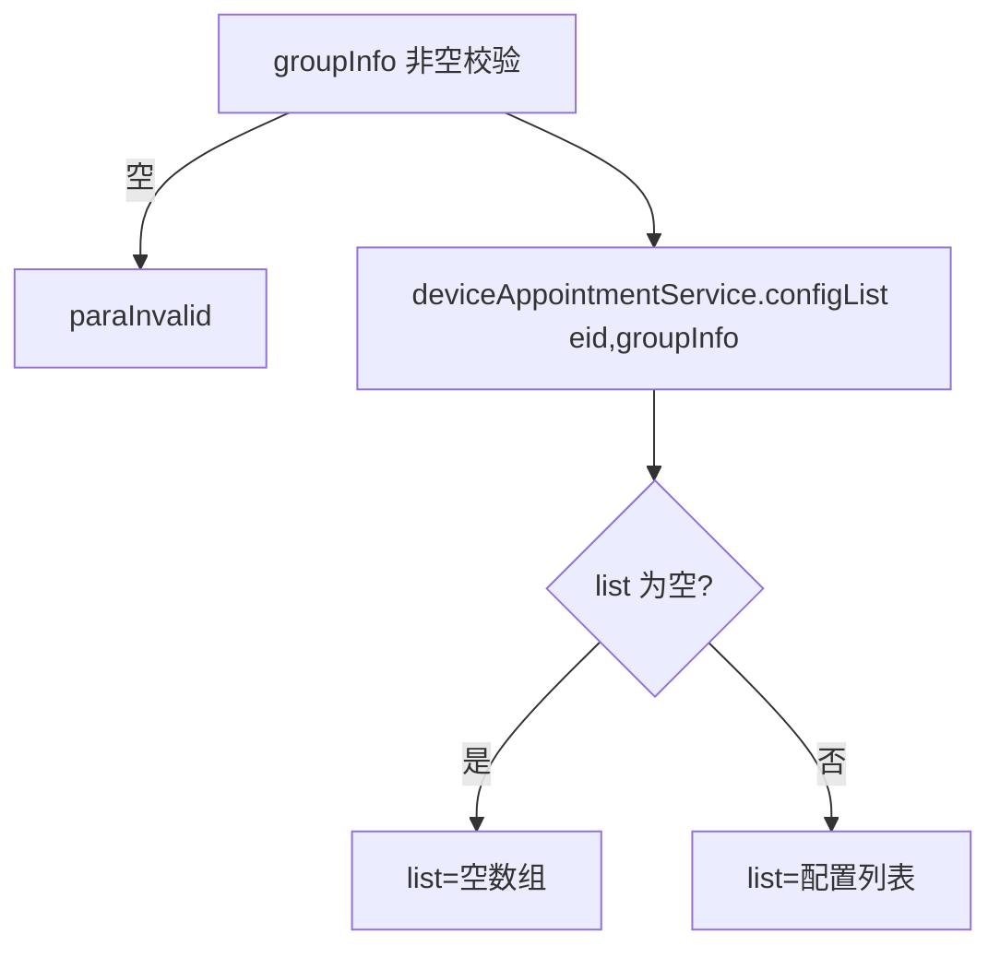

# AppointmentConfig

- **类全名**：`cn.testin.service.appointment.AppointmentConfig`
- **源码路径**：`real-controlcenter/src/main/java/cn/testin/service/appointment/AppointmentConfig.java`
- **职责**：设备预约配置查询（预约规则配置列表）。

## op 一览表

| op | 方法 | 职责 |
| --- | --- | --- |
| list | `AppointmentConfig.list` | 预约设备配置列表查询 |

---

### list (`AppointmentConfig.list`)

- **入口**：ApiServlet，action=appointment，op=AppointmentConfig.list
- **实现意图**：按企业 ID + 组信息（groupInfo）查询预约配置列表（DeviceAppointmentConfig），供预约设置页展示。

**请求参数**

| 参数 | 类型 | 必填 | 说明 |
| --- | --- | --- | --- |
| eid | Integer | 否 | 企业 ID |
| groupInfo | String | 是 | 组信息（非空） |

**返回参数**

| 字段 | 类型 | 说明 |
| --- | --- | --- |
| code | Integer | 状态码，0 成功 |
| msg | String | 提示信息 |
| data | Object | 返回数据对象 |
| data.list | JSONArray&lt;DeviceAppointmentConfig&gt; | 预约配置列表（空时返回空数组） |

**处理流程**



**调用链**：`IDeviceAppointmentService.configList`。
**涉及表与 SQL**：`device_appointment_config`（select by eid+groupInfo）。
**异常与校验**：groupInfo 空 → paraInvalid。

**关键代码摘录**

```java
// real-controlcenter/.../service/appointment/AppointmentConfig.java
List<DeviceAppointmentConfig> list = deviceAppointmentService.configList(eid, groupInfo);
if (list == null || list.isEmpty()) {
    datamap.put(ApiResponse.RES_LIST, new ArrayList<>());
} else {
    datamap.put(ApiResponse.RES_LIST, list);
}
```
