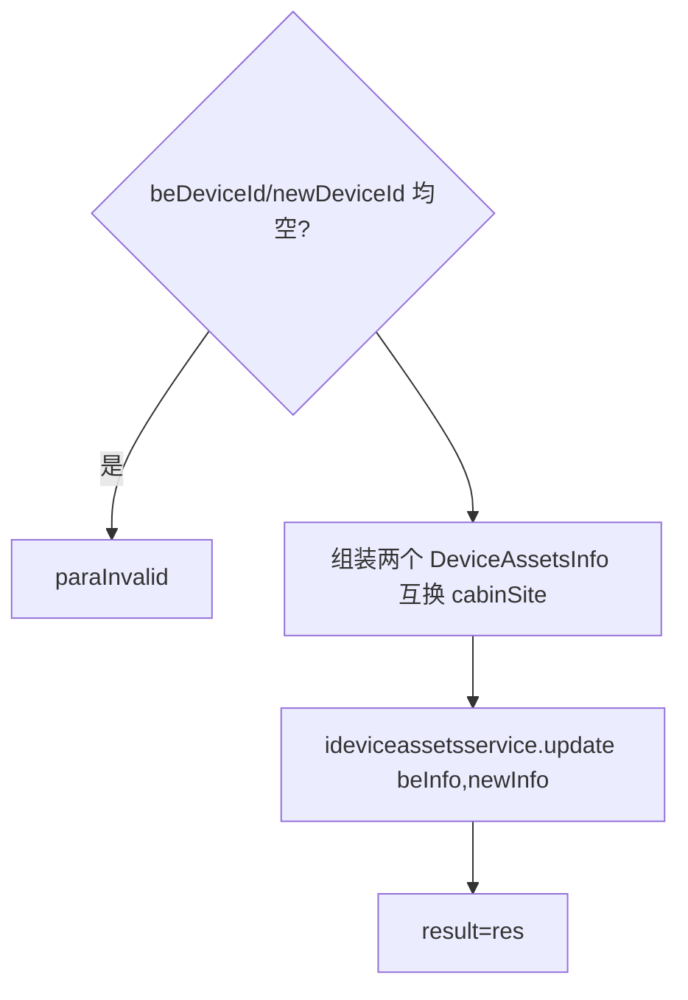

# Cabinet

- **类全名**：`cn.testin.service.cabinet.Cabinet`
- **源码路径**：`real-controlcenter/src/main/java/cn/testin/service/cabinet/Cabinet.java`
- **职责**：机房机柜相关查询与维护：机柜列表、设备机位调换、机柜大屏（上位机信息）、机柜空间配置、环境告警数据。

## op 一览表

| op | 方法 | 职责 |
| --- | --- | --- |
| cabinetList | `Cabinet.cabinetList` | 机柜信息列表 |
| maintainDevice | `Cabinet.maintainDevice` | 设备机位调换 |
| ucomInfoList | `Cabinet.ucomInfoList` | 机柜大屏：上位机信息列表 |
| getCabinetSpace | `Cabinet.getCabinetSpace` | 机柜空间配置查询 |
| getWarnInfo | `Cabinet.getWarnInfo` | 机柜环境告警数据 |

---

### cabinetList (`Cabinet.cabinetList`)

- **入口**：ApiServlet，action=cabinet，op=Cabinet.cabinetList
- **实现意图**：返回全部机柜（caseNum）列表，供大屏/管理端选择机柜。

**请求参数**：无。
**返回参数**

| 字段 | 类型 | 说明 |
| --- | --- | --- |
| code | Integer | 状态码，0 成功 |
| msg | String | 提示信息 |
| data | Object | 返回数据对象 |
| data.caseNumList | JSONArray&lt;Map&gt; | 机柜信息列表 |
**处理流程**：`iUcomInfoService.getCabinetList()` → 直接返回。
**调用链**：`IUcomInfoService.getCabinetList`。
**涉及表与 SQL**：`ucom_info`（select distinct 机柜字段，mapper：`mapper/device/UcomInfoMapper.xml`）。
**异常与校验**：无显式校验。

---

### maintainDevice (`Cabinet.maintainDevice`)

- **入口**：ApiServlet，action=cabinet，op=Cabinet.maintainDevice
- **实现意图**：调换两台设备的机柜位置（或单台上下架）：原设备移到新位置，新位置原设备移到原位置，位置字段缺省为 "screen"。

**请求参数**

| 参数 | 类型 | 必填 | 说明 |
| --- | --- | --- | --- |
| beDeviceId | String | 二选一 | 原设备 ID |
| beSite | String | 否 | 原位置（默认 screen） |
| newDeviceId | String | 二选一 | 新位置原设备 ID |
| newSite | String | 否 | 新位置（默认 screen） |

**返回参数**

| 字段 | 类型 | 说明 |
| --- | --- | --- |
| code | Integer | 状态码，0 成功 |
| msg | String | 提示信息 |
| data | Object | 返回数据对象 |
| data.result | Integer | 更新结果（影响行数/状态） |

**处理流程**



**调用链**：`IDeviceAssetsService.update`（设备资产服务）。
**涉及表与 SQL**：设备资产表（device_assets，update cabin_site）。
**异常与校验**：两个设备 ID 均为空 → paraInvalid。

**关键代码摘录**

```java
// real-controlcenter/.../service/cabinet/Cabinet.java
DeviceAssetsInfo beInfo = new DeviceAssetsInfo();
beInfo.setDeviceid(beDeviceId);
beInfo.setCabinSite(newSite);
DeviceAssetsInfo newInfo = new DeviceAssetsInfo();
newInfo.setDeviceid(newDeviceId);
newInfo.setCabinSite(beSite);
Integer res = ideviceassetsservice.update(beInfo, newInfo);
```

---

### ucomInfoList (`Cabinet.ucomInfoList`)

- **入口**：ApiServlet，action=cabinet，op=Cabinet.ucomInfoList
- **实现意图**：机柜大屏展示：按机柜号查询该机柜下所有上位机（ucom）运行信息列表。

**请求参数**

| 参数 | 类型 | 必填 | 说明 |
| --- | --- | --- | --- |
| caseNum | String | 是 | 机柜号 |

**返回参数**

| 字段 | 类型 | 说明 |
| --- | --- | --- |
| code | Integer | 状态码，0 成功 |
| msg | String | 提示信息 |
| data | Object | 返回数据对象 |
| data.ucomList | JSONArray&lt;UcomInfoResult&gt; | 上位机信息列表 |
**处理流程**：caseNum 校验 → `iUcomInfoService.list(caseNum)` → 返回。
**调用链**：`IUcomInfoService.list`。
**涉及表与 SQL**：`ucom_info`（select by caseNum，mapper：`mapper/device/UcomInfoMapper.xml`）。
**异常与校验**：caseNum 空 → paraInvalid。

---

### getCabinetSpace (`Cabinet.getCabinetSpace`)

- **入口**：ApiServlet，action=cabinet，op=Cabinet.getCabinetSpace
- **实现意图**：查询机柜空间配置（层/位布局），供大屏渲染机柜图。

**请求参数**

| 参数 | 类型 | 必填 | 说明 |
| --- | --- | --- | --- |
| caseNum | String | 否 | 机柜号 |
| caseFloor | String | 否 | 机柜层号 |

**返回参数**

| 字段 | 类型 | 说明 |
| --- | --- | --- |
| code | Integer | 状态码，0 成功 |
| msg | String | 提示信息 |
| data | Object | 返回数据对象 |
| data.cabinetSpace | JSONArray&lt;CabinetSpaceCfg&gt; | 机柜空间配置列表 |
**处理流程**：`iUcomInfoService.getCabinetSpace(caseNum, caseFloor)` → 返回。
**调用链**：`IUcomInfoService.getCabinetSpace`。
**涉及表与 SQL**：`cabinet_space_cfg`（select 条件查询）。
**异常与校验**：无显式必填校验（参数均可空，空即全量）。

---

### getWarnInfo (`Cabinet.getWarnInfo`)

- **入口**：ApiServlet，action=cabinet，op=Cabinet.getWarnInfo
- **实现意图**：按机柜号查询环境检测（传感器）告警数据，返回 JSON 数组。

**请求参数**

| 参数 | 类型 | 必填 | 说明 |
| --- | --- | --- | --- |
| caseNum | String | 是 | 机柜号 |

**返回参数**

| 字段 | 类型 | 说明 |
| --- | --- | --- |
| code | Integer | 状态码，0 成功 |
| msg | String | 提示信息 |
| data | Object | 返回数据对象 |
| data.senorList | JSONArray | 告警信息 JSONArray（无数据时为空数组） |
**处理流程**：caseNum 校验 → `iUcomInfoService.getWarningByCaseNum` → 字符串转 JSONArray → 返回。
**调用链**：`IUcomInfoService.getWarningByCaseNum`（底层可能为 Redis/传感器采集服务）。
**涉及表与 SQL**：环境告警数据（由实现层读取，可能为 Redis key by caseNum）。
**异常与校验**：caseNum 空 → paraInvalid。
