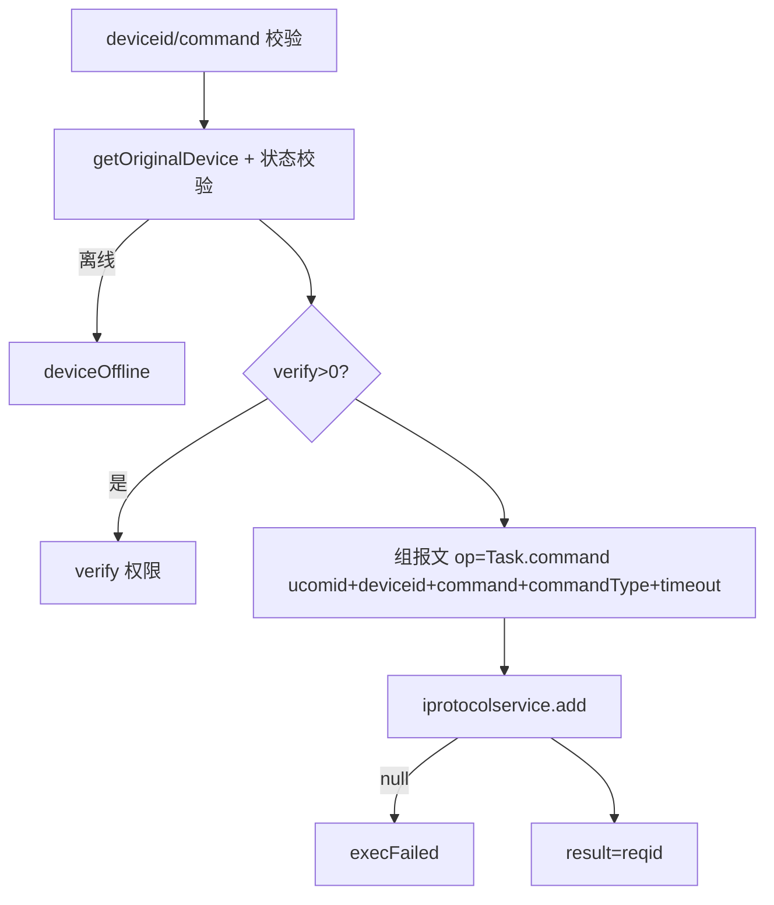
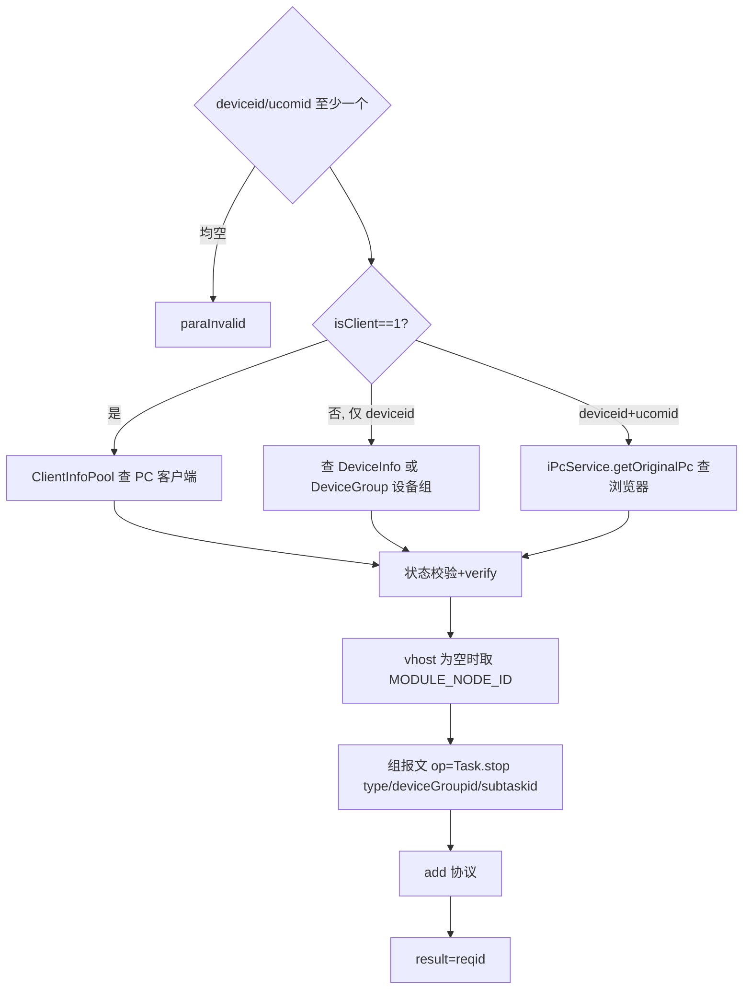
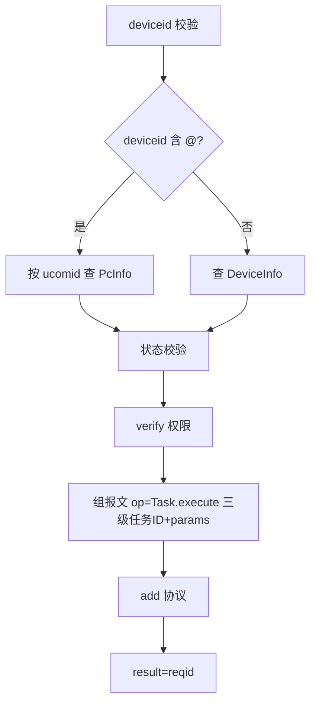
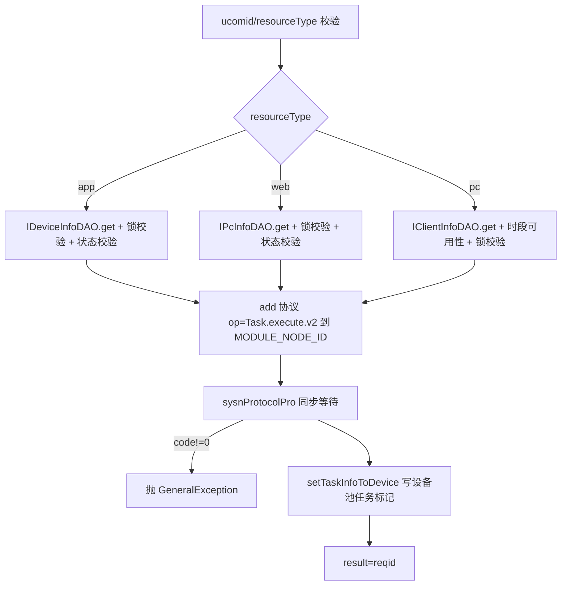

# Task-control

- **类全名**：`cn.testin.service.control.Task`
- **源码路径**：`real-controlcenter/src/main/java/cn/testin/service/control/Task.java`
- **同名说明**：与 `cn.testin.service.pcap.Task` 区分，本文档为 control 包（任务控制）。
- **职责**：自动化任务在设备上的执行控制：命令下发、任务停止、任务继续/取消执行、任务分发（v2）。设备路由按三类资源区分：app 真机（DeviceInfo）、web 浏览器（PcInfo）、pc 客户端（ClientInfoPojo）。

## op 一览表

| op | 方法 | 职责 |
| --- | --- | --- |
| command | `Task.command` | 向设备下发执行命令（Robotium/UIA 等） |
| stop | `Task.stop` | 停止设备/浏览器/客户端上的任务 |
| execute | `Task.execute` | 任务继续执行/取消执行 |
| distributeTask | `Task.distributeTask` | 任务分发执行下发（v2，含锁校验与设备池任务标记） |

---

### command (`Task.command`)

- **入口**：ApiServlet，action=control，op=Task.command
- **实现意图**：向指定设备下发一条执行命令（如 Robotium/UIA 脚本命令），可做设备云权限校验。

**请求参数**

| 参数 | 类型 | 必填 | 说明 |
| --- | --- | --- | --- |
| deviceid | String | 是 | 设备 ID |
| command | String | 是 | 执行命令内容 |
| commandType | Integer | 否 | 0 无类型 / 1 Robotium / 2 UIA 脚本 |
| timeout | Long | 否 | 超时时间 |
| eid / projectid | Integer | verify 时需要 | 企业/项目组 |
| verify | Integer | 否 | >0 时做设备云权限校验 |

**返回参数**

| 字段 | 类型 | 说明 |
| --- | --- | --- |
| code | Integer | 状态码，0 成功 |
| msg | String | 提示信息 |
| data | Object | 返回数据对象 |
| data.result | String | 协议 reqid |

**处理流程**



**调用链**：`IDeviceService.getOriginalDevice` → verify（平台配置 ProjectGroupApi）→ `IProtocolService.add` → 上位机执行（脚本执行侧关联 [script-service](../../../脚本服务/00-首页.md)）。
**涉及表与 SQL**：`device_info`（select）。
**异常与校验**：deviceid/command 空 → paraInvalid；设备离线 → deviceOffline；无权限 → deviceSourceInvalid；add 失败 → execFailed。

---

### stop (`Task.stop`)

- **入口**：ApiServlet，action=control，op=Task.stop
- **实现意图**：停止正在设备/浏览器/PC 客户端上执行的任务。按入参组合确定资源类型与路由（isClient=1 → PC 客户端；仅 deviceid → 真机或设备组；deviceid+ucomid → Web 浏览器），组报文 `Task.stop` 下发。

**请求参数**

| 参数 | 类型 | 必填 | 说明 |
| --- | --- | --- | --- |
| deviceid | String | 二选一 | 设备 ID（可为设备组 ID） |
| ucomid | String | 二选一 | 上位机账号（Web/PC 场景） |
| isClient | Integer | 否 | 1=PC 自动化客户端 |
| subtaskid | String | 否 | 子任务 ID |
| subsubtaskids | JSONObject | 否 | 子子任务列表 |
| eid / projectid / verify | - | 否 | 权限校验 |

**返回参数**

| 字段 | 类型 | 说明 |
| --- | --- | --- |
| code | Integer | 状态码，0 成功 |
| msg | String | 提示信息 |
| data | Object | 返回数据对象 |
| data.result | String | 协议 reqid |

**处理流程**



**调用链**：`ClientInfoPoolUtil`/`IDeviceService.getOriginalDevice`/`DeviceGroupDAO.get`/`IPcService.getOriginalPc` → verify → `IProtocolService.add` → 上位机。
**涉及表与 SQL**：`device_info` / `pc_info` / `client_info` / `device_group`（select）。
**异常与校验**：deviceid、ucomid 均空 → paraInvalid；资源离线 → deviceOffline（设备空闲时提示"设备空闲，无需取消"）；无权限 → deviceSourceInvalid；add 失败 → execFailed。

**关键代码摘录**

```java
// real-controlcenter/.../service/control/Task.java
cn.testin.pojo.device.DeviceInfo dbdeviceinfo = ideviceservice.getOriginalDevice(deviceid);
DeviceGroupment dbdeviceGroupinfo = DeviceGroupDAO.get(deviceid);
if (dbdeviceinfo == null && dbdeviceGroupinfo == null) {
    throw new GeneralException(ControlCenterCode.deviceOffline.getValue(), ...);
}
// 设备组场景：取主控设备作为实际路由，deviceGroupid 透传
```

---

### execute (`Task.execute`)

- **入口**：ApiServlet，action=control，op=Task.execute
- **实现意图**：任务执行控制（继续执行/取消执行）。deviceid 含 "@" 时按 Web 浏览器处理（ucomid_句柄 形式），否则按真机处理；组报文 `Task.execute` 携带任务三级 ID 与参数下发。

**请求参数**

| 参数 | 类型 | 必填 | 说明 |
| --- | --- | --- | --- |
| deviceid | String | 是 | 设备 ID；含 @ 时视为 web 端 ucomid |
| taskid | String | 否 | 任务 ID |
| subtaskid | String | 否 | 子任务 ID |
| subsubtaskid | String | 否 | 子子任务 ID |
| params | JSONArray | 否 | 执行参数 |
| eid / projectid / verify | - | 否 | 权限校验 |

**返回参数**

| 字段 | 类型 | 说明 |
| --- | --- | --- |
| code | Integer | 状态码，0 成功 |
| msg | String | 提示信息 |
| data | Object | 返回数据对象 |
| data.result | String | 协议 reqid |

**处理流程**



**调用链**：`IDeviceService.getOriginalDevice` / `IPcService.getOriginalPc` → verify → `IProtocolService.add` → 上位机。
**涉及表与 SQL**：`device_info` / `pc_info`（select）。
**异常与校验**：deviceid 空 → paraInvalid；资源离线 → deviceOffline；无权限 → deviceSourceInvalid；add 失败 → execFailed。

---

### distributeTask (`Task.distributeTask`)

- **入口**：ApiServlet，action=control，op=Task.distributeTask
- **实现意图**：任务分发执行下发（v2）。按 resourceType（app/web/pc）校验资源存在、任务锁归属（`DeviceService.getLockDeviceTaskId` 必须与传入 taskid 一致）、资源在线；然后下发 `Task.execute.v2` 同步等待上位机确认，成功后把任务信息（DeviceTaskInfo）写入对应内存设备池。

**请求参数**

| 参数 | 类型 | 必填 | 说明 |
| --- | --- | --- | --- |
| ucomid | String | 是 | 上位机账号 |
| resourceType | String | 是 | app / web / pc |
| deviceid | String | app 时需要 | 设备 ID |
| taskid | String | 是 | 任务 ID（需持有设备锁） |
| 其他 | - | 否 | 原样透传至上位机（reqjson 整体作为 data） |

**返回参数**

| 字段 | 类型 | 说明 |
| --- | --- | --- |
| code | Integer | 状态码，0 成功 |
| msg | String | 提示信息 |
| data | Object | 返回数据对象 |
| data.result | String | 协议 reqid |

**处理流程**



**调用链**：`IDeviceInfoDAO`/`IPcInfoDAO`/`IClientInfoDAO` → `DeviceService.getLockDeviceTaskId`（锁校验）→ `ITaskInfoService.currentTimeSlotValidForDevice`（pc 时段）→ `IProtocolService.add/get` → 上位机；任务信息源自 [任务调度服务](../../../任务调度服务（real-scheduling）/07-开放接口文档/00-模块索引.md)（TaskInfo bean）。
**涉及表与 SQL**：`device_info` / `pc_info` / `client_info`（select）；锁信息存 Redis（TaskDeviceLockPool，`DeviceService.getLockDeviceTaskId`）；设备池为内存结构。
**异常与校验**：ucomid/resourceType 空、资源不存在、锁归属不一致、资源不在线、pc 时段不可用 → paraInvalid；上位机失败 → 透传 code/msg。

**关键代码摘录**

```java
String lockDeviceTaskId = deviceService.getLockDeviceTaskId(deviceid, null, NewDeviceTypeEnum.App);
if (!taskid.equals(lockDeviceTaskId)) {
    return ApiUtil.getResult(apirequest, CommonCode.paraInvalid.getValue(),
        "(this device is locking by task!, taskid is )" + lockDeviceTaskId);
}
...
sysnProtocolPro(result, content);
TaskInfo task = TaskInfo.toBean(reqjson);
setTaskInfoToDevice(task, resourceType, ucomid, deviceid); // 锁内更新内存设备池 DeviceTaskInfo
```
