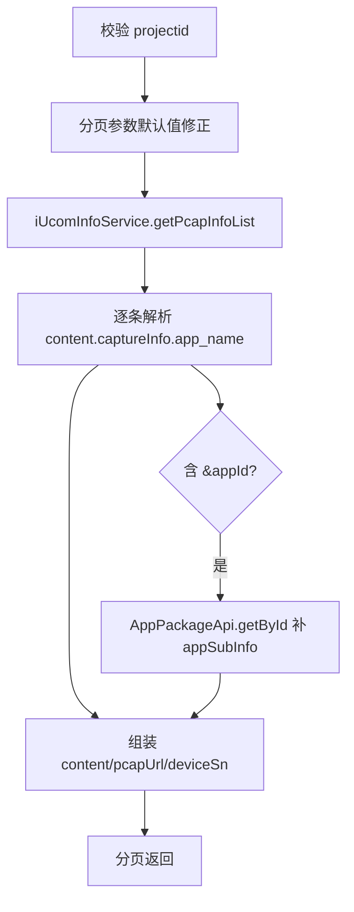

# Task-pcap（pcap 包）

## 职责
抓包（pcap）任务记录查询：按项目组分页查询抓包信息，解析 content JSON 中的被测应用名，并按 appId 补充应用包详情。

- 源码：`real-controlcenter/src/main/java/cn/testin/service/pcap/Task.java`
- 基类：`GenericBaseService`（注入 iUcomInfoService）

## op 一览表

| op | 说明 |
|---|---|
| pcapInfoList | 抓包信息分页列表 |

---

### pcapInfoList (`Task.pcapInfoList`)
- **入口**：ApiServlet，action/op（action=task，op=Task.pcapInfoList）
- **实现意图**：查询项目组下的抓包记录；content 中 `captureInfo.app_name` 形如 "应用名&appId" 时拆分解析，并调用应用包接口补充 appSubInfo。
- **请求参数**：

| 参数 | 类型 | 必填 | 说明 |
|---|---|---|---|
| projectid | int | 是 | 项目组 ID |
| page | int | 否 | 页码，缺省/非法置 1 |
| pageSize | int | 否 | 页大小，缺省/非法置 20 |
| startTime / endTime | long | 否 | 时间区间过滤 |

- **返回参数**

| 字段 | 类型 | 说明 |
| --- | --- | --- |
| code | Integer | 状态码，0 成功 |
| msg | String | 提示信息 |
| data | Object | 返回数据对象 |
| data.page | Integer | 当前页 |
| data.pageSize | Integer | 每页条数 |
| data.totalRow | Integer | 总记录数 |
| data.totalPage | Integer | 总页数 |
| data.list | JSONArray | 抓包记录列表，元素含 content（抓包 JSON 字符串，可能含 appSubInfo）、pcapUrl、deviceSn |
- **处理流程**：

- **调用链**：[App包管理（脚本服务）](../../../脚本服务/00-首页.md)（AppPackageApi.getById 查应用包信息）。
- **涉及表与 SQL**：`pcap_info`（按 projectid+时间分页）。
- **异常与校验**：projectid 为空 → paraInvalid；分页参数不强制报错，自动回退默认值。
- **关键代码摘录**：
```java
// real-controlcenter/src/main/java/cn/testin/service/pcap/Task.java
if (appSubName.contains("&")) {
    appId = appSubName.substring(appSubName.lastIndexOf("&") + 1);
    appSubName = appSubName.substring(0, appSubName.lastIndexOf("&"));
}
if (appId != null) {
    AppSubInfo appSubInfo = new AppPackageApi().getById(appId);
    if (appSubInfo.getContent() != null) {
        content.put("appSubInfo", new JSONObject(appSubInfo.getContent()));
    }
}
```

---

## 依赖汇总
- 外部服务：[App包管理（脚本服务）](../../../脚本服务/00-首页.md)（应用包信息）
- 主要表：pcap_info
