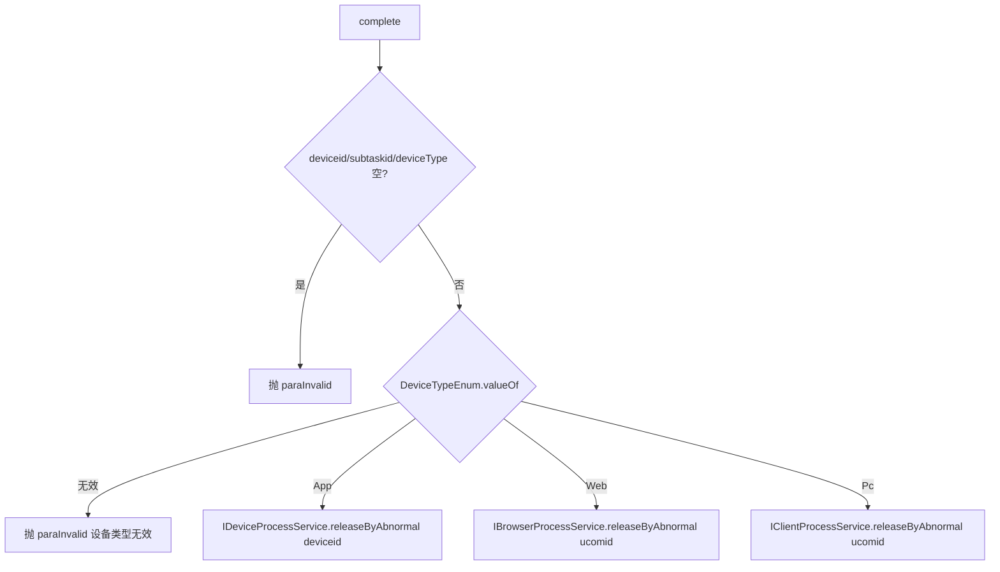

# TaskController（UcomDevice-任务执行回报）

- 源码：`real-controlcenter/src/main/java/cn/testin/mvc/controller/UcomDevice/TaskController.java`
- 职责：上位机任务生命周期回报——预完成、完成释放、结果上报、过程上报、视频上报。
- 基础路径 `/v3/UcomDeivce/task`

## 接口一览

| # | 方法 | 路径 | 说明 |
|---|------|------|------|
| 1 | POST | /v3/UcomDeivce/task/precomplete | 任务结果预上报 |
| 2 | POST | /v3/UcomDeivce/task/complete | 任务完成（释放设备占用） |
| 3 | POST | /v3/UcomDeivce/task/resultReport | 任务结果上报 |
| 4 | POST | /v3/UcomDeivce/task/processReport | 任务过程上报 |
| 5 | POST | /v3/UcomDeivce/task/videoReport | 任务视频上报 |

---

### 任务结果预上报 (`POST /v3/UcomDeivce/task/precomplete`)

- **实现意图**：子子任务执行完成后先行上报执行结果与出入参，并可通过 delayperiod 推迟该设备下次任务匹配。
- **请求参数**（`TaskPrecompleteRequestDTO extends BaseRequestDTO`）：

| 参数名 | 类型 | 必填 | 说明 |
|--------|------|------|------|
| ucomId | String | 是 | 上位机账号 |
| deviceid / subtaskid / subsubtaskid | String | 是 | 设备与子任务 id，空抛"参数错误" |
| taskid | String | 否 | 任务 id |
| delayperiod | Long | 否 | 推迟下次匹配毫秒数 |
| runinfo | Map | 否 | 执行结果信息 |
| inputParams / params | List | 否 | 执行前/后参数 |

- **返回参数**

| 字段 | 类型 | 说明 |
| --- | --- | --- |
| code | int | 状态码，0 成功 |
| msg | String | 提示信息 |
| data | Object | 返回数据对象（Map） |
| data.result | Integer | 1 成功 / 0 失败 |
- **处理流程**：参数校验 → `ITaskInfoService.precomplete(taskid, subtaskid, subsubtaskid, deviceid, delayperiod, JSONObject(runinfo), JSONArray(inputParams), JSONArray(params), ucomid)` → result。
- **调用链**：任务结果经 ITaskInfoService 写入 Redis 并异步汇总到调度侧（[任务调度服务](../../../任务调度服务（real-scheduling）/07-开放接口文档/00-模块索引.md) 任务体系）。
- **涉及表与 SQL**：Redis 任务结果队列（ITaskInfoService.precomplete）。
- **异常与校验**：deviceid/subtaskid/subsubtaskid 空抛 `paraInvalid`。
- **关键代码摘录**：

```java
// mvc/service/TaskService.java
result = this.itaskinfoservice.precomplete(taskid, subtaskid, subsubtaskid, deviceid,
        delayperiod, new JSONObject(runinfo), new JSONArray(inputParams), new JSONArray(params), ucomid);
```

---

### 任务完成-释放占用 (`POST /v3/UcomDeivce/task/complete`)

- **实现意图**：任务结束后按设备类型释放占用记录（App→device_process、Web→browser_process、Pc→client_process），以 releaseByAbnormal("complete") 方式归还设备。
- **请求参数**（`TaskCompleteRequestDTO`）：

| 参数名 | 类型 | 必填 | 说明 |
|--------|------|------|------|
| ucomId | String | 是 | 上位机账号 |
| deviceid | String | 是 | 设备 id |
| subtaskid | String | 是 | 子任务 id |
| deviceType | Integer | 是 | DeviceTypeEnum App/Web/Pc |

- **返回参数**

| 字段 | 类型 | 说明 |
| --- | --- | --- |
| code | int | 状态码，0 成功 |
| msg | String | 提示信息 |
| data | Object | 返回数据对象（Map） |
| data.result | Integer | 1 成功 / 0 失败 |
- **处理流程**：



- **调用链**：无外部服务。
- **涉及表与 SQL**：`device_process` / `browser_process` / `client_process`（释放更新）。
- **异常与校验**：参数空、deviceType 非法抛 `paraInvalid`。
- **关键代码摘录**：

```java
// mvc/service/TaskService.java
if (DeviceTypeEnum.App.getValue().equals(deviceTypeEnum.getValue())) {
    result = deviceProcessService.releaseByAbnormal(deviceid, "complete");
}
```

---

### 任务结果上报 (`POST /v3/UcomDeivce/task/resultReport`)

- **实现意图**：上报子子任务的最终结果 URL（报告地址）、重试序号与 Web 执行策略。
- **请求参数**（`TaskResultReportRequestDTO`）：

| 参数名 | 类型 | 必填 | 说明 |
|--------|------|------|------|
| ucomId | String | 是 | 上位机账号 |
| deviceid / subtaskid / subsubtaskid / resultUrl | String | 是 | 空抛"参数错误" |
| taskid | String | 否 | 任务 id |
| retryNum | Integer | 是 | 重试序号，必须 >=0 |
| standard | Map | 否 | Web 任务执行策略 |
| sid | String | 否 | Web 浏览器会话参数 |

- **返回参数**

| 字段 | 类型 | 说明 |
| --- | --- | --- |
| code | int | 状态码，0 成功 |
| msg | String | 提示信息 |
| data | Object | 返回数据对象（Map） |
| data.result | Integer | 1 成功 / 0 失败 |
- **处理流程**：参数校验 → `ITaskInfoService.reportResult(taskid, subtaskid, subsubtaskid, deviceid, retryNum, resultUrl, JSONObject(standard), sid)` → result。
- **调用链**：结果 URL 指向报告存储（[file-service](../../../文件管理服务/00-首页.md) 体系），数据经 ITaskInfoService 写 Redis。
- **涉及表与 SQL**：Redis 任务结果（ITaskInfoService.reportResult）。
- **异常与校验**：必填空抛 `paraInvalid`；retryNum 为负抛"retryNum无效"。
- **关键代码摘录**：

```java
// mvc/service/TaskService.java
result = this.itaskinfoservice.reportResult(taskid, subtaskid, subsubtaskid, deviceid,
        retryNum, resultUrl, new JSONObject(standard), sid);
```

---

### 任务过程上报 (`POST /v3/UcomDeivce/task/processReport`)

- **实现意图**：任务执行过程中的进度/过程数据上报（心跳式过程记录）。
- **请求参数**（`TaskProcessReportRequestDTO`）：

| 字段 | 类型 | 必填 | 说明 |
| --- | --- | --- | --- |
| ucomId | String | 是 | 上位机账号 |
| deviceid | String | 是 | 设备 id |
| taskid | String | 是 | 任务 id |
| subtaskid | String | 是 | 子任务 id |
| subsubtaskid | String | 是 | 子子任务 id |
- **返回参数**

| 字段 | 类型 | 说明 |
| --- | --- | --- |
| code | int | 状态码，0 成功 |
| msg | String | 提示信息 |
| data | Object | 返回数据对象（Map） |
| data.result | Integer | 1 成功 / 0 失败 |
- **处理流程**：参数校验 → `ITaskInfoService.processReport(taskid, subtaskid, subsubtaskid, deviceid)` → result。
- **调用链**：无外部服务（Redis）。
- **涉及表与 SQL**：Redis 任务过程数据（ITaskInfoService.processReport）。
- **异常与校验**：四项 id 任一为空抛 `paraInvalid`。
- **关键代码摘录**：

```java
// mvc/service/TaskService.java
result = this.itaskinfoservice.processReport(taskid, subtaskid, subsubtaskid, deviceid);
```

---

### 任务视频上报 (`POST /v3/UcomDeivce/task/videoReport`)

- **实现意图**：上报子子任务执行录像 URL。
- **请求参数**（`TaskVideoReportRequestDTO`）：

| 字段 | 类型 | 必填 | 说明 |
| --- | --- | --- | --- |
| ucomId | String | 是 | 上位机账号 |
| taskid | String | 否 | 任务 id（无显式校验） |
| subtaskid | String | 否 | 子任务 id |
| subsubtaskid | String | 否 | 子子任务 id |
| videoUrl | String | 否 | 视频地址 |
- **返回参数**

| 字段 | 类型 | 说明 |
| --- | --- | --- |
| code | int | 状态码，0 成功 |
| msg | String | 提示信息 |
| data | Object | 返回数据对象（Map） |
| data.result | Integer | 1 成功 / 0 失败 |
- **处理流程**：`ITaskInfoService.reportVideo(taskid, subtaskid, subsubtaskid, videoUrl)` → result（本接口无显式参数校验）。
- **调用链**：视频文件存储于 [file-service](../../../文件管理服务/00-首页.md) 体系。
- **涉及表与 SQL**：Redis 任务结果（ITaskInfoService.reportVideo）。
- **异常与校验**：无显式校验，依赖下游处理。
- **关键代码摘录**：

```java
// mvc/service/TaskService.java
result = this.itaskinfoservice.reportVideo(taskid, subtaskid, subsubtaskid, videoUrl);
```
