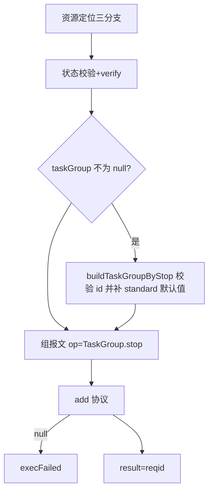
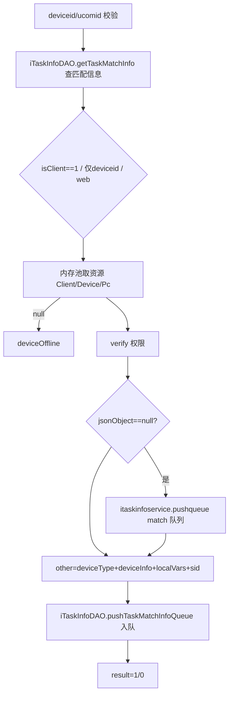

# TaskGroup

- **类全名**：`cn.testin.service.control.TaskGroup`
- **源码路径**：`real-controlcenter/src/main/java/cn/testin/service/control/TaskGroup.java`
- **职责**：任务组（恒生定制）相关控制：按任务组停止任务、按任务组执行任务（入匹配队列，由匹配线程统一下发）。

## op 一览表

| op | 方法 | 职责 |
| --- | --- | --- |
| stop | `TaskGroup.stop` | 停止任务组相关任务 |
| executeTask | `TaskGroup.executeTask` | 任务组任务入匹配执行队列 |

---

### stop (`TaskGroup.stop`)

- **入口**：ApiServlet，action=control，op=TaskGroup.stop
- **实现意图**：停止任务组任务。资源定位逻辑与 `Task.stop` 相同（isClient / 仅 deviceid / deviceid+ucomid 三分支），额外构建 taskGroup 节点（id 必填，standard 含 restoreNetwork/uninstall/clear，默认 -1）随报文下发 `TaskGroup.stop`。

**请求参数**

| 参数 | 类型 | 必填 | 说明 |
| --- | --- | --- | --- |
| deviceid | String | 二选一 | 设备 ID |
| ucomid | String | 二选一 | 上位机账号 |
| isClient | Integer | 否 | 1=PC 客户端 |
| subtaskid | String | 否 | 子任务 ID |
| subsubtaskids | JSONObject | 否 | 子子任务列表 |
| taskGroup | JSONObject | 否 | 任务组 `{id, standard:{restoreNetwork,uninstall,clear}}` |
| eid / projectid / verify | - | 否 | 权限校验 |

**返回参数**

| 字段 | 类型 | 说明 |
| --- | --- | --- |
| code | Integer | 状态码，0 成功 |
| msg | String | 提示信息 |
| data | Object | 返回数据对象 |
| data.result | String | 协议 reqid |

**处理流程**



**调用链**：`ClientInfoPoolUtil`/`IDeviceService`/`IPcService` → verify → `IProtocolService.add` → 上位机。
**涉及表与 SQL**：`device_info` / `pc_info` / `client_info`（select）。
**异常与校验**：deviceid/ucomid 均空、taskGroup.id 空 → paraInvalid；资源离线 → deviceOffline；无权限 → deviceSourceInvalid。

---

### executeTask (`TaskGroup.executeTask`)

- **入口**：ApiServlet，action=control，op=TaskGroup.executeTask
- **实现意图**：任务组任务执行入口。与直接下发不同：本接口按资源类型取内存池资源（不强制空闲，非空闲仅记日志），把任务信息 push 到 Redis 匹配队列（`ITaskInfoDAO.pushTaskMatchInfoQueue`），由匹配线程取出后调私有重载 `executeTask(ucomid, vhost, jsonObject)` 下发 `TaskGroup.executeTask` 协议；若该 taskid 无匹配信息则先把资源 push 到 match 队列。

**请求参数**

| 参数 | 类型 | 必填 | 说明 |
| --- | --- | --- | --- |
| ucomid | String | 二选一 | 上位机账号（web/pc 必填） |
| deviceid | String | 二选一 | 设备 ID（app 场景） |
| isClient | Integer | 否 | 1=PC 客户端 |
| taskid | String | 是 | 任务 ID |
| subtaskid | String | 否 | 子任务 ID |
| localVars | JSONObject | 否 | 变量透传 |
| sid | String | 否 | 浏览器句柄 ID |
| eid / projectid / verify | - | 否 | 权限校验 |

**返回参数**

| 字段 | 类型 | 说明 |
| --- | --- | --- |
| code | Integer | 状态码，0 成功 |
| msg | String | 提示信息 |
| data | Object | 返回数据对象 |
| data.result | Integer | 1 入队成功 / 0 失败 |

**处理流程**



**调用链**：`ClientInfoPoolUtil`/`DevicePoolUtil`/`PcInfoPoolUtil` → `ITaskInfoDAO.getTaskMatchInfo/pushTaskMatchInfoQueue`（Redis）→ `ITaskInfoService.pushqueue` → 匹配线程 → `IProtocolService.add` → 上位机；任务模型来自 [任务调度服务](../../../任务调度服务（real-scheduling）/07-开放接口文档/00-模块索引.md)。
**涉及表与 SQL**：Redis（任务匹配队列 task match info queue）；`device_info` / `pc_info` / `client_info`（仅内存池未命中时间接 select）。
**异常与校验**：deviceid/ucomid 均空 → paraInvalid；资源不在内存池/DB → deviceOffline；无权限 → deviceSourceInvalid。

**关键代码摘录**

```java
// real-controlcenter/.../service/control/TaskGroup.java
JSONObject jsonObject = iTaskInfoDAO.getTaskMatchInfo(null, taskid);
...
if (jsonObject == null) {
    itaskinfoservice.pushqueue(TaskConfig.QueueType.match, dbdeviceinfo);
}
other.put("deviceType", DeviceConfig.DeviceType.DEVICE_TYPE.getType());
other.put("deviceInfo", JSONUtil.toJsonStr(dbdeviceinfo));
boolean flag = iTaskInfoDAO.pushTaskMatchInfoQueue(vhost, ucomid, deviceid, taskid, subtaskid, other);
```
