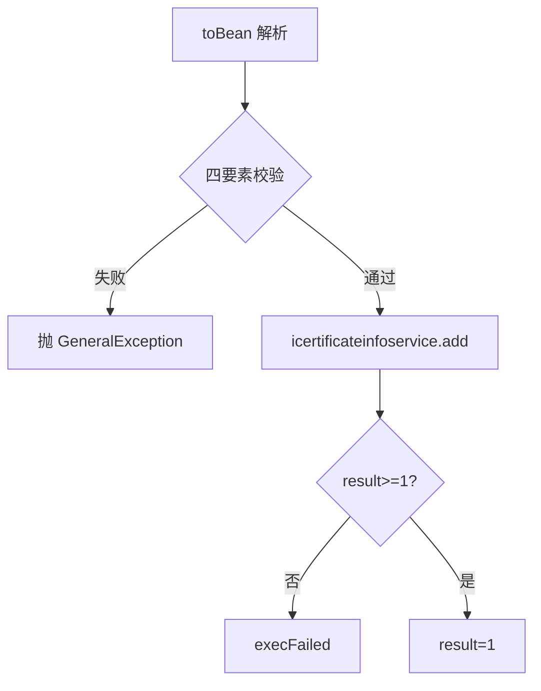
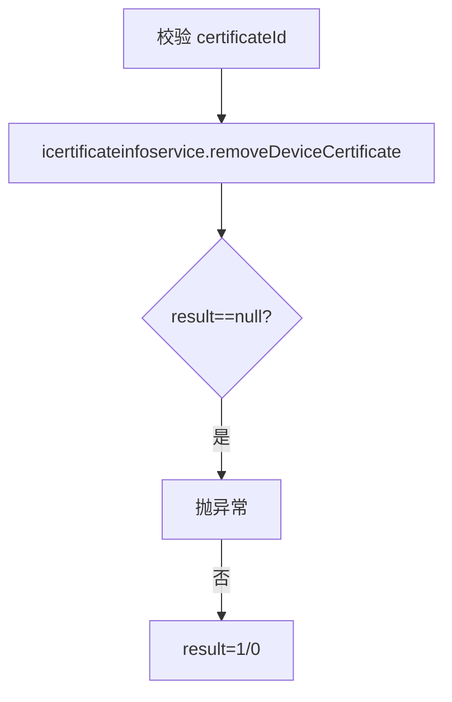
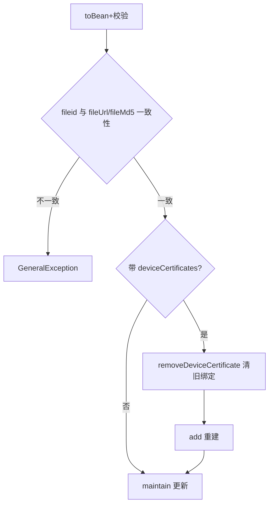
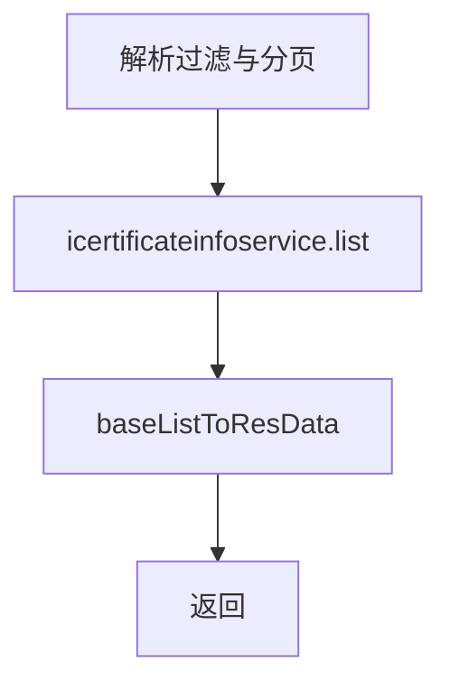
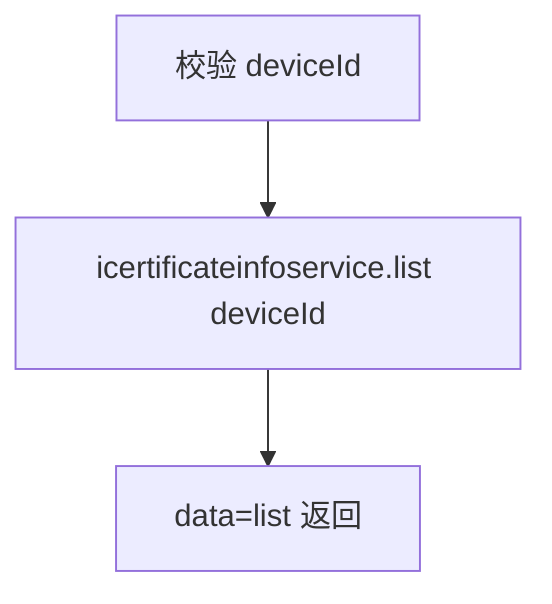

# Certificate（device 包）

## 职责
iOS 证书（描述文件/证书文件）管理：新增、移除、维护（含设备-证书绑定关系重置）、单查、分页列表、按设备查询。

- 源码：`real-controlcenter/src/main/java/cn/testin/service/device/Certificate.java`
- 基类：`GenericBaseService`（注入 icertificateinfoservice）

## op 一览表

| op | 说明 |
|---|---|
| add | 新增证书信息 |
| remove | 移除证书及设备绑定 |
| maintain | 维护证书（可重置设备绑定） |
| get | 按证书 ID 查询 |
| list | 分页查询证书 |
| getCertificateInfoByDeviceId | 按设备 ID 查证书 |

---

### add (`Certificate.add`)
- **入口**：ApiServlet，action/op（action=device，op=Certificate.add）
- **实现意图**：登记一条 iOS 证书（文件已上传 [file-service](../../../文件管理服务/00-首页.md)，此处保存元数据）。
- **请求参数**：整体按 `CertificateInfo.toBean(reqjson)` 解析，关键字段：

| 参数 | 类型 | 必填 | 说明 |
|---|---|---|---|
| certificateId | String | 是 | 证书 ID |
| fileid | int | 是 | 文件服务文件 ID（>0） |
| fileMd5 | String | 是 | 文件 MD5 |
| fileUrl | String | 是 | 文件下载地址 |

- **返回参数**

| 字段 | 类型 | 说明 |
| --- | --- | --- |
| code | Integer | 状态码，0 成功 |
| msg | String | 提示信息 |
| data | Object | 返回数据对象 |
| data.result | Integer | 固定 1 |

- **处理流程**：

- **调用链**：证书文件本身由 [file-service](../../../文件管理服务/00-首页.md) 托管。
- **涉及表与 SQL**：`certificate_info`（INSERT）。
- **异常与校验**：字段缺失抛 `GeneralException(paraInvalid)`；插入失败抛 `execFailed`。
- **关键代码摘录**：
```java
// real-controlcenter/src/main/java/cn/testin/service/device/Certificate.java
CertificateInfo certificateInfo = CertificateInfo.toBean(reqjson);
if (StringUtils.isBlank(certificateInfo.getCertificateId())) { throw new GeneralException(...); }
Integer result = this.icertificateinfoservice.add(certificateInfo);
```

### remove (`Certificate.remove`)
- **入口**：ApiServlet，action/op（action=device，op=Certificate.remove）
- **实现意图**：删除证书并清理其与设备的绑定关系。
- **请求参数**：certificateId（String，必填）。
- **返回参数**

| 字段 | 类型 | 说明 |
| --- | --- | --- |
| code | Integer | 状态码，0 成功 |
| msg | String | 提示信息 |
| data | Object | 返回数据对象 |
| data.result | Integer | 1 成功 / 0 无影响行 |
- **处理流程**：

- **涉及表与 SQL**：`certificate_info`、`device_certificate`（DELETE）。
- **异常与校验**：certificateId 空 → GeneralException；result==null → GeneralException(sqlException 描述，code 用 paraInvalid)。

### maintain (`Certificate.maintain`)
- **入口**：ApiServlet，action/op（action=device，op=Certificate.maintain）
- **实现意图**：更新证书信息；当携带 deviceCertificates（设备绑定列表）时，先删旧绑定再整体重建。
- **请求参数**：CertificateInfo JSON，certificateId 必填；fileid/fileMd5/fileUrl 三者必须同有同无；deviceCertificates（可选，设备绑定数组）。
- **返回参数**

| 字段 | 类型 | 说明 |
| --- | --- | --- |
| code | Integer | 状态码，0 成功 |
| msg | String | 提示信息 |
| data | Object | 返回数据对象 |
| data.result | Integer | 1 成功 / 0 失败 |
- **处理流程**：

- **涉及表与 SQL**：`certificate_info`（UPDATE）、`device_certificate`（DELETE+INSERT）。
- **异常与校验**：绑定清理/重建失败抛 `execFailed`。
- **关键代码摘录**：
```java
// Certificate.java maintain —— fileid 与文件信息必须同有同无
if (certificateInfo.getFileid() != null
        && (StringUtils.isBlank(certificateInfo.getFileUrl())
        || StringUtils.isBlank(certificateInfo.getFileMd5()))) {
    throw new GeneralException(CommonCode.paraInvalid.getValue(), msg);
}
```

### get (`Certificate.get`)
- **入口**：ApiServlet，action/op（action=device，op=Certificate.get）
- **实现意图**：按证书 ID 查询证书详情。
- **请求参数**：certificateId（String，必填）。
- **返回参数**

| 字段 | 类型 | 说明 |
| --- | --- | --- |
| code | Integer | 状态码，0 成功 |
| msg | String | 提示信息 |
| data | Object | 返回数据对象（证书不存在时为空 map） |
| data.objInfo | Object | CertificateInfo 证书详情（RES_OBJECT） |
- **涉及表与 SQL**：`certificate_info`（主键查询）。
- **异常与校验**：certificateId 空 → GeneralException。

### list (`Certificate.list`)
- **入口**：ApiServlet，action/op（action=device，op=Certificate.list）
- **实现意图**：证书分页查询，支持设备/状态/描述/标识过滤。
- **请求参数**：page、pageSize（必填，pageSize<Config.MaxSize）；deviceid、status、descr、identifier（可选）。
- **返回参数**

| 字段 | 类型 | 说明 |
| --- | --- | --- |
| code | Integer | 状态码，0 成功 |
| msg | String | 提示信息 |
| data | Object | 返回数据对象 |
| data.page | Integer | 当前页 |
| data.pageSize | Integer | 每页条数 |
| data.totalRow | Integer | 总记录数 |
| data.totalPage | Integer | 总页数 |
| data.list | JSONArray&lt;CertificateInfo&gt; | 证书列表 |
- **处理流程**：

- **涉及表与 SQL**：`certificate_info`（关联 `device_certificate` 按 deviceid 过滤）。
- **异常与校验**：分页非法 → GeneralException；结果 null → unknown。

### getCertificateInfoByDeviceId (`Certificate.getCertificateInfoByDeviceId`)
- **入口**：ApiServlet，action/op（action=device，op=Certificate.getCertificateInfoByDeviceId）
- **实现意图**：按设备 ID 查其绑定的全部证书（不分页）。
- **请求参数**：deviceId（String，必填）。
- **返回参数**

| 字段 | 类型 | 说明 |
| --- | --- | --- |
| code | Integer | 状态码，0 成功 |
| msg | String | 提示信息 |
| data | JSONArray&lt;CertificateInfo&gt; | 设备绑定的证书列表（非标准分页结构） |
- **处理流程**：

- **涉及表与 SQL**：`certificate_info` JOIN `device_certificate`。
- **异常与校验**：deviceId 空 → GeneralException。

---

## 依赖汇总
- 外部服务：[file-service](../../../文件管理服务/00-首页.md)（证书文件存储）
- 主要表：certificate_info、device_certificate
