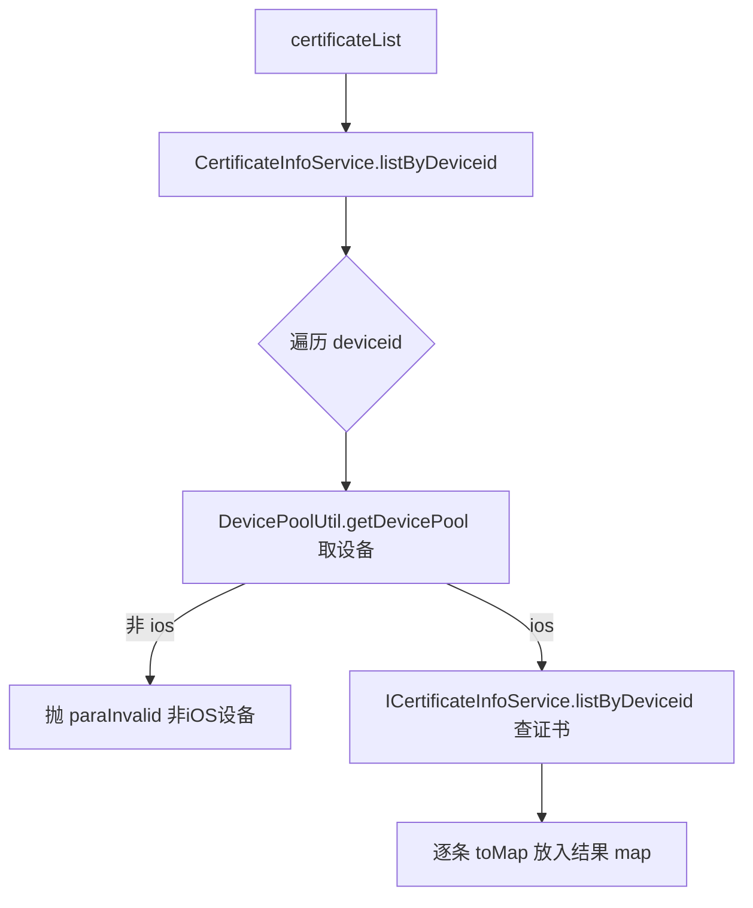

# CertificateInfoController（UcomDevice-证书查询）

- 源码：`real-controlcenter/src/main/java/cn/testin/mvc/controller/UcomDevice/CertificateInfoController.java`
- 职责：供上位机批量查询 iOS 设备证书信息。
- 基础路径 `/v3/UcomDeivce/certificate`

## 接口一览

| # | 方法 | 路径 | 说明 |
|---|------|------|------|
| 1 | POST | /v3/UcomDeivce/certificate/list | 按设备批量查证书 |

---

### 按设备批量查证书 (`POST /v3/UcomDeivce/certificate/list`)

- **实现意图**：按设备 id 列表查询各设备的证书记录；非 iOS 设备直接报错（用于上架/签名流程前置校验）。
- **请求参数**（`CertificateInfoRequestDTO extends BaseRequestDTO`）：

| 参数名 | 类型 | 必填 | 说明 |
|--------|------|------|------|
| ucomId | String | 是 | 上位机账号 @NotNull |
| devices | List<String> | 是 | 设备 id 列表 |

- **返回参数**

| 字段 | 类型 | 说明 |
| --- | --- | --- |
| code | int | 状态码，0 成功 |
| msg | String | 提示信息 |
| data | Object | Map&lt;deviceid, JSONArray&lt;Map&gt;&gt;，key 为设备 id，value 为证书 map 列表 |
- **处理流程**：



- **调用链**：无外部服务。
- **涉及表与 SQL**：`certificate_info`（SELECT；ICertificateInfoService.listByDeviceid）、DevicePool（内存设备池）。
- **异常与校验**：设备在池中且平台非 iOS 抛 `paraInvalid`；查不到证书则跳过该设备。
- **关键代码摘录**：

```java
// mvc/service/CertificateInfoService.java
if (!deviceinfo.getSyspfName().equalsIgnoreCase(DeviceConfig.DeviceOs.ios.getName())) {
    throw new GeneralException(CommonCode.paraInvalid.getValue(),
        "...this device is not ios device)");
}
List<CertificateInfo> list = icertificateinfoservice.listByDeviceid(deviceid);
```
