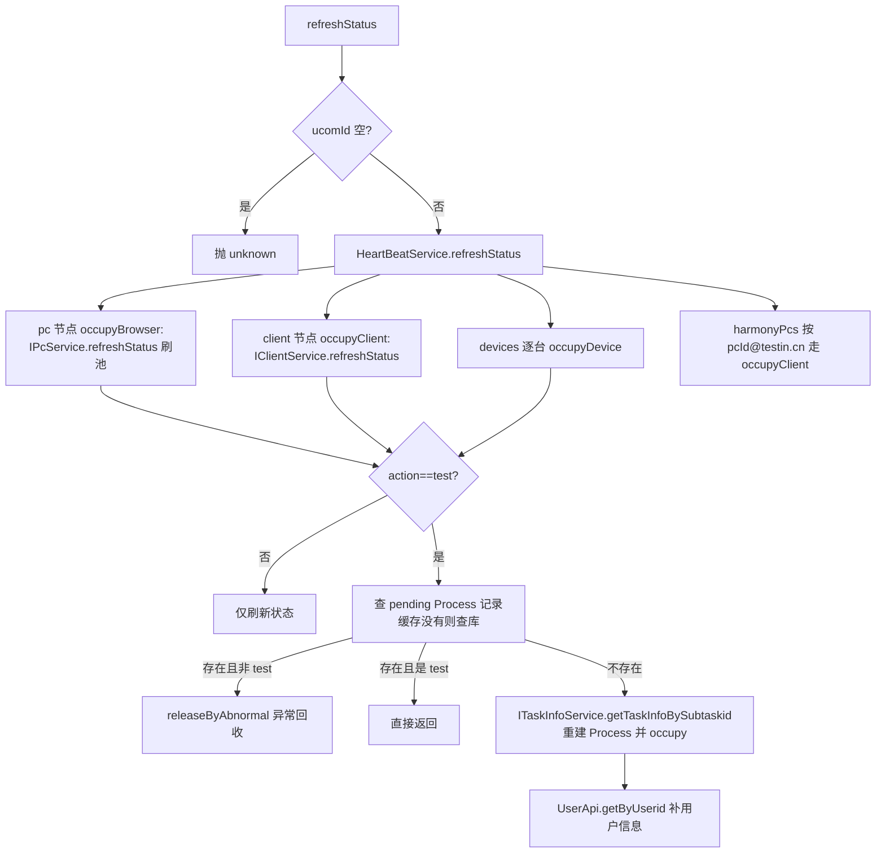

# HeartBeatController-UcomDevice（上位机心跳刷新）

- 源码：`real-controlcenter/src/main/java/cn/testin/mvc/controller/UcomDevice/HeartBeatController.java`（bean 名 `UcomDeviceHeartBeatController`）
- 职责：上位机心跳时携带各设备实时状态，刷新缓存并"兜底"重建测试任务占用记录（DeviceProcess/BrowserProcess/ClientProcess）。
- 基础路径 `/v3/UcomDeivce/heartBeat`

## 接口一览

| # | 方法 | 路径 | 说明 |
|---|------|------|------|
| 1 | POST | /v3/UcomDeivce/heartBeat/refreshStatus | 心跳刷新设备状态 |

---

### 心跳刷新设备状态 (`POST /v3/UcomDeivce/heartBeat/refreshStatus`)

- **实现意图**：一次心跳覆盖四类节点：Pc（Web 浏览器）、Client（桌面客户端）、devices（App 真机）、harmonyPcs（鸿蒙 PC）。对"执行测试任务"的设备，若占用记录丢失（如服务重启），按任务信息重建占用；若占用记录非测试动作则异常回收。
- **请求参数**（`HeartBeatRequestDTO extends BaseRequestDTO`）：

| 参数名 | 类型 | 必填 | 说明 |
|--------|------|------|------|
| ucomId | String | 是 | 上位机账号，空抛"Session is invalid!" |
| devices | List<DeviceInfoDTO> | 否 | App 设备状态（deviceid/deviceState/deviceAction/debugOwner=subtaskid 等） |
| pc | PcInfoDTO | 否 | Web 节点（osName/osVersion/debugOwner/action/browsers[]） |
| client | ClientInfoDTO | 否 | Client 节点（pcId/debugOwner/action/systemName/systemType 等） |
| harmonyPcs | List<HarmonyPcDTO> | 否 | 鸿蒙 PC 节点 |

- **返回参数**

| 字段 | 类型 | 说明 |
| --- | --- | --- |
| code | int | 状态码，0 成功 |
| msg | String | 提示信息 |
| data | Object | 返回数据对象 |
| data.result | Integer | 固定返回 1（PcInfo.STATUS_ON 在线状态常量） |
- **处理流程**：



- **调用链**：[user-manager](../../../平台基础功能服务/00-首页.md)（UserApi.getByUserid）；任务信息经 ITaskInfoService（Redis 任务缓存）。
- **涉及表与 SQL**：`device_process` / `browser_process` / `client_process`（查 pending / occupy / releaseByAbnormal）、`device_info`（IDeviceService.getOriginalDevice 兜底）、Redis 任务缓存（ITaskInfoService）。
- **异常与校验**：ucomId 空抛 `unknown`；occupyDevice 内部整体 try-catch 仅记日志，单设备失败不影响其他设备。
- **关键代码摘录**：

```java
// mvc/service/HeartBeatService.java
DeviceProcess deviceProcess = this.ideviceprocessservice.getByPending(deviceid);
if (deviceProcess == null) {
    deviceProcess = this.ideviceprocessservice.getByPending(deviceid, true); // 从db中加载
}
...
deviceProcess.setJobId(String.format("%s_%d", subtaskid, System.currentTimeMillis()));
this.ideviceprocessservice.occupy(deviceProcess);
```
