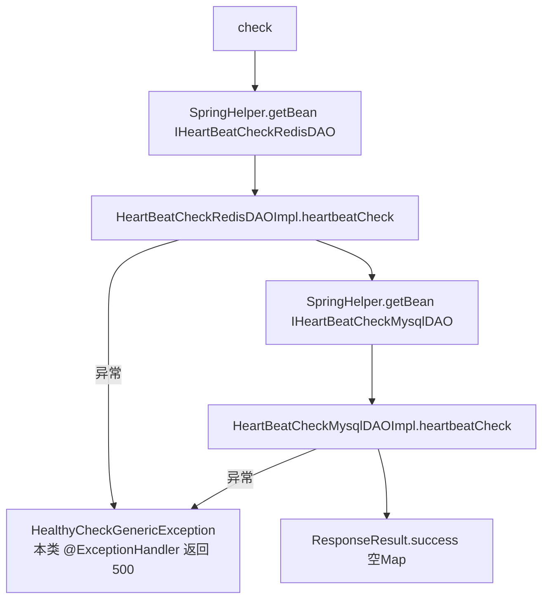

# HeartBeatController（服务健康检查）

- 源码：`real-controlcenter/src/main/java/cn/testin/mvc/controller/HeartBeatController.java`
- 职责：控制中心服务自身的健康检查，探测 Redis 与 MySQL 连通性。
- 基础路径 `/v3/ControlCenter`

## 接口一览

| # | 方法 | 路径 | 说明 |
|---|------|------|------|
| 1 | GET | /v3/ControlCenter/heartbeat/check | 健康检查（Redis + MySQL） |

---

### 健康检查 (`GET /v3/ControlCenter/heartbeat/check`)

- **实现意图**：供部署探活/监控调用，依次执行 Redis 与 MySQL 心跳检测，任一失败抛 `HealthyCheckGenericException`，HTTP 500。
- **请求参数**：无。
- **返回参数**

| 字段 | 类型 | 说明 |
| --- | --- | --- |
| code | int | 状态码，0 成功 |
| msg | String | 提示信息 |
| data | Object | 空 map（健康检查无业务数据） |

失败时 HTTP 500 + `ResponseResult.error(errCode, errMsg)`（code=errCode、msg=errMsg）。
- **处理流程**：



- **调用链**：Redis、MySQL（基础设施）。
- **涉及表与 SQL**：Redis PING 类探测；MySQL 轻量查询（HeartBeatCheckMysqlDAOImpl）。
- **异常与校验**：类内 `@ExceptionHandler(HealthyCheckGenericException.class)` 直接返回 `HttpStatus.INTERNAL_SERVER_ERROR`，不走全局处理器。
- **关键代码摘录**：

```java
// mvc/controller/HeartBeatController.java
@RequestMapping(value = "/heartbeat/check", method = RequestMethod.GET)
@ResponseBody
public ResponseResult check() {
    HeartBeatCheckRedisDAOImpl heartBeatCheckRedisDAO = (HeartBeatCheckRedisDAOImpl) SpringHelper.getBean("IHeartBeatCheckRedisDAO");
    HeartBeatCheckMysqlDAOImpl heartBeatCheckMysqlDAO = (HeartBeatCheckMysqlDAOImpl) SpringHelper.getBean("IHeartBeatCheckMysqlDAO");
    heartBeatCheckRedisDAO.heartbeatCheck();
    heartBeatCheckMysqlDAO.heartbeatCheck();
    return ResponseResult.success(new HashMap<>());
}
```
