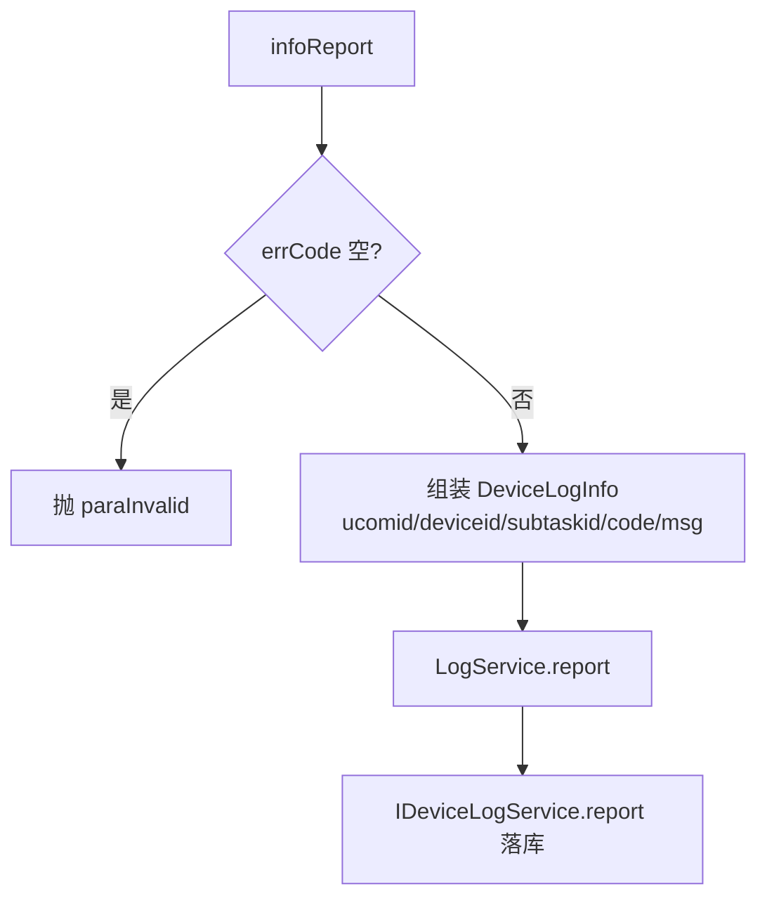

# LogController（UcomDevice-设备日志上报）

- 源码：`real-controlcenter/src/main/java/cn/testin/mvc/controller/UcomDevice/LogController.java`
- 职责：接收上位机上报的设备执行错误日志。
- 基础路径 `/v3/UcomDeivce/log`

## 接口一览

| # | 方法 | 路径 | 说明 |
|---|------|------|------|
| 1 | POST | /v3/UcomDeivce/log/infoReport | 设备错误日志上报 |

---

### 设备错误日志上报 (`POST /v3/UcomDeivce/log/infoReport`)

- **实现意图**：上位机在任务执行失败时上报 errCode/errMsg 等错误信息，落库供结果页"错误日志"查询（对应主包 DeviceController 的 /error_log_info）。
- **请求参数**（`LogRequestDTO extends BaseRequestDTO`）：

| 参数名 | 类型 | 必填 | 说明 |
|--------|------|------|------|
| ucomId | String | 是 | 上位机账号 |
| deviceid | String | 否 | 设备 id |
| taskid / subtaskid / sub_subtaskid | String | 否 | 任务三级 id |
| errCode | String | 是 | 错误码，空抛 paraInvalid |
| errMsg | String | 否 | 错误信息 |
| descr | String | 否 | 描述 |
| interrupt | Integer | 否 | 是否中断 |

- **返回参数**

| 字段 | 类型 | 说明 |
| --- | --- | --- |
| code | int | 状态码，0 成功 |
| msg | String | 提示信息 |
| data | Object | 返回数据对象 |
| data.result | Integer | 1 成功 / 0 失败 |
- **处理流程**：



- **调用链**：无外部服务。
- **涉及表与 SQL**：`device_error_log_info`（INSERT；IDeviceLogService.report）。
- **异常与校验**：errCode 空抛 `paraInvalid`。
- **关键代码摘录**：

```java
// mvc/controller/UcomDevice/LogController.java
DeviceLogInfo loginfo = new DeviceLogInfo();
loginfo.setUcomid(request.getUcomId());
loginfo.setCode(request.getErrCode());
loginfo.setMsg(request.getErrMsg());
boolean result = logService.report(request.getTaskid(), loginfo);
```
