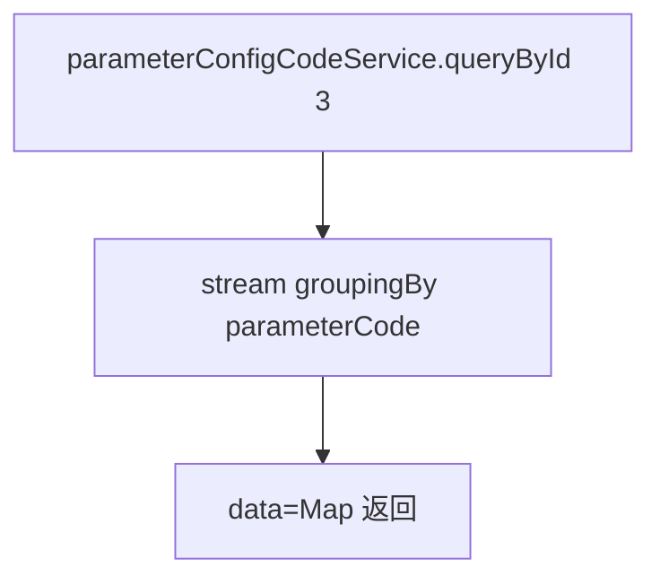

# ParameterConfigCodeInfo（monitor 包）

## 职责
监控参数配置码表查询：按固定分类（id=3，报警相关配置）取出参数配置并按参数编码分组返回，供前端渲染报警规则配置项。

- 源码：`real-controlcenter/src/main/java/cn/testin/service/monitor/ParameterConfigCodeInfo.java`
- 基类：`GenericBaseService`（注入 parameterConfigCodeService）

## op 一览表

| op | 说明 |
|---|---|
| queryById | 查询报警参数配置并按 parameterCode 分组 |

---

### queryById (`ParameterConfigCodeInfo.queryById`)
- **入口**：ApiServlet，action/op（action=parameterConfigCodeInfo，op=ParameterConfigCodeInfo.queryById）
- **实现意图**：查询分类 ID=3 的全部参数配置，按 `parameterCode` 分组为 Map 返回。
- **请求参数**：无（分类 ID 硬编码为 3）。
- **返回参数**

| 字段 | 类型 | 说明 |
| --- | --- | --- |
| code | Integer | 状态码，0 成功 |
| msg | String | 提示信息 |
| data | Object | Map&lt;parameterCode, JSONArray&lt;ParameterConfigCode&gt;&gt;，按参数编码分组（非标准 result/list 结构） |
- **处理流程**：

- **涉及表与 SQL**：`parameter_config_code`（按分类 ID 查询）。
- **异常与校验**：无入参校验。
- **关键代码摘录**：
```java
// real-controlcenter/src/main/java/cn/testin/service/monitor/ParameterConfigCodeInfo.java
List<ParameterConfigCode> parameterConfigCodes = parameterConfigCodeService.queryById(3);
Map<String, List<ParameterConfigCode>> stringListMap = gradeList.stream()
        .filter(Objects::nonNull)
        .collect(Collectors.groupingBy(ParameterConfigCode::getParameterCode));
```

---

## 依赖汇总
- 外部服务：无
- 主要表：parameter_config_code
