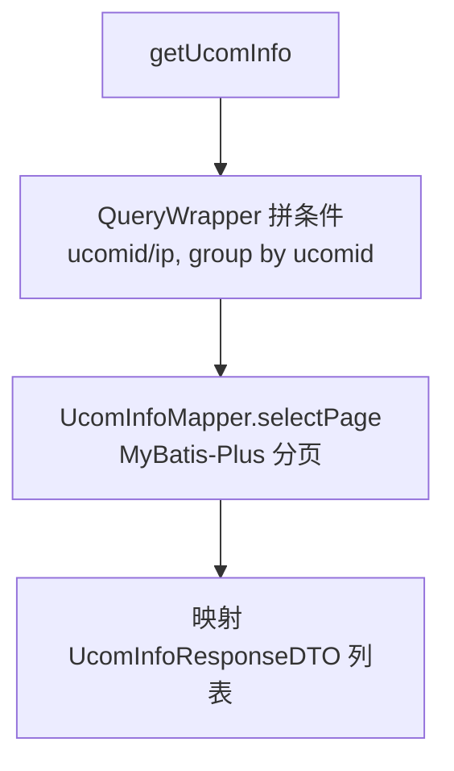

# UcomInfoController（上位机信息）

- 源码：`real-controlcenter/src/main/java/cn/testin/mvc/controller/UcomInfoController.java`
- 职责：分页查询上位机（ucom）注册信息。
- 基础路径 `/v3/ucom`

## 接口一览

| # | 方法 | 路径 | 说明 |
|---|------|------|------|
| 1 | POST | /v3/ucom/list | 上位机信息分页查询 |

---

### 上位机信息分页查询 (`POST /v3/ucom/list`)

- **实现意图**：按 ucomId / ucomIds / ip 条件分页查询上位机列表（按 ucomid 去重分组）。
- **请求参数**（`UcomInfoRequestDTO`）：

| 参数名 | 类型 | 必填 | 说明 |
|--------|------|------|------|
| page / pageSize | Integer | 是 | 分页参数 |
| ucomId | String | 否 | 上位机账号精确匹配 |
| ucomIds | List<String> | 否 | 上位机账号列表（注意：源码中 isEmpty 判断写反，传空才会拼 in 条件，疑似 bug） |
| ip | String | 否 | 上位机 ip |

- **返回参数**

| 字段 | 类型 | 说明 |
| --- | --- | --- |
| code | int | 状态码，0 成功 |
| msg | String | 提示信息 |
| data | Object | 分页对象 PageInfoList&lt;UcomInfoResponseDTO&gt; |
| data.totalRow | Long | 总记录数 |
| data.totalPage | Integer | 总页数 |
| data.pageSize | Integer | 每页条数 |
| data.page | Integer | 当前页 |
| data.list | JSONArray&lt;UcomInfoResponseDTO&gt; | 上位机列表，元素含 ucomId/ucomIp/status |
- **处理流程**：



- **调用链**：无。
- **涉及表与 SQL**：`ucom_info`（SELECT 分页，GROUP BY ucomid；UcomInfoMapper.selectPage）。
- **异常与校验**：无显式校验。
- **关键代码摘录**：

```java
// mvc/service/UcomInfoService.java
queryWrapper.groupBy("ucomid");
IPage<UcomInfo> ucomInfoIPage = ucomInfoMapper.selectPage(page, queryWrapper);
```

> 值得注意：`if (CollectionUtils.isEmpty(request.getUcomIds())) { queryWrapper.in("ucomid", request.getUcomIds()); }` 条件写反，传入 ucomIds 反而不会生效。
