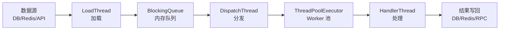

# 定时任务总览

> 覆盖 real 项目 4 个模块的全部后台线程、@Scheduled 定时任务、CommandLineRunner 启动线程、Quartz 定时调度。

## 线程全景

### 设备控制中心（控制中心）

**StartRunner**（`cn.testin.config.StartRunner`，`CommandLineRunner`）在应用启动后一次性启动所有常驻线程：

| 线程 | 启动方式 | 周期 | 职责 |
|------|---------|------|------|
| MessageDispatchThread | new Thread | 常驻 | Redis MQ 消息分发（从 BlockingPool 消费） |
| ServiceInitThread | scheduleAtFixedRate | 1h | 系统配置重载（设备池/云配置/项目组等） |
| ProtocolWorkerThread | scheduleAtFixedRate | 30s | 过期协议清理 |
| PcAccountWorkerThread | scheduleAtFixedRate | 30s | 上位机账号同步 |
| MonitorConfigWorkerThread | scheduleAtFixedRate | 5min | 监控配置加载 |
| DeviceGroupStatusThread | scheduleAtFixedRate | 10s | 设备分组状态刷新 |
| MonitorDispatchThread | new Thread | 常驻 | 设备温度等监控数据分发（含 Worker 池） |
| DeviceDispatchThread (match) | new Thread | 常驻 | 设备匹配分发（从 match 队列消费） |
| DeviceDispatchThread (extract) | new Thread | 常驻 | 设备提取分发（从 extract 队列消费） |
| BootThread (TCP/MINA) | new Thread | 常驻 | MINA TCP 长连接服务（上位机通信端口） |
| ProtocolDispatchThread (activity) | new Thread | 常驻 | 主动协议分发（控制中心请求其他方） |
| ProtocolDispatchThread (passivity) | new Thread | 常驻 | 被动协议分发（控制中心响应其他方） |
| TaskGroupDispatchThread | scheduleAtFixedRate | 5min | 任务组调度 |
| OemStartThread | scheduleAtFixedRate | 1min | OEM 配置加载 |
| DisconnectAppThread | scheduleAtFixedRate | 5s | 断连 App 清理 |
| AppointmentConfigInitThread | scheduleAtFixedRate | 10min | 预约配置加载 |
| AppointmentWorkerThread | scheduleAtFixedRate | 5min | 预约任务处理 |
| DeviceCountThread | scheduleAtFixedRate | 1h | 设备趋势图数据采集 |

**@Scheduled 定时任务**：

| 类 | Cron | 职责 |
|----|------|------|
| `AlarmLogServiceScheduled` | `0 0/1 * * * ?`（每分钟） | 设备温度监控告警：从 LimitedQueue 消费温度数据，按规则（阈值/条件/触发次数）判定是否告警，支持邮件通知+页面通知+通道沉默（Redis） |
| ~~`AlarmLogServiceScheduledNew`~~ | 已注释 | 新版通用监控告警（支持温度+湿度等多维度），逻辑同旧版但按 ruleType+target 匹配规则 |

### 任务调度服务（任务调度）

所有线程为 DispatchThread + HandlerThread 模式（dispatch 从队列拉取分发给 worker 池处理）：

| 线程组 | Dispatch | Handler | 队列类型 | 职责 |
|--------|----------|---------|---------|------|
| Device 调度 | `DeviceDispatchThread` | `DeviceHandlerThread` | 设备任务队列 | 设备匹配与任务下发 |
| Browser 调度 | `BrowserDispatchThread` | `BrowserHandlerThread` | 浏览器任务队列 | 浏览器任务分发 |
| Client 调度 | `ClientDispatchThread` | `ClientHandlerThread` | 客户端任务队列 | 客户端任务分发 |
| AbnormalDevice | `AbnormalDeviceLoadThread` + `AbnormalDeviceDispatchThread` | `AbnormalDeviceHandlerThread` | 异常设备队列 | 异常设备检测与回收 |
| Result 处理 | `ResultDispatchThread` | `ResultHandlerThread` | 结果回调队列 | 任务执行结果回收处理 |
| Message(MQ) | `MessageDispatchThread` | `MessageHandlerThread` + `MessageWorkerThread` | Redis MQ 队列 | 跨模块消息消费 |
| Task 调度 | `TaskDispatchThread` | — | task_action 队列 | 任务状态变更处理 |
| ES Task | `EsTaskDispatchThread` | `EsTaskHandlerThread` | ES 同步队列 | 任务数据同步至 Elasticsearch |
| TaskCancelCheck | `TaskCancelCheckThread` | — | — | 取消任务检查（5min 轮询） |
| TaskDeviceCheck | `TaskDeviceCheckThread` | — | — | 任务设备状态检查 |
| DeviceTaskCount | `DeviceTaskCountThread` | — | — | 设备任务计数统计 |

### app处理服务（测试执行）

| 类 | 类型 | 职责 |
|----|------|------|
| `QuartzJobServiceImpl` | Quartz Job 管理 | 定时任务模板 CRUD、Cron 解析、触发执行 |
| `QuartzJobExecuteServiceImpl` | Quartz Job 执行 | 按模板创建测试任务并提交执行 |
| `QuartzJobStatementServiceImpl` | Quartz 执行记录 | 定时任务执行记录查询与统计 |

### 平台配置（配置中心）

| 线程 | 启动方式 | 职责 |
|------|---------|------|
| `ResourceInitThread` | `@PostConstruct` | 资源定义初始化加载 |
| `LicenseInitThread` | `@PostConstruct` | 授权许可初始化加载 |

## 架构模式

所有模块的后台线程遵循统一的 **Dispatcher + Worker** 模式：

## 线程安全

- 设备控制中心: `StartRunner` 用 `Executors.newScheduledThreadPool(10)` 统一管理周期任务；常驻线程用 `new Thread()` 直接启动
- 任务调度服务: 所有 Dispatch/Handler 线程自建 `ThreadPoolExecutor`（core=5, max=30, 有界队列 50~500）
- 跨线程共享数据通过 Redis（设备池、任务状态）+ DB 保证一致性

## 相关文档

- [后台线程全景（real 专题）](../../04-复杂功能细节/后台线程全景.md)
- [任务状态机](../../04-复杂功能细节/任务状态机.md)
- [模块间通信](../../04-复杂功能细节/模块间通信.md)
