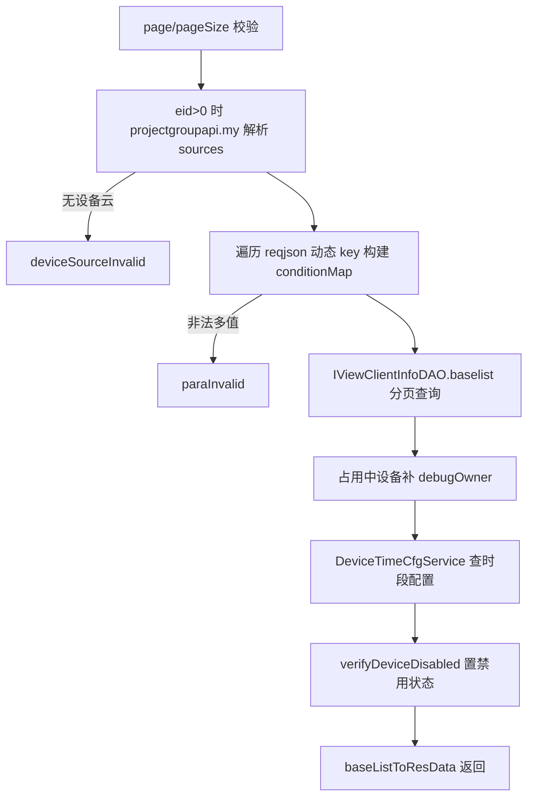
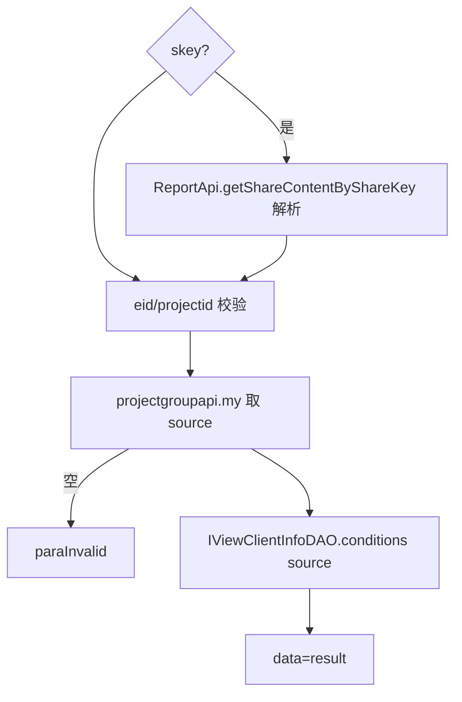

# Client

- **类全名**：`cn.testin.service.client.Client`
- **源码路径**：`real-controlcenter/src/main/java/cn/testin/service/client/Client.java`
- **职责**：PC 自动化测试客户端（Client/Web 自动化 PC 资源）的列表查询、筛选条件查询与真实上位机账号解析。

## op 一览表

| op | 方法 | 职责 |
| --- | --- | --- |
| disList | `Client.disList` | PC 客户端设备分页列表（含时段配置与可用状态） |
| conditions | `Client.conditions` | PC 客户端查询条件（筛选下拉项） |
| getRealUcomId | `Client.getRealUcomId` | 解析客户端真实来源上位机账号 |

---

### disList (`Client.disList`)

- **入口**：ApiServlet，action=client，op=Client.disList
- **实现意图**：分页查询企业可见的 PC 客户端设备列表。按企业+项目组解析设备云 sources（叠加主云 eid=1 的公共云），支持动态条件（ClientConditionKeyword 枚举内任意 key），补充 debugOwner（占用中设备从 PC 池取）、设备时段配置（TimePeriod）与禁用状态。

**请求参数**

| 参数 | 类型 | 必填 | 说明 |
| --- | --- | --- | --- |
| page | Integer | 是 | 页码（>0） |
| pageSize | Integer | 是 | 每页大小（<=Config.MaxSize） |
| eid | Integer | 否 | 企业 ID，传则按设备云过滤 |
| projectid | Integer | 否 | 项目组 ID（默认 0 主云） |
| useProjectId | Boolean | 否 | false 时强制 projectid=0 |
| systemStatus | Integer | 否 | 1 空闲 2 测试 3 online 4 离线 |
| checkValid | Integer | 否 | 默认 1，>0 时仅查 licences 有效设备 |
| 其他动态 key | - | 否 | ClientConditionKeyword 中的条件字段（数组或多值） |

**返回参数**

| 字段 | 类型 | 说明 |
| --- | --- | --- |
| code | Integer | 状态码，0 成功 |
| msg | String | 提示信息 |
| data | Object | 返回数据对象 |
| data.page | Integer | 当前页 |
| data.pageSize | Integer | 每页条数 |
| data.totalRow | Integer | 总记录数 |
| data.totalPage | Integer | 总页数 |
| data.list | JSONArray&lt;ViewClientInfoResponse&gt; | PC 客户端列表（元素含 timePeriodList 时段配置、status 禁用时置 DISABLED） |

**处理流程**



**调用链**：`ProjectGroupApi.my`（内部 平台配置）→ `IViewClientInfoDAO.baselist` → `IPcService.getOriginalPc` → `DeviceTimeCfgService.selectDeviceCfgByCondition/verifyDeviceDisabled`。
**涉及表与 SQL**：视图 `view_client_source`（select 分页，mapper：`mapper/client/ViewClientInfoMapper.xml`）；`device_time_cfg`（select by deviceIds+projectExclusiveId，mapper：`mapper/device/DeviceTimeCfgMapper.xml`）。
**异常与校验**：page/pageSize 非法、动态条件非数组且 isMore → paraInvalid；无设备云 → deviceSourceInvalid；查询为空 → unknown。

**关键代码摘录**

```java
// real-controlcenter/.../service/client/Client.java
List<RealcfgProjectGroup> list = this.projectgroupapi.my(eid, projectid, SourceTypeEnum.PC.getType(), null, null);
List<RealcfgProjectGroup> enterpriseList = this.projectgroupapi.my(1, 0, SourceTypeEnum.PC.getType(), null, null);
list.addAll(enterpriseList);
...
BaseList<ViewClientInfo> baseList = this.IViewClientInfoDAO.baselist(conditionMap, page, pageSize);
```

---

### conditions (`Client.conditions`)

- **入口**：ApiServlet，action=client，op=Client.conditions
- **实现意图**：返回 PC 客户端列表页的筛选条件集合（按设备云 source 统计的可选值）。支持通过分享 key（skey）反解 eid/projectid。

**请求参数**

| 参数 | 类型 | 必填 | 说明 |
| --- | --- | --- | --- |
| skey | String | 否 | 报告分享 key，解析出 eid/projectid |
| eid | Integer | 是 | 企业 ID |
| projectid | Integer | 是 | 项目组 ID |

**返回参数**

| 字段 | 类型 | 说明 |
| --- | --- | --- |
| code | Integer | 状态码，0 成功 |
| msg | String | 提示信息 |
| data | Object | 条件 Map（各筛选字段的可选值集合） |

**处理流程**



**调用链**：`ReportApi.getShareContentByShareKey`（[app处理服务](../../../app处理服务（real-test）/07-开放接口文档/00-模块索引.md)）→ `ProjectGroupApi.my`（平台配置）→ `IViewClientInfoDAO.conditions`。
**涉及表与 SQL**：视图 `view_client_source`（select 聚合条件）。
**异常与校验**：eid/projectid 非法、无设备云配置 → paraInvalid；查询空 → unknown。

---

### getRealUcomId (`Client.getRealUcomId`)

- **入口**：ApiServlet，action=client，op=Client.getRealUcomId
- **实现意图**：PC 客户端可能挂载在另一台上位机下（fromUcomDevice），本接口从内存客户端池解析其真实来源上位机账号。

**请求参数**

| 参数 | 类型 | 必填 | 说明 |
| --- | --- | --- | --- |
| ucomid | String | 是 | 客户端上位机账号 |

**返回参数**

| 字段 | 类型 | 说明 |
| --- | --- | --- |
| code | Integer | 状态码，0 成功 |
| msg | String | 提示信息 |
| data | Object | 返回数据对象 |
| data.result | String | 真实来源上位机账号 fromUcomDevice |
**处理流程**：ucomid 校验 → `ClientInfoPoolUtil.getClientPool().get` → 取 fromUcomDevice → 返回。
**调用链**：`ClientInfoPoolUtil`（内存池，无 DB/外部调用）。
**涉及表与 SQL**：无（内存池；池数据源自 `client_info` 上报）。
**异常与校验**：ucomid 空/池中不存在 → paraInvalid；fromUcomDevice 为空 → unknown。
