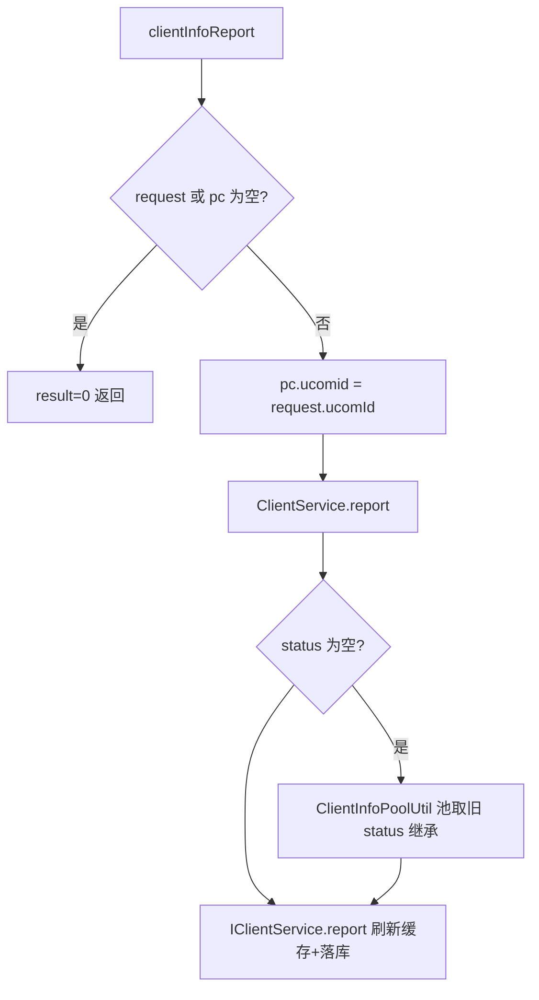

# ClientController（UcomDevice-PC 客户端上报）

- 源码：`real-controlcenter/src/main/java/cn/testin/mvc/controller/UcomDevice/ClientController.java`
- 职责：接收上位机上报的 PC 桌面客户端（Client）配置信息。
- 基础路径 `/v3/UcomDeivce/clientInfo`

## 接口一览

| # | 方法 | 路径 | 说明 |
|---|------|------|------|
| 1 | POST | /v3/UcomDeivce/clientInfo/report | PC 客户端信息上报 |

---

### PC 客户端信息上报 (`POST /v3/UcomDeivce/clientInfo/report`)

- **实现意图**：上位机上报 PC 桌面客户端的硬件/系统配置，写入 ClientInfo 池与库；status 缺省时从缓存池继承旧状态（无状态上报容错）。
- **请求参数**（`ClientInfoRequestDTO extends BaseRequestDTO`）：

| 参数名 | 类型 | 必填 | 说明 |
|--------|------|------|------|
| ucomId | String | 是 | 上位机账号 |
| pc | ClientInfoPojo | 是 | 客户端信息（pcId/systemName/systemType/ip/cpuName/ram/status 等） |

- **返回参数**

| 字段 | 类型 | 说明 |
| --- | --- | --- |
| code | int | 状态码，0 成功 |
| msg | String | 提示信息 |
| data | Object | 返回数据对象 |
| data.result | Integer | 1 成功 / 0 失败（请求体或 pc 为空时返回 0） |
- **处理流程**：



- **调用链**：无外部服务。
- **涉及表与 SQL**：`client_info`（INSERT/UPDATE；IClientService.report）、ClientInfoPool（内存池）。
- **异常与校验**：空请求不抛异常，result=0。
- **关键代码摘录**：

```java
// mvc/controller/UcomDevice/ClientController.java
request.getPc().setUcomid(request.getUcomId());
boolean result = clientService.report(request.getPc());
dataMap.put("result", result ? 1 : 0);
```
