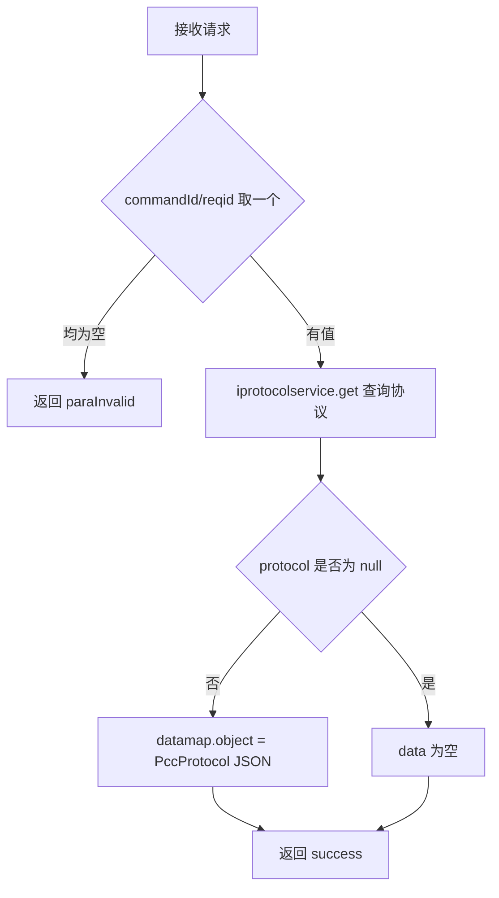

# Command

- **类全名**：`cn.testin.service.control.Command`
- **源码路径**：`real-controlcenter/src/main/java/cn/testin/service/control/Command.java`
- **职责**：设备命令回应查询。控制中心通过 `IProtocolService` 向上位机下发命令时生成 reqid，本类提供按 reqid 查询命令执行回报（PccProtocol）的入口。

## op 一览表

| op | 方法 | 职责 |
| --- | --- | --- |
| response | `Command.response` | 按 reqid/commandId 查询命令协议回报 |

---

### response (`Command.response`)

- **入口**：ApiServlet，action=control，op=Command.response
- **实现意图**：上位机/其他服务执行完控制中心下发的命令后，回报内容写入协议记录；调用方通过本接口按命令标示（reqid）轮询取回完整协议对象（含 resContent）。

**请求参数**

| 参数 | 类型 | 必填 | 说明 |
| --- | --- | --- | --- |
| commandId | String | 二选一 | 命令标示（优先取） |
| reqid | String | 二选一 | 命令标示（commandId 为空时取） |

**返回参数**

| 字段 | 类型 | 说明 |
| --- | --- | --- |
| code | Integer | 状态码，0 成功 |
| msg | String | 提示信息 |
| data | Object | 返回数据对象（协议不存在时为空 map） |
| data.objInfo | Object | `PccProtocol.toJson(protocol)` 协议对象 JSON（RES_OBJECT） |

**处理流程**



**调用链**：`IProtocolService.get(reqid)`（本模块协议报文服务，底层为 Redis/DB 协议记录）。无外部服务调用。

**涉及表与 SQL**：协议报文（pcc_protocol，经 IProtocolService 读写），select by reqid。

**异常与校验**
- reqid/commandId 均为空 → `CommonCode.paraInvalid`。

**关键代码摘录**

```java
// real-controlcenter/src/main/java/cn/testin/service/control/Command.java
if (!reqjson.isNull("commandId")) {
    reqid = reqjson.optString("commandId");
} else if (!reqjson.isNull("reqid")) {
    reqid = reqjson.optString("reqid");
}
if (StringUtils.isBlank(reqid)) {
    return ApiUtil.getResult(apirequest, CommonCode.paraInvalid.getValue(), msg);
}
PccProtocol protocol = iprotocolservice.get(reqid);
if (protocol != null) {
    datamap.put(ApiResponse.RES_OBJECT, PccProtocol.toJson(protocol));
}
```
