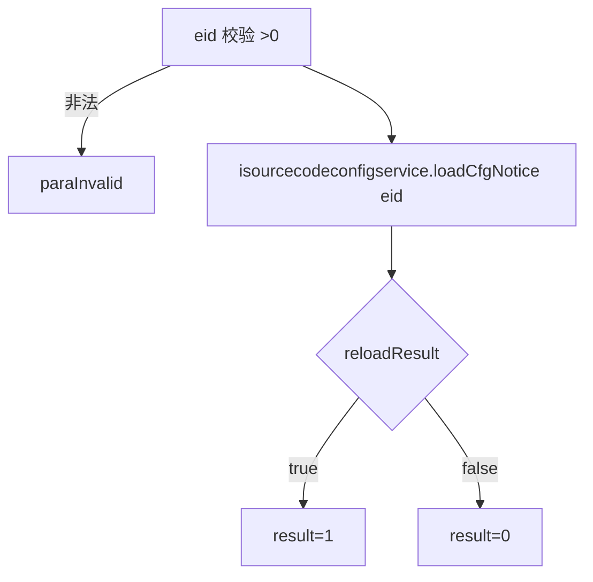

# SourcecodeConfig

- **类全名**：`cn.testin.service.control.SourcecodeConfig`
- **源码路径**：`real-controlcenter/src/main/java/cn/testin/service/control/SourcecodeConfig.java`
- **职责**：源码（脚本源码）配置的热加载通知。

## op 一览表

| op | 方法 | 职责 |
| --- | --- | --- |
| reloadCfg | `SourcecodeConfig.reloadCfg` | 触发企业源码配置重新加载 |

---

### reloadCfg (`SourcecodeConfig.reloadCfg`)

- **入口**：ApiServlet，action=control，op=SourcecodeConfig.reloadCfg
- **实现意图**：按企业 ID 触发源码配置重新加载通知（`ISourcecodeConfigService.loadCfgNotice`），使上位机/执行端拉取最新源码配置。

**请求参数**

| 参数 | 类型 | 必填 | 说明 |
| --- | --- | --- | --- |
| eid | Integer | 是 | 企业 ID（>0） |

**返回参数**

| 字段 | 类型 | 说明 |
| --- | --- | --- |
| code | Integer | 状态码，0 成功 |
| msg | String | 提示信息 |
| data | Object | 返回数据对象 |
| data.result | Integer | 1=加载通知成功，0=失败 |

**处理流程**



**调用链**：`ISourcecodeConfigService.loadCfgNotice`（业务层，源码配置相关，可能联动 [script-service](../../../脚本服务/00-首页.md)）。
**涉及表与 SQL**：源码配置表（由 ISourcecodeConfigService 实现层读写）。
**异常与校验**：eid<=0 → paraInvalid。

**关键代码摘录**

```java
// real-controlcenter/.../service/control/SourcecodeConfig.java
int eid = reqjson.optInt("eid");
if (eid <= 0) { return ApiUtil.getResult(apirequest, CommonCode.paraInvalid.getValue(), msg); }
boolean reloadResult = this.isourcecodeconfigservice.loadCfgNotice(eid);
datamap.put(ApiResponse.RES_RESULT, reloadResult ? 1 : 0);
```
