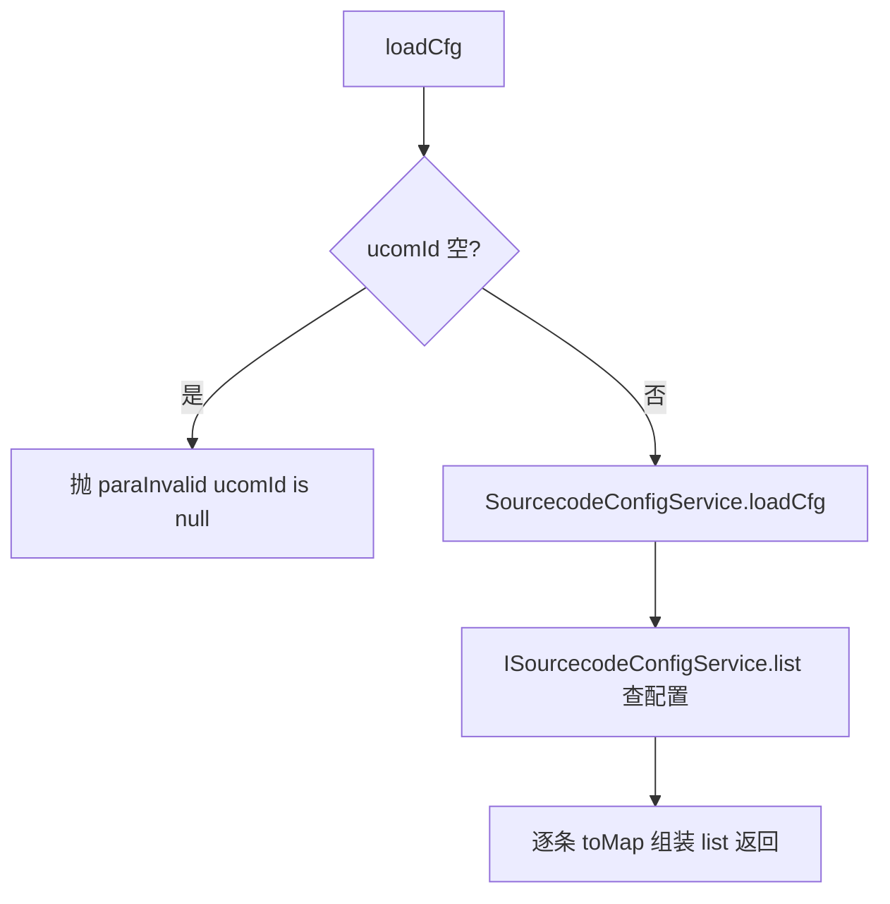

# SourcecodeConfigController（UcomDevice-源码配置）

- 源码：`real-controlcenter/src/main/java/cn/testin/mvc/controller/UcomDevice/SourcecodeConfigController.java`
- 职责：上位机拉取源码（Sourcecode）配置清单。
- 基础路径 `/v3/UcomDeivce/sourcecodeConfig`

## 接口一览

| # | 方法 | 路径 | 说明 |
|---|------|------|------|
| 1 | GET | /v3/UcomDeivce/sourcecodeConfig/loadCfg | 加载源码配置 |

---

### 加载源码配置 (`GET /v3/UcomDeivce/sourcecodeConfig/loadCfg`)

- **实现意图**：上位机启动/刷新时按 ucomId 拉取源码配置列表（源码仓库/分支等 realcfg 配置）。
- **请求参数**：

| 参数名 | 类型 | 必填 | 说明 |
|--------|------|------|------|
| ucomId | String | 是 | 上位机账号，空抛 paraInvalid |

- **返回参数**

| 字段 | 类型 | 说明 |
| --- | --- | --- |
| code | int | 状态码，0 成功 |
| msg | String | 提示信息 |
| data | Object | 返回数据对象 |
| data.list | JSONArray&lt;Map&gt; | 源码配置列表（RealcfgSourcecodeConfig.toMap 数组） |
- **处理流程**：



- **调用链**：[平台配置](../../../平台配置（real-cfg）/07-开放接口文档/00-模块索引.md)（RealcfgSourcecodeConfig 配置数据源自 realcfg 体系）。
- **涉及表与 SQL**：源码配置表（ISourcecodeConfigService.list）。
- **异常与校验**：ucomId 空抛 `paraInvalid`。
- **关键代码摘录**：

```java
// mvc/service/SourcecodeConfigService.java
List<RealcfgSourcecodeConfig> list = this.isourcecodeconfigservice.list(ucomid);
List<Object> cfgJSONArray = new ArrayList<>();
for (RealcfgSourcecodeConfig sourcecodeConfig : list) {
    if (sourcecodeConfig != null) { cfgJSONArray.add(sourcecodeConfig.toMap()); }
}
datamap.put("list", cfgJSONArray);
```
