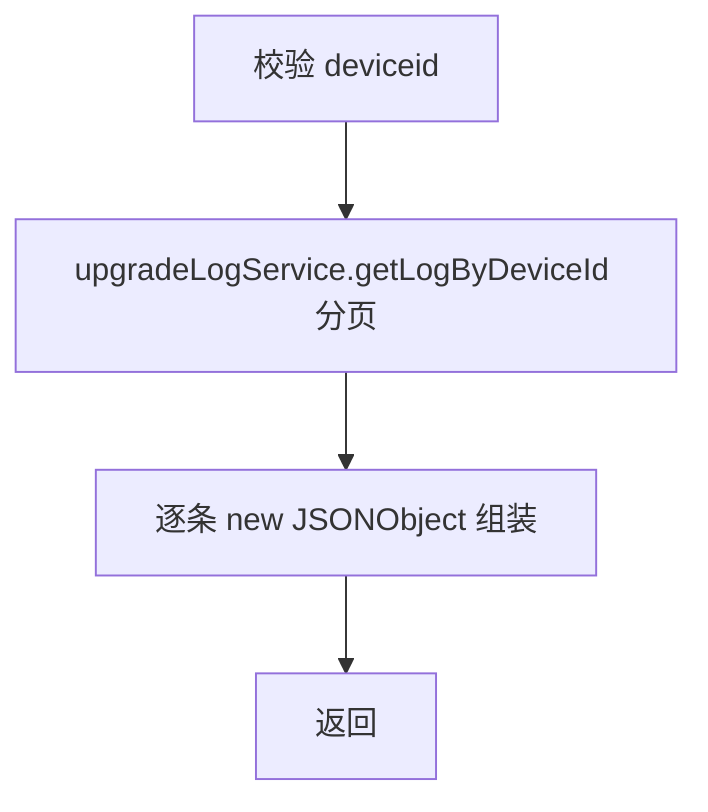
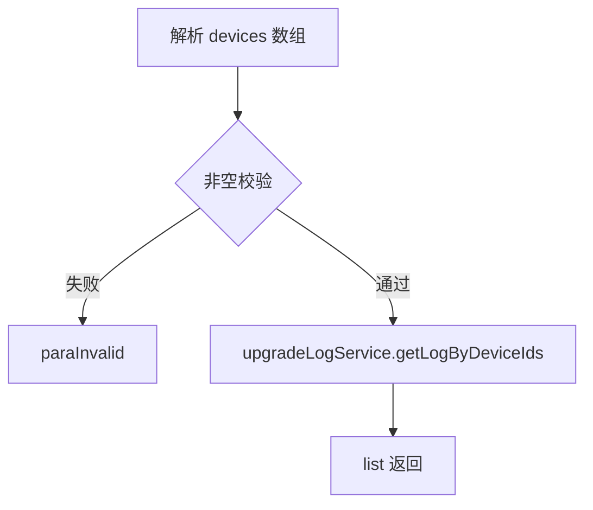

# UpgradeLog（device 包）

## 职责
设备升级日志查询：单台设备分页查询、多设备批量查询最新升级记录。

- 源码：`real-controlcenter/src/main/java/cn/testin/service/device/UpgradeLog.java`
- 基类：`GenericBaseService`（注入 upgradeLogService）

## op 一览表

| op | 说明 |
|---|---|
| getUpgradeLogList | 单设备升级日志分页 |
| getUpgradeLogs | 多设备升级日志批量查询 |

---

### getUpgradeLogList (`UpgradeLog.getUpgradeLogList`)
- **入口**：ApiServlet，action/op（action=upgradeLog，op=UpgradeLog.getUpgradeLogList）
- **实现意图**：分页查询某台设备的升级历史日志。
- **请求参数**：

| 参数 | 类型 | 必填 | 说明 |
|---|---|---|---|
| deviceid | String | 是 | 设备 ID |
| page / pageSize | int | 否 | 分页参数（service 层未做强校验） |

- **返回参数**

| 字段 | 类型 | 说明 |
| --- | --- | --- |
| code | Integer | 状态码，0 成功 |
| msg | String | 提示信息 |
| data | Object | 返回数据对象 |
| data.page | Integer | 当前页 |
| data.pageSize | Integer | 每页条数 |
| data.totalRow | Integer | 总记录数 |
| data.totalPage | Integer | 总页数 |
| data.list | JSONArray&lt;DeviceUpgradeLog&gt; | 设备升级日志列表 |
- **处理流程**：

- **涉及表与 SQL**：`device_upgrade_log`（按 deviceid 分页）。
- **异常与校验**：deviceid 空 → paraInvalid；查询 null → unknown。
- **关键代码摘录**：
```java
// real-controlcenter/src/main/java/cn/testin/service/device/UpgradeLog.java
BaseList<DeviceUpgradeLog> upgradeLogBaseList = this.upgradeLogService.getLogByDeviceId(deviceid, page, pageSize);
for (DeviceUpgradeLog assetsLog : upgradeLogBaseList.getList()) {
    jsonArray.put(new JSONObject(assetsLog));
}
```

### getUpgradeLogs (`UpgradeLog.getUpgradeLogs`)
- **入口**：ApiServlet，action/op（action=upgradeLog，op=UpgradeLog.getUpgradeLogs）
- **实现意图**：批量查询多台设备的升级日志（如每台最新一条，具体由业务层决定）。
- **请求参数**：devices（JSONArray&lt;String&gt;，必填，设备 ID 数组）。
- **返回参数**

| 字段 | 类型 | 说明 |
| --- | --- | --- |
| code | Integer | 状态码，0 成功 |
| msg | String | 提示信息 |
| data | Object | 返回数据对象 |
| data.list | JSONArray&lt;DeviceUpgradeLog&gt; | 设备升级日志列表 |
- **处理流程**：

- **涉及表与 SQL**：`device_upgrade_log`（IN 查询）。
- **异常与校验**：devices 空 → paraInvalid；结果空 → unknown。

---

## 依赖汇总
- 外部服务：无
- 主要表：device_upgrade_log
