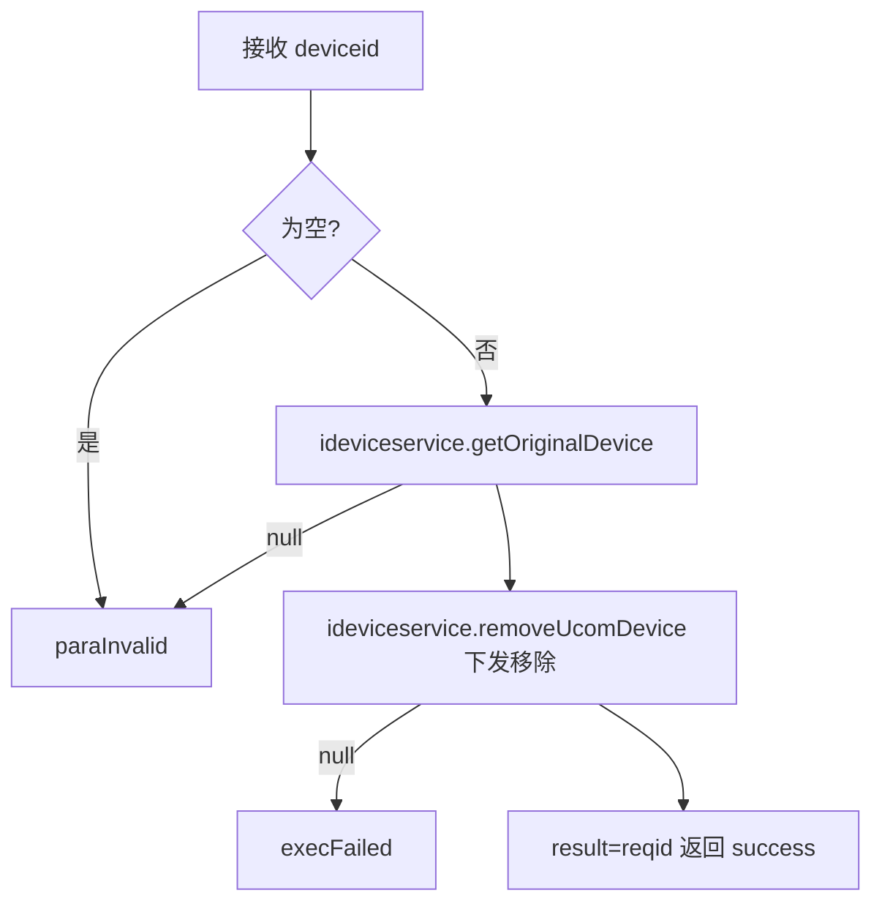
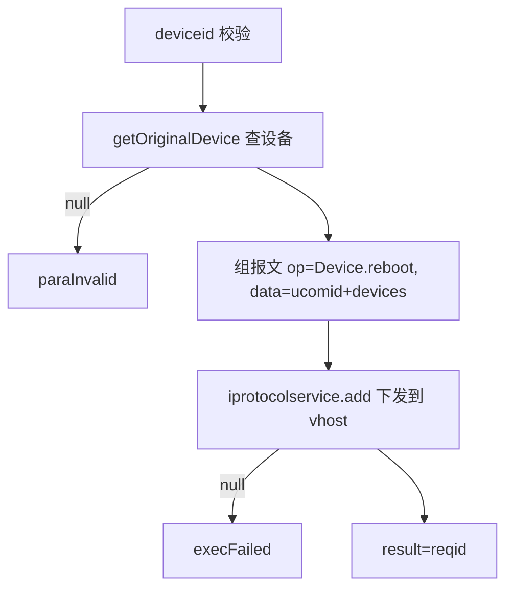
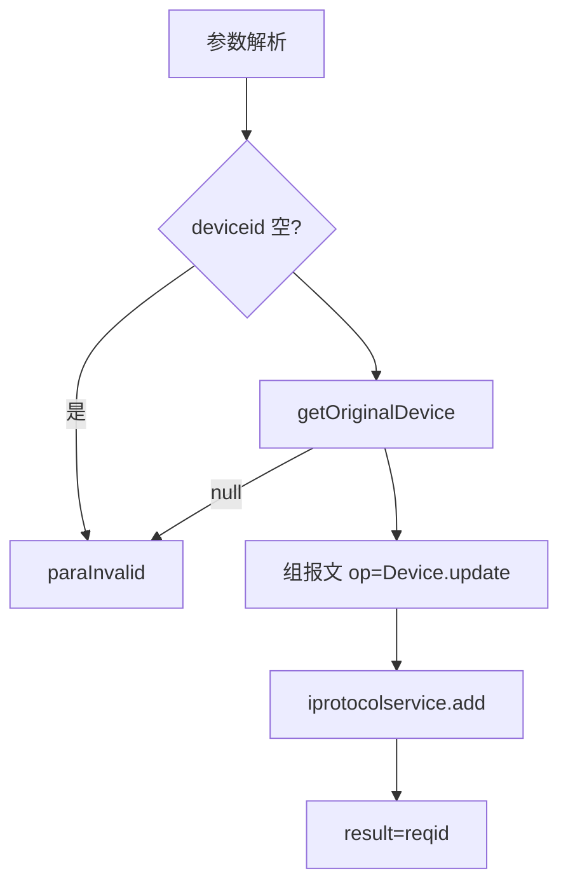
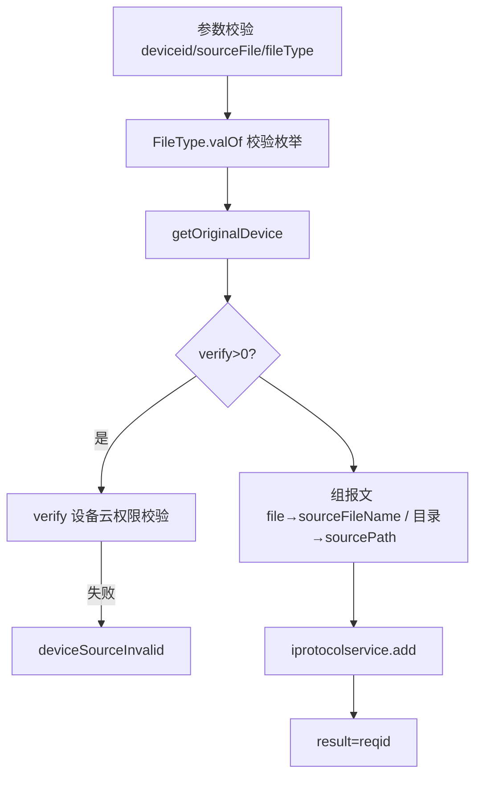
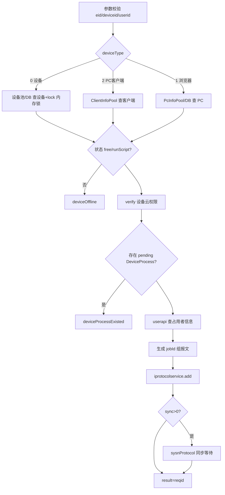
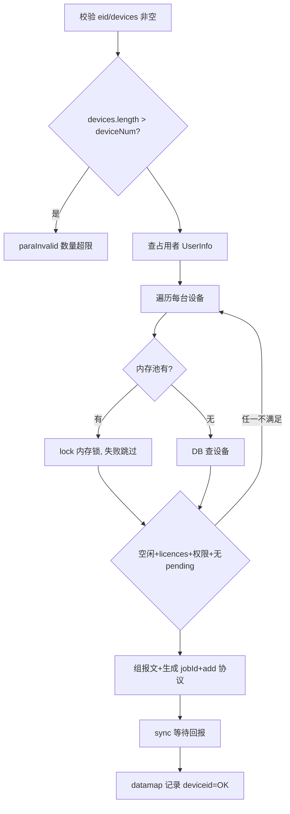
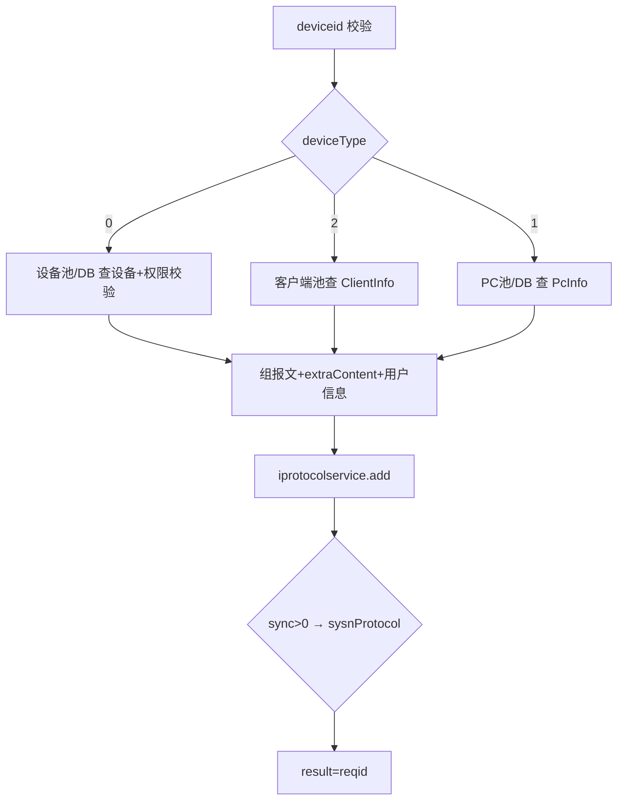
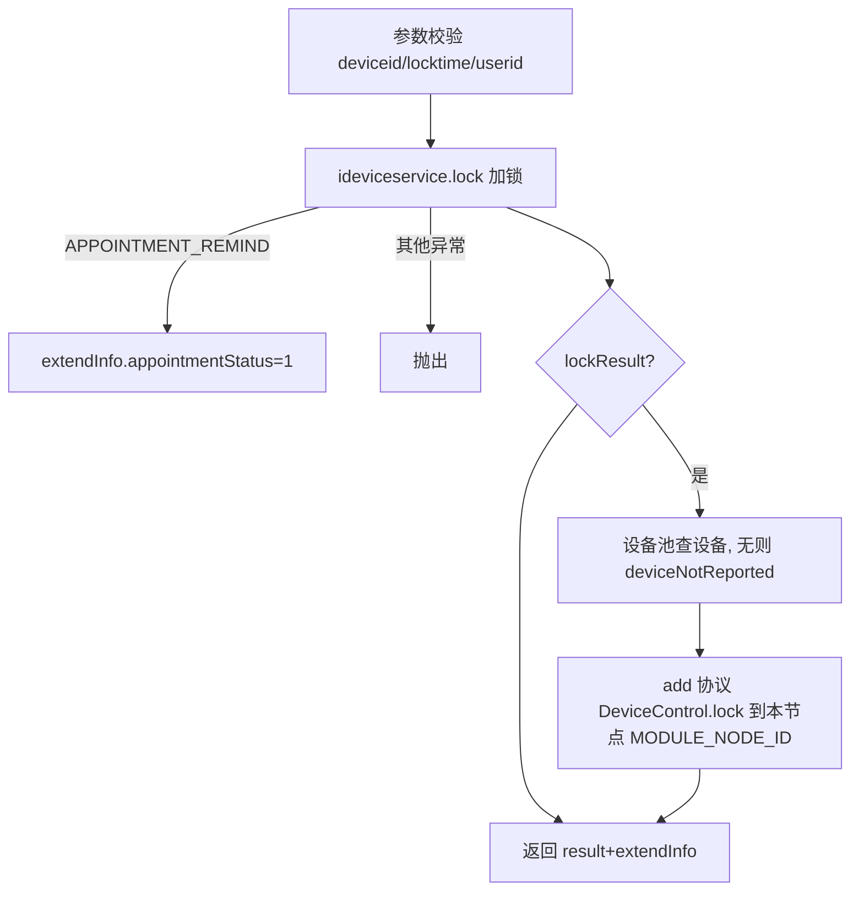
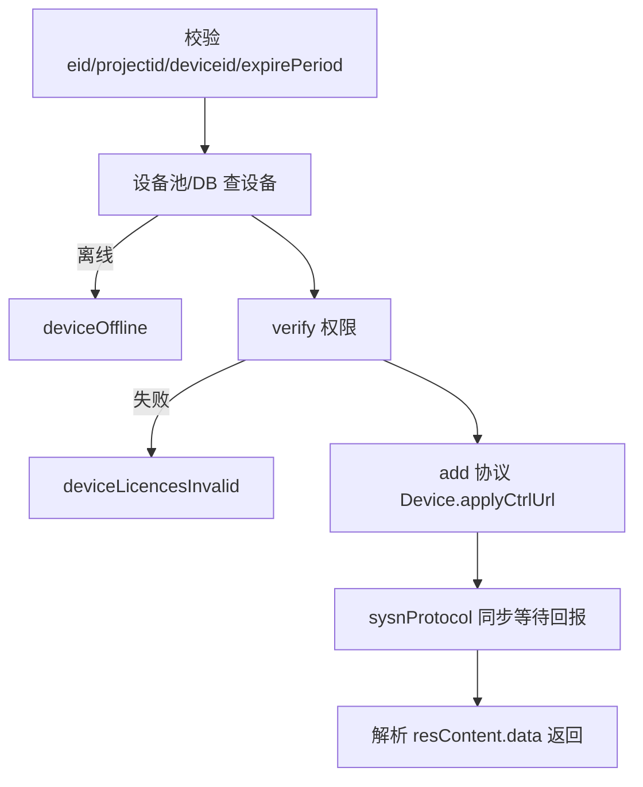
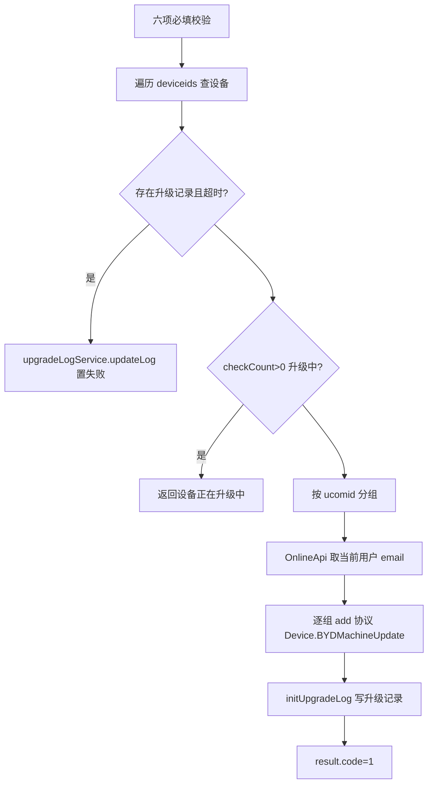

# Device-control

- **类全名**：`cn.testin.service.control.Device`
- **源码路径**：`real-controlcenter/src/main/java/cn/testin/service/control/Device.java`
- **同名说明**：与 `cn.testin.service.device.Device` 区分，本文档为 control 包（设备控制指令下发）。
- **职责**：真机设备控制指令中心。所有 op 的核心模式一致：校验参数与设备状态/权限 → 组装 JSON 报文 → `IProtocolService.add` 生成协议通知（reqid）下发到设备所属上位机（ucom）→ 可选 `sysnProtocol` 同步等待上位机回报 → 返回 reqid 或回报数据。

## op 一览表

| op | 方法 | 职责 |
| --- | --- | --- |
| remove | `Device.remove` | 从上位机移除设备 |
| reboot | `Device.reboot` | 重启设备 |
| update | `Device.update` | 更新设备机型名称/版本 |
| screencap | `Device.screencap` | 设备截图 |
| clean | `Device.clean` | 清理设备 |
| filetransfer | `Device.filetransfer` | 请求下载设备文件 |
| filedelete | `Device.filedelete` | 删除设备文件 |
| occupy | `Device.occupy` | 申请占用设备（单机） |
| occupyMultiDevice | `Device.occupyMultiDevice` | 批量申请占用设备 |
| release | `Device.release` | 释放设备占用 |
| lock | `Device.lock` | 锁定真机 |
| oprChannel | `Device.oprChannel` | 操控 USB 通道开/关 |
| applyCtrlUrl | `Device.applyCtrlUrl` | ADB 调试地址申请 |
| releaseCtrlUrl | `Device.releaseCtrlUrl` | ADB 调试地址释放 |
| machineUpgrade | `Device.machineUpgrade` | 车机 ROM 升级 |
| upgradeByJenkins | `Device.upgradeByJenkins`（@Deprecated） | 车机 Jenkins 集成升级 |
| comm | `Device.comm`（@Deprecated） | 串口通信 |
| commList | `Device.commList`（@Deprecated） | 串口列表 |
| shutdown | `Device.shutdown` | 设备关机 |

> 通用下发报文字段：`op`（上位机侧指令名）、`mkey="script"`、`type=ProtocolType.activity`、`status=pendingRequest`；响应 datamap 的 `result`(RES_RESULT) 通常为 `IProtocolService.add` 返回的 reqid。

---

### remove (`Device.remove`)

- **入口**：ApiServlet，action=control，op=Device.remove
- **实现意图**：通知设备所属上位机将该设备移除（下线上报）。

**请求参数**

| 参数 | 类型 | 必填 | 说明 |
| --- | --- | --- | --- |
| deviceid | String | 是 | 设备 ID |

**返回参数**

| 字段 | 类型 | 说明 |
| --- | --- | --- |
| code | Integer | 状态码，0 成功 |
| msg | String | 提示信息 |
| data | Object | 返回数据对象 |
| data.result | String | 协议 reqid（下发成功返回的请求 ID） |

**处理流程**



**调用链**：`IDeviceService.getOriginalDevice`、`IDeviceService.removeUcomDevice`（内部封装 IProtocolService 下发到上位机）。
**涉及表与 SQL**：`device_info`（select by deviceid，DAO：`IDeviceInfoDAO.get`）；视图 `view_device_info`。
**异常与校验**：deviceid 为空/设备不存在 → paraInvalid；下发失败 → execFailed。

**关键代码摘录**

```java
// real-controlcenter/.../service/control/Device.java
DeviceInfo dbdeviceinfo = ideviceservice.getOriginalDevice(deviceid);
if (dbdeviceinfo == null) { return ApiUtil.getResult(apirequest, CommonCode.paraInvalid.getValue(), msg); }
String result = ideviceservice.removeUcomDevice(dbdeviceinfo.getVhost(), dbdeviceinfo.getUcomid(), deviceid);
```

---

### reboot (`Device.reboot`)

- **入口**：ApiServlet，action=control，op=Device.reboot
- **实现意图**：向设备所属上位机下发 `Device.reboot` 指令，重启指定设备。

**请求参数**

| 参数 | 类型 | 必填 | 说明 |
| --- | --- | --- | --- |
| deviceid | String | 是 | 设备 ID |

**返回参数**

| 字段 | 类型 | 说明 |
| --- | --- | --- |
| code | Integer | 状态码，0 成功 |
| msg | String | 提示信息 |
| data | Object | 返回数据对象 |
| data.result | String | 协议 reqid（下发成功返回的请求 ID） |

**处理流程**



**调用链**：`IDeviceService.getOriginalDevice` → `IProtocolService.add`（上位机执行重启）。
**涉及表与 SQL**：`device_info`（select）；协议报文 insert。
**异常与校验**：deviceid 空/设备不存在 → paraInvalid；add 返回 null → execFailed。

**关键代码摘录**

```java
jsonContent.put("op", "Device.reboot");
data.put("ucomid", dbdeviceinfo.getUcomid());
JSONArray devices = new JSONArray(); devices.put(deviceid);
data.put("devices", devices);
String result = iprotocolservice.add(dbdeviceinfo.getVhost(), type, sessionKey, reqid, mkey, op, content, status, null, null);
```

---

### update (`Device.update`)

- **入口**：ApiServlet，action=control，op=Device.update
- **实现意图**：下发 `Device.update` 指令，更新设备的真实机型名称与版本（realModelName/realReleaseVer）。

**请求参数**

| 参数 | 类型 | 必填 | 说明 |
| --- | --- | --- | --- |
| deviceid | String | 是 | 设备 ID |
| modelName | String | 否 | 机型名称 |
| releaseVer | String | 否 | 机型版本 |

**返回参数**

| 字段 | 类型 | 说明 |
| --- | --- | --- |
| code | Integer | 状态码，0 成功 |
| msg | String | 提示信息 |
| data | Object | 返回数据对象 |
| data.result | String | 协议 reqid（下发成功返回的请求 ID） |

**处理流程**



**调用链**：`IDeviceService.getOriginalDevice` → `IProtocolService.add`。
**涉及表与 SQL**：`device_info`（select；实际更新由上位机回报后落库）。
**异常与校验**：deviceid 空/设备不存在 → paraInvalid。

**关键代码摘录**

```java
data.put("deviceid", deviceid);
data.put("realModelName", modelName);
data.put("realReleaseVer", releaseVer);
```

---

### screencap (`Device.screencap`)

- **入口**：ApiServlet，action=control，op=Device.screencap
- **实现意图**：下发 `Device.screencap` 指令，要求上位机对设备截屏（异步，截图结果经协议回报/文件服务流转）。

**请求参数**

| 参数 | 类型 | 必填 | 说明 |
| --- | --- | --- | --- |
| deviceid | String | 是 | 设备 ID |

**返回参数**

| 字段 | 类型 | 说明 |
| --- | --- | --- |
| code | Integer | 状态码，0 成功 |
| msg | String | 提示信息 |
| data | Object | 返回数据对象 |
| data.result | String | 协议 reqid（下发成功返回的请求 ID） |
**处理流程**：与 reboot 相同（校验 → 查设备 → add 协议 → 返回 reqid）。
**调用链**：`IDeviceService.getOriginalDevice` → `IProtocolService.add`；截图文件后续经 [file-service](../../../文件管理服务/00-首页.md) 流转。
**涉及表与 SQL**：`device_info`（select）。
**异常与校验**：deviceid 空/设备不存在 → paraInvalid；add 失败 → execFailed。

---

### clean (`Device.clean`)

- **入口**：ApiServlet，action=control，op=Device.clean
- **实现意图**：下发 `Device.clean` 指令，清理设备环境（卸载残留应用、清理数据等）。

**请求参数**

| 参数 | 类型 | 必填 | 说明 |
| --- | --- | --- | --- |
| deviceid | String | 是 | 设备 ID |

**返回参数**

| 字段 | 类型 | 说明 |
| --- | --- | --- |
| code | Integer | 状态码，0 成功 |
| msg | String | 提示信息 |
| data | Object | 返回数据对象 |
| data.result | String | 协议 reqid（下发成功返回的请求 ID） |
**处理流程**：校验 → 查设备 → add（op=Device.clean，data.deviceid）→ 返回 reqid。
**调用链**：`IDeviceService.getOriginalDevice` → `IProtocolService.add`。
**涉及表与 SQL**：`device_info`（select）。
**异常与校验**：同 screencap。

---

### filetransfer (`Device.filetransfer`)

- **入口**：ApiServlet，action=control，op=Device.filetransfer
- **实现意图**：请求从设备上拉取文件/目录（fileType=file 传 sourceFileName，目录传 sourcePath），可做设备云权限校验。

**请求参数**

| 参数 | 类型 | 必填 | 说明 |
| --- | --- | --- | --- |
| deviceid | String | 是 | 设备 ID |
| sourceFile | String | 是 | 待下载文件/目录路径 |
| fileType | String | 是 | 文件类型，`FileType` 枚举（file 文件 / 目录） |
| verify | Integer | 否 | >0 时做设备云权限校验 |
| eid | Integer | verify 时需要 | 企业 ID |
| projectid | Integer | verify 时需要 | 项目组 ID |

**返回参数**

| 字段 | 类型 | 说明 |
| --- | --- | --- |
| code | Integer | 状态码，0 成功 |
| msg | String | 提示信息 |
| data | Object | 返回数据对象 |
| data.result | String | 协议 reqid（下发成功返回的请求 ID） |

**处理流程**



**调用链**：`IDeviceService.getOriginalDevice` → `GenericBaseService.verify`（内部 平台配置 `ProjectGroupApi.my`）→ `IProtocolService.add`；文件内容经 [file-service](../../../文件管理服务/00-首页.md) 回传。
**涉及表与 SQL**：`device_info`（select）。
**异常与校验**：三项必填为空/fileType 非法 → paraInvalid；权限不足 → deviceSourceInvalid；add 失败 → unknown。

**关键代码摘录**

```java
FileType file = FileType.valOf(fileType);
if (file.getValue().equals(FileType.file.getValue())) {
    data.put("sourceFileName", sourceFile);
} else {
    data.put("sourcePath", sourceFile);
}
```

---

### filedelete (`Device.filedelete`)

- **入口**：ApiServlet，action=control，op=Device.filedelete
- **实现意图**：下发 `Device.filedelete` 指令删除设备上的文件/目录（sourcePath）。

**请求参数**

| 参数 | 类型 | 必填 | 说明 |
| --- | --- | --- | --- |
| deviceid | String | 是 | 设备 ID |
| sourceFile | String | 是 | 待删除路径 |
| verify | Integer | 否 | >0 时做设备云权限校验 |
| eid / projectid | Integer | verify 时需要 | 企业/项目组 |

**返回参数**

| 字段 | 类型 | 说明 |
| --- | --- | --- |
| code | Integer | 状态码，0 成功 |
| msg | String | 提示信息 |
| data | Object | 返回数据对象 |
| data.result | String | 协议 reqid（下发成功返回的请求 ID） |
**处理流程**：同 filetransfer（报文 data 固定传 sourcePath）。
**调用链**：`IDeviceService.getOriginalDevice` → verify（平台配置）→ `IProtocolService.add`。
**涉及表与 SQL**：`device_info`（select）。
**异常与校验**：deviceid/sourceFile 空 → paraInvalid；权限不足 → deviceSourceInvalid。

---

### occupy (`Device.occupy`)

- **入口**：ApiServlet，action=control，op=Device.occupy
- **实现意图**：申请占用一台设备（或浏览器/PC 客户端）。校验设备在线、设备云权限、无 pending 占用记录后，生成 jobId（MD5），下发 `Device.occupy` 占用通知，可按 sync 同步等待上位机确认。

**请求参数**

| 参数 | 类型 | 必填 | 说明 |
| --- | --- | --- | --- |
| eid | Integer | 是 | 企业 ID |
| projectid | Integer | 否 | 项目组 ID（默认 0） |
| deviceid | String | 是 | 设备 ID（deviceType=0/1 时） |
| deviceType | Integer | 否 | 0=设备(默认) 1=浏览器(WEB) 2=PC客户端 |
| ucomid | String | deviceType=2 时使用 | PC 客户端上位机账号 |
| deviceAction | Integer | 否 | 占用动作枚举，默认 thirdParty |
| timeout | Long | 否 | 占用超时时间 |
| userid | Integer | 是* | 用户 ID（与 debugOwner 二选一） |
| debugOwner | String | 否 | 占用者邮箱，优先于 userid |
| markName1 / markName2 | String | 否 | 占用标记 |
| sync | Integer | 否 | >0 同步等待上位机回报 |
| ip/osName/type/version | String | deviceType=1 时 | 浏览器环境信息 |

**返回参数**

| 字段 | 类型 | 说明 |
| --- | --- | --- |
| code | Integer | 状态码，0 成功 |
| msg | String | 提示信息 |
| data | Object | 返回数据对象 |
| data.result | String | 协议 reqid（下发成功返回的请求 ID） |

**处理流程**



**调用链**：`DevicePoolUtil`/`ClientInfoPoolUtil`/`PcInfoPoolUtil`（内存池）→ `IDeviceService.lock/getOriginalDevice`、`IDeviceProcessService.getByPending` → `UserApi.getByEmail/getByUserid`（[user-manager](../../../平台基础功能服务/00-首页.md)）→ `IProtocolService.add` → 上位机。
**涉及表与 SQL**：`device_info` / `pc_info` / `client_info`（select）；`device_process`（select by pending，DAO：`IDeviceProcessDAO`）；占用记录由上位机回报后写入 `device_process`。
**异常与校验**：eid/deviceid/userid 非法 → paraInvalid；设备离线 → deviceOffline；内存锁失败 → deviceInService；无权限 → deviceLicencesInvalid；已有占用 → deviceProcessExisted。

**关键代码摘录**

```java
DeviceProcess dbprocess = this.ideviceprocessservice.getByPending(deviceid);
if (dbprocess != null) {
    throw new GeneralException(ControlCenterCode.deviceProcessExisted.getValue(), msg);
}
// jobId = MD5(type + sessionKey + deviceid + currentTimeMillis)
data.put("jobId", md5.getMD5ofStr(sb.toString()));
String result = iprotocolservice.add(vhost, type, sessionKey, reqid, mkey, op, content, status, null, null);
if (sync > 0) { sysnProtocol(result, content); }
```

---

### occupyMultiDevice (`Device.occupyMultiDevice`)

- **入口**：ApiServlet，action=control，op=Device.occupyMultiDevice
- **实现意图**：一次申请占用多台真机。逐台校验（在线、空闲、licences、权限、无 pending），合格的设备逐台下发占用通知；不合格设备静默跳过。默认 sync=1 同步等待每台回报。

**请求参数**

| 参数 | 类型 | 必填 | 说明 |
| --- | --- | --- | --- |
| eid | Integer | 是 | 企业 ID |
| projectid | Integer | 否 | 项目组 ID |
| devices | JSONArray | 是 | `[{"deviceid":"..."}]` 设备数组 |
| deviceNum | Integer | 否 | 单用户最大占用数（默认 5），超过则拒绝 |
| deviceAction / timeout / userid / debugOwner / markName1 / markName2 / sync | - | 否 | 同 occupy |

**返回参数**

| 字段 | 类型 | 说明 |
| --- | --- | --- |
| code | Integer | 状态码，0 成功 |
| msg | String | 提示信息 |
| data | Object | 返回数据对象，key 为 deviceid，value 为 "OK"（逐项占用成功） |

**处理流程**



**调用链**：同 occupy（内存池 + `IDeviceService.lock` + `IDeviceProcessService.getByPending` + [user-manager](../../../平台基础功能服务/00-首页.md) + `IProtocolService.add`）。
**涉及表与 SQL**：`device_info`、`device_process`（select）。
**异常与校验**：eid/devices 空、数量超限 → paraInvalid；单台失败跳过不报错；add 返回 null → unknown。

---

### release (`Device.release`)

- **入口**：ApiServlet，action=control，op=Device.release
- **实现意图**：释放设备占用（异步消息为主）。按 deviceType 分别从设备池/客户端池/PC 池取上位机路由（vhost、ucomid），补充用户信息后下发 `Device.release`。

**请求参数**

| 参数 | 类型 | 必填 | 说明 |
| --- | --- | --- | --- |
| deviceid | String | 是 | 设备 ID |
| eid / projectid | Integer | 否 | 权限校验用 |
| sync | Integer | 否 | >0 同步等待 |
| deviceAction | Integer | 否 | 释放动作，默认 thirdParty |
| deviceType | Integer | 否 | 0=设备(默认) 1=浏览器 2=PC客户端 |
| extraContent | JSONObject | 否 | 浏览器端附加信息（userName/userEmail/type/version/osname） |
| ucomid | String | deviceType=2 时 | PC 客户端上位机账号 |
| userId | Integer | 否 | 用户 ID，用于补充 userName/userEmail |

**返回参数**

| 字段 | 类型 | 说明 |
| --- | --- | --- |
| code | Integer | 状态码，0 成功 |
| msg | String | 提示信息 |
| data | Object | 返回数据对象 |
| data.result | String | 协议 reqid（下发成功返回的请求 ID） |

**处理流程**



**调用链**：内存池 → `IDeviceService`/`IPcService` → `UserApi.getByUserid`（[user-manager](../../../平台基础功能服务/00-首页.md)）→ `IProtocolService.add`。
**涉及表与 SQL**：`device_info` / `pc_info` / `client_info`（select）。
**异常与校验**：deviceid 空 → paraInvalid；设备离线 → deviceOffline；无权限 → deviceLicencesInvalid。

---

### lock (`Device.lock`)

- **入口**：ApiServlet，action=control，op=Device.lock
- **实现意图**：锁定真机供使用人独占（如远程调试）。先调 `IDeviceService.lock` 加锁（可能返回预约提醒 APPOINTMENT_REMIND，转为 extendInfo 返回而不报错），锁定成功后下发 `DeviceControl.lock` 通知上位机。

**请求参数**

| 参数 | 类型 | 必填 | 说明 |
| --- | --- | --- | --- |
| deviceid | String | 是 | 设备 ID |
| userid | Integer | 是 | 使用人 ID |
| locktime | Integer | 是 | 锁定时长（>0） |
| projectid | Integer | 否 | 项目组 ID |
| eid | Integer | 否 | 企业 ID（优先取 onlineUserInfo.eid） |

**返回参数**

| 字段 | 类型 | 说明 |
| --- | --- | --- |
| code | Integer | 状态码，0 成功 |
| msg | String | 提示信息 |
| data | Object | 返回数据对象 |
| data.result | Boolean | lockResult，是否锁定成功 |
| data.extendInfo | Object | 可选，命中预约提醒时返回，含 `appointmentStatus`=1 |

**处理流程**



**调用链**：`IDeviceService.lock`（内部，含预约检查）→ `DevicePoolUtil` → `IProtocolService.add`。
**涉及表与 SQL**：`device_info`（select/update 锁字段）；预约检查关联 `device_appointment`。
**异常与校验**：deviceid/locktime/userid 非法 → paraInvalid；设备未上报 → deviceNotReported；预约提醒不阻断，以 extendInfo 返回。

**关键代码摘录**

```java
try {
    lockResult = this.ideviceservice.lock(eid, projectid, deviceid, userid, locktime, true);
} catch (GeneralException ge) {
    if (ControlCenterCode.APPOINTMENT_REMIND.getValue().equals(ge.getCode())) {
        extendInfoJson = new JSONObject();
        extendInfoJson.put("appointmentStatus", 1);
    } else { throw ge; }
}
```

---

### oprChannel (`Device.oprChannel`)

- **入口**：ApiServlet，action=control，op=Device.oprChannel
- **实现意图**：批量开/关上位机的 USB 通道（channelStatus>0 → Channel.open，否则 Channel.close）。

**请求参数**

| 参数 | 类型 | 必填 | 说明 |
| --- | --- | --- | --- |
| ucomid | String | 是 | 上位机账号 |
| channelStatus | Integer | 是 | >0 打开，否则关闭 |
| devices | JSONArray | 否 | 设备数组，缺省为空数组 |

**返回参数**

| 字段 | 类型 | 说明 |
| --- | --- | --- |
| code | Integer | 状态码，0 成功 |
| msg | String | 提示信息 |
| data | Object | 返回数据对象 |
| data.result | String | 协议 reqid（下发成功返回的请求 ID） |
**处理流程**：校验 → `IPcAccountService.get` 查上位机在线（signvhost）→ 组报文（op=Channel.open/close）→ add → 返回 reqid。
**调用链**：`IPcAccountService.get` → `IProtocolService.add`。
**涉及表与 SQL**：上位机账号表（realcfg pc_account，select）。
**异常与校验**：ucomid/channelStatus 空、devices 非数组、上位机离线 → paraInvalid；add 失败 → execFailed。

---

### applyCtrlUrl (`Device.applyCtrlUrl`)

- **入口**：ApiServlet，action=control，op=Device.applyCtrlUrl
- **实现意图**：ADB 远程调试地址申请。校验设备在线与权限后下发 `Device.applyCtrlUrl` 并**同步等待**上位机返回调试连接信息，将回报 data 原样返回。

**请求参数**

| 参数 | 类型 | 必填 | 说明 |
| --- | --- | --- | --- |
| eid | Integer | 是 | 企业 ID |
| projectid | Integer | 是 | 项目组 ID |
| deviceid | String | 是 | 设备 ID |
| expirePeriod | Long | 是 | 占用时长（ms） |

**返回参数**

| 字段 | 类型 | 说明 |
| --- | --- | --- |
| code | Integer | 状态码，0 成功 |
| msg | String | 提示信息 |
| data | Object | 返回数据对象 |
| data.result | Object | 上位机回报报文中的 data 节点（含 ADB 连接 URL 等调试信息） |

**处理流程**



**调用链**：`DevicePoolUtil`/`IDeviceService` → verify（平台配置 ProjectGroupApi）→ `IProtocolService.add/get` → 上位机同步回报。
**涉及表与 SQL**：`device_info`（select）。
**异常与校验**：四项必填非法 → paraInvalid；离线 → deviceOffline；无权限 → deviceLicencesInvalid；上位机 code>0 → 透传错误码。

---

### releaseCtrlUrl (`Device.releaseCtrlUrl`)

- **入口**：ApiServlet，action=control，op=Device.releaseCtrlUrl
- **实现意图**：释放 ADB 调试地址。下发 `Device.releaseCtrlUrl` 并同步等待（等待异常仅记日志不中断），按上位机回报 code 决定最终响应码。

**请求参数**

| 参数 | 类型 | 必填 | 说明 |
| --- | --- | --- | --- |
| eid | Integer | 是 | 企业 ID |
| projectid | Integer | 是 | 项目组 ID |
| deviceid | String | 是 | 设备 ID |

**返回参数**

| 字段 | 类型 | 说明 |
| --- | --- | --- |
| code | Integer | 状态码，上位机回报 0 成功，非 0 透传 |
| msg | String | 提示信息（非 0 时透传上位机回报 msg） |
| data | Object | 空对象（{}） |
**处理流程**：校验 → 查设备+权限 → add → sysnProtocol（异常吞掉记日志）→ 解析回报 code 返回。
**调用链**：同 applyCtrlUrl。
**涉及表与 SQL**：`device_info`（select）。
**异常与校验**：必填非法 → paraInvalid；离线返回 deviceOffline（不抛异常）；无权限 → deviceLicencesInvalid。

---

### machineUpgrade (`Device.machineUpgrade`)

- **入口**：ApiServlet，action=control，op=Device.machineUpgrade
- **实现意图**：车机 ROM 批量升级。逐台校验设备在线、清理超时升级记录、拒绝升级中设备；按上位机（ucomid）分组下发 `Device.BYDMachineUpdate` 升级指令（含 FTP ROM 地址与账号），并写入升级日志。

**请求参数**

| 参数 | 类型 | 必填 | 说明 |
| --- | --- | --- | --- |
| eid | Integer | 是 | 企业 ID |
| projectid | Integer | 是 | 项目组 ID |
| deviceids | JSONArray | 是 | 设备 ID 数组 |
| FTPUrl | String | 是 | FTP 格式 ROM 地址 |
| userName | String | 是 | FTP 用户名 |
| passWord | String | 是 | FTP 密码 |

**返回参数**

| 字段 | 类型 | 说明 |
| --- | --- | --- |
| code | Integer | 状态码，0 成功 |
| msg | String | 提示信息 |
| data | Object | 返回数据对象 |
| data.result | Object | 提交结果，`{"code": 1}` |

**处理流程**



**调用链**：`DevicePoolUtil`/`IDeviceService` → `DeviceUpgradeLogService` → `OnlineApi.getUserOnline`（[user-manager](../../../平台基础功能服务/00-首页.md)）→ `IProtocolService.add` → 上位机执行 ROM 升级。
**涉及表与 SQL**：`device_upgrade_log`（select by deviceid / update status / insert，DAO：`DeviceUpgradeLogService` → IUpgradeDAO）。
**异常与校验**：必填非法 → paraInvalid；设备离线 → deviceOffline；升级中 → deviceLicencesInvalid。

**关键代码摘录**

```java
List<DeviceUpgradeLog> upgradeLogList = upgradeLogService.getUpgradeByDeviceId(deviceid);
if (!CollectionUtils.isEmpty(upgradeLogList)) {
    DeviceUpgradeLog deviceUpgradeLog = upgradeLogList.get(0);
    Long timeOut = deviceUpgradeLog.getTimeConfig() != null ? deviceUpgradeLog.getTimeConfig() : 3600000L;
    if (System.currentTimeMillis() - deviceUpgradeLog.getCreatetime() > timeOut) {
        upgradeLogService.updateLog(deviceid, 2);
    }
}
int count = upgradeLogService.checkCount(deviceid);
if (count > 0) { return ApiUtil.getResult(apirequest, ..., "设备正在升级中..."); }
```

---

### upgradeByJenkins (`Device.upgradeByJenkins`) @Deprecated

- **入口**：ApiServlet，action=control，op=Device.upgradeByJenkins
- **实现意图**：Jenkins 流水线触发的车机升级（已废弃，功能同 machineUpgrade，但不校验 eid/projectid、不写用户 email，升级执行人固定为 "jenkins"）。

**请求参数**

| 参数 | 类型 | 必填 | 说明 |
| --- | --- | --- | --- |
| deviceids | JSONArray | 是 | 设备 ID 数组 |
| FTPUrl / userName / passWord | String | 是 | ROM FTP 地址与账号 |

**返回参数**

| 字段 | 类型 | 说明 |
| --- | --- | --- |
| code | Integer | 状态码，0 成功 |
| msg | String | 提示信息 |
| data | Object | 返回数据对象 |
| data.result | Object | 提交结果，`{"code": 1}` |
**处理流程**：同 machineUpgrade（去掉项目/用户维度，initUpgradeLog 执行人为 jenkins）。
**调用链**：`DeviceUpgradeLogService` → `IProtocolService.add` → 上位机。
**涉及表与 SQL**：`device_upgrade_log`（select/update/insert）。
**异常与校验**：四项必填为空 → paraInvalid；设备离线 → deviceOffline；升级中 → deviceLicencesInvalid。

---

### comm (`Device.comm`) @Deprecated

- **入口**：ApiServlet，action=control，op=Device.comm
- **实现意图**：通过上位机向设备串口发送数据（已废弃）。校验串口参数后下发 `serial.comm`，同步等待回报并透传 code/msg。

**请求参数**

| 参数 | 类型 | 必填 | 说明 |
| --- | --- | --- | --- |
| eid / projectid | Integer | 是 | 企业/项目组 |
| deviceid | String | 是 | 设备 ID |
| baudrate | Integer | 是 | 波特率 |
| dataBits | Integer | 否 | 数据位（5-8，注：代码中范围判断为且关系，实际不生效） |
| stopBits | Integer | 否 | 停止位（1-3，同上） |
| parity | Integer | 否 | 校验位（0-4，同上） |
| portName | String | 是 | 端口名 |
| flowctrlRtsCts / flowctrlXonXoff | Integer | 否 | 1 表示开启流控 |
| sendData | String | 否 | 发送数据 |

**返回参数**

| 字段 | 类型 | 说明 |
| --- | --- | --- |
| code | Integer | 状态码，0 成功 |
| msg | String | 提示信息 |
| data | Object | 返回数据对象 |
| data.code | Object | 上位机回报 code（透传） |
| data.msg | Object | 上位机回报 msg（透传） |
**处理流程**：校验 → 查设备+权限 → add（op=serial.comm）→ sysnProtocolPro 同步等待 → 透传 code/msg。
**调用链**：`IDeviceService` → verify → `IProtocolService.add/get` → 上位机串口。
**涉及表与 SQL**：`device_info`（select）。
**异常与校验**：必填非法 → paraInvalid；离线 → deviceOffline；无权限 → deviceLicencesInvalid。

---

### commList (`Device.commList`) @Deprecated

- **入口**：ApiServlet，action=control，op=Device.commList
- **实现意图**：查询设备可用串口列表（已废弃）。下发 `serial.list` 同步等待，透传回报的串口列表。

**请求参数**

| 参数 | 类型 | 必填 | 说明 |
| --- | --- | --- | --- |
| eid / projectid | Integer | 是 | 企业/项目组 |
| deviceid | String | 是 | 设备 ID |

**返回参数**

| 字段 | 类型 | 说明 |
| --- | --- | --- |
| code | Integer | 状态码，0 成功 |
| msg | String | 提示信息 |
| data | Object | 返回数据对象 |
| data.code | Object | 上位机回报 code（透传） |
| data.msg | Object | 上位机回报 msg（透传） |
| data.data | Object | 上位机回报 data.msg（串口列表） |
**处理流程/调用链/涉及表**：同 comm。
**异常与校验**：必填非法 → paraInvalid；离线 → deviceOffline；无权限 → deviceLicencesInvalid。

---

### shutdown (`Device.shutdown`)

- **入口**：ApiServlet，action=control，op=Device.shutdown
- **实现意图**：下发 `Device.shutdown` 指令关闭设备。

**请求参数**

| 参数 | 类型 | 必填 | 说明 |
| --- | --- | --- | --- |
| deviceid | String | 是 | 设备 ID |

**返回参数**

| 字段 | 类型 | 说明 |
| --- | --- | --- |
| code | Integer | 状态码，0 成功 |
| msg | String | 提示信息 |
| data | Object | 返回数据对象 |
| data.result | String | 协议 reqid（下发成功返回的请求 ID） |
**处理流程**：校验 → getOriginalDevice → 组报文（ucomid+devices）→ add → 返回 reqid。
**调用链**：`IDeviceService.getOriginalDevice` → `IProtocolService.add`。
**涉及表与 SQL**：`device_info`（select）。
**异常与校验**：deviceid 空/设备不存在 → paraInvalid；add 失败 → execFailed。
