# Device（device 包）

## 职责
设备资源核心接口类：设备锁/解锁（运维占用）、设备权限（授权/回收/清理）、设备列表与查询条件、设备占用进程、iOS 证书查询、设备状态统计、进行中任务、设备占用率等。设备详情走 `DevicePoolUtil` 内存设备池 + MySQL 视图（view_device_source_info / view_device_info / view_device_process）。

- 源码：`real-controlcenter/src/main/java/cn/testin/service/device/Device.java`
- 基类：`GenericBaseService`（`SpringHelper.getBean` 注入 ideviceservice / ideviceprivilegeservice / iviewdevicesourceinfodao / iviewdeviceinfodao / ideviceprocessservice / ideviceprojectrelationdao / itaskinfoservice / ideviceassetsservice / projectgroupapi）

## op 一览表

| op | 说明 |
|---|---|
| lock | 批量锁设备（维护占用，设备不可被选用） |
| unlock | 批量解锁设备 |
| grantPrivilege | 按渠道批量增加设备权限 |
| revokePrivilege | 按渠道批量取消设备权限 |
| cleanPrivilege | 清理设备权限配置 |
| getConditionList | 车机版本/MCU 版本筛选条件列表 |
| list | 设备云分页列表（多条件+排序+项目组过滤） |
| infolist | 无设备云设备分页列表 |
| privileges | 查询单台设备权限信息 |
| conditions | 设备查询条件（按云/项目组） |
| processlist | 设备占用列表（分页） |
| certificates | 设备 iOS 证书列表 |
| totalByStatus | 云设备状态统计 |
| getOriginalDevice | 原始设备信息（已废弃 @Deprecated） |
| getDeviceInfo | 设备详情（视图） |
| tasksInProgress | 设备正在执行的任务（Redis） |
| modelList | 机型聚合分页列表 |
| deviceOccupancy | 设备占用率 |

---

### lock (`Device.lock`)
- **入口**：ApiServlet，action/op（action=device，op=Device.lock）
- **实现意图**：运维侧批量锁定设备一段时间，锁内设备不可被任务调度选用。
- **请求参数**：

| 参数 | 类型 | 必填 | 说明 |
|---|---|---|---|
| devices | JSONArray&lt;String&gt; | 是 | 设备 ID 数组 |
| lockPeriod | int | 是 | 锁定时长（>0，单位由业务层定义） |

- **返回参数**

| 字段 | 类型 | 说明 |
| --- | --- | --- |
| code | Integer | 状态码，0 成功 |
| msg | String | 提示信息 |
| data | Object | 返回数据对象 |
| data.result | Integer | 1 成功 / 0 失败 |
- **处理流程**：
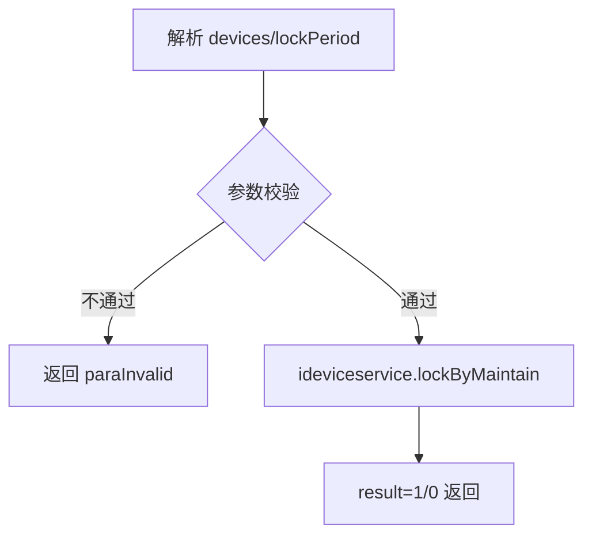
- **调用链**：`cn.testin.business.impl` 设备业务实现 → `device_info` 相关表/设备池刷新。
- **涉及表与 SQL**：`device_info`（更新锁定状态/锁定期，具体 SQL 在 DAO 层动态拼接）。
- **异常与校验**：devices 为空或 lockPeriod<=0 返回 `CommonCode.paraInvalid`。
- **关键代码摘录**：
```java
// real-controlcenter/src/main/java/cn/testin/service/device/Device.java
if (deviceids == null || deviceids.length == 0) {
    return ApiUtil.getResult(apirequest, CommonCode.paraInvalid.getValue(), msg);
}
boolean result = this.ideviceservice.lockByMaintain(deviceids, lockPeriod);
```

### unlock (`Device.unlock`)
- **入口**：ApiServlet，action/op（action=device，op=Device.unlock）
- **实现意图**：批量解除运维锁，设备恢复可选状态。
- **请求参数**：

| 参数 | 类型 | 必填 | 说明 |
|---|---|---|---|
| devices | JSONArray&lt;String&gt; | 是 | 设备 ID 数组 |

- **返回参数**

| 字段 | 类型 | 说明 |
| --- | --- | --- |
| code | Integer | 状态码，0 成功 |
| msg | String | 提示信息 |
| data | Object | 返回数据对象 |
| data.result | Integer | 1 成功 / 0 失败 |
- **处理流程**：
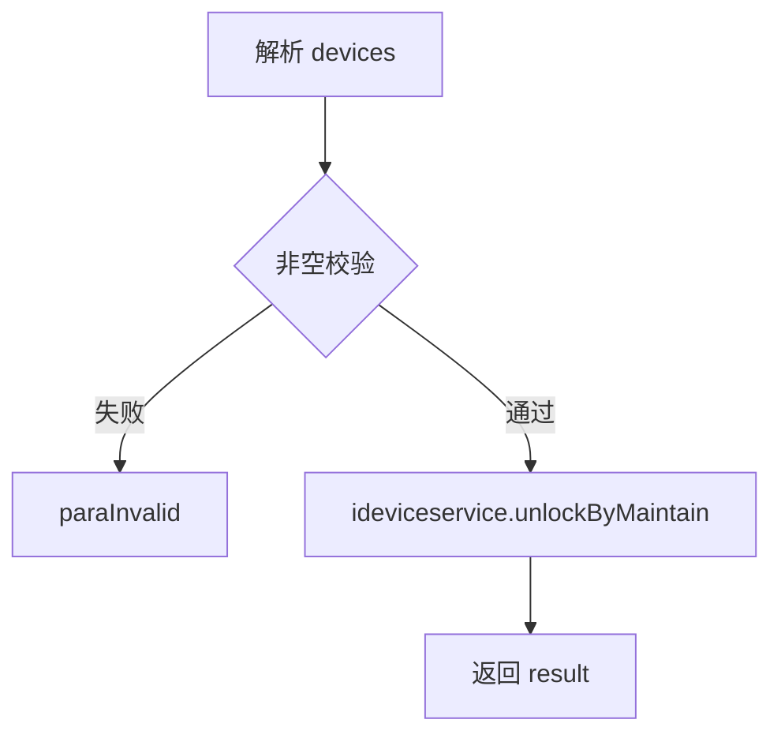
- **调用链**：业务层解锁 → 设备池状态刷新。
- **涉及表与 SQL**：`device_info`。
- **异常与校验**：devices 为空 → paraInvalid。

### grantPrivilege (`Device.grantPrivilege`)
- **入口**：ApiServlet，action/op（action=device，op=Device.grantPrivilege）
- **实现意图**：按渠道（channel）为一批设备授权使用权限。
- **请求参数**：

| 参数 | 类型 | 必填 | 说明 |
|---|---|---|---|
| channel | String | 是 | 渠道标识 |
| devices | JSONArray&lt;Object&gt; | 是 | DevicePrivilege JSON 数组（含 source/deviceid 等） |

- **返回参数**

| 字段 | 类型 | 说明 |
| --- | --- | --- |
| code | Integer | 状态码，0 成功 |
| msg | String | 提示信息 |
| data | Object | 返回数据对象 |
| data.result | Integer | 1 全部成功 / 0 中途失败 |
- **处理流程**：
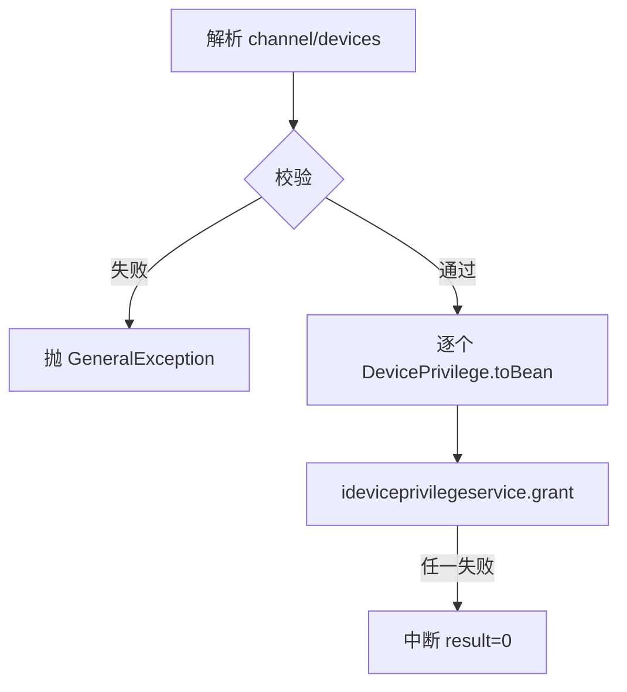
- **调用链**：`ideviceprivilegeservice.grant` → `device_privilege` 表写入。
- **涉及表与 SQL**：`device_privilege`（INSERT/REPLACE，按 source+deviceid）。
- **异常与校验**：channel 空 / devices 空 → 抛 `GeneralException(paraInvalid)`。
- **关键代码摘录**：
```java
// Device.java grantPrivilege
for (int i = 0; i < devicesJson.length(); i++) {
    result = this.ideviceprivilegeservice.grant(channel, DevicePrivilege.toBean(devicesJson.getJSONObject(i)));
    if (!result) { break; }
}
```

### revokePrivilege (`Device.revokePrivilege`)
- **入口**：ApiServlet，action/op（action=device，op=Device.revokePrivilege）
- **实现意图**：按渠道回收设备权限，与 grantPrivilege 对称。
- **请求参数**：同 grantPrivilege（channel、devices）。
- **返回参数**

| 字段 | 类型 | 说明 |
| --- | --- | --- |
| code | Integer | 状态码，0 成功 |
| msg | String | 提示信息 |
| data | Object | 返回数据对象 |
| data.result | Integer | 1 成功 / 0 失败 |
- **处理流程**：
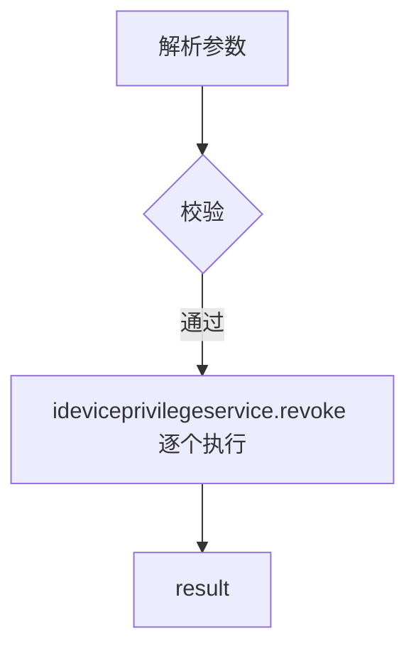
- **涉及表与 SQL**：`device_privilege`（DELETE/UPDATE 按渠道）。
- **异常与校验**：channel/devices 缺失 → GeneralException。

### cleanPrivilege (`Device.cleanPrivilege`)
- **入口**：ApiServlet，action/op（action=device，op=Device.cleanPrivilege）
- **实现意图**：清理设备上的权限配置（不按渠道，按 source+deviceid 全量清除）。
- **请求参数**：

| 参数 | 类型 | 必填 | 说明 |
|---|---|---|---|
| devices | JSONArray&lt;Object&gt; | 是 | DevicePrivilege JSON 数组（需含 source、deviceid） |

- **返回参数**

| 字段 | 类型 | 说明 |
| --- | --- | --- |
| code | Integer | 状态码，0 成功 |
| msg | String | 提示信息 |
| data | Object | 返回数据对象 |
| data.result | Integer | 1 成功 / 0 失败 |
- **处理流程**：
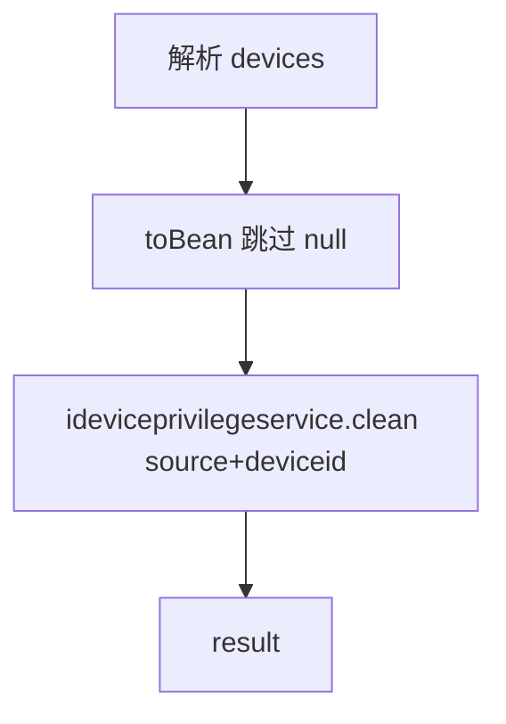
- **涉及表与 SQL**：`device_privilege`。
- **异常与校验**：devices 空 → GeneralException；toBean 为 null 的项跳过。

### getConditionList (`Device.getConditionList`)
- **入口**：ApiServlet，action/op（action=device，op=Device.getConditionList）
- **实现意图**：返回车机筛选下拉条件：MCU 版本列表与车机版本列表（去重）。
- **请求参数**：无（内部固定 modelType=3 查询车机视图）。
- **返回参数**

| 字段 | 类型 | 说明 |
| --- | --- | --- |
| code | Integer | 状态码，0 成功 |
| msg | String | 提示信息 |
| data | Object | 返回数据对象 |
| data.mcuList | JSONArray&lt;String&gt; | MCU 版本去重数组 |
| data.machineList | JSONArray&lt;String&gt; | 车机版本去重数组 |
- **处理流程**：
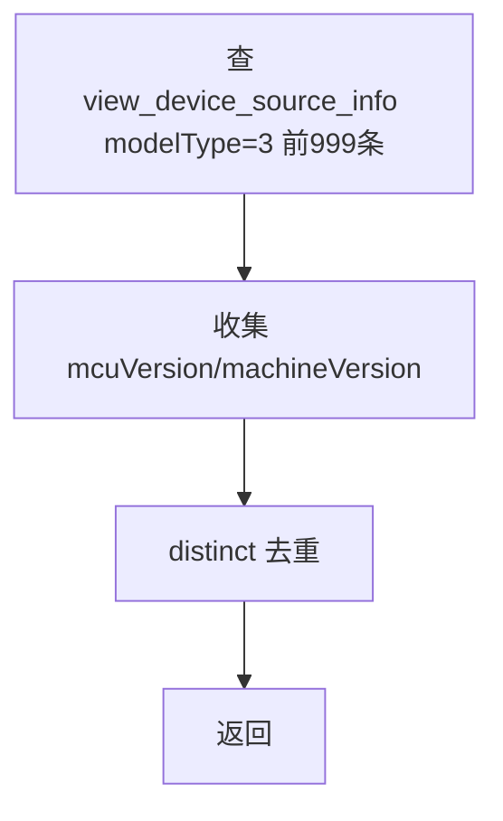
- **涉及表与 SQL**：`view_device_source_info`（视图，conditionMap: modelType=3）。
- **异常与校验**：查询结果为 null → `CommonCode.noneData`。

### list (`Device.list`)
- **入口**：ApiServlet，action/op（action=device，op=Device.list）
- **实现意图**：设备云分页列表，支持状态/机型/版本/项目云过滤/排序，并叠加恒生定制（剔除项目独享设备、标注"工位来源"）。
- **请求参数**：

| 参数 | 类型 | 必填 | 说明 |
|---|---|---|---|
| page | int | 是 | 页码，>0 |
| pageSize | int | 是 | 页大小，≤Config.MaxSize |
| status | int | 否 | 设备状态 |
| debugOwner | String | 否 | 调试占用人邮箱 |
| eid / projectid / bizCode / privateSource | int | 否 | 企业/项目组/业务/私有云过滤 |
| checkValid | int | 否 | 授权合法性校验开关 |
| modelType | int | 否 | 机型分类 0手机/1平板/2电视/3车机/9其他 |
| modelName / deviceid / machineVersion / mcuVersion / iccid / serialNumber / releaseVer / locationDescr / ucomid | String | 否 | 关键字过滤 |
| searchStatus | int | 否 | 0在线 1离线 2空闲 3测试 4真机 |
| sortKey | JSONArray | 否 | [{key, sortType(1倒序/0升序)}] |

- **返回参数**

| 字段 | 类型 | 说明 |
| --- | --- | --- |
| code | Integer | 状态码，0 成功 |
| msg | String | 提示信息 |
| data | Object | 返回数据对象 |
| data.page | Integer | 当前页 |
| data.pageSize | Integer | 每页条数 |
| data.totalRow | Integer | 总记录数 |
| data.totalPage | Integer | 总页数 |
| data.list | JSONArray&lt;ViewDeviceSourceInfo&gt; | 设备云列表 |
- **处理流程**：
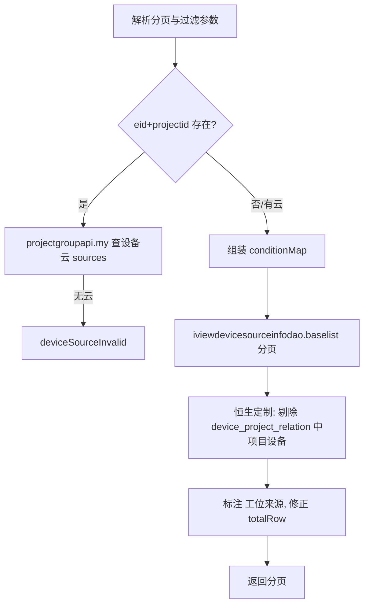
- **调用链**：[平台配置](../../../平台配置（real-cfg）/07-开放接口文档/00-模块索引.md)（ProjectGroupApi.my 查项目组设备云）→ 本库 DAO。
- **涉及表与 SQL**：`view_device_source_info`（主查询）、`device_project_relation`（项目独享过滤，listForFilter/list）。
- **异常与校验**：page/pageSize 非法 → paraInvalid；无可用设备云 → `ControlCenterCode.deviceSourceInvalid`；查询 null → unknown。
- **关键代码摘录**：
```java
// Device.java list —— 恒生定制：剔除项目持有/共享设备
Map<String, Object> relationConditionMap = new HashMap<>();
relationConditionMap.put("projectid", projectid);
List<DeviceProjectRelation> list = this.ideviceprojectrelationdao.listForFilter(relationConditionMap, null, 1, 1000);
...
if (!serialNumberSet.contains(baseList.getList().get(i).getSerialNumber())) {
    newList.add(baseList.getList().get(i));
}
```

### infolist (`Device.infolist`)
- **入口**：ApiServlet，action/op（action=device，op=Device.infolist）
- **实现意图**：无设备云维度的设备信息分页列表（view_device_info），透传 DeviceConditionKeyword 支持的任意过滤键。
- **请求参数**

| 字段 | 类型 | 必填 | 说明 |
| --- | --- | --- | --- |
| page | Integer | 是 | 页码，>0 |
| pageSize | Integer | 是 | 页大小，≤Config.MaxSize |
| id | Integer | 否 | 透传回显（caseFoor） |
| 其余 DeviceConditionKeyword 键 | - | 否 | 过滤条件（数组值表示多值 IN） |
- **返回参数**

| 字段 | 类型 | 说明 |
| --- | --- | --- |
| code | Integer | 状态码，0 成功 |
| msg | String | 提示信息 |
| data | Object | 返回数据对象 |
| data.page | Integer | 当前页 |
| data.pageSize | Integer | 每页条数 |
| data.totalRow | Integer | 总记录数 |
| data.totalPage | Integer | 总页数 |
| data.list | JSONArray&lt;ViewDeviceInfo&gt; | 设备信息列表 |
| data.id | Integer | 可选，透传回显的 id（caseFoor） |
- **处理流程**：
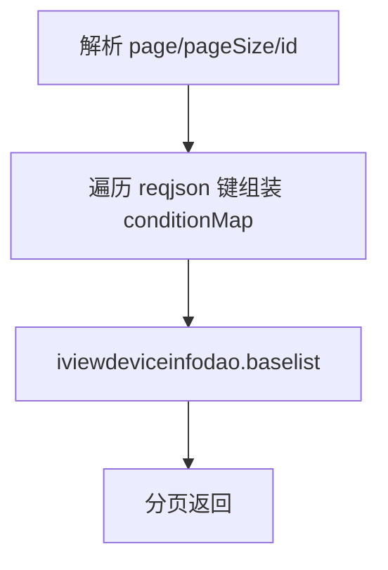
- **涉及表与 SQL**：`view_device_info`（视图）。
- **异常与校验**：分页参数非法 → paraInvalid；结果 null → unknown。

### privileges (`Device.privileges`)
- **入口**：ApiServlet，action/op（action=device，op=Device.privileges）
- **实现意图**：查询单台设备在某云下的权限配置。
- **请求参数**：

| 参数 | 类型 | 必填 | 说明 |
|---|---|---|---|
| cloudName | String | 否 | 云/渠道名 |
| deviceid | String | 否 | 设备 ID |

- **返回参数**

| 字段 | 类型 | 说明 |
| --- | --- | --- |
| code | Integer | 状态码，0 成功 |
| msg | String | 提示信息 |
| data | Object | 返回数据对象 |
| data.objInfo | Object | DevicePrivilege JSON（无则缺省） |
- **处理流程**：
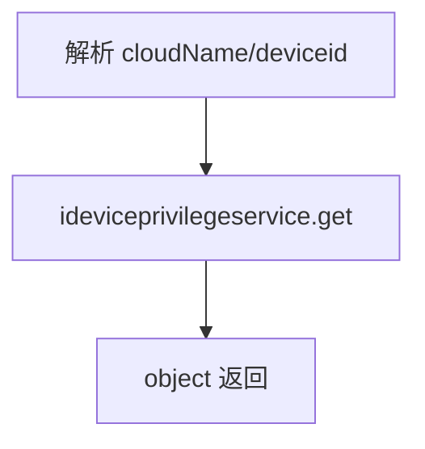
- **涉及表与 SQL**：`device_privilege`。

### conditions (`Device.conditions`)
- **入口**：ApiServlet，action/op（action=device，op=Device.conditions）
- **实现意图**：查询某设备云下的筛选条件集合（如系统版本、品牌等维度）。
- **请求参数**：

| 参数 | 类型 | 必填 | 说明 |
|---|---|---|---|
| source | String | 否 | 设备云 ID；缺省时用 eid+projectid 反查 |
| type | String | 否 | 条件分类 |
| eid / projectid | int | source 缺省时必填 | 企业/项目组 |

- **返回参数**

| 字段 | 类型 | 说明 |
| --- | --- | --- |
| code | Integer | 状态码，0 成功 |
| msg | String | 提示信息 |
| data | Object | 返回数据对象 |
| data.list | JSONArray&lt;ViewDeviceCondition&gt; | 设备查询条件数组 |
- **处理流程**：
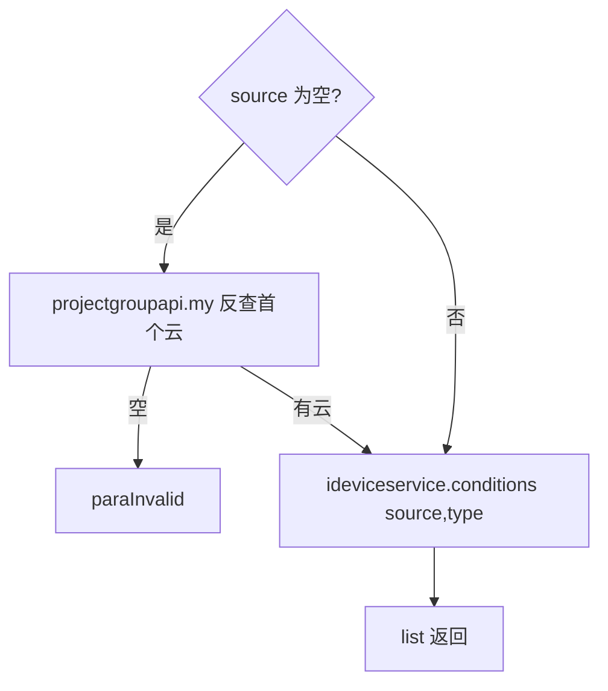
- **调用链**：[平台配置](../../../平台配置（real-cfg）/07-开放接口文档/00-模块索引.md)（ProjectGroupApi.my）。
- **涉及表与 SQL**：`view_device_condition`（视图）。
- **异常与校验**：eid/projectid 非法 → paraInvalid；查询 null → unknown。

### processlist (`Device.processlist`)
- **入口**：ApiServlet，action/op（action=device，op=Device.processlist）
- **实现意图**：设备占用（进行中任务/调试）分页列表，flag=1 时忽略 projectid/userid 过滤。
- **请求参数**

| 字段 | 类型 | 必填 | 说明 |
| --- | --- | --- | --- |
| eid | Integer | 是 | 企业 ID |
| page | Integer | 是 | 页码，>0 |
| pageSize | Integer | 是 | 页大小，≤Config.MaxSize |
| flag | Integer | 否 | 1 时忽略 projectid/userid 过滤 |
| sortKey | JSONArray | 否 | [{key, sortType(1倒序/0升序)}] |
| 其余 DeviceProcessConditionKeyword 键 | - | 否 | 过滤条件（数组值表示多值 IN） |
- **返回参数**

| 字段 | 类型 | 说明 |
| --- | --- | --- |
| code | Integer | 状态码，0 成功 |
| msg | String | 提示信息 |
| data | Object | 返回数据对象 |
| data.page | Integer | 当前页 |
| data.pageSize | Integer | 每页条数 |
| data.totalRow | Integer | 总记录数 |
| data.totalPage | Integer | 总页数 |
| data.list | JSONArray&lt;ViewDeviceProcess&gt; | 设备占用列表 |
- **处理流程**：
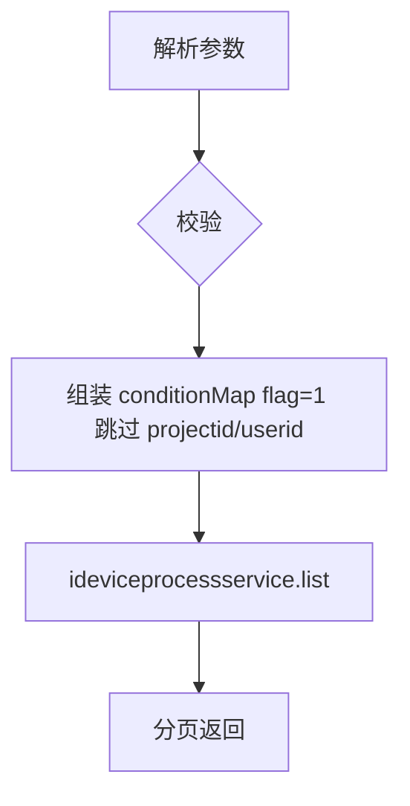
- **涉及表与 SQL**：`view_device_process`（视图）。
- **异常与校验**：eid/page/pageSize 非法 → paraInvalid。

### certificates (`Device.certificates`)
- **入口**：ApiServlet，action/op（action=device，op=Device.certificates）
- **实现意图**：查询 iOS 设备关联证书列表；优先读设备池缓存，未命中再走库。
- **请求参数**：

| 参数 | 类型 | 必填 | 说明 |
|---|---|---|---|
| deviceid | String | 是 | 设备 ID，必须为 iOS 系统 |

- **返回参数**

| 字段 | 类型 | 说明 |
| --- | --- | --- |
| code | Integer | 状态码，0 成功 |
| msg | String | 提示信息 |
| data | Object | 返回数据对象 |
| data.list | JSONArray&lt;CertificateInfo&gt; | 设备 iOS 证书数组 |
- **处理流程**：
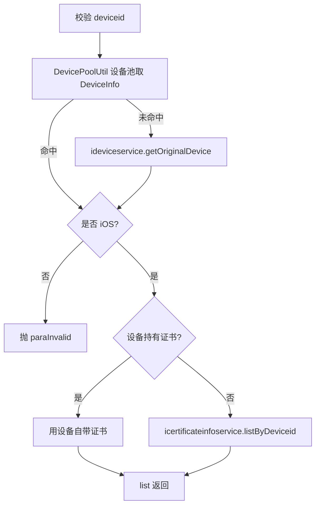
- **涉及表与 SQL**：`certificate_info`、`device_certificate`（关联查询）。
- **异常与校验**：deviceid 空/非 iOS → GeneralException；查询 null → sqlException。

### totalByStatus (`Device.totalByStatus`)
- **入口**：ApiServlet，action/op（action=device，op=Device.totalByStatus）
- **实现意图**：按云统计各状态设备数量。
- **请求参数**：无。
- **返回参数**

| 字段 | 类型 | 说明 |
| --- | --- | --- |
| code | Integer | 状态码，0 成功 |
| msg | String | 提示信息 |
| data | Object | 返回数据对象 |
| data.list | JSONArray&lt;DeviceTotal&gt; | 各云设备状态统计数组 |
- **处理流程**：
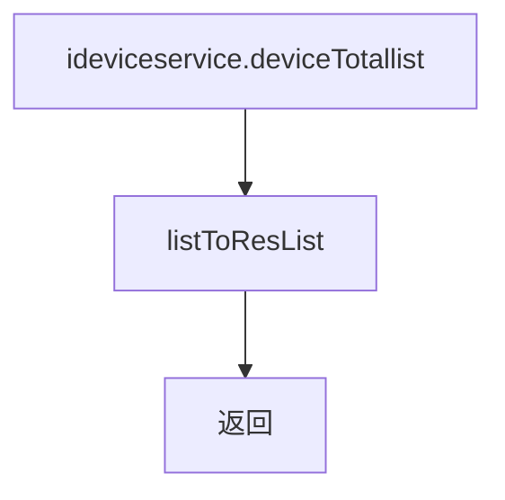
- **涉及表与 SQL**：`device_total`（统计表，定时任务刷新）。

### getOriginalDevice (`Device.getOriginalDevice`)
- **入口**：ApiServlet，action/op（action=device，op=Device.getOriginalDevice）
- **实现意图**：查询设备原始信息（不读设备池），已标记 @Deprecated，建议使用 getDeviceInfo。
- **请求参数**

| 字段 | 类型 | 必填 | 说明 |
| --- | --- | --- | --- |
| deviceid | String | 是 | 设备 ID |
- **返回参数**

| 字段 | 类型 | 说明 |
| --- | --- | --- |
| code | Integer | 状态码，0 成功 |
| msg | String | 提示信息 |
| data | Object | 返回数据对象 |
| data.objInfo | Object | DeviceInfo（设备原始信息，无则缺省） |
- **涉及表与 SQL**：`device_info`。
- **异常与校验**：deviceid 空 → GeneralException。

### getDeviceInfo (`Device.getDeviceInfo`)
- **入口**：ApiServlet，action/op（action=device，op=Device.getDeviceInfo）
- **实现意图**：查询设备详情（视图聚合信息）。
- **请求参数**

| 字段 | 类型 | 必填 | 说明 |
| --- | --- | --- | --- |
| deviceid | String | 是（与 deviceId 二选一） | 设备 ID |
| deviceId | String | 是（与 deviceid 二选一，优先覆盖） | 设备 ID |
- **返回参数**

| 字段 | 类型 | 说明 |
| --- | --- | --- |
| code | Integer | 状态码，0 成功 |
| msg | String | 提示信息 |
| data | Object | 返回数据对象 |
| data.objInfo | Object | ViewDeviceInfo（设备详情视图，无则缺省） |
- **处理流程**：
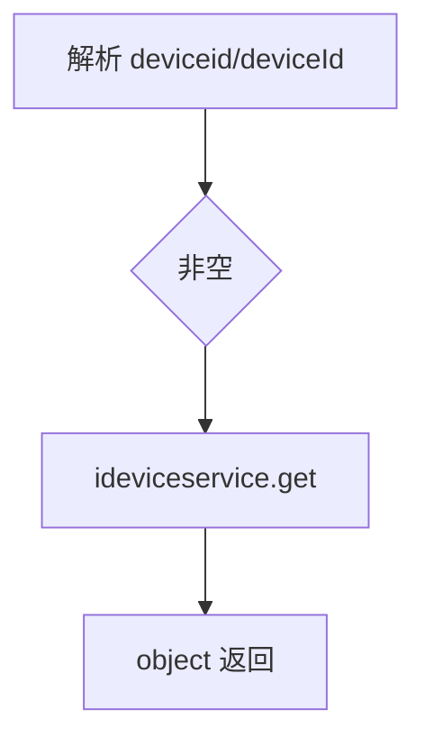
- **涉及表与 SQL**：`view_device_info`。
- **异常与校验**：两者皆空 → GeneralException(paraInvalid)。

### tasksInProgress (`Device.tasksInProgress`)
- **入口**：ApiServlet，action/op（action=device，op=Device.tasksInProgress）
- **实现意图**：批量查询设备当前执行中的任务，补充完成率与机柜工位信息，按创建时间排序返回。
- **请求参数**：

| 参数 | 类型 | 必填 | 说明 |
|---|---|---|---|
| deviceidList | JSONArray&lt;String&gt; | 是 | 设备 ID 数组 |
| id | int | 否 | 透传回显（caseFoor） |

- **返回参数**

| 字段 | 类型 | 说明 |
| --- | --- | --- |
| code | Integer | 状态码，0 成功 |
| msg | String | 提示信息 |
| data | Object | 返回数据对象 |
| data.resList | JSONArray&lt;Map&gt; | 任务信息 Map 列表，元素含 scriptFinish、scriptSum、taskFinishRate、cabinSite、createTime 等 |
| data.id | Integer | 可选，透传回显的 id（caseFoor） |
- **处理流程**：
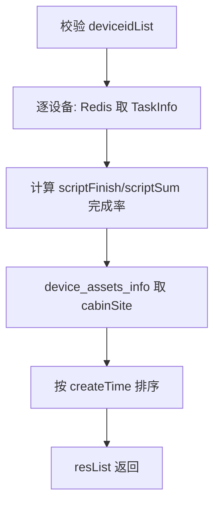
- **调用链**：任务信息存 Redis（`cn.testin.dao.impl.redis.TaskInfoDAOImpl`），由 [任务调度服务](../../../任务调度服务（real-scheduling）/07-开放接口文档/00-模块索引.md) 写入。
- **涉及表与 SQL**：Redis（任务哈希）；`device_assets_info`（机柜工位）。
- **异常与校验**：deviceidList 空 → paraInvalid；单台无任务跳过。
- **关键代码摘录**：
```java
// Device.java tasksInProgress
Map<String, Object> map = itaskinfoservice.getTaskInfoByDevice(deviceidList.getString(i));
DeviceAssetsInfo assetsInfo = ideviceassetsservice.get(deviceidList.getString(i));
int finishRate = (int) map.get("scriptFinish") * 100 / (int) map.get("scriptSum");
map.put("taskFinishRate", finishRate);
map.put("cabinSite", assetsInfo.getCabinSite());
```

### modelList (`Device.modelList`)
- **入口**：ApiServlet，action/op（action=device，op=Device.modelList）
- **实现意图**：按机型聚合的设备分页列表（同机型合并），支持项目云过滤与系统类型筛选。
- **请求参数**

| 字段 | 类型 | 必填 | 说明 |
| --- | --- | --- | --- |
| page | Integer | 是 | 页码，>0 |
| pageSize | Integer | 是 | 页大小，≤Config.MaxSize |
| eid | Integer | 否 | 企业 ID |
| projectid | Integer | 否 | 项目组 ID |
| checkValid | Integer | 否 | 授权合法性校验开关 |
| status | Integer | 否 | 设备状态 |
| modelType | Integer | 否 | 机型分类 0手机/1平板/2电视/3车机/9其他 |
| modelName | String | 否 | 机型名称 |
| searchStatus | Integer | 否 | 0在线 1离线 2空闲 3测试 4真机 |
| sysos | String | 否 | 系统名 |
| 其余 DeviceConditionKeyword 键 | - | 否 | 过滤条件（数组值表示多值 IN） |
- **返回参数**

| 字段 | 类型 | 说明 |
| --- | --- | --- |
| code | Integer | 状态码，0 成功 |
| msg | String | 提示信息 |
| data | Object | 返回数据对象 |
| data.page | Integer | 当前页 |
| data.pageSize | Integer | 每页条数 |
| data.totalRow | Integer | 总记录数 |
| data.totalPage | Integer | 总页数 |
| data.list | JSONArray&lt;OnlineDeviceModelInfo&gt; | 机型聚合列表 |
- **处理流程**：
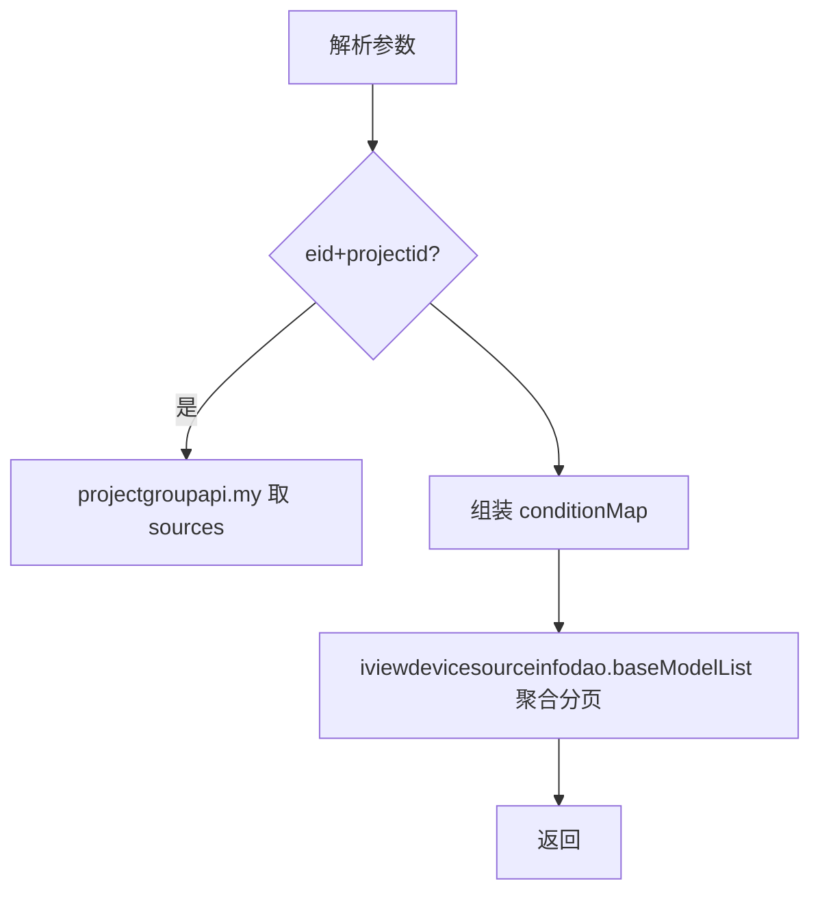
- **调用链**：[平台配置](../../../平台配置（real-cfg）/07-开放接口文档/00-模块索引.md)（ProjectGroupApi.my）。
- **涉及表与 SQL**：`view_device_source_info`（GROUP BY 机型聚合）。
- **异常与校验**：同 list；无可用云 → deviceSourceInvalid。

### deviceOccupancy (`Device.deviceOccupancy`)
- **入口**：ApiServlet，action/op（action=device，op=Device.deviceOccupancy）
- **实现意图**：统计指定设备集合在一段时间内的占用率。
- **请求参数**：

| 参数 | 类型 | 必填 | 说明 |
|---|---|---|---|
| time | long | 否 | 统计截止时间（毫秒） |
| deviceIds | JSONArray&lt;String&gt; | 否 | 设备 ID 数组 |

- **返回参数**

| 字段 | 类型 | 说明 |
| --- | --- | --- |
| code | Integer | 状态码，0 成功 |
| msg | String | 提示信息 |
| data | Object | 返回数据对象 |
| data.result | Map&lt;String,Double&gt; | key 为 deviceid，value 为占用率 Double |
- **处理流程**：
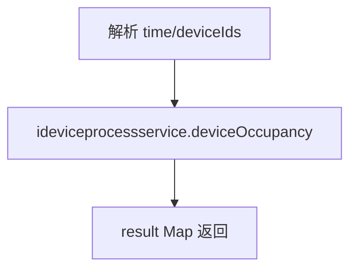
- **涉及表与 SQL**：`view_device_process` / 设备占用记录（占用时长聚合计算）。

---

## 依赖汇总
- 外部服务：[平台配置](../../../平台配置（real-cfg）/07-开放接口文档/00-模块索引.md)（ProjectGroupApi.my）、[任务调度服务](../../../任务调度服务（real-scheduling）/07-开放接口文档/00-模块索引.md)（任务数据写入方）
- 缓存：DevicePoolUtil 设备池、Redis（TaskInfo）
- 主要表/视图：view_device_source_info、view_device_info、view_device_condition、view_device_process、device_info、device_privilege、certificate_info、device_certificate、device_project_relation、device_total、device_assets_info
