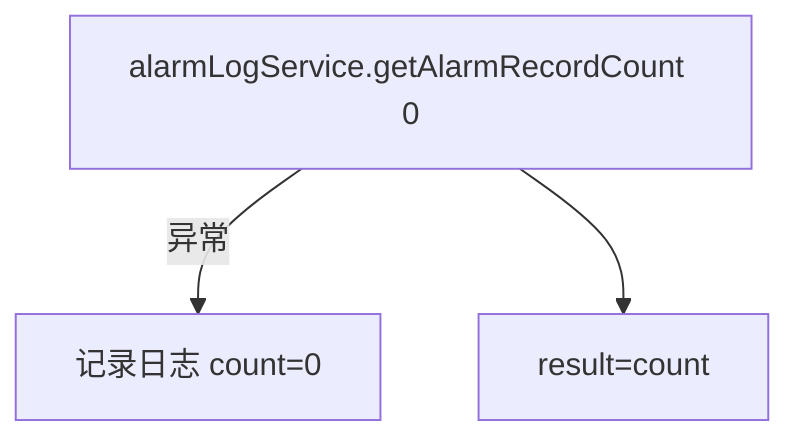
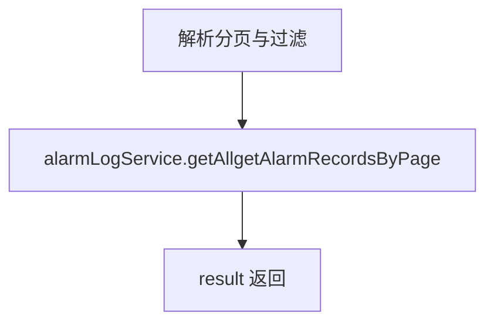
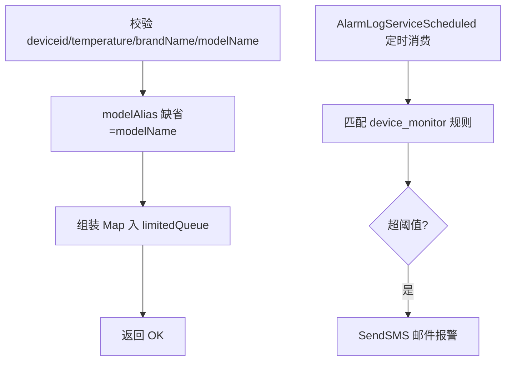

# DeviceAlarmLog（monitor 包）

## 职责
设备监控报警记录：未读报警数、报警记录分页、一键清除；同时接收上位机上报的设备温度数据，写入内存队列由定时任务 `AlarmLogServiceScheduled` 匹配规则并触发邮件报警。

- 源码：`real-controlcenter/src/main/java/cn/testin/service/monitor/DeviceAlarmLog.java`
- 基类：`GenericBaseService`（注入 alarmLogService、parameterConfigCodeService）
- 关键常量：`limitedQueue`（容量 12000 的内存队列，约 200 台设备 10 分钟数据）

## op 一览表

| op | 说明 |
|---|---|
| getAlarmRecordCount | 未读报警记录数 |
| getAllAlarmRecords | 报警记录分页查询 |
| cleartAllAlarmRecords | 一键清除所有报警记录 |
| checkDeviceReportInfo | 接收设备温度上报（入队待规则匹配） |

---

### getAlarmRecordCount (`DeviceAlarmLog.getAlarmRecordCount`)
- **入口**：ApiServlet，action/op（action=deviceAlarmLog，op=DeviceAlarmLog.getAlarmRecordCount）
- **实现意图**：获取系统消息通知个数（未读报警记录数），异常时降级返回 0。
- **请求参数**：无。
- **返回参数**

| 字段 | 类型 | 说明 |
| --- | --- | --- |
| code | Integer | 状态码，0 成功 |
| msg | String | 提示信息 |
| data | Object | 返回数据对象 |
| data.result | Integer | 未读报警记录数 |
- **处理流程**：

- **涉及表与 SQL**：`alarm_log`（COUNT 未读）。
- **异常与校验**：try-catch 兜底，不向上抛。

### getAllAlarmRecords (`DeviceAlarmLog.getAllAlarmRecords`)
- **入口**：ApiServlet，action/op（action=deviceAlarmLog，op=DeviceAlarmLog.getAllAlarmRecords）
- **实现意图**：分页查询全部报警记录，支持时间区间与规则类型过滤。
- **请求参数**

| 字段 | 类型 | 必填 | 说明 |
| --- | --- | --- | --- |
| page | Integer | 否 | 页码，默认 1 |
| pageSize | Integer | 否 | 每页条数，默认 10 |
| beginTime | String | 否 | 起始时间 |
| endTime | String | 否 | 结束时间 |
| ruleType | Integer | 否 | 规则类型 |

- **返回参数**

| 字段 | 类型 | 说明 |
| --- | --- | --- |
| code | Integer | 状态码，0 成功 |
| msg | String | 提示信息 |
| data | Object | 返回数据对象 |
| data.result | Object | PageUtils 分页对象 |
| data.result.totalCount | Integer | 总记录数 |
| data.result.pageSize | Integer | 每页记录数 |
| data.result.totalPage | Integer | 总页数 |
| data.result.currPage | Integer | 当前页 |
| data.result.list | JSONArray&lt;AlarmLog&gt; | 报警记录列表 |
- **处理流程**：

- **涉及表与 SQL**：`alarm_log`（条件分页）。
- **异常与校验**：无强制校验，使用默认值。

### cleartAllAlarmRecords (`DeviceAlarmLog.cleartAllAlarmRecords`)
- **入口**：ApiServlet，action/op（action=deviceAlarmLog，op=DeviceAlarmLog.cleartAllAlarmRecords）
- **实现意图**：一键清除所有报警记录（全部标记已读/删除）。
- **请求参数**：无。
- **返回参数**

| 字段 | 类型 | 说明 |
| --- | --- | --- |
| code | Integer | 状态码，0 成功 |
| msg | String | 提示信息 |
| data | Object | 返回数据对象 |
| data.result | Integer | 影响行数 |
- **涉及表与 SQL**：`alarm_log`（批量 UPDATE/DELETE）。

### checkDeviceReportInfo (`DeviceAlarmLog.checkDeviceReportInfo`)
- **入口**：ApiServlet，action/op（action=deviceAlarmLog，op=DeviceAlarmLog.checkDeviceReportInfo）
- **实现意图**：接收上位机/代理上报的设备温度数据，写入内存队列；定时任务消费队列按监控规则判定是否报警。接口本身同步返回 OK/ERROR，不做规则计算。
- **请求参数**：

| 参数 | 类型 | 必填 | 说明 |
|---|---|---|---|
| deviceid | String | 是 | 设备 ID |
| temperature | double | 是 | 上报温度 |
| brandName | String | 是 | 品牌 |
| modelName | String | 是 | 机型 |
| modelAlias | String | 否 | 别名，缺省取 modelName |

- **返回参数**

| 字段 | 类型 | 说明 |
| --- | --- | --- |
| code | Integer | 状态码，0 成功 |
| msg | String | 提示信息 |
| data | Object | 返回数据对象 |
| data.result | String | "OK" 入队成功 / "ERROR" 入队异常 |
- **处理流程**：

- **调用链**：报警邮件经 notice-manager（NoticeApi.sendEmail，模板 ID 10118）；规则匹配由本模块定时任务 `AlarmLogServiceScheduled` 完成（依赖 Redis 静默 key `*:monitor_rule:<ruleId>silence`）。
- **涉及表与 SQL**：`alarm_log`（报警落库，定时任务侧）；`parameter_config_code`（报警参数配置）。
- **异常与校验**：必填缺失 → paraInvalid；入队过程异常 → result="ERROR" 但接口仍 200。
- **关键代码摘录**：
```java
// real-controlcenter/src/main/java/cn/testin/service/monitor/DeviceAlarmLog.java
map.put("deviceid", deviceid);
map.put("temperature", temperature);
map.put("alarmTime", alarmTime);
boolean add = limitedQueue.add(map);   // 仅入队，规则判定由定时任务完成
```

---

## 依赖汇总
- 外部服务：notice-manager（邮件报警，NoticeApi.sendEmail）
- 缓存/内存：LimitedQueue（12000）、Redis（静默 key）
- 主要表：alarm_log、parameter_config_code
