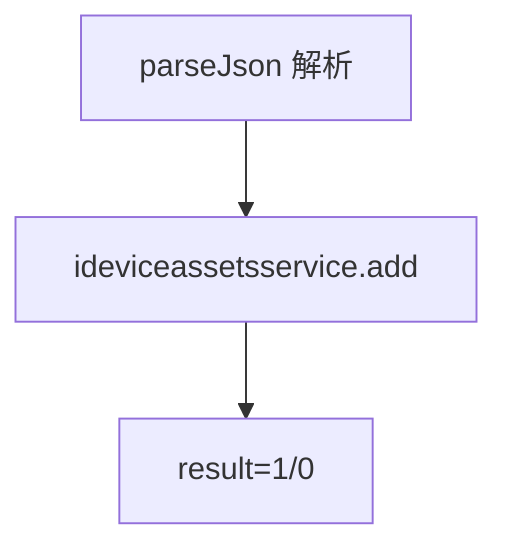
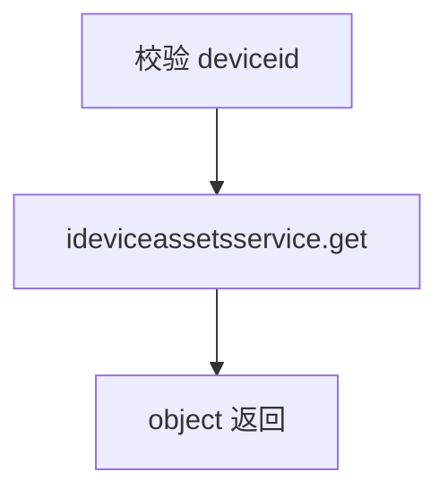
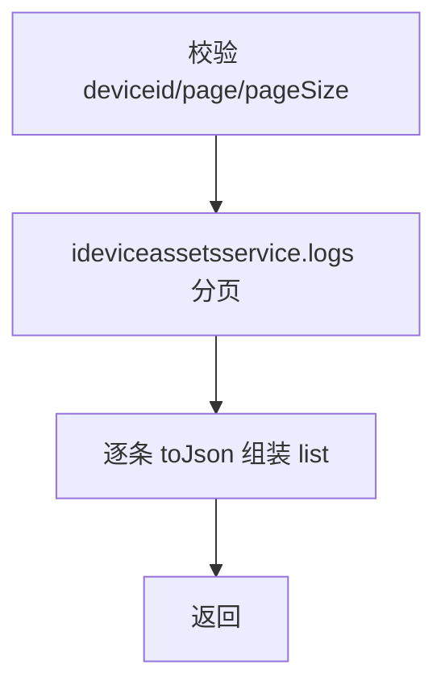

# DeviceAssets（device 包）

## 职责
设备资产台账管理：资产信息登记（机柜、工位等）、单台查询、资产维护日志分页查询。

- 源码：`real-controlcenter/src/main/java/cn/testin/service/device/DeviceAssets.java`
- 基类：`GenericBaseService`（注入 ideviceassetsservice）

## op 一览表

| op | 说明 |
|---|---|
| add | 新增/登记设备资产信息 |
| get | 查询设备资产信息 |
| logs | 资产维护日志分页 |

---

### add (`DeviceAssets.add`)
- **入口**：ApiServlet，action/op（action=deviceAssets，op=DeviceAssets.add）
- **实现意图**：登记设备资产信息（机柜位置、工位、资产编号等），字段由 `DeviceAssetsInfo.parseJson` 解析。
- **请求参数**

| 字段 | 类型 | 必填 | 说明 |
| --- | --- | --- | --- |
| deviceid | String | 是 | 设备 ID（资产主键） |
| cabinSite | String | 否 | 机柜工位 |
| owner / descr / operator / assetsNum / region / additionalConfig / mark1 / mark2 | String | 否 | 资产字段，由 DeviceAssetsInfo.parseJson 解析 |

- **返回参数**

| 字段 | 类型 | 说明 |
| --- | --- | --- |
| code | Integer | 状态码，0 成功 |
| msg | String | 提示信息 |
| data | Object | 返回数据对象 |
| data.result | Integer | 1 成功 / 0 失败 |
- **处理流程**：

- **涉及表与 SQL**：`device_assets_info`（INSERT/REPLACE）；资产变更日志写入 `device_assets_log`（业务层）。
- **异常与校验**：service 层无显式校验，依赖业务层约束。
- **关键代码摘录**：
```java
// real-controlcenter/src/main/java/cn/testin/service/device/DeviceAssets.java
DeviceAssetsInfo assetsinfo = DeviceAssetsInfo.parseJson(reqjson);
boolean result = this.ideviceassetsservice.add(assetsinfo);
```

### get (`DeviceAssets.get`)
- **入口**：ApiServlet，action/op（action=deviceAssets，op=DeviceAssets.get）
- **实现意图**：按设备 ID 查询资产信息。
- **请求参数**：

| 参数 | 类型 | 必填 | 说明 |
|---|---|---|---|
| deviceid | String | 是 | 设备 ID |

- **返回参数**

| 字段 | 类型 | 说明 |
| --- | --- | --- |
| code | Integer | 状态码，0 成功 |
| msg | String | 提示信息 |
| data | Object | 返回数据对象 |
| data.objInfo | Object | DeviceAssetsInfo JSON（无则缺省） |
- **处理流程**：

- **涉及表与 SQL**：`device_assets_info`（主键查询）。
- **异常与校验**：deviceid 空 → paraInvalid。

### logs (`DeviceAssets.logs`)
- **入口**：ApiServlet，action/op（action=deviceAssets，op=DeviceAssets.logs）
- **实现意图**：查询某设备的资产维护/变更日志（分页）。
- **请求参数**

| 字段 | 类型 | 必填 | 说明 |
| --- | --- | --- | --- |
| deviceid | String | 是 | 设备 ID |
| page | Integer | 是 | 页码，>0 |
| pageSize | Integer | 是 | 页大小，≤Config.MaxSize |

- **返回参数**

| 字段 | 类型 | 说明 |
| --- | --- | --- |
| code | Integer | 状态码，0 成功 |
| msg | String | 提示信息 |
| data | Object | 返回数据对象 |
| data.page | Integer | 当前页 |
| data.pageSize | Integer | 每页条数 |
| data.totalRow | Integer | 总记录数 |
| data.totalPage | Integer | 总页数 |
| data.list | JSONArray&lt;DeviceAssetsLog&gt; | 资产维护日志数组 |
- **处理流程**：

- **涉及表与 SQL**：`device_assets_log`（按 deviceid 分页）。
- **异常与校验**：参数非法 → paraInvalid；结果 null → unknown。
- **关键代码摘录**：
```java
// DeviceAssets.java logs
BaseList<DeviceAssetsLog> baseList = this.ideviceassetsservice.logs(deviceid, page, pageSize);
datamap.put(ApiResponse.RES_PAGE, baseList.getCurPage());
datamap.put(ApiResponse.RES_TOTALROW, baseList.getTotalRow());
```

---

## 依赖汇总
- 外部服务：无
- 主要表：device_assets_info、device_assets_log
