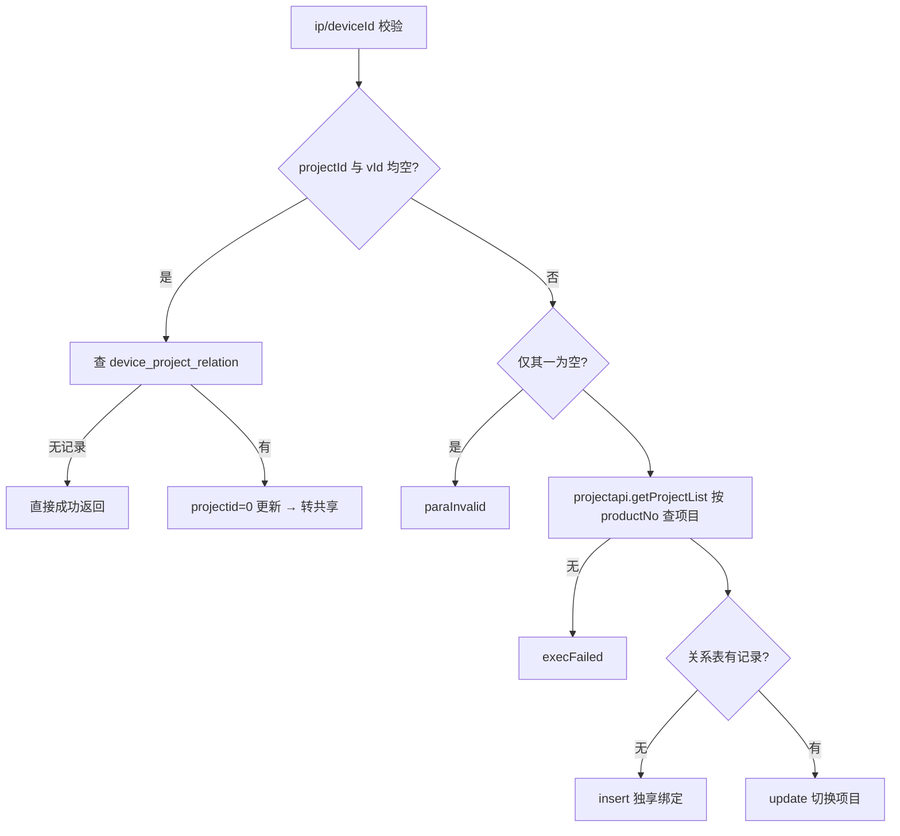
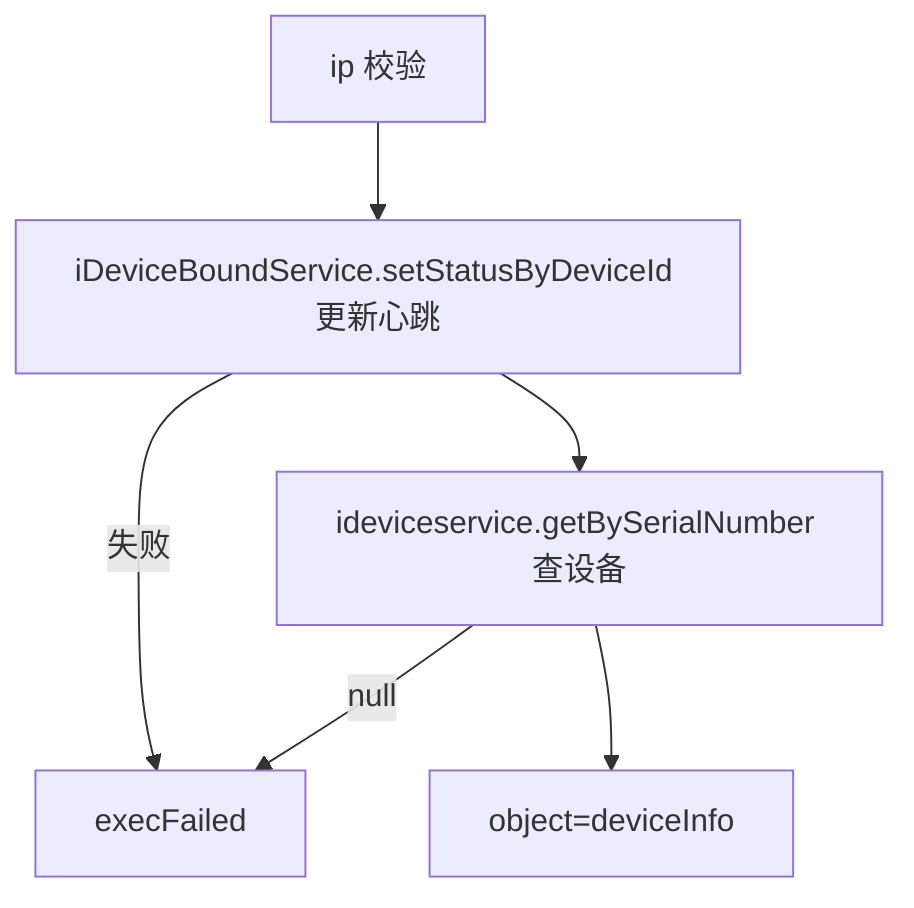

# DeviceBound

- **类全名**：`cn.testin.service.app.DeviceBound`
- **源码路径**：`real-controlcenter/src/main/java/cn/testin/service/app/DeviceBound.java`
- **职责**：App 端设备绑定/项目切换（恒生场景）：独享设备转共享、共享转独享、独享切换项目；以及设备心跳状态上报。设备以 `ip:5555` 作为 serialNumber。另含 `checkHeartbeat` 定时心跳超时处理（断开 ADB 连接并移除设备）。

## op 一览表

| op | 方法 | 职责 |
| --- | --- | --- |
| bound | `DeviceBound.bound` | 绑定设备/项目切换（独享⇄共享） |
| getStatus | `DeviceBound.getStatus` | 设备心跳上报并返回设备信息 |

---

### bound (`DeviceBound.bound`)

- **入口**：ApiServlet，action=app，op=DeviceBound.bound
- **实现意图**：App 端发起的设备-项目绑定。三种模式：projectId 与 vId 均空 → 独享转共享（projectid 置 0）；均非空 → 按 projectNo（projectId_vId）查云测项目，关系表无记录则新增独享绑定，有记录则更新为共享转独享/独享切换项目。

**请求参数**

| 参数 | 类型 | 必填 | 说明 |
| --- | --- | --- | --- |
| projectId | String | 否 | 恒生项目 ID（与 vId 同时为空=转共享） |
| vId | String | 否 | 版本 ID |
| ip | String | 是 | 设备 IP（拼  为 serialNumber） |
| deviceId | String | 是 | 设备 ID |

**返回参数**

| 字段 | 类型 | 说明 |
| --- | --- | --- |
| code | Integer | 状态码，0 成功 |
| msg | String | 提示信息 |
| data | Object | 空对象（无业务数据）；失败抛 GeneralException |

**处理流程**



**调用链**：`IDeviceProjectRelationDAO.list/insert/update` → `ProjectApi.getProjectList`（[user-manager](../../../平台基础功能服务/00-首页.md)，按 productNo 查项目）。
**涉及表与 SQL**：`device_project_relation`（select by serial_number / insert / update）。
**异常与校验**：ip/deviceId 空、projectId 与 vId 仅其一为空 → paraInvalid；项目不存在、绑定/更新失败 → execFailed。

**关键代码摘录**

```java
// real-controlcenter/.../service/app/DeviceBound.java
if (StringUtils.isBlank(projectId) && StringUtils.isBlank(vId)) {
    // 独享设备转共享设备
    deviceProject.setProjectid(0);
    Integer update = this.ideviceprojectrelationdao.update(deviceProject);
    ...
}
projectNo = projectId + "_" + vId;
ProjectInfo project = getProject(projectNo); // projectapi.getProjectList(eid=1, productNo)
```

---

### getStatus (`DeviceBound.getStatus`)

- **入口**：ApiServlet，action=app，op=DeviceBound.getStatus
- **实现意图**：App 端心跳：更新 Redis 中设备（ip:5555）的最后心跳时间，并返回设备视图信息。配合 `checkHeartbeat`（定时任务，35s 超时）判定设备离线并断开 ADB。

**请求参数**

| 参数 | 类型 | 必填 | 说明 |
| --- | --- | --- | --- |
| ip | String | 是 | 设备 IP |

**返回参数**

| 字段 | 类型 | 说明 |
| --- | --- | --- |
| code | Integer | 状态码，0 成功 |
| msg | String | 提示信息 |
| data | Object | 返回数据对象 |
| data.objInfo | Object | ViewDeviceInfo 设备信息 |

**处理流程**



**调用链**：`IDeviceBoundService.setStatusByDeviceId`（Redis）→ `IDeviceService.getBySerialNumber`；心跳超时处理链路：`checkHeartbeat` → `disConnect` → HTTP `Config.DEVICE_CONNECT_URL/method/appRemoteAccess`（ADB 连接服务，外部 HTTP）→ `ideviceservice.cleanDbDevice` + HTTP `DEVICE_DEL_DEVICE_URL/device.action`（Device.delDevice，[设备控制中心](../00-模块索引.md) 自身设备管理服务）→ `IDeviceProjectRelationDAO.delete`。
**涉及表与 SQL**：Redis（设备心跳状态 hash）；视图 `view_device_info`（select by serial_number）；`device_project_relation`（delete by serialNumber，超时分支）。
**异常与校验**：ip 空 → paraInvalid；Redis 更新失败/设备不存在 → execFailed。

**关键代码摘录**

```java
boolean b = this.iDeviceBoundService.setStatusByDeviceId(ipAndPort, String.valueOf(currentTime));
if (!b) { throw new GeneralException(CommonCode.execFailed.getValue(), "更新redis中设备状态失败！"); }
ViewDeviceInfo deviceInfo = this.ideviceservice.getBySerialNumber(ipAndPort);
```
