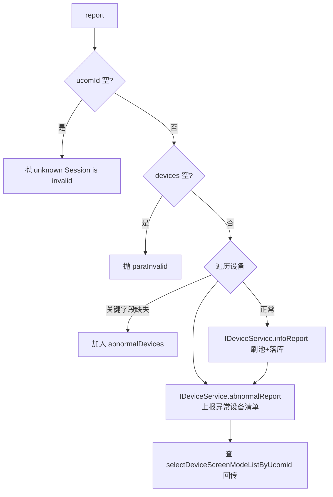
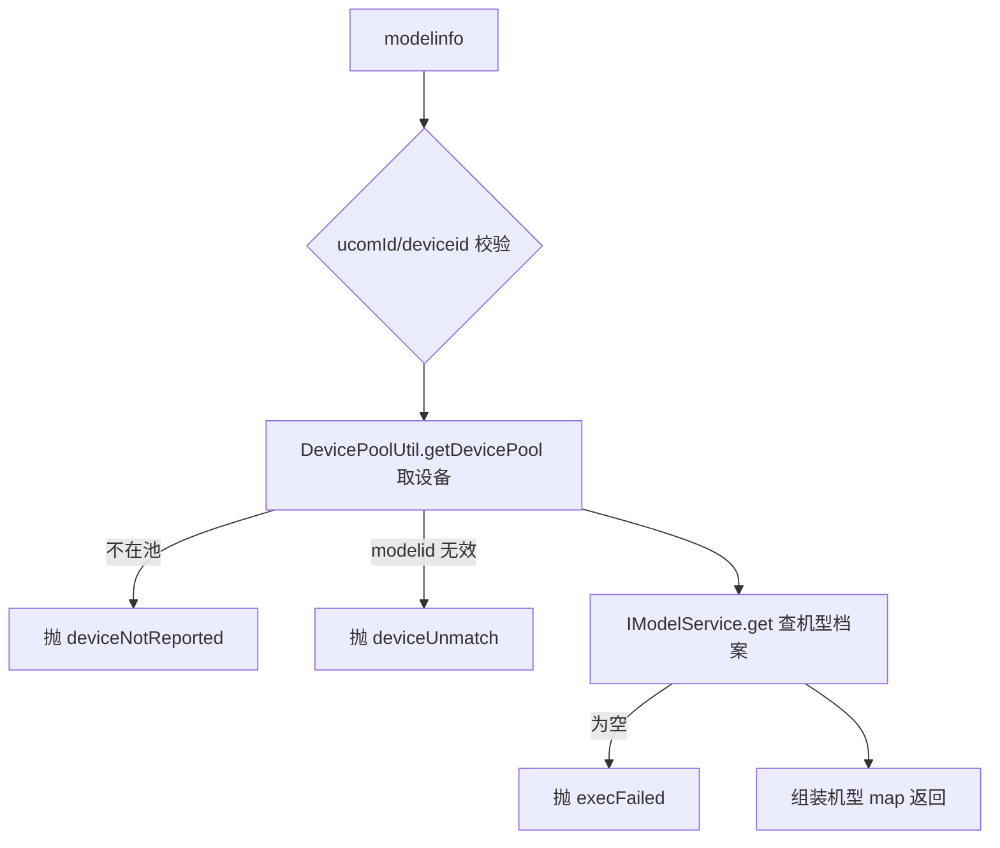
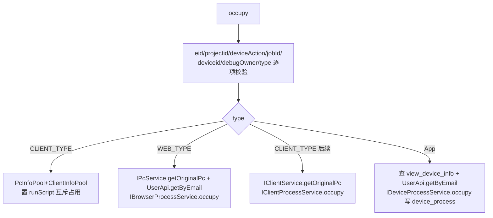
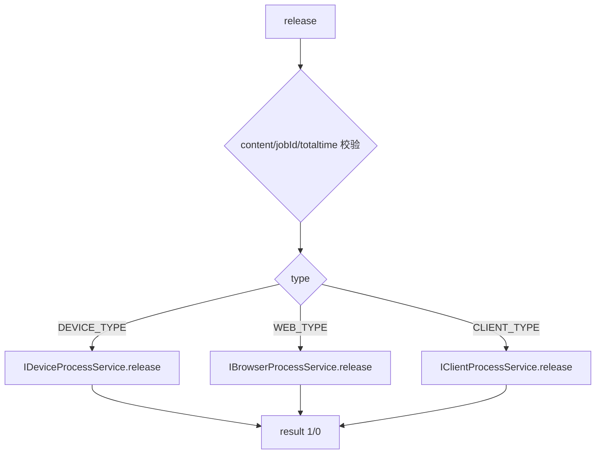

# DeviceController-UcomDevice（上位机侧设备接口）

- 源码：`real-controlcenter/src/main/java/cn/testin/mvc/controller/UcomDevice/DeviceController.java`（bean 名 `UcomDeviceDeviceController`，与主包 DeviceController 区分）
- 职责：面向上位机（ucom）的设备侧 HTTP 接口——设备信息上报、机型匹配、设备签名、占用/释放。
- 基础路径 `/v3/UcomDeivce/device`
- 说明：业务方法复用主包 `cn.testin.mvc.service.DeviceService`。

## 接口一览

| # | 方法 | 路径 | 说明 |
|---|------|------|------|
| 1 | POST | /v3/UcomDeivce/device/report | 设备信息上报 |
| 2 | POST | /v3/UcomDeivce/device/modelinfo | 设备机型匹配信息 |
| 3 | POST | /v3/UcomDeivce/device/matchSign | 设备签名匹配 |
| 4 | POST | /v3/UcomDeivce/device/signReport | 设备签名上报 |
| 5 | POST | /v3/UcomDeivce/device/occupy | 设备占用 |
| 6 | POST | /v3/UcomDeivce/device/release | 设备释放 |

（`/infolist` 接口已在源码中注释下线。）

---

### 设备信息上报 (`POST /v3/UcomDeivce/device/report`)

- **实现意图**：上位机批量上报挂载设备信息；字段不全的记入异常设备清单单独上报；成功后回传该上位机下各设备的投屏模式。
- **请求参数**（`DeviceReportRequestDTO extends BaseRequestDTO`）：

| 参数名 | 类型 | 必填 | 说明 |
|--------|------|------|------|
| ucomId | String | 是 | 上位机账号 |
| devices | List<DeviceInfo> | 是 | 设备信息列表（deviceid/brandName/modelName/releaseVer/status 等 50+ 字段） |

- **返回参数**

| 字段 | 类型 | 说明 |
| --- | --- | --- |
| code | int | 状态码，0 成功 |
| msg | String | 提示信息 |
| data | Object | 返回数据对象（Map） |
| data.result | Integer | 1 成功 / 0 失败 |
| data.devices | JSONArray | 该上位机下各设备投屏模式列表，元素含 deviceId、screenMode（仅 result=1 时返回） |
- **处理流程**：



- **调用链**：无外部服务。
- **涉及表与 SQL**：`device_info`（INSERT/UPDATE；selectDeviceScreenModeListByUcomid）。
- **异常与校验**：ucomId 空抛 `unknown`；devices 空抛 `paraInvalid`。
- **关键代码摘录**：

```java
// mvc/service/DeviceService.java
boolean reportResult = ideviceservice.infoReport(deviceinfo);
...
ideviceservice.abnormalReport(ucomid, abnormalDevices);
datamap.put("devices", getDeviceScreenModeListByUcomid(ucomid));
```

---

### 设备机型匹配信息 (`POST /v3/UcomDeivce/device/modelinfo`)

- **实现意图**：上位机查询某设备匹配到的机型档案（品牌/型号/别名/DPI/分辨率/os），用于画面适配。
- **请求参数**（`DeviceModelinfoRequestDTO`）：

| 字段 | 类型 | 必填 | 说明 |
| --- | --- | --- | --- |
| ucomId | String | 是 | 上位机账号 |
| deviceid | String | 是 | 设备 id |

- **返回参数**

| 字段 | 类型 | 说明 |
| --- | --- | --- |
| code | int | 状态码，0 成功 |
| msg | String | 提示信息 |
| data | Object | 返回数据对象（Map，机型档案） |
| data.brandId | Integer | 品牌 ID |
| data.brandName | String | 品牌名 |
| data.modelid | Integer | 机型 ID |
| data.modelName | String | 机型名 |
| data.aliasName | String | 机型别名 |
| data.dpiWidth | Integer | DPI 宽 |
| data.dpiHeight | Integer | DPI 高 |
| data.type | Integer | 类型（非空时返回） |
| data.osName | String | 系统名（非空时返回） |
| data.logicalResolution | String | 逻辑分辨率 |
- **处理流程**：



- **调用链**：[平台配置](../../../平台配置（real-cfg）/07-开放接口文档/00-模块索引.md)（IModelService 机型档案来自 平台配置 体系）。
- **涉及表与 SQL**：机型表（IModelService.get）；DevicePool（内存池）。
- **异常与校验**：三级异常：未上报 / 未匹配机型 / 机型档案缺失。
- **关键代码摘录**：

```java
// mvc/service/DeviceService.java
DeviceInfo deviceinfo = DevicePoolUtil.getDevicePool().get(deviceid);
if (deviceinfo == null) { throw new GeneralException(ControlCenterCode.deviceNotReported...); }
RealcfgModel model = imodelservice.get(deviceinfo.getModelid());
```

---

### 设备签名匹配 (`POST /v3/UcomDeivce/device/matchSign`)

- **实现意图**：按 imei/androidid/mac 匹配已登记设备签名，用于设备唯一性识别（换 USB 口/重装后识别同一台设备）。
- **请求参数**（`DeviceMatchSignRequestDTO`）：

| 字段 | 类型 | 必填 | 说明 |
| --- | --- | --- | --- |
| baseImei | String | 否* | IMEI（三者至少一个非空） |
| baseAndroidid | String | 否* | Android ID |
| baseMac | String | 否* | MAC |

- **返回参数**

| 字段 | 类型 | 说明 |
| --- | --- | --- |
| code | int | 状态码，0 成功 |
| msg | String | 提示信息 |
| data | Object | 返回数据对象（Map） |
| data.list | JSONArray | 匹配到的设备签名列表（DeviceSign.toMap） |
- **处理流程**：参数校验 → `IDeviceSignService.match(baseImei, baseAndroidid, baseMac)` → 逐条 toMap 返回。
- **调用链**：无。
- **涉及表与 SQL**：`device_sign`（SELECT 匹配）。
- **异常与校验**：三者全空抛 `paraInvalid`；服务返回 null 抛 `unknown`。
- **关键代码摘录**：

```java
// mvc/service/DeviceService.java
List<DeviceSign> list = this.idevicesignservice.match(baseImei, baseAndroidid, baseMac);
```

---

### 设备签名上报 (`POST /v3/UcomDeivce/device/signReport`)

- **实现意图**：上位机上报设备的 imei/androidid/mac/sn 签名，写入签名库（注释提示"少报文没验证"）。
- **请求参数**（`DeviceSignReportRequestDTO`）：

| 字段 | 类型 | 必填 | 说明 |
| --- | --- | --- | --- |
| ucomId | String | 是 | 上位机账号 |
| deviceid | String | 是 | 设备 id |
| baseImei | String | 否 | IMEI |
| baseAndroidid | String | 否 | Android ID |
| baseMac | String | 否 | MAC |
| baseSerialNumber | String | 否 | 序列号 |
- **返回参数**

| 字段 | 类型 | 说明 |
| --- | --- | --- |
| code | int | 状态码，0 成功 |
| msg | String | 提示信息 |
| data | Object | 返回数据对象（Map） |
| data.result | Integer | 1 成功 / 0 失败 |
- **处理流程**：校验 → 组装 `DeviceSign` → `IDeviceSignService.report` 落库 → 返回 result。
- **调用链**：无。
- **涉及表与 SQL**：`device_sign`（INSERT/UPDATE）。
- **异常与校验**：ucomId 空抛 `unknown`；deviceid 空抛 `paraInvalid`。
- **关键代码摘录**：

```java
// mvc/service/DeviceService.java
DeviceSign devicesign = new DeviceSign();
devicesign.setUcomid(ucomid); devicesign.setDeviceid(deviceid);
result = this.idevicesignservice.report(devicesign);
```

---

### 设备占用 (`POST /v3/UcomDeivce/device/occupy`)

- **实现意图**：任务/调试发起方占用设备：App 写 device_process，Web 写 browser_process，Pc 写 client_process，并联动刷新 PcInfoPool/ClientInfoPool 状态（Pc 与 Web 互斥）。
- **请求参数**（`DeviceOccupyRequestDTO`）：

| 参数名 | 类型 | 必填 | 说明 |
|--------|------|------|------|
| ucomId | String | 是 | 上位机账号 |
| eid / projectid | Integer | 是 | 企业/项目 |
| deviceAction | Integer | 是 | 动作（test/debug/recordScript 等） |
| jobId | String | 是 | 占用任务标识 |
| type | Integer | 是 | DEVICE_TYPE=App / WEB_TYPE / CLIENT_TYPE |
| deviceid | String | 是 | 设备 id |
| debugOwner | String | 是 | 占用人邮箱 |
| browserType / browserVer | String | 否 | Web 浏览器类型/版本 |
| markName1 / markName2 | String | 否 | 标记 |

- **返回参数**

| 字段 | 类型 | 说明 |
| --- | --- | --- |
| code | int | 状态码，0 成功 |
| msg | String | 提示信息 |
| data | Object | 返回数据对象（Map） |
| data.result | Integer | 1 成功 / 0 失败 |
- **处理流程**：



- **调用链**：[user-manager](../../../平台基础功能服务/00-首页.md)（UserApi.getByEmail）。
- **涉及表与 SQL**：`device_process` / `browser_process` / `client_process`（占用写入）、`view_device_info`（SELECT）。
- **异常与校验**：七项必填逐项抛 `paraInvalid`；Pc 池数据缺失抛错；用户邮箱无效抛错。
- **关键代码摘录**：

```java
// mvc/service/DeviceService.java
clientInfoPojo.setStatus(DeviceConfig.DeviceStatus.runScript.getValue());
pcInfo.setStatus(DeviceConfig.DeviceStatus.runScript.getValue());
...
boolean result = this.ideviceprocessservice.occupy(process);
```

---

### 设备释放 (`POST /v3/UcomDeivce/device/release`)

- **实现意图**：任务结束释放占用，按类型释放 device/browser/client 进程记录并累计使用时长。
- **请求参数**（`DeviceReleaseRequestDTO`）：

| 字段 | 类型 | 必填 | 说明 |
| --- | --- | --- | --- |
| ucomId | String | 否 | 上位机账号（DTO 继承字段，未参与业务） |
| type | Integer | 否 | DEVICE_TYPE/WEB_TYPE/CLIENT_TYPE（非空时按类型释放） |
| jobId | String | 是 | 占用任务标识 |
| totaltime | Long | 是 | 使用时长，>0 |
| content | Map | 是 | 附加内容 |
- **返回参数**

| 字段 | 类型 | 说明 |
| --- | --- | --- |
| code | int | 状态码，0 成功 |
| msg | String | 提示信息 |
| data | Object | 返回数据对象（Map） |
| data.result | Integer | 1 成功 / 0 失败 |
- **处理流程**：



- **调用链**：无。
- **涉及表与 SQL**：`device_process` / `browser_process` / `client_process`（释放更新）。
- **异常与校验**：content/jobId/totaltime 非法抛 `paraInvalid`（jobId 判空重复写了两次，冗余）。
- **关键代码摘录**：

```java
// mvc/service/DeviceService.java
if (type != null && type.equals(DeviceConfig.DeviceType.DEVICE_TYPE.getType())) {
    result = this.ideviceprocessservice.release(jobId, totaltime, null, contentStr);
}
```
